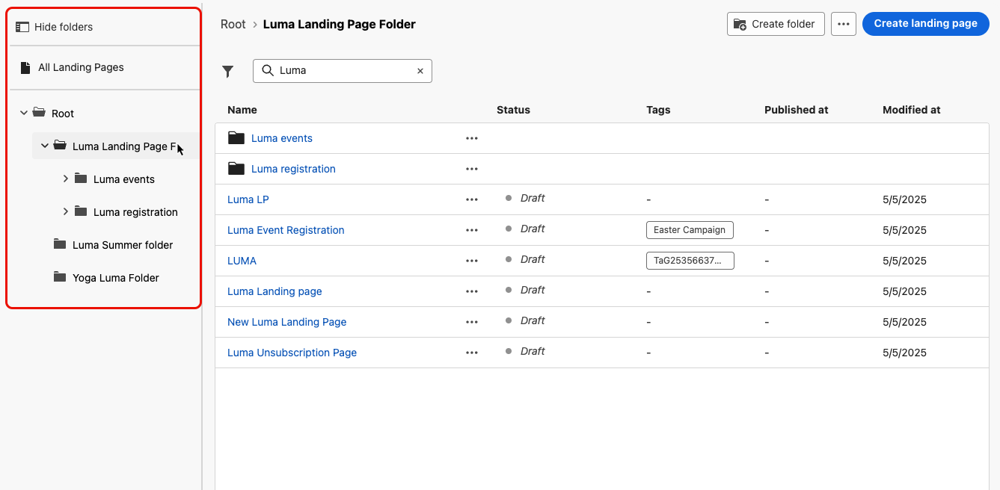

# Hantera dina landningssidor {#manage-lp}

## Åtkomst till landningssidor {#access-landing-pages}

Välj **[!UICONTROL Content Management]** > **[!UICONTROL Landing pages]** på den vänstra menyn för att komma åt landningssidans lista.

Alla befintliga landningssidor visas.

I rutan till vänster kan du ordna landningssidor i mappar. Som standard visas alla objekt. När du väljer en mapp visas endast de landningssidor och mappar som finns i den valda mappen. [Läs mer](#folders)

Om du vill söka efter ett visst objekt börjar du skriva ett namn i sökfältet. När en [mapp](#folders) är markerad tillämpas sökningen på alla landningssidor eller mappar på den första nivån i hierarkin i den mappen<!--(not nested items)-->.

Du kan filtrera landningssidor baserat på deras status, ändringsdatum eller taggar.

I den här listan kan du klicka på de tre punkterna bredvid en landningssida och välja önskad åtgärd:

* För [publicerade](create-lp.md#publish-landing-page) landningssidor, gå till [landningssidrapporten](../reports/lp-report-global-cja.md) och [den senaste 24 timmars Live-rapporten](../reports/lp-report-live.md).

* **Ta bort** och **Avpublicera** en landningssida. Du kan inte ta bort en [publicerad](create-lp.md#publish-landing-page)-landningssida. Om du vill ta bort den måste du först avpublicera den.

  >[!CAUTION]
  >
  >Om du avpublicerar en landningssida som det refereras till i ett meddelande bryts länken till landningssidan och användarna får en felsida om de försöker få åtkomst till den.

* **Duplicera** alla landningssidor.

* Redigera en startsidas associerade [taggar](../start/search-filter-categorize.md#tags).

* Flytta landningssidan till en mapp. [Läs mer](#folders)

## Använd mappar för att hantera landningssidor {#folders}

>[!CONTEXTUALHELP]
>id="ajo_lp_folders"
>title="Ordna dina landningssidor i mappar"
>abstract="Använd mappar för att kategorisera och hantera dina landningssidor efter organisationens behov."

För att enkelt kunna navigera bland landningssidorna kan du använda mappar för att ordna dem mer effektivt i en strukturerad hierarki. På så sätt kan du kategorisera och hantera objekten efter organisationens behov.

1. Klicka på knappen **[!UICONTROL All Landing Pages]** om du vill visa alla objekt som tidigare skapats utan mappgruppering.

   

1. Klicka på mappen **[!UICONTROL Root]** för att visa alla mappar som skapats.

   >[!NOTE]
   >
   >Om du inte har skapat mappar än visas alla landningssidor.

1. Klicka på en mapp i mappen **[!UICONTROL Root]** för att visa dess innehåll.

1. När du klickar på mappen **[!UICONTROL Root]** eller någon annan mapp visas knappen **[!DNL Create folder]** . Markera den.

   

1. Ange ett namn för den nya mappen och klicka på **[!UICONTROL Save]**. Den nya mappen visas i mappen **[!UICONTROL Root]** eller i den mapp som är markerad för tillfället.

1. Du kan klicka på knappen **[!UICONTROL More actions]** om du vill byta namn på eller ta bort mappen.

   

1. Med knappen **[!UICONTROL More actions]** kan du även flytta landningssidor till en annan befintlig mapp.

1. Nu kan du navigera till mappen som du nyss skapade. Varje ny landningssida som du [skapar](create-lp.md#create-landing-page.md) från här sparas i den aktuella mappen.

   
