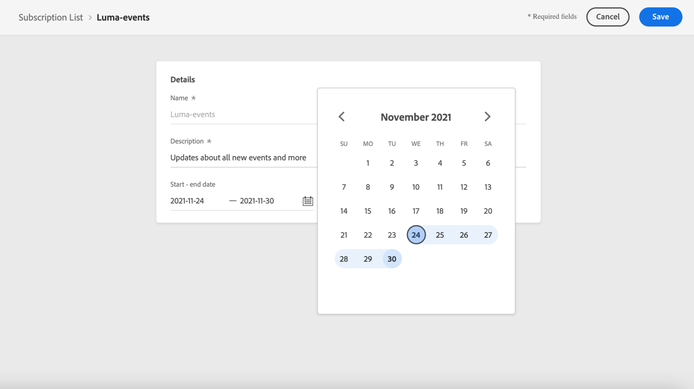

# Skapa en prenumerationslista {#create-subscription-list}

## Vad är en prenumerationslista?

En prenumerationstjänst avser marknadsföringsvaror och marknadsföringstjänster som tillhandahålls kunder som har valt att ta emot meddelanden om ett visst ämne/evenemang/intresse/osv. fortlöpande. I [!DNL Journey Optimizer], samlas dessa kunder i en prenumerationslista.

En prenumerationstjänst kan vara:

* ett nyhetsbrev, t.ex.&quot;Körningsserie&quot;
* en händelse, till exempel&quot;Summit 2021&quot;
* ett webbinarium, till exempel&quot;Läs mer om krypto&quot;
* en ränta på en viss produkt/sport/tjänst/osv., t.ex.&quot;Intresserad att köpa ett hus under de kommande 12 månaderna&quot;
* en inställning för hur du ska meddelas, till exempel&quot;Ta emot nya låtmeddelanden via e-post&quot;

Profilerna kan läggas till i en prenumerationslista via en [landningssida](create-lp.md). Ett exempel presenteras i [det här avsnittet](get-started-lp.md#subscription-to-a-service).

## Definiera en prenumerationslista {#define-subscription-list}

Följ stegen nedan för att skapa en prenumerationslista.

1. Välj **[!UICONTROL Customer]** > **[!UICONTROL Subscription list]**.

   

1. Klicka på i prenumerationslistan **[!UICONTROL Create subscription]** lista.

   

1. Lägg till ett namn och en beskrivning. Dessa fält är obligatoriska.

1. Du kan definiera ett startdatum och ett slutdatum.

   

1. Klicka på **[!UICONTROL Save]**.

I listan visas alla prenumerationslistor som skapats. Du kan filtrera dem baserat på skapandedatumet eller ändringsdatumet.

Möjliga statusvärden är följande:

* **[!UICONTROL Not started]**: Du definierade ett startdatum som är senare än den aktuella dagen. Profilerna som prenumererar på den här listan får ännu inte meddelanden om den här prenumerationslistan.
* **[!UICONTROL Live]**: Den aktuella dagen ligger mellan prenumerationslistans startdatum och slutdatum, eller så har du inte definierat slut-/startdatum, vilket innebär att prenumerationslistan alltid är aktiv.
* **[!UICONTROL Expired]**: Slutdatumet har passerats, prenumerationslistan är inte längre giltig. Alla profiler som prenumererar på den här listan kommer inte att få mer information om den här prenumerationslistan.

När prenumerationslistan har skapats kan du använda den på en landningssida, så att profilerna kan anmäla sig via ett formulär och läggas till i listan. [Läs mer](design-lp.md)

Du kan också använda prenumerationslistor som segment när du skapar resor och personalisering.

<!--

**Questions**

* Can't see the newly created subscription list in UI because their name included spacing > bug - to follow up (should be fixed for Dec. release)

* How do you handle the different statuses? Live, Not started, Expired? Is it only through start/end dates?

* What does it mean when a subscription list is expired or not started? You can't use it in a LP? And if a user is subscribed to this service, then he won't receive communications any more?

* What else can you currently do with subscription lists apart from attach them to a landing page?

* Can you update the subscription list in a way other than through a LP? Not in UI but with APIs > to follow up with Fred

-->