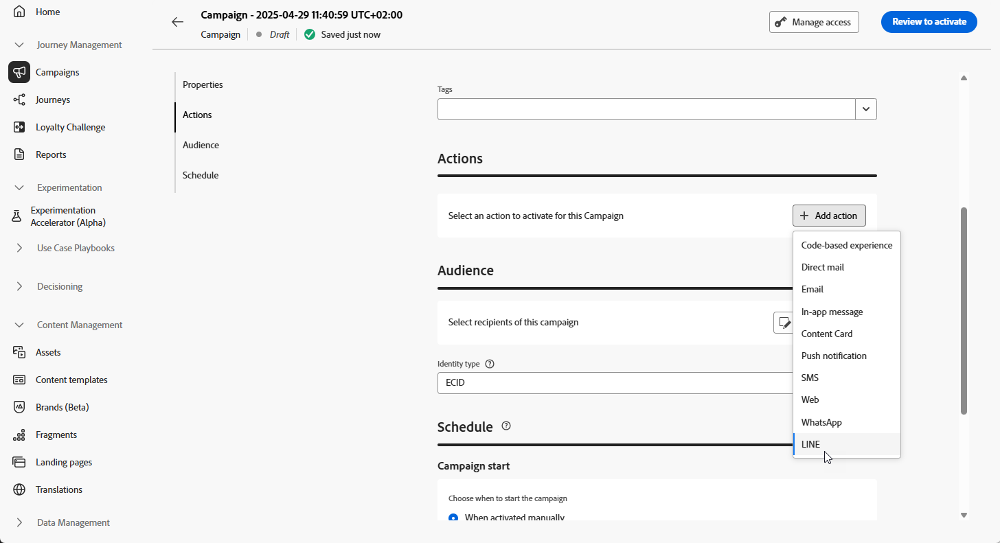

# Skapa ett LINE-meddelande {#create-line}

## Lägg till ett LINE-meddelande {#create-line-journey-campaign}

Bläddra bland flikarna nedan för att lära dig hur du lägger till ett LINE-meddelande i en kampanj eller en resa.

>[!BEGINTABS]

>[!TAB Lägg till ett LINE-meddelande på en resa]

1. Öppna resan och dra och släpp en **LINE**-aktivitet från **åtgärdsetiketterna** på paletten.

   

1. Ange grundläggande information i meddelandet (etikett, beskrivning, kategori) och välj sedan den meddelandekonfiguration som ska användas.

   Mer information om hur du konfigurerar en resa finns på [sidan](../building-journeys/journey-gs.md)

   Fältet **[!UICONTROL configuration]** är som standard förfyllt med den senaste konfigurationen som används av användaren för den kanalen.

Nu kan du börja designa innehållet i ditt LINE-meddelande med knappen **[!UICONTROL Edit content]**, som beskrivs nedan.

>[!TAB Lägg till ett radmeddelande i en kampanj]

1. Öppna menyn **[!UICONTROL Campaigns]** och klicka sedan på **[!UICONTROL Create campaign]**.

1. Välj den typ av kampanj som du vill köra

   * **Schemalagd - marknadsföring**: Kör kampanjen direkt eller på ett angivet datum. Schemalagda kampanjer syftar till att skicka marknadsföringsmeddelanden. De konfigureras och körs från användargränssnittet.

   * **API-utlöst - Markering/transaktion**: Kör kampanjen med ett API-anrop. API-utlösta kampanjer syftar till att skicka antingen marknadsförings- eller transaktionsmeddelanden, dvs. meddelanden som skickas ut efter en åtgärd som utförs av en individ: lösenordsåterställning, kundvagn osv.

1. I avsnittet **[!UICONTROL Properties]** redigerar du din kampanjs **[!UICONTROL Title]** och **[!UICONTROL Description]**.

1. Klicka på knappen **[!UICONTROL Select audience]** för att definiera målgruppen i listan över tillgängliga Adobe Experience Platform-målgrupper. [Läs mer](../audience/about-audiences.md).

1. I fältet **[!UICONTROL Identity namespace]** väljer du det namnutrymme som ska användas för att identifiera personer från den valda målgruppen. [Läs mer](../event/about-creating.md#select-the-namespace).

1. I avsnittet **[!UICONTROL Actions]** väljer du **[!UICONTROL LINE]** och väljer eller skapar en ny konfiguration.

   Läs mer om LINE-konfigurationen på [den här sidan](line-configuration.md).

   

1. Klicka på **[!UICONTROL Create experiment]** för att börja konfigurera ditt innehållsexperiment och skapa behandlingar för att mäta deras prestanda och identifiera det bästa alternativet för målgruppen. [Läs mer](../content-management/content-experiment.md)

1. I avsnittet **[!UICONTROL Actions tracking]** anger du om du vill spåra klickningar på länkar i SMS-meddelandet.

1. Kampanjer är utformade för att köras ett visst datum eller med en återkommande frekvens. Lär dig hur du konfigurerar **[!UICONTROL Schedule]** för din kampanj i [det här avsnittet](../campaigns/create-campaign.md#schedule).

1. Välj **[!UICONTROL Action triggers]** i SMS-meddelandet på menyn **[!UICONTROL Frequency]**:

   * En gång
   * Dagligen
   * Vecka
   * Månad

Nu kan du börja designa innehållet i ditt textmeddelande med knappen **[!UICONTROL Edit content]**, som beskrivs nedan.

>[!ENDTABS]

## Definiera ditt LINE-innehåll{#line-content}

Adobe Journey Optimizer stöder följande meddelandetyper för LINE:

* **Text**: Skicka oformaterad eller formaterad text.
* **Stickers**: Lägg till tecken och uttryck med hjälp av Lines egna klistermärken.
* **Bilder**: Bifoga bilder för att förbättra den visuella effekten.
* **Videor**: Dela videoinnehåll för dynamisk kommunikation.
* **Platser**: Skicka platsinformation med kartor.
* **Mallar**: Använd fördefinierade mallar för konsekventa meddelanden.
* **Flex Messages**: Skapa komplexa layouter med avancerat innehåll med JSON-baserade Flex Messages.

Dessa meddelandetyper kan konfigureras genom att JSON-innehållet redigeras direkt, vilket möjliggör dynamiska och personaliserade meddelandestrategier.

Följ stegen nedan för att konfigurera ditt LINE-innehåll.

1. Klicka på knappen **[!UICONTROL Edit content]** på skärmen för resan eller kampanjkonfigurationen för att konfigurera textmeddelandeinnehållet.

1. Klicka på **[!UICONTROL Edit code]** om du vill redigera JSON-innehåll.

1. Använd personaliseringsredigeraren för att definiera innehåll, lägga till personalisering och dynamiskt innehåll. Du kan använda alla attribut, till exempel profilnamnet eller stad. Du kan också definiera villkorliga regler. Bläddra till följande sidor om du vill veta mer om [personalisering](../personalization/personalize.md) och [dynamiskt innehåll](../personalization/get-started-dynamic-content.md) i personaliseringsredigeraren.

1. Klicka på **[!UICONTROL Save]** och kontrollera meddelandet i förhandsgranskningen.

1. Använd knappen **[!UICONTROL Simulate content]** om du vill förhandsgranska ditt LINE-meddelandeinnehåll och anpassat innehåll.

När du har utfört testerna och validerat innehållet kan du skicka LINE-meddelandet till mottagarna. De här stegen beskrivs i [den här sidan](send-line.md)

När du har skickat det kan du mäta effekten av LINE i kampanjrapporten eller reserapporten. Mer information om rapportering finns i [det här avsnittet](../reports/campaign-global-report-cja.md).
