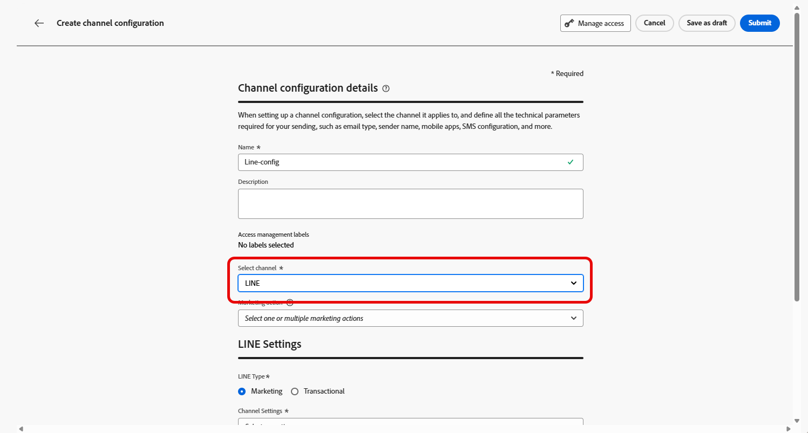

# Konfigurera LINE-kanal i Journey Optimizer {#line-configuration}

1. Gå till menyn **[!UICONTROL Channels]** > **[!UICONTROL General settings]** > **[!UICONTROL Channel configurations]** och klicka sedan på **[!UICONTROL Create channel configuration]**.

   

1. Ange ett namn och en beskrivning (valfritt) för konfigurationen och välj sedan den kanal som ska konfigureras.

   >[!NOTE]
   >
   > Namn måste börja med en bokstav (A-Z). Det får bara innehålla alfanumeriska tecken. Du kan också använda understreck `_`, punkt `.` och bindestreck `-`.

1. Om du vill tilldela anpassade eller grundläggande dataanvändningsetiketter till konfigurationen kan du välja **[!UICONTROL Manage access]**. [Läs mer om OLAC (Object Level Access Control)](../administration/object-based-access.md).

1. Välj **LINE**-kanal.

   

1. Välj **[!UICONTROL Marketing action]** om du vill associera medgivandeprinciper till meddelanden som använder den här konfigurationen. Alla policyer för samtycke som är kopplade till marknadsföringsåtgärden utnyttjas för att ta hänsyn till kundernas preferenser. [Läs mer](../action/consent.md#surface-marketing-actions)

1. Välj typ av meddelande för konfigurationen:

   * **Marknadsföring**: För kampanjmeddelanden, till exempel veckokampanjer för en butik. Dessa meddelanden kräver användarens samtycke och ska följa LINS policy för användartillval.
   * **Transaktionellt**: För icke-kommersiella meddelanden, till exempel orderbekräftelser, meddelanden om lösenordsåterställning eller leveransuppdateringar. Dessa meddelanden kan skickas även till användare som har avbeställt marknadskommunikation men som är strikt begränsade till specifika transaktionskontexter.

1. Välj din **[!UICONTROL Channel settings]**.

   Kontakta din Adobe-representant för att konfigurera din **[!UICONTROL Channel settings]**.

   

1. Välj den **[!UICONTROL LINE user ID]** som du vill mappa. Detta är den identifierare som används för att länka meddelanden till enskilda användare i LINE-kanalen.

1. Skriv in din **[!UICONTROL Sender Name]**, till exempel ditt varumärkes namn.

1. Skicka in ändringarna.

Du kan nu välja din konfiguration när du skapar LINE-meddelandet.
