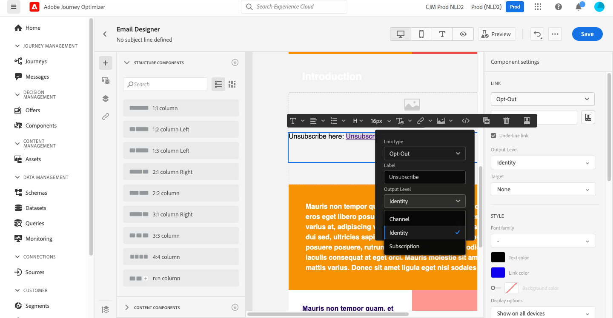

# Hantera medgivande {#consent}

Använd [!DNL Journey Optimizer] för att spåra mottagarnas samtycke till kommunikation och förstå hur de vill interagera med ert varumärke genom att hantera sina preferenser och prenumerationer.

I bestämmelser som GDPR anges att du måste uppfylla specifika krav innan du kan använda information från registrerade. Dessutom bör registrerade kunna ändra sitt samtycke när som helst.

**Varför är det viktigt?**

* Om ni inte följer dessa regler medför detta juridiska risker för ert varumärke.
* Det hjälper er att undvika att skicka oombedda meddelanden till era mottagare, vilket kan få dem att märka era meddelanden som skräppost och skada ert rykte.

Läs mer om hur du hanterar sekretess och tillämpliga regler i [Experience Platform dokumentation](https://experienceleague.adobe.com/docs/experience-platform/privacy/home.html){target=&quot;_blank&quot;}.

>[!NOTE]
>
>I [!DNL Journey Optimizer], samtycke hanteras av Experience Platform [Samtyckesschema](https://experienceleague.adobe.com/docs/experience-platform/xdm/field-groups/profile/consents.html){target=&quot;_blank&quot;}. Som standard är värdet för medgivandefältet tomt och behandlas som samtycke för att ta emot dina meddelanden. Du kan ändra det här standardvärdet när du går vidare till något av de möjliga värdena som anges [här](https://experienceleague.adobe.com/docs/experience-platform/xdm/data-types/consents.html#choice-values){target=&quot;_blank&quot;}.

## Hantering av avanmälan via e-post {#opt-out-management}

Att ge mottagarna möjlighet att avbryta prenumerationen på information från ett varumärke är ett juridiskt krav. Läs mer om gällande lagstiftning i [Experience Platform dokumentation](https://experienceleague.adobe.com/docs/experience-platform/privacy/regulations/overview.html#regulations){target=&quot;_blank&quot;}.

Därför måste du alltid inkludera en **avbeställ länk** i varje e-postmeddelande som skickas till mottagarna:

* När du klickar på den här länken dirigeras mottagarna till en landningssida där de kan bekräfta att de vill avanmäla sig.
* När profilens val har bekräftats uppdateras profilens data med den här informationen.

### Extern avanmälan {#opt-out-external-lp}

För att göra detta kan du infoga en länk till en extern landningssida i ett e-postmeddelande så att användarna kan avbryta prenumerationen på information från ert varumärke.

#### Lägg till en länk för att avbryta prenumerationen {#add-unsubscribe-link}

Du måste först lägga till en länk för att avbryta prenumerationen i ett meddelande. Följ stegen nedan för att göra detta:

1. Bygg en egen landningssida utan prenumeration.

1. Lägg det på valfritt tredjepartssystem.

1. [Skapa ett meddelande](create-message.md) in [!DNL Journey Optimizer].

1. Markera text i innehållet och [infoga en länk](message-tracking.md#insert-links) med hjälp av kontextverktygsfältet.

   

1. Välj **[!UICONTROL External Opt-out/Unsubscription]** från **[!UICONTROL Link type]** nedrullningsbar lista.

   

1. I **[!UICONTROL Link]** klistra in länken till tredjepartssidan.

   

1. Klicka på **[!UICONTROL Save]**.

1. Spara innehåll och [publicera meddelandet](publish-manage-message.md).

#### Implementera ett API-anrop för avanmälan {#opt-out-api}

Om du vill att mottagarna ska avanmäla sig när de skickar in sitt val från landningssidan måste du implementera en **Prenumerations-API-anrop** genom Adobe I/O för att uppdatera motsvarande profilers inställningar.

Detta samtal till POSTEN i Adobe I/O är följande:

Slutpunkt: platform.adobe.io/journey/imp/consent/preferences

Frågeparametrar:

* **parametrar**: innehåller den krypterade nyttolasten
* **sig**: signatur
* **pid**: krypterat profil-ID

Dessa tre parametrar kommer att ingå i den URL till landningssidan som skickas till mottagaren:


Huvudkrav:

* x-api-key
* x-gw-ims-org-id
* x-sandbox-name
* behörighet (användartoken från ditt tekniska konto)

Begärandetext:

```
{
   "marketing": [
       {
            "type": "email",           
            "choice": "no",          
            "scope": "channel"       
        }
    ],
 
}
```

[!DNL Journey Optimizer] använder de här parametrarna för att uppdatera motsvarande profils val via anropet till Adobe I/O.

#### Skicka meddelandet med en länk för att avbryta prenumerationen {#send-message-unsubscribe-link}

När du har konfigurerat länken för att avbryta prenumerationen på din landningssida och implementerat API-anropet är ditt meddelande klart att skickas.

1. Skicka meddelandet inklusive länken via en [resa](../building-journeys/journey.md).

1. Om mottagaren klickar på länken för att avbryta prenumerationen visas din startsida när meddelandet har tagits emot.

   

1. Om mottagaren skickar in formuläret (här, genom att klicka på **Avbeställ** på landningssidan) uppdateras profildata via [Adobe I/O call](#opt-out-api).

1. Mottagaren omdirigeras sedan till ett bekräftelsemeddelande som anger att avanmälan lyckades.

   

   Därför får den här användaren inte information från ert varumärke om han eller hon inte prenumererar igen.

1. Om du vill kontrollera att den aktuella profilens val har uppdaterats går du till Experience Platform och öppnar profilen genom att markera ett identitetsnamnutrymme och ett motsvarande identitetsvärde. Läs mer i [Experience Platform dokumentation](https://experienceleague.adobe.com/docs/experience-platform/profile/ui/user-guide.html#getting-started){target=&quot;_blank&quot;}.

   

   I **[!UICONTROL Attributes]** kan du se värdet för **[!UICONTROL choice]** har ändrats till **[!UICONTROL no]**.

### Avanmäl dig med ett klick {#one-click-opt-out}

Eftersom många kunder vill ha en enklare process för att avbryta prenumerationen kan du även lägga till en länk för att avanmäla dig med ett enda klick i ditt e-postinnehåll. Med den här länken kan dina mottagare snabbt avbeställa din kommunikation utan att omdirigeras till en landningssida där de måste bekräfta sitt val, vilket snabbar upp avanmälningsprocessen.

Följ stegen nedan om du vill lägga till en länk för att avanmäla dig i ditt e-postmeddelande.

1. [Infoga en länk](message-tracking.md#insert-links) och markera **[!UICONTROL One click Opt-out]** som typ av länk.

   

1. Välj hur du vill använda avanmälningen: på kanal-, identitet- eller prenumerationsnivå.

   

   * **[!UICONTROL Channel]**: Avanmälningen gäller för framtida meddelanden som skickas till profilens mål (dvs. e-postadress) för den aktuella kanalen. Om flera mål är kopplade till en profil gäller avanmälan alla mål (t.ex. e-postadresser) i profilen för den kanalen.
   * **[!UICONTROL Identity]**: Avanmälningen gäller för framtida meddelanden som skickas till det specifika målet (dvs. e-postadressen) som används för det aktuella meddelandet.
   * **[!UICONTROL Subscription]**: Avanmälningen gäller för framtida meddelanden som är kopplade till en viss prenumerationslista. Det här alternativet kan bara väljas om det aktuella meddelandet är kopplat till en prenumerationslista.

1. Ange URL-adressen till landningssidan där användaren omdirigeras när prenumerationen har upphört. Den här sidan är bara här för att bekräfta att avanmälan lyckades.

   

   Du kan anpassa länkarna. Läs mer om personaliserade URL:er i [det här avsnittet](../personalization/personalization-syntax.md).

1. Spara ändringarna.

När ditt meddelande har skickats via en [resa](../building-journeys/journey.md), om en mottagare klickar på länken för att avanmäla sig, avvisas deras profil omedelbart.

### Avbeställ länk i meddelanderubriken {#unsubscribe-email}

Om mottagarnas e-postklient har stöd för att visa en länk för att avbryta prenumerationen i e-posthuvudet, skickas e-postmeddelanden med [!DNL Journey Optimizer] infogar automatiskt den här länken.

Länken för att avbryta prenumerationen visas så här i Gmail:


Beroende på e-postklienten kan du klicka på länken för att avbryta prenumerationen från rubriken på något av följande sätt:

* Motsvarande profil väljs omedelbart och det här alternativet uppdateras i Experience Platform. Läs mer i [Experience Platform dokumentation](https://experienceleague.adobe.com/docs/experience-platform/profile/ui/user-guide.html#getting-started){target=&quot;_blank&quot;}.

* Det har samma effekt som att klicka på länken för att avbryta prenumerationen från e-postinnehållet: Mottagaren omdirigeras till en landningssida med en knapp som bekräftar att han eller hon avanmäler sig. Läs mer om avanmälningshantering i [det här avsnittet](#opt-out-management).

## Hantering av avanmälan {#push-opt-out-management}

Push-mottagare kan avbeställa prenumerationen via sina enheter själva.

När du till exempel hämtar eller använder programmet kan de välja att stoppa meddelanden. På samma sätt kan de ändra meddelandeinställningarna via det mobila operativsystemet.
