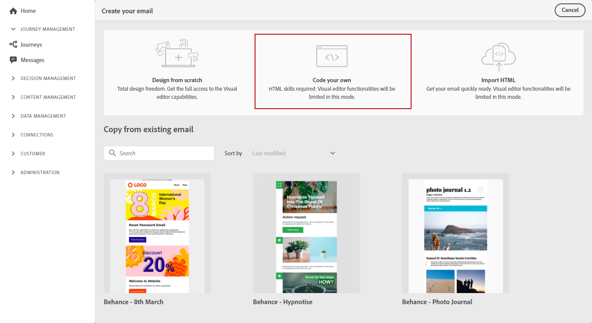

# Importera eller koda ditt e-postinnehåll {#existing-content}

Med Journey Optimizer kan du importera befintligt HTML-innehåll för att utforma dina e-postmeddelanden. Det här innehållet kan vara oformaterad HTML-kod eller innehåll från en befintlig HTML-fil eller en zip-mapp.

Följ stegen nedan om du vill koda HTML-innehåll eller importera befintligt innehåll:

1. [Skapa ett meddelande](create-message.md)

1. Öppna **[!UICONTROL Email Designer]** från **[!UICONTROL Edit Content]** -avsnitt.

   

1. Välj **[!UICONTROL Code your own]** eller **[!UICONTROL Import HTML]**. Gå till avsnitten nedan för nästa steg.

## Koda din egen {#import-raw-html-code}

Använd **[!UICONTROL Code your own]** läge för att importera råformat HTML och/eller koda ditt e-postinnehåll. Den här metoden kräver kunskaper i HTML.

>[!CAUTION]
>
> Bilder från [Adobe Experience Manager Assets Essentials](assets-essentials.md) kan inte refereras när den här metoden används. De bilder som refereras i HTML-koden måste lagras på en offentlig plats.

1. På e-postdesignerns startsida väljer du **[!UICONTROL Code your own]**.

   

1. Ange eller klistra in HTML-koden i Raw-format.

1. Använd den vänstra rutan för att utnyttja [!DNL Journey Optimizer] personaliseringsfunktioner. Mer information om detta finns i [det här avsnittet](../personalization/personalize.md).

   

1. Om du vill öppna e-postdesignern för att starta e-postmeddelandet från en ny design väljer du **[!UICONTROL Change your design]** på Alternativ-menyn.

   

1. Klicka på **[!UICONTROL Preview]** för att kontrollera meddelandets utformning och personalisering med testprofiler. Mer information om detta finns i [det här avsnittet](preview.md).

   

1. När koden är klar klickar du på **[!UICONTROL Save]** går du tillbaka till skärmen för att skapa meddelanden för att slutföra meddelandet.

   

## Importera HTML {#import-html-content-from-file}

Du kan importera HTML i e-postdesignern. Innehållet kan vara:

* An **HTML-fil** med en infogad formatmall,
* A **ZIP-mapp** med HTML-filen, formatmallen (.css) och bilderna.

   >[!NOTE]
   >
   >ZIP-filstrukturen har inga begränsningar. Referenserna måste dock vara relativa och passa med trädstrukturen i ZIP-mappen.

Om du vill importera en fil som innehåller HTML-innehåll följer du stegen nedan:

1. På e-postdesignerns startsida väljer du **[!UICONTROL Import HTML]**.

   

1. Dra och släpp HTML- eller ZIP-filen med HTML.

1. När HTML-innehållet har överförts kan du använda e-postdesignerns funktioner för att redigera och förhandsgranska e-postmeddelandet. [Läs mer i det här avsnittet](create-email-content.md).

   
