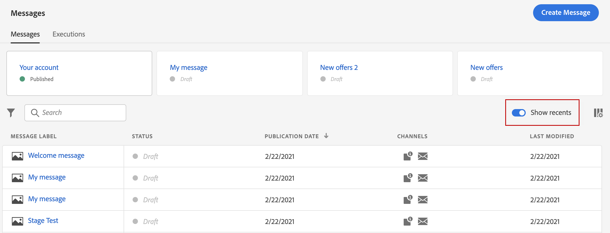
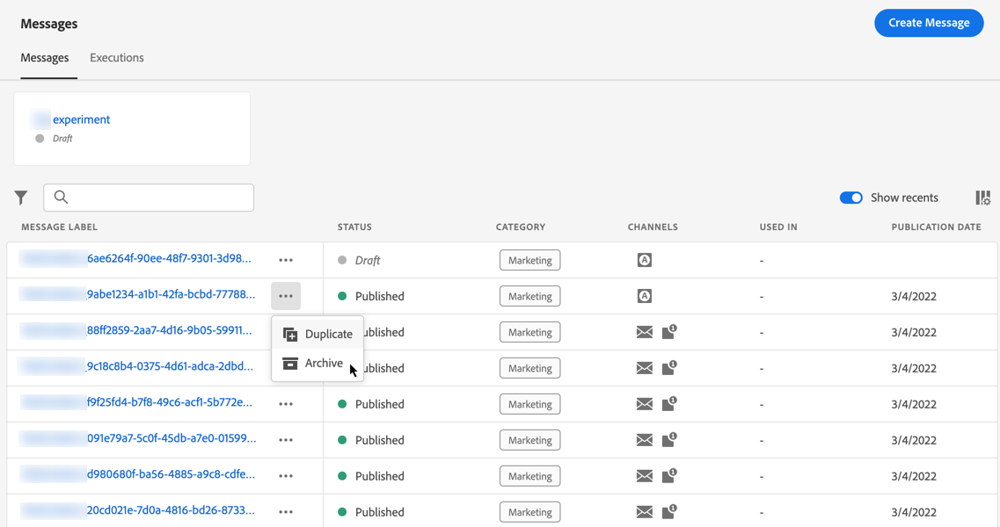

# Kom igång med meddelanden {#get-started-contents-messages}

Använd [!DNL Journey Optimizer] för att utnyttja olika resurser som resurser och innehåll på ett och samma ställe, och skapa och publicera personaliserade push-meddelanden och e-postmeddelanden.

* Utnyttja [!DNL Journey Optimizer] **funktioner för e-postdesign** för att skapa eller importera responsiva e-postmeddelanden.

* Utnyttja **Adobe Experience Manager Assets Essentials** för att bygga upp en egen databas och berika era e-postmeddelanden.

* Förbättra kundernas upplevelse genom att skapa **personaliserade push- och e-postmeddelanden** baserat på deras profilattribut.

* **Skapa push- och e-postmeddelanden** baserat på innehållet och publicera dem sedan.

## Åtkomstmeddelanden {#access-messages}

Meddelanden är tillgängliga från **[!UICONTROL Messages]** genväg till vänster. Alla meddelanden visas sorterade efter publiceringsdatum (för publicerade meddelanden) eller skapandedatum (för utkastmeddelanden).

>[!NOTE]
>
>Användarna kan komma åt, skapa, redigera och/eller publicera meddelanden beroende på deras produktprofil. Läs mer om användarbehörigheter [i det här avsnittet](../administration/permissions.md).

* Använd **[!UICONTROL Show recents]** växla för att lägga till direktlänkar till meddelanden som du har haft tillgång till de senaste fem dagarna.

   

* Använd filterikonen om du bara vill visa utkast, publicerade meddelanden eller meddelanden som publiceras. Du kan även söka på meddelandeetiketten enligt nedan:

   

* Du kan arkivera oanvända meddelanden för att rensa meddelandelistan med hjälp av den dedikerade ikonen på snabbåtgärdsmenyn.

   

   Använd filterikonen för att visa alla arkiverade meddelanden och klicka på **[!UICONTROL Unarchive]** om du vill ta bort ett objekt från listan med arkiverade meddelanden.

   >[!NOTE]
   >
   >Du kan inte öppna ett arkiverat meddelande. Du måste avarkivera det först.

## Skapa ett nytt meddelande {#create-new-message}

Följ stegen nedan för att skapa ett nytt meddelande:

1. Öppna meddelandelistan och klicka sedan på **[!UICONTROL Create Message]**.

1. Definiera meddelandeegenskaperna.

   

   * Ange **[!UICONTROL Title]** (obligatoriskt) och **[!UICONTROL Description]**.

   * Välj **[!UICONTROL Message category]**: Marknadsföring eller Transactional.

   * Markera de kanaler som du vill använda för det meddelandet: E-post och/eller push-meddelanden. Du måste välja minst en kanal för att kunna skapa meddelandet.

   * Välj **[!UICONTROL Preset]** som ska användas för meddelandet.

      Förinställningarna innehåller alla parametrar som krävs för att ett e-postmeddelande och/eller ett push-meddelande ska skickas enligt ert varumärke. [Läs mer om förinställningar](../configuration/message-presets.md).
   >[!CAUTION]
   >
   >Du måste välja en giltig meddelandeförinställning för den valda kategorin och de valda kanalerna.

   Observera att du när som helst kan komma åt och ändra meddelandets titel, beskrivning och förinställning med **[!UICONTROL Properties]** i meddelandegränssnittet.

1. Klicka **[!UICONTROL Create]** för att bekräfta att meddelandet har skapats. Meddelandet läggs till i meddelandelistan i **[!UICONTROL Draft]** status.

   En flik är tillgänglig för varje vald kanal. Använd dessa flikar för att konfigurera innehållet för varje kanal. Du kan ta bort en tabb genom att markera den och klicka på **[!UICONTROL Delete channel]** till höger.

   

   Nu kan du skapa innehållet i meddelandet och anpassa inställningarna. Detaljerad information om konfigurationen av e-post och push-meddelanden finns i följande avsnitt:

   * [Skapa ett e-postmeddelande](create-email.md)
   * [Skapa push-meddelanden](create-push.md)

   >[!NOTE]
   >   
   >Du kan anpassa meddelanden med hjälp av profildata med uttrycksredigeraren. Mer information om personalisering finns i [det här avsnittet](../personalization/personalize.md).

1. Styr återgivningen av meddelanden och kontrollera personaliseringsinställningarna med testprofiler med förhandsgranskningsavsnittet till vänster. Mer information om detta finns i [det här avsnittet](../design/preview.md).

   

1. Kontrollera varningar i den övre delen av redigeraren.  Vissa av dem är enkla varningar, men andra kan hindra dig från att publicera meddelandet. Läs mer i [det här avsnittet](alerts.md).

1. Nu kan du publicera meddelandet genom att klicka på **[!UICONTROL Publish]** eller behålla det som ett utkast och publicera det senare. Mer information om hur du publicerar meddelanden finns i [det här avsnittet](publish-manage-message.md).

## Duplicera ett meddelande {#duplicate-message}

Följ stegen nedan om du vill skapa ett meddelande från en befintlig.

1. Öppna meddelandet som du vill kopiera.

1. Använd **[!UICONTROL Duplicate]** från meddelandegränssnittet.

   

   Alla inställningar och konfigurationer kopieras till det nya meddelandet.

1. Du kan byta namn på meddelandet innan du bekräftar duplicering.

   

1. Ett bekräftelsemeddelande visas längst ned i fönstret när det nya meddelandet har skapats.

Du kan också duplicera ett meddelande från meddelandelistan med hjälp av den dedikerade ikonen på snabbåtgärdsmenyn.

Samma bekräftelseprocess gäller.

