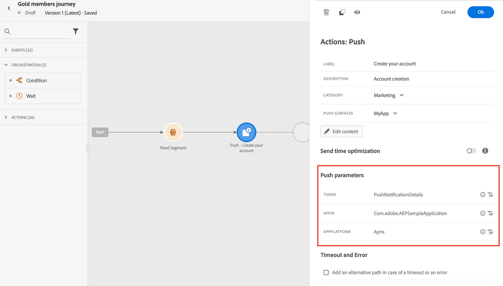
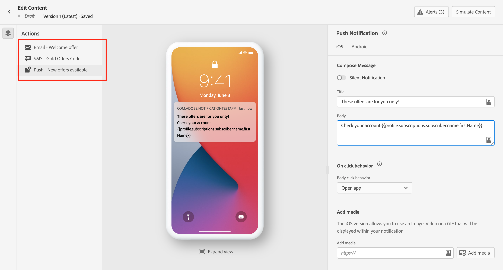
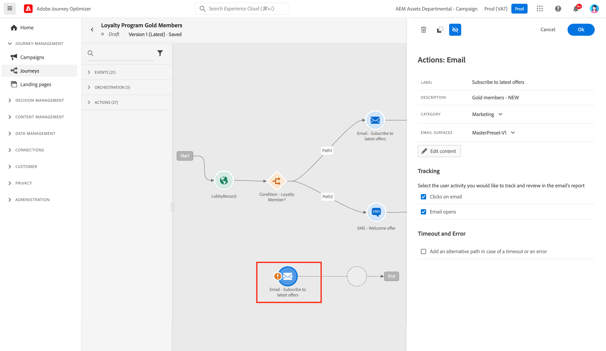
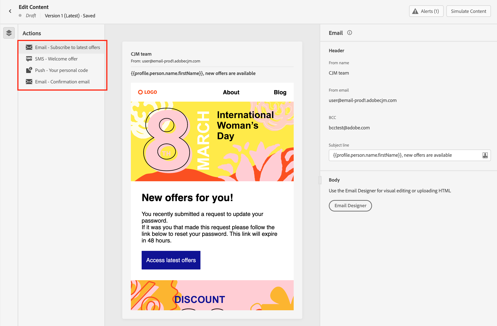

# Kom igång med meddelanden {#get-started-messages}

>[!CONTEXTUALHELP]
>id="ajo_journey_message"
>title="Kanalåtgärder"
>abstract="Använd kanalåtgärder för att skicka ett push-, SMS- eller e-postmeddelande."

Använd [!DNL Journey Optimizer] för att skapa och leverera personaliserade push-meddelanden, SMS och e-postmeddelanden. Alla meddelanden kan redigeras online som en del av en åtgärd på arbetsytan på resan.  Använd funktionen Spara som mall för att enkelt återanvända innehållet. Du kan:

* Använd [!DNL Journey Optimizer] **funktioner för e-postdesign** för att skapa eller importera responsiva e-postmeddelanden.

* Utnyttja **Adobe Experience Manager Assets Essentials** för att berika era e-postmeddelanden, bygga och hantera er egen databas för mediefiler.

* Sök **Adobe Stock foton** för att skapa innehåll och förbättra e-postdesignen.

* Förbättra kundernas upplevelse genom att skapa personaliserade **push-meddelanden, SMS och e-post** baserat på deras profilattribut.

* **Skicka leveranser** baserat på innehållet och spåra kundbeteende.

>[!NOTE]
>
>Användarna kan öppna, skapa, redigera och/eller publicera resor beroende på deras produktprofil. Läs mer om användarbehörigheter [i det här avsnittet](../administration/permissions.md).

## Lägg till meddelanden på dina resor{#messages-in-journeys}

>[!CONTEXTUALHELP]
>id="ajo_message_category"
>title="Meddelandekategori"
>abstract="Välj Marknadsföring för kommersiella meddelanden eller Transactional för icke-kommersiella meddelanden som orderbekräftelse, meddelanden om lösenordsåterställning eller leveransinformation"

>[!CONTEXTUALHELP]
>id="ajo_message_surface"
>title="Kanalyta"
>abstract="En kanalyta är en instans av den kanalen som har alla inställningar för att kunna leverera en åtgärd via en kampanj eller en resa. Den definieras av en systemadministratör."

Om du vill lägga till meddelanden på dina resor lägger du bara till en push-, SMS- eller e-postaktivitet i kundresan.

1. Påbörja resan med en [Händelse](../building-journeys/general-events.md) eller en [Läs segment](../building-journeys/read-segment.md) aktivitet.

1. Från **Åtgärder** dra och släpp en **e-post**, en **SMS** eller en **Push** till arbetsytan.

   

1. Ange en etikett och en beskrivning.

1. Markera meddelandet **[!UICONTROL Category]**: välj **Marknadsföring** för kommersiella meddelanden, eller **Transactional** för icke-kommersiella meddelanden som orderbekräftelse, meddelanden om lösenordsåterställning eller leveransinformation.

   >[!CAUTION]
   >
   >Om du har definierat [frekvensregler](../configuration/frequency-rules.md) för en viss kanal och kategori tillämpas de automatiskt på meddelandet när den kanalen och kategorin väljs. För närvarande bara **[!UICONTROL Marketing]** finns för frekvensregler.

   

   >[!CAUTION]
   >
   >Marknadsföringsmeddelanden måste innehålla en [länk för avanmälan](../messages/consent.md#opt-out-management). Detta krävs inte för transaktionsmeddelanden eftersom dessa meddelanden kan skickas till profiler som avbeställer marknadskommunikation.

1. Välj kanalen **[!UICONTROL Surface]** (t.ex. meddelandeförinställning) för att skicka meddelandet.

   En yta är en konfiguration som har definierats av en [Systemadministratör](../start/path/administrator.md). Den innehåller alla tekniska parametrar för att skicka meddelandet, som rubrikparametrar, underdomän, mobilappar osv. [Läs mer](../configuration/channel-surfaces.md).

   >[!CAUTION]
   >
   >Du måste välja en giltig kanalyta för den valda meddelandekategorin och kanalen.

   Du kan när som helst komma åt och ändra meddelandets etikett, beskrivning och yta med hjälp av **[!UICONTROL Properties]** i meddelandegränssnittet.

1. Skapa meddelandeinnehållet.

   Lär dig detaljerade steg för att skapa meddelandeinnehåll på följande sida:

   * [Skapa ett e-postmeddelande](create-email.md)
   * [Skapa push-meddelanden](create-push.md)
   * [Skapa ett SMS-meddelande](create-sms.md)

## Aktivera optimering vid sändning{#sto-in-journeys}

För e-post- och push-meddelanden kan du aktivera **[!UICONTROL Send-time optimization]**.

Använd **[!UICONTROL Send-time optimization]** för att schemalägga personliga sändningstider för varje användare så att de kan utöka både öppnings- och klickfrekvensen för dina meddelanden. [Läs mer](../messages/send-time-optimization.md).

## Avancerade parametrar{#adv-settings}

Avancerade parametrar är skrivskyddade och dolda som standard.

Om du vill komma åt avancerade parametrar klickar du på **[!UICONTROL Show read-only fields]** -ikonen högst upp i meddelandefönstret.

Avancerade parametrar visas längst ned i meddelandefönstret. Dessa parametrar definieras av [systemadministratör](../start/path/administrator.md) i [kanalyta](../configuration/channel-surfaces.md) (t.ex. meddelandeförinställning) som är kopplad till meddelandet.

För push-meddelanden kan du visa följande parametrar: Token, AppID, AppPlatform.

För e-post kan du visa den primära e-postadressen.

Du kan åsidosätta dessa värden i specifika sammanhang om du vill använda dem. Om du vill tvinga fram ett värde klickar du på **Aktivera åsidosättning av parametrar** till höger om fältet. Det här alternativet kan vara användbart till exempel för att:

* Testa ett e-postmeddelande så kan du lägga till din e-postadress. När du har publicerat resan skickas e-postmeddelandet till dig.
* Se e-postadressen till prenumeranterna i en lista. Läs mer i [det här användningsfallet](../building-journeys/message-to-subscribers-uc.md).

Klicka på samma ikon om du vill återställa till standardparametern.

## Bläddra bland meddelanden{#browse-message}

När flera meddelanden används under en resa kan du växla från ett till ett annat från **Redigera innehåll** skärm.

Då kan du [kontrollera aviseringar](alerts.md) och [simulera](../design/preview.md) varje innehåll från en och samma vy.

## Duplicera ett meddelande {#duplicate-message}

Du kan kopiera ett befintligt meddelande från arbetsytan för resan.

Gör så här:

1. Markera meddelandet som du vill kopiera.

1. Använd **[!UICONTROL Copy]** från **[!UICONTROL Action]** fönster.

   

1. Retur **Ctrl+V** för att klistra in meddelandet.

   Meddelandet läggs till i kundresan. Alla inställningar och konfigurationer kopieras till det nya meddelandet.

   

1. Byt namn på meddelandet så att det kan skilja det ursprungliga meddelandet från kopian, till exempel när du redigerar meddelanden, enligt nedan:

   

>[!NOTE]
>
>För e-postmeddelanden kan du även omvandla ett befintligt meddelande till en mall. [Läs mer](../design/email-templates.md).

## Ta bort ett meddelande{#delete-message}

Om du vill ta bort ett meddelande använder du papperskorgsikonen högst upp i åtgärdsrutan för kanaler.

Använd **[!UICONTROL Confirm]** valideringsknapp.
