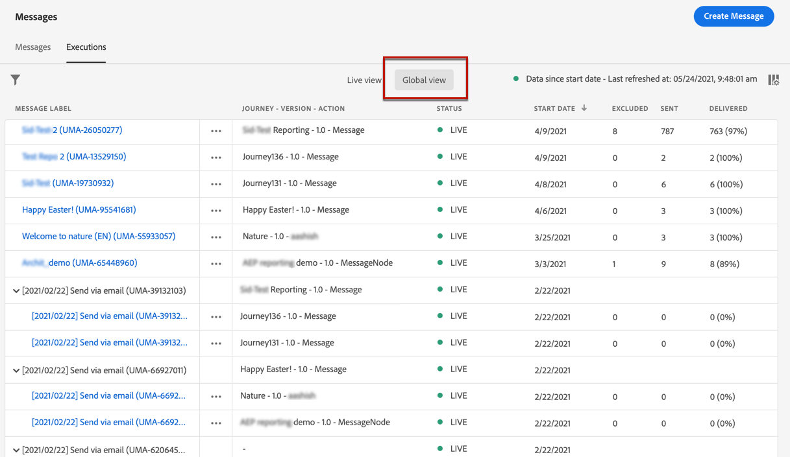

# Meddelandeövervakning {#monitor-message-execution}

För att vara säker på att dina meddelanden kan köras, skickas och levereras, [!DNL Journey Optimizer] har funktioner för att övervaka de meddelanden som för närvarande är publicerade och utlösta. Du kan se hur dina meddelanden fungerar på olika resor <!--and APIs--> i realtid från **[!UICONTROL Executions]** lista.

➡️ [Upptäck den här funktionen i en video](#video)

Om du vill komma åt den här listan går du till **[!DNL Journey Optimizer]** startsida, välja **[!UICONTROL Messages]** och klickar på **[!UICONTROL Executions]** -fliken.

På den här fliken finns två vyer: **[!UICONTROL Live view]** och **[!UICONTROL Global view]**.

* The **[!UICONTROL Live view]** -fliken innehåller en **realtidsöversikt över alla körda meddelanden** utlöses av en eller flera [resor](../building-journeys/journey.md) **under de senaste 24 timmarna**.

   

   Den här listan uppdateras automatiskt var sextio sekund. Om ingen körning utfördes de senaste 24 timmarna för ett specifikt meddelande visas null-värden (0) för det meddelandet i alla kolumner.

* The **[!UICONTROL Global view]** -fliken innehåller en **översikt över alla körda meddelanden** utlöses av en eller flera [resor](../building-journeys/journey.md) **sedan meddelandets startdatum**.

   

   Den här listan uppdateras automatiskt var nittio minut. Data sammanställs över tid sedan varje meddelandes startdatum.

Om ett meddelande publiceras men ännu inte aktiveras av en resa, visas det inte på någon av flikarna. Endast följande element visas:
* Meddelanden som har utlösts men ännu inte startats (väntar).
* Meddelanden som har utlösts och som körs (pågående).

>[!NOTE]
>
>Om ett meddelande har använts på flera resor visas en rad per resa för varje körning.

Som standard visas meddelandena med början från det senaste körningsdatumet. Klicka på **[!UICONTROL Filters]** -ikonen om du vill söka i meddelandena efter kanal, startdatum och/eller slutdatum. Du kan också välja att utesluta testhändelser från **Körningslista**.

The <!--**[!UICONTROL Quick action]**-->den andra kolumnen öppnar motsvarande [message](create-message.md) och få tillgång till [Live-rapport](../reports/live-report.md) om du är i **[!UICONTROL Live view]** eller [Global rapport](../reports/global-report.md) om du är i **[!UICONTROL Global view]**.

För varje meddelandekörning visas ett antal indikatorer:

* **[!UICONTROL Message label]**: Meddelanderubrik som du definierade på [skapar meddelandet](create-message.md). Körnings-ID, som genereras automatiskt, visas inom parentes.

   <!--**[!UICONTROL Execution ID]**: Automatically generated identifier.
  **[!UICONTROL Source]**: Name of the journey leveraging that message.-->

* **[!UICONTROL Journey - Version - Action]**: Namn på den resa som utnyttjar meddelandet, version av resan och etikett på den åtgärd som drar nytta av meddelandet under resan.

* **[!UICONTROL Status]**: Status för meddelandekörning.

* **[!UICONTROL Start date]**: Datum och tid när meddelandet har körts från resan.

* **[!UICONTROL Targeted]**: Antal målprofiler för varje meddelandekörning.

* **[!UICONTROL Excluded]**: Antal profiler som har uteslutits från det ursprungliga målet på grund av undantagsregler.

* **[!UICONTROL Sent]**: Antal meddelanden som har skickats.

* **[!UICONTROL Delivered]**: Antal meddelanden som levererats i mottagarens postlåda (e-post) eller enhet (push) utan att generera ett studs eller något annat leveransfel.

* **[!UICONTROL Bounces]**: Antal meddelanden som inte kan levereras på grund av ett leveransfel. [Läs mer om studsar](suppression-list.md).

* **[!UICONTROL Opens]**: Antal meddelanden som har öppnats.

* **[!UICONTROL Clicks]**: Antal klick på länkar i ett e-postmeddelande.

   >[!NOTE]
   >
   >Klickningar finns inte för push-meddelanden: När en användare klickar på ett push-meddelande öppnas programmet, som bara kan betraktas som en öppen fil.

* **[!UICONTROL Errors]**: Antal meddelanden som inte kan skickas på grund av ett tekniskt fel.

* **[!UICONTROL Spam complaints]**: Antal meddelanden som har markerats som skräppost av mottagare. Läs mer om klagomål i [Handbok om bästa praxis för leverans](https://experienceleague.adobe.com/docs/deliverability-learn/deliverability-best-practice-guide/metrics-for-deliverability/complaints.html#metrics-for-deliverability){target=&quot;_blank&quot;}.

Du kan välja vilka kolumner som ska visas i tabellen. Om du vill göra det klickar du på **[!UICONTROL Customize table]** överst på skärmen och markera de kolumner som du vill visa.

I **Global vy** Du kan välja om du vill visa data som tal, procenttal eller både och. Klicka på **Dataformat** för att växla mellan de tre alternativen.

Om du klickar på varje hyperlänk öppnas motsvarande meddelandesammanfattningsvy. [Läs mer om meddelanden](create-message.md).

## Instruktionsvideo {#video}

Läs mer om live- och globala rapporter, hur du får tillgång till och analyserar resan och de meddelandespecifika rapporterna samt hur du ändrar rapportpanelerna.

>[!VIDEO](https://video.tv.adobe.com/v/334108?quality=12)
