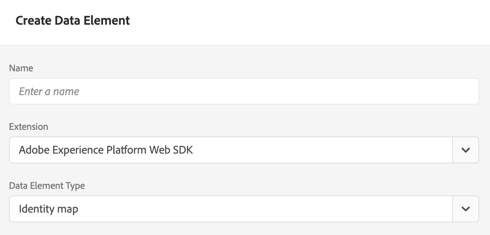

# Leverera erbjudanden med Edge Decisioning API {#edge-decisioning-api}

## Komma igång och krav {#edge-overview-and-prerequisites}

The [Adobe Experience Platform Web SDK](https://experienceleague.adobe.com/docs/experience-platform/edge/home.html#video-overview) är ett JavaScript-bibliotek på klientsidan som gör att Adobe Experience Cloud-kunder kan interagera med de olika tjänsterna i Experience Cloud via Experience Platform Edge Network.

Experience Platform Web SDK stöder frågor om personaliseringslösningarna på Adobe, inklusive beslutsstöd, så att du kan hämta och återge personaliserade erbjudanden som du har skapat med hjälp av API:er eller erbjudandebiblioteket. Mer detaljerad information finns i dokumentationen om [skapa ett erbjudande](../../get-started/starting-offer-decisioning.md).

Det finns två sätt att genomföra beslutsfattandet med [Platform Web SDK](https://experienceleague.adobe.com/docs/experience-platform/edge/home.html#video-overview). Ett sätt är inriktat på utvecklare och kräver kunskaper om webbplatser och programmering. Det andra sättet är att använda Adobe Experience Platform användargränssnitt för att ställa in erbjudanden som bara kräver att ett litet skript refereras till i sidhuvudet på HTML-sidan.

Mer information finns i dokumentationen om [beslutsfattande](https://experienceleague.adobe.com/docs/experience-platform/edge/personalization/offer-decisioning/offer-decisioning-overview.html#enabling-offer-decisioning) om du vill ha mer information om hur du kan leverera personaliserade erbjudanden med Adobe Experience Platform Web SDK.

>[!NOTE]
>
>Beslutshantering i Adobe Experience Platform Web SDK är bara tillgängligt för en uppsättning organisationer (begränsad tillgänglighet). Om du vill använda den här funktionen kontaktar du din kontoansvarige på Adobe.

## Webb-SDK för Adobe Experience Platform {#aep-web-sdk}

Platform Web SDK ersätter följande SDK:

* Visitor.js
* AppMeasurement.js
* AT.js
* DIL.js

SDK kombinerade inte dessa bibliotek och är en ny implementering från grunden. Om du vill använda den måste du först göra följande:

1. Se till att din organisation har rätt behörighet att använda SDK och att du har konfigurerat behörigheterna korrekt.

   <!-- For more detailed instructions, refer to the documentation on using the [Adobe Experience Platform Web SDK](). -->

1. [Konfigurera ditt datastream](https://experienceleague.adobe.com/docs/experience-platform/edge/fundamentals/datastreams.html) på fliken Datainsamling i ditt konto i Adobe Experience Cloud.

1. Installera SDK. Det finns flera metoder för detta, som beskrivs i [Installera SDK-sidan](https://experienceleague.adobe.com/docs/experience-platform/edge/fundamentals/installing-the-sdk.html). Den här sidan fortsätter med varje implementeringsmetod.

För att kunna använda SDK måste du ha en [schema](../../../data/get-started-schemas.md) och [datastream](../../../data/get-started-datasets.md) definierad.

<!-- ****TODO - Configure schema**** -->

För att personalisera erbjudanden måste ni konfigurera er personalisering/profiler separat.

<!-- Refer to the [doc](www.link.com) for detailed instructions.  -->

Följ något av följande två steg för att konfigurera SDK för beslutshantering:

## Alternativ 1 - Installera taggtillägget och implementeringen med Launch

Det här alternativet är mer användarvänligt för personer som kan ha en mindre kodningsupplevelse.

1. [Skapa en taggegenskap](https://experienceleague.adobe.com/docs/experience-platform/tags/admin/companies-and-properties.html)

1. [Lägg till inbäddningskoden](https://experienceleague.adobe.com/docs/core-services-learn/implementing-in-websites-with-launch/configure-launch/launch-add-embed.html)

1. Installera och konfigurera Adobe Experience Platform Web SDK-tillägget med den dataström du skapade genom att välja konfigurationen i listrutan Datastream. Läs dokumentationen om [tillägg](https://experienceleague.adobe.com/docs/experience-platform/tags/ui/extensions/overview.html).

   

   

1. Skapa de nödvändiga [Dataelement](https://experienceleague.adobe.com/docs/experience-platform/tags/ui/data-elements.html). Minimikravet är att du måste skapa en plattformsbaserad SDK-identitetskarta och ett XDM-objektdataelement för plattformswebben.

   

   

1. Skapa [Regler](https://experienceleague.adobe.com/docs/experience-platform/tags/ui/rules.html):

   Lägg till en SDK-sändningshändelse för en plattform och lägg till relevanta beslutsomfattningar i åtgärdens konfiguration

   

   

1. [Skapa och publicera](https://experienceleague.adobe.com/docs/experience-platform/tags/publish/libraries.html) ett bibliotek som innehåller alla relevanta regler, dataelement och tillägg som du har konfigurerat.

## Alternativ 2 - Implementera manuellt med den fristående versionen

Här är de steg som krävs för att använda beslutshantering med den färdiga fristående installationen av web SDK. I den här handboken förutsätts att det är första gången du implementerar SDK, så alla steg kanske inte gäller för dig. Den här guiden förutsätter också viss utvecklingsupplevelse.

Inkludera följande JavaScript-kodfragment från alternativ 2: Den fördefinierade fristående versionen på [den här sidan](https://experienceleague.adobe.com/docs/experience-platform/edge/fundamentals/installing-the-sdk.html) i `<head>` på HTML-sidan.

```
javascript
    <script>
        !function(n,o){o.forEach(function(o){n[o]||((n.__alloyNS=n.__alloyNS||
        []).push(o),n[o]=function(){var u=arguments;return new Promise(
        function(i,l){n[o].q.push([i,l,u])})},n[o].q=[])})}
        (window,["alloy"]);
    </script>
    <script src="https://cdn1.adoberesources.net/alloy/2.6.4/alloy.js" async></script>
```

Du behöver två ID:n från ditt Adobe-konto för att konfigurera SDK-konfigurationen - ditt edgeConfigId och ditt orgId. edgeConfigId är samma som ditt DataStream ID, som du borde ha konfigurerat i Förutsättningar.

Om du vill hitta ditt edgeConfigID/datastream ID går du till Datainsamling och väljer Datastream. Gå till din profil för att hitta ditt orgId.

Konfigurera SDK i JavaScript enligt instruktionerna på den här sidan. Du kommer alltid att använda edgeConfigId och orgId i konfigurationsfunktionen. Dokumentationen beskriver också vilka valfria parametrar som finns för din konfiguration. Den slutliga konfigurationen kan se ut ungefär så här:

```
javascript
    alloy("configure", {
        "edgeConfigId": "12345678-0ABC-DEF-GHIJ-KLMNOPQRSTUV",                            
        "orgId":"ABCDEFGHIJKLMNOPQRSTUVW@AdobeOrg",
        "debugEnabled": true,
        "edgeDomain": "edge.adobedc.net",
        "clickCollectionEnabled": true,
        "idMigrationEnabled": true,
        "thirdPartyCookiesEnabled": true,
        "defaultConsent":"in"  
    });
```

Installera tillägget för felsökningskrom som ska användas med felsökning. Här hittar du: <https://chrome.google.com/webstore/detail/adobe-experience-platform/bfnnokhpnncpkdmbokanobigaccjkpob>

Logga sedan in på ditt konto i felsökaren. Gå sedan till Loggar och kontrollera att du är ansluten till rätt arbetsyta. Nu kan du kopiera base64-kodad version av beslutsomfånget från ditt erbjudande.

När du redigerar webbplatsen inkluderar du skriptet med konfigurationen och `sendEvent` funktion för att skicka beslutsomfånget till Adobe.

**Exempel**:

```
javascript
    alloy("sendEvent", {
        "decisionScopes": 
        [
        "eyJ4ZG06YWN0aXZpdHlJZCI6Inhjb3JlOm9mZmVyLWFjdGl2aXR5OjE0ZWE4MDhhZjJjZDM1NzQiLCJ4ZG06cGxhY2VtZW50SWQiOiJ4Y29yZTpvZmZlci1wbGFjZW1lbnQ6MTRjNGFmZDI2OTXXXXXXXXXX"
        ]
    });
```

Se följande exempel på hur du hanterar svaret:

```
javascript
    alloy("sendEvent", {
        "decisionScopes":
        [
        "eyJ4ZG06YWN0aXZpdHlJZCI6Inhjb3JlOm9mZmVyLWFjdGl2aXR5OjE0ZWE4MDhhZjJjZDM1NzQiLCJ4ZG06cGxhY2VtZW50SWQiOiJ4Y29yZTpvZmZlci1wbGFjZW1lbnQ6MTRjNGFmZDI2OTXXXXXXXXXX"
        ]
    }).then(function(result) {
        Object.entries(result).forEach(([key, value]) => {
            console.log(key, value);
        });
    });
```

Du kan använda felsökaren för att verifiera att du har anslutit till Edge-nätverket.

>[!NOTE]
>
>Om du inte ser någon anslutning till kanten i loggarna kan du behöva inaktivera annonsblockeraren.

Återgå till hur du skapade erbjudandet och den formatering som användes. Baserat på de kriterier som anges i beslutet kommer du att få ett erbjudande med den information du angav när du skapade det i Adobe Experience Platform.

I det här exemplet är den JSON som ska returneras:

```
json
{
   "name":"ABC Test",
   "description":"This is a test offer", 
   "link":"https://sampletesting.online/",
   "image":"https://sample-demo-URL.png"
}
```

Hantera svarsobjektet och analysera de data du behöver. Du kan skicka flera beslutsomfattningar i ett `sendEvent` ditt svar kan se lite annorlunda ut.

```
json
    {
        "id": "abrxgl843d913",
        "scope": "eyJ4ZG06YWN0aXZpdHlJZCI6Inhjb3JlOm9mZmVyLWFjdGl2aXR5OjE0ZWE4MDhhZjJjZDM1NzQiLCJ4ZG06cGxhY2VtZW50SWQiOiJ4Y29yZTpvZmZlci1wbGFjZW1lbnQ6MTRjNGFmZDI2OTVlNWRmOSJ9",
        "items": 
        [
            {
                "id": "xcore:fallback-offer:14ea7f1ea26ebd0a",
                "etag": "1",
                "schema": "https://ns.adobe.com/experience/offer-management/content-component-json",
                "data": {
                    "id": "xcore:fallback-offer:14ea7f1ea26ebd0a",
                    "format": "application/json",
                    "language": [
                        "en-us"
                    ],
                    "content": "{\"name\":\"ABC Test\",\"description\":\"This is a test offer\", \"link\":\"https://sampletesting.online/\",\"image\":\"https://sample-demo-URL.png\"}"
                }
            }
        ]
    }
]
}
```

```
json
{
    "propositions": 
    [
    {
        "renderAttempted": false,
        "id": "e15ecb09-993e-4b66-93d8-0a4c77e3d913",
        "scope": "eyJ4ZG06YWN0aXZpdHlJZCI6Inhjb3JlOm9mZmVyLWFjdGl2aXR5OjE0ZWE4MDhhZjJjZDM1NzQiLCJ4ZG06cGxhY2VtZW50SWQiOiJ4Y29yZTpvZmZlci1wbGFjZW1lbnQ6MTRjNGFmZDI2OTVlNWRmOSJ9",
        "items": 
        [
            {
                "id": "xcore:fallback-offer:14ea7f1ea26ebd0a",
                "etag": "1",
                "schema": "https://ns.adobe.com/experience/offer-management/content-component-json",
                "data": {
                    "id": "xcore:fallback-offer:14ea7f1ea26ebd0a",
                    "format": "application/json",
                    "language": [
                        "en-us"
                    ],
                    "content": "{\"name\":\"Claire Hubacek Test\",\"description\":\"This is a test offer\", \"link\":\"https://sampletesting.online/\",\"image\":\"https://sample-demo-URL.png\"}"
                }
            }
        ]
    }
    ]
}
```

I det här exemplet var den väg som behövdes för att hantera och använda den erbjudandespecifika informationen på webbsidan: `result['decisions'][0]['items'][0]['data']['content']`

Så här anger du JS-variabler:

```
javascript
const offer = JSON.parse(result['decisions'][0]['items'][0]['data']['content']);

let offerURL = offer['link'];
let offerDescription = offer['description'];
let offerImageURL = offer['image'];

document.getElementById("offerDescription").innerHTML = offerDescription;
document.getElementById('offerImage').src = offerImageURL;
```

<!--## Limitations

Some offer constraints are currently not supported with the mobile Experience Edge workflows, for example Capping. The Capping field value specifies the number of times an offer can be presented across all users. For more details, see [Add constraints to an offer](../../offer-library/add-constraints.md#capping).-->
