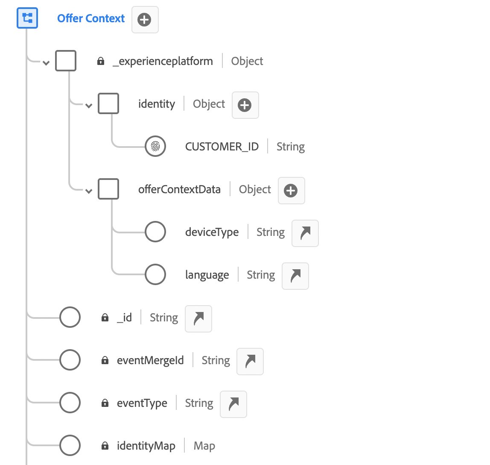

# Kontextdata och Edge Decisioneringsbegäranden {#edge}

I det här avsnittet får du hjälp med att skicka kontextdata i Edge Decisioning-begäranden och använda dem i reglerna för behörighet. Vi kommer att utforska ett heltäckande användningsexempel som visar hur vi kan leverera personaliserade erbjudanden baserat på den typ av enhet som kunderna använder.

Det här exemplet innehåller flera viktiga steg:

1. [Konfigurera förutsättningar](#prerequisites): Kontrollera att alla nödvändiga steg har slutförts för att skicka kontextdata i dina begäranden.
1. [Använd kontextdata i berättiganderegler](#rules): Skapa regler som avgör vilka erbjudanden som ska visas baserat på användarens enhetstyp.
1. [Designa enhetsspecifika erbjudanden](#offers): Skapa anpassade erbjudanden för varje enhetstyp och länka dem till motsvarande regler.
1. [Skapa en erbjudandesamling](#collection): Gruppera alla erbjudanden till en statisk samling.
1. [Konfigurera ett beslut](#decision) : Skapa ett nytt beslut som utnyttjar beslutsmotorn för erbjudanden för att välja det bästa erbjudandet som ska visas för användare baserat på deras enhetstyp.
1. [Skicka kontextdata i Edge Decisioning-begäran](#request): Skicka kontextdata via din API-begäran för att hämta och presentera lämpliga erbjudanden för användarna.

>[!BEGINSHADEBOX]

Om du vill gå vidare kan du även använda kontextdata i **rankningsformler** eller för att **anpassa dina offertrepresentationer** dynamiskt. Du kan till exempel skapa ett enda erbjudande och använda personaliseringsfält för att anpassa dess representation baserat på kontextdata. Visa till exempel en viss bild om användaren har en iPhone och en annan för iPad-användare. Mer information finns i följande avsnitt:

* [Rankningsformler - Öka erbjudanden baserat på kontextdata](../offers/ranking/create-ranking-formulas.md#context-data)
* [Anpassa representationer baserat på kontextdata](../offers/offer-library/add-representations.md#context-data)

>[!ENDSHADEBOX]

## Krav för att skicka kontextdata i Edge Decisioning-begäranden {#prerequisites}

I motsats till att skicka kontext i ett ganska fritt format med hjälp av API:t för beslutskontext måste Edge Decisioning-kontextens nyttolast vara XDM Experience Event-kompatibel. För att göra detta måste sammanhanget definieras som en del av XDM Experience Event som används för datainsamling.

1. Definiera ett händelseschema för upplevelser. I det här fallet skapas ett&quot;Erbjudandekontext&quot;-schema och erbjudandekontextfälten ingår i en&quot;Erbjudandekontext&quot;-fältgrupp. I själva verket skulle fältgruppen läggas till i det händelseschema som används för datainsamling som är kopplat till datastream&quot;Edge Collection Network&quot;.

   >[!NOTE]
   >
   >Schemat för upplevelsehändelser för erbjudandekontext måste vara en del av profilen, där fältet CUSTOMER_ID används som primär identitet.

   I det här exemplet har fältgruppen&quot;Erbjudandekontext&quot; två egenskaper: language och deviceType. Dessa egenskaper kommer att användas i reglerna för rankning och behörighet.

   {width="60%" align="center" zoomable="yes"}

   Lär dig hur du arbetar med scheman i guiden [Experience Data Model (XDM)](https://experienceleague.adobe.com/sv/docs/experience-platform/xdm/home){target="_blank"} (Adobe Experience Platform Experience Data Model)

1. Skapa en datauppsättning (här&quot;Erbjudandekontext&quot;) och se till att den är aktiverad för profilen.

1. Skapa en ny datastream från menyn **[!UICONTROL Data Collection]** > **[!UICONTROL Datastreams]**. Lär dig hur du skapar och konfigurerar datastream i Adobe Experience Platform [Datastreams-guiden](https://experienceleague.adobe.com/sv/docs/experience-platform/datastreams/configure){target="_blank"}

   Här har vi skapat en datastam för&quot;Erbjudandekontext&quot; med händelseschemat&quot;Erbjudandeinnehåll&quot; markerat.

   

1. Redigera den nya datastreamen och välj&quot;Adobe Experience Platform&quot; som tjänst och&quot;Erbjud kontext&quot; som händelsedatamängd.

   

1. Spara datastream och kopiera dess ID. Detta ID används i API-begärans slutpunkt. [Lär dig hur du skapar API-anropet](#request)

   

## Använd kontextdata i berättiganderegler {#rules}

Skapa regler för behörighet som avgör vilka erbjudanden som ska visas baserat på användarens enhetstyp:


* Regel för iPhone-enhet:

   * Regelnamn:&quot;Edge-kontextregel - iphone&quot;
   * Konfiguration: deviceType = &#39;iphone&#39;
   * PQL syntax:

     ```
     select _Any1 from xEvent where _Any1._experienceplatform.offerContextData.deviceType.equals("iphone", false)
     ```

* Regel för iPad-enhet:

   * Regelnamn:&quot;Edge Context Rule - ipad&quot;
   * Konfiguration: deviceType = &#39;ipad&#39;
   * PQL syntax

     ```
     select _Any1 from xEvent where _Any1._experienceplatform.offerContextData.deviceType.equals("ipad", false)
     ```

## Skapa erbjudanden {#offers}

Skapa ett erbjudande för varje enhetstyp och länka det till motsvarande berättiganderegel som skapats tidigare:

* Erbjudande för iphone-användare:

   * Erbjudandenamn :&quot;Edge Context - iPhone Offer Content&quot;
   * Associerad regel:&quot;Edge Context Rule - iphone&quot;

* Erbjudande för iPad-användare:

   * Erbjudandets namn: Edge Context - iPad Offer Content:
   * Associerad regel:&quot;Edge Context Rule - ipad&quot;

Skapa dessutom ett reserverbjudande (här&quot;Context Fallback Content&quot;) som visas om inga specifika enhetskriterier uppfylls.

## Lägg till erbjudanden i en samling {#collection}

Lägg till erbjudanden som skapats tidigare i en statisk samling som heter här&quot;Edge Device Context&quot;. I den här samlingen väljs valbara erbjudanden ut till kunderna.


## Skapa offertbeslut {#decision}

Skapa ett nytt beslut som utnyttjar beslutsmotorn för erbjudanden för att välja det bästa erbjudandet som ska visas för användarna baserat på deras enhetstyp med erbjudandet&quot;Context Fallback&quot; valt som reserverbjudande.


>[!NOTE]
>
>Om du vill gå vidare kan du använda kontextdata i rankningsformler och tilldela dem till ditt beslut. LÄGG TILL INFORMATION

## Skicka kontextdata i Edge Decisioning-begäran {#request}

### Slutpunkt

Använd ID:t för [datastream](#prerequisites) som skapades tidigare i slutpunkten.

`https://edge.adobedc.net/ee/irl1/v1/interact?configId=f3c47f2a-c484-4908-87a5-a82b55039e22`

### Nyttolast

Här är ett exempel på en begäran som skickar kontextdata.

* Information om enhetstypen skickas i noden `xdm:ContextData`.
* I noden `decisionScopes` kopierar och klistrar du in beslutsomfånget för det [erbjudandebeslut](#decision) som konfigurerats tidigare.

  +++Var beslutets omfattning ska hämtas

  

  +++

```
{
    "events": [{
        "xdm": {
            "identityMap": {
                "customerId": [{
                    "id": "0000158216",
                    "authenticatedState": "authenticated",
                    "primary": true
                }]
            },
            "_experienceplatform": {
                "identity": {
                    "core": {
                        "customerId": "0000158216"
                    }
                },
                "offerContextData" : {
                    "language" : "NL",
                    "deviceType" : "iphone"
                }
            }
        }
    }],
    "query": {
        "personalization": {
            "decisionScopes": ["eyJ4ZG06YWN0aXZpdHlJZCI6Inhjb3JlOm9mZmVyLWFjdGl2aXR5OjE3M2I1MGM5Mjg0ZGQ4NzkiLCJ4ZG06cGxhY2VtZW50SWQiOiJ4Y29yZTpvZmZlci1wbGFjZW1lbnQ6MTZhMzQxZWQ4ZDYyMzc2MSJ9"]
        }
    }
}
```

### Svar

Här följer ett exempelsvar:

```
{
    "requestId": "14a2d3f5-a6fa-494e-b42c-cc65a845284a",
    "handle": [
        {
            "payload": [
                {
                    "id": "1eafc831-4819-4800-8e25-c9e9f0838e09",
                    "scope": "eyJ4ZG06YWN0aXZpdHlJZCI6Inhjb3JlOm9mZmVyLWFjdGl2aXR5OjE3M2I1MGM5Mjg0ZGQ4NzkiLCJ4ZG06cGxhY2VtZW50SWQiOiJ4Y29yZTpvZmZlci1wbGFjZW1lbnQ6MTZhMzQxZWQ4ZDYyMzc2MSJ9",
                    "activity": {
                        "id": "xcore:offer-activity:173b50c9284dd879",
                        "etag": "1",
                        "name": "Edge Device Context"
                    },
                    "placement": {
                        "id": "xcore:offer-placement:16a341ed8d623761",
                        "etag": "1",
                        "name": "HIB",
                        "channel": "https://ns.adobe.com/xdm/channel-types/mobile",
                        "componentType": "https://ns.adobe.com/experience/offer-management/content-component-json"
                    },
                    "items": [
                        {
                            "id": "xcore:personalized-offer:173b4e05676d87f5",
                            "etag": "3",
                            "name": "Edge Context - iPhone Offer",
                            "priority": 0,
                            "schema": "https://ns.adobe.com/experience/offer-management/content-component-json",
                            "data": {
                                "id": "xcore:personalized-offer:173b4e05676d87f5",
                                "format": "application/json",
                                "language": [
                                    "en-gb"
                                ],
                                "content": "{\n    \"name\" : \"iphone offer\"\n}"
                            }
                        }
                    ]
                }
            ],
            "type": "personalization:decisions",
            "eventIndex": 0
        },
        {
            "payload": [],
            "type": "activation:pull",
            "eventIndex": 0
        },
        {
            "payload": [],
            "type": "personalization:decisions",
            "eventIndex": 0
        },
        {
            "payload": [
                {
                    "scope": "Target",
                    "hint": "37",
                    "ttlSeconds": 1800
                },
                {
                    "scope": "AAM",
                    "hint": "6",
                    "ttlSeconds": 1800
                },
                {
                    "scope": "EdgeNetwork",
                    "hint": "irl1",
                    "ttlSeconds": 1800
                }
            ],
            "type": "locationHint:result"
        },
        {
            "payload": [
                {
                    "key": "kndctr_907075E95BF479EC0A495C73_AdobeOrg_identity",
                    "value": "CiY0MDAwMDgyMjMzNTEzNzU1OTcwMjQ0NDcyNjU1MTAyMDEwNDQ3MVIRCNnE4Y6QMRABGAEqBElSTDHwAdnE4Y6QMQ==",
                    "maxAge": 34128000
                },
                {
                    "key": "kndctr_907075E95BF479EC0A495C73_AdobeOrg_cluster",
                    "value": "irl1",
                    "maxAge": 1800
                }
            ],
            "type": "state:store"
        }
    ]
}
```
