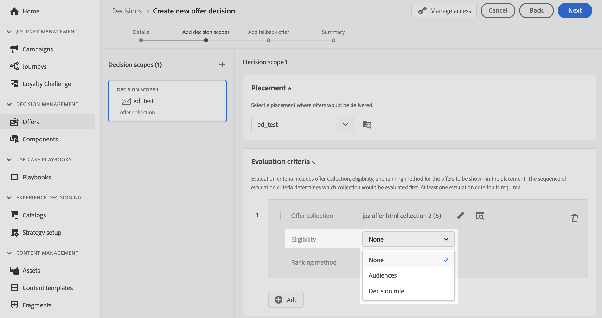

# Utnyttja anpassade uppladdningsmålgrupper för beslut {#custom-upload-decisioning}

>[!TIP]
>
>Beslutsfattandet, [!DNL Adobe Journey Optimizer]s nya beslutsfunktion, är nu tillgängligt via den kodbaserade upplevelsen och e-postkanalerna! [Läs mer](../experience-decisioning/gs-experience-decisioning.md)

Med [!DNL Journey Optimizer] kan du utnyttja data från målgrupper som skapats med anpassad överföring (CSV-fil) till [!DNL Adobe Experience Platform]. Dessa data har stöd för dina beslutsflöden. Detta är särskilt användbart när informationen inte behövs i profilen men ändå är viktig för att fatta beslut.

Data från anpassade uppladdningsgrupper kan utnyttjas i Beslutshantering för:

1. Kvalificeringskriterier i erbjudanden och beslut.
2. Anpassa innehåll i erbjudanderepresentationer.

Mer information om anpassade uppladdningsgrupper finns i avsnitten:

* [Kom igång med målgrupper och Journey Optimizer](../audience/about-audiences.md)
* [Importera en målgrupp i Adobe Experience Platform](https://experienceleague.adobe.com/sv/docs/experience-platform/segmentation/ui/audience-portal#import-audience){target="_blank"}

## Måste läsas {#must-read}

* **Endast beslutshantering** - Den här funktionen stöds endast i beslutshantering, inte i beslut (kallades tidigare Experience Decision).
* **API för beslut (Hub) endast** - Det är tillgängligt exklusivt via Hub-begäranden (Decisioning API) och stöds inte av Edge Decisioning API eller gruppbeslut.
* **Nödvändig API-flagga för anrikningsdata** - Om du använder en CSV-målgrupp (Custom Upload) och vill hämta anrikningsdata i svaret på erbjudandet måste du inkludera `"xdm:enrichedAudience": true` i nyttolasten för din API-begäran. Utan den här flaggan returneras inte anrikningsattribut från den överförda CSV-målgruppen. [Läs mer om besluts-API](api-reference/offer-delivery-api/decisioning-api.md)

## Använd en anpassad publik som kvalificeringskriterier {#eligibilty}

Du kan använda en anpassad uppladdningspublik som kvalificeringskriterier både på erbjudande- och beslutsnivå. När de lagts till kan dessa kriterier utesluta erbjudanden eller uppsättningar av erbjudanden från berättigandet. Här är de olika platserna där du kan utnyttja anpassade uppladdningsgrupper för att förfina erbjudanden och beslutsbehörigheter:

* Skapa en beslutsregel med hjälp av en anpassad uppladdningspublik:

   1. När du redigerar en regel öppnar du fliken **Publiker** och söker efter din CSV-målgrupp i listan. Dra och släpp publiken på regelarbetsytan.
   1. Använd fliken **Attribut** och navigera till anrikningsscheman länkade till den valda målgruppen. På så sätt kan du komma åt alla data från CSV-filen och använda dem i din regel. [Lär dig skapa en beslutsregel](../offers/offer-library/creating-decision-rules.md)
   1. Spara regeln. När regeln har skapats kan den användas både på erbjudande- och beslutsnivå för att förfina deras behörighet.

  

* Använd anpassade uppladdningsmålgrupper som begränsning för erbjudandet. [Lär dig lägga till begränsningar i ett erbjudande](../offers/offer-library/add-constraints.md)

  När du skapar ett erbjudande kan du i steget **Lägg till begränsningar** antingen:

   * Använd den anpassade uppladdningspubliken för att definiera kvalificeringen för erbjudandet,
   * Använd en regel som utnyttjar den anpassade uppladdningspubliken.

  

* Använd anpassade uppladdningsmålgrupper på beslutsnivå.

  När du ställer in ett beslut kan du i steget **Lägg till beslutsomfattning** använda anpassade uppladdningsmålgrupper som utvärderingskriterier för en samling med erbjudanden. [Lär dig definiera beslutsomfattning](../offers/offer-activities/create-offer-activities.md#add-decision-scopes)

  

## Anpassa offertrepresentationerna med en anpassad publik

Anpassade uppladdningsgrupper kan också användas för att anpassa innehållet i offertrepresentationer genom att referera till data från CSV-filen. [Lär dig hur du lägger till representationer i ett erbjudande](../offers/offer-library/add-representations.md)

Om ni vill utnyttja en anpassad uppladdningspåbileys attribut för personalisering måste ni först lägga till den anpassade målgruppen som en begränsning. Om du vill göra det när du redigerar ett erbjudande lägger du till målgruppen som begränsningar i steget **Lägg till begränsningar** eller väljer en regel som utnyttjar den anpassade uppladdningsmålgruppen.

När målgruppen har lagts till som en begränsning kan du använda dess attribut för att anpassa återgivningsinnehållet. Om du vill göra det går du till fliken **Profilattribut** och söker efter den anpassade uppladdningsmålgruppen. Välj relevanta attribut från målgruppen för att anpassa erbjudandeinnehållet.

