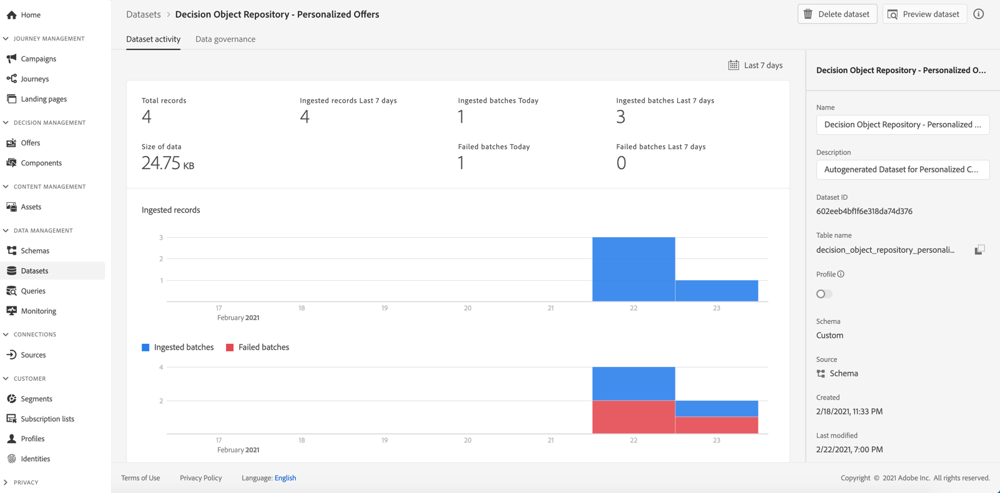

# Åtkomst till den exporterade erbjudandekatalogen {#access-exported-catalog}

Katalogen för exporterade erbjudanden är tillgänglig i Adobe Experience Platform **[!UICONTROL Datasets]** -menyn. En datauppsättning skapas för varje objekt i erbjudandebiblioteket.

Klicka på en datauppsättning för att komma åt informationen om den.

The **[!UICONTROL Preview dataset]** kan du visa den senaste lyckade gruppen i datauppsättningen.

Mer information om hur du bläddrar bland och använder datauppsättningar finns i [den här sidan](../../data/get-started-datasets.md).
