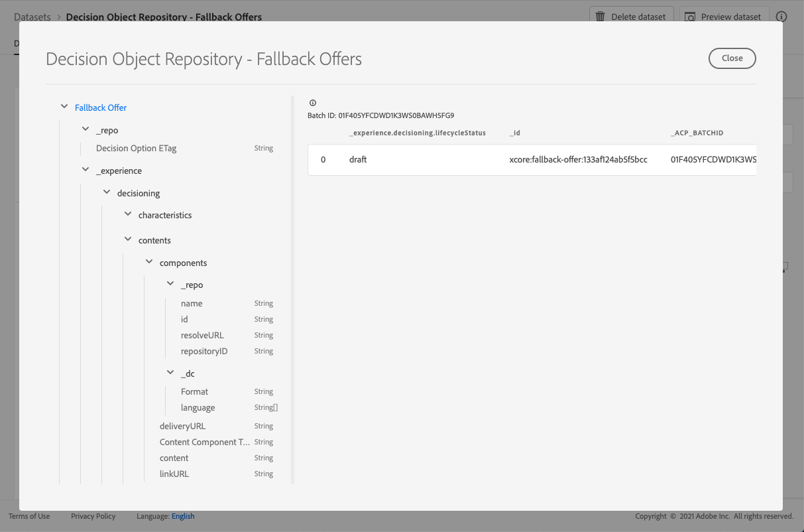

# Reserverbjudanden - datauppsättning {#fallback-dataset}

Varje gång ett erbjudande ändras uppdateras den autogenererade datauppsättningen för reserverbjudanden.

Den senaste lyckade batchen i datauppsättningen visas till höger. Den hierarkiska vyn av schemat för datauppsättningen visas i den vänstra rutan.

>[!NOTE]
>
>Borttagna reserverbjudanden markeras som arkiverade i datauppsättningen.

Här är en lista över alla fält som kan användas i datamängden **[!UICONTROL Decision Object Repository - Fallback Offers]**.

+++ Identifierare

**Fält:**&#x200B;_id
**Titel:** Identifierare
**Beskrivning:** En unik identifierare för posten.
**Typ:** sträng

+++

+++ upplevelse

**Fält:**&#x200B;_upplevelse
**Typ:** objekt

+++

+++ _experience > decisioning

**Fält:** beslut
**Typ:** objekt

+++

+++ _experience > decisioning > properties

**Fält:** - egenskaper
**Titel:** Beslutsalternativsegenskaper
**Beskrivning:** Ytterligare egenskaper eller attribut som tillhör det här beslutsalternativet. Olika instanser kan ha olika egenskaper (tangenter på kartan). Egenskaperna är namnvärdespar som används för att skilja mellan olika beslutsalternativ. Egenskaper används som värden i innehåll som representerar det här alternativet och som funktioner för att analysera och optimera prestanda för ett alternativ. När alla instanser har samma attribut eller egenskap bör den aspekten modelleras som ett tilläggsschema som härleds från beslutsalternativsinformationen.
**Typ:** objekt

+++

<!--Field under Characteristics without title = additionalProperties? Desc = Value of the property. Type: string-->

+++ _experience > decisioning > contents

**Fält:** innehåll
**Titel:** Innehållsinformation
**Beskrivning:** Innehållsobjekt som återger beslutsobjektet i olika sammanhang. Ett enda beslutsalternativ kan ha flera innehållsvarianter. Innehåll är information som riktar sig till en målgrupp som konsumeras i en (digital) upplevelse. Innehållet levereras via kanaler till en viss plats.
**Typ:**-matris

+++

+++_experience > decisioning > contents > components

**Fält:** komponenter
**Beskrivning:** Komponenterna i innehållet som representerar beslutsalternativet, inklusive alla deras språkvarianter. Specifika komponenter hittades av dx:format, dc:subject och dc:language eller en kombination av dessa. Dessa metadata används för att hitta eller representera innehållet som är kopplat till ett erbjudande och integrera det enligt placeringskontraktet.
**Typ:**-matris
**Obligatoriskt:** &quot;_type&quot;, &quot;_dc&quot; <!--TBC?-->

* **_experience > decisioning > contents > components > Content Component Type**

  **Fält:**&#x200B;_typ
  **Titel:** Innehållskomponenttyp
  **Beskrivning:** En uppräknad uppsättning URI:er där varje värde mappas till en typ som anges för innehållskomponenten. En del användare av innehållsrepresentationerna förväntar sig att värdet @type ska vara en referens till schema som beskriver ytterligare egenskaper för innehållskomponenten.
  **Typ:** sträng

* **_experience > Decision > contents > components > _dc**

  **Fält:**&#x200B;_dc
  **Typ:** objekt
  **Obligatoriskt:** &quot;format&quot;

   * **Format**

     **Fält:**-format
     **Titel:** Format
     **Beskrivning:** Resursens fysiska eller digitala manifestation. Vanligtvis ska Format innehålla resursens medietyp. Format kan användas för att fastställa programvara, maskinvara eller annan utrustning som behövs för att visa eller använda resursen. Rekommenderad bästa praxis är att välja ett värde från ett kontrollerat vokabulär (till exempel en lista över [Internetmedietyper]&#x200B;(https://www.iana.org/-tilldelningar/medietyper/) som definierar datormediaformat).
     **Typ:** sträng
     **Exempel:** &quot;application/vnd.adobe.photoshop&quot;

   * **Språk**

     **Fält:** språk
     **Titel:** Språk
     **Beskrivning:** Resursens språk. \nSpråk anges i språkkoden enligt definitionen i [IETF RFC 3066](https://www.ietf.org/rfc/rfc3066.txt) som är en del av BCP 47, som används någon annanstans i XDM.
     **Typ:**-matris
     **Exempel:** &quot;\n&quot;, &quot;pt-BR&quot;, &quot;es-ES&quot;

* **_experience > Decision > contents > components > _repo**

  **Fält:**&#x200B;_repo
  **Typ:** objekt

   * **id**

     **Fält:** id
     **Beskrivning:** En valfri unik identifierare som refererar till resursen i en innehållsdatabas. När plattforms-API:er används för att hämta representationen kan klienten förvänta sig att ytterligare egenskapen \&quot;repo:resolveUrl\&quot; hämtar resursen.
     **Typ:** sträng
     **Exempel:** &quot;urn:aaid:sc:US:6dc33479-13ca-4b19-b25d-c805eff8a69e&quot;

   * **namn**

     **Fält:** namn
     **Beskrivning:** Tips om var du hittar databasen som lagrar den externa resursen med \&quot;repo:id\&quot;.
     **Typ:** sträng

   * **databaseID**

     **Fält:** databaseID
     **Beskrivning:** En valfri unik identifierare som refererar till resursen i en innehållsdatabas. När plattforms-API:er används för att hämta representationen kan klienten förvänta sig att ytterligare egenskapen \&quot;repo:resolveUrl\&quot; hämtar resursen.
     **Typ:** sträng
     **Exempel:** &quot;C87932A55B06F7070A49412D@AdobeOrg&quot;

   * **resolveURL**

     **Fält:** resolveURL
     **Beskrivning:** En unik resurslokaliserare (valfritt) som kan läsa resursen i en innehållsdatabas. Detta gör det enklare att hämta resursen utan att kunden förstår var resursen hanteras och vilka API:er som ska anropas. Detta liknar en HAL-länk, men semantiken är enklare och mer målinriktad.
     **Typ:** sträng
     **Exempel:** &quot;https://plaftform.adobe.io/resolveByPath?path=&quot;/mycorp/content/projectx/fragment/prod/herobanners/banner14.html3&quot;&quot;

* **_experience > decisioning > contents > components > content**

  **Fält:** innehåll
  **Beskrivning:** Ett valfritt fält som ska innehålla innehåll direkt. I stället för att referera till innehåll i en resursdatabas kan komponenten lagra enkelt innehåll direkt. Det här fältet används inte för sammansatta, komplexa och binära innehållsresurser.
  **Typ:** sträng

* **_experience > Decision > contents > components > deliveryURL**

  **Fält:** deliveryURL
  **Beskrivning:** En unik resurslokaliserare (valfritt) som kan hämta resursen från ett innehållsleveransnätverk eller en tjänstslutpunkt. Den här URL:en används av en användaragent för att få tillgång till resursen offentligt.
  **Typ:** sträng
  **Exempel:** &quot;https://cdn.adobe.io/content/projectx/fragment/prod/static/1232324wd32.jpeg&quot;

* **_experience > Decision > contents > components > linkURL**

  **Fält:** linkURL
  **Beskrivning:** En unik resurslokaliserare (valfritt) för användarinteraktioner. Den här URL:en används för att referera slutanvändaren till i en användaragent och kan spåras.
  **Typ:** sträng
  **Exempel:** &quot;https://cdn.adobe.io/tracker?code=23432&redirect=/content/projectx/fragment/prod/static/1232324wd32.jpeg&quot;

+++

+++ _experience > decisioning > contents > Placement

**Fält:** placering
**Titel:** Placement
**Beskrivning:** Placering att följa. Värdet är URI (@id) för erbjudandeplaceringen som refereras. Se schema https://ns.adobe.com/experience/decisioning/placement.
**Typ:** sträng

+++ 

+++ _experience > decisioning > Lifecycle Status

**Fält:** lifecycleStatus
**Titel:** Livscykelstatus
**Beskrivning:** Livscykelstatus tillåter att arbetsflöden utförs med ett objekt. Statusen kan påverka var ett objekt är synligt eller anses relevant. Statusändringar styrs av klienter eller tjänster som använder objekten.
**Typ:** sträng
**Möjliga värden:** &quot;Utkast&quot; (standard), &quot;Godkänd&quot;, &quot;Live&quot;, &quot;Slutförd&quot;, &quot;Arkiverad&quot;

+++

+++ _experience > Decision > Decision Option Name

**Fält:** namn
**Titel:** Beslutsalternativsnamn
**Beskrivning:** Alternativnamn som visas i olika användargränssnitt.
**Typ:** sträng

+++

+++ _experience > decisioning > taggar

**Fält:** taggar
**Titel:** Taggar
**Beskrivning:** Uppsättningen med samlingskvalificerare (tidigare känd som taggar) som är associerade med den här entiteten. Samlingskvalificerarna används i filteruttryck för att begränsa det totala lagret till en delmängd (kategori).
**Typ:**-matris

+++

<!--Field without name under collection qualifiers: Description: An identifier of a collection qualifier object. The value is the @id of the collection qualifier that is referenced. See tag schema: https://ns.adobe.com/experience/decisioning/tag. Type: string-->

+++ repo

**Fält:**&#x200B;_repo
**Typ:** objekt

+++

+++ _repo > Decision Option ETag

**Fält:**-tagg
**Titel:** Beslutsalternativets ETag
**Beskrivning:** Den revision som beslutsalternativsobjektet var när ögonblicksbilden togs.
**Typ:** sträng

+++
