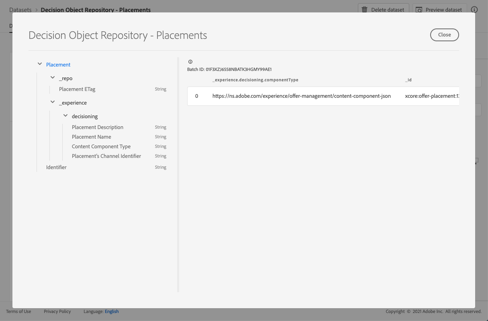

# Placeringar, datauppsättning {#placements-dataset}

Varje gång ett erbjudande ändras uppdateras den autogenererade datauppsättningen för ersättningar.

Den senaste lyckade batchen i datauppsättningen visas till höger. Den hierarkiska vyn av schemat för datauppsättningen visas i den vänstra rutan.

>[!NOTE]
>
>Lär dig hur du får åtkomst till exporterade datauppsättningar för varje objekt i ditt Erbjudandebibliotek i [det här avsnittet](../export-catalog/access-dataset.md).

Här är en lista över alla fält som kan användas i **[!UICONTROL Decision Object Repository - Placements]**-datauppsättningen.

<!--A placement describes a location or place in a personalized message. It is used to set technical constraints for content that the personalization decision supplies. The placement also represents a request to produce certain types of metrics when an experience event is produced where this placement is involved. For instance, the placement facilitates a personalized clickable image inside an email shown to an end-user. The placement may for instance request from the assembled experience that the click on its image gets reported in an experience event with a metric https://ns.adobe.com/xdm/data/metrics/web/linkclicks and a reference to this placement.-->

## Identifierare

**Fält:** _id 
**Title:** Identifier 
**Description:** A unique identifier for the record.
**Typ:** sträng

## upplevelse

**fält:** _upplevelsetyp 
**:** objekt

### _experience > decisioning

**fält:** bestämma 
**typ:** objekt

#### _experience > decisioning > Placements Channel Identifier

**Fält:** channelID 
**Title:** Placement&#39;s Channel Identifier 
**Description:** Den kanal som förslaget gjordes i. Värdet är en giltig kanal-URI. Se https://ns.adobe.com/xdm/channels/channel.
**Typ:** sträng

#### _experience > decisioning > Content Component Type

**Fält:** componentType 
**Title:** Content Component Type 
**Description:** En uppräknad uppsättning URI:er där varje värde mappas till en typ som anges för innehållskomponenten. En del användare av innehållsrepresentationerna förväntar sig att värdet @type ska vara en referens till schema som beskriver ytterligare egenskaper för innehållskomponenten.
**Typ:** sträng

#### _experience > decisioning > contentTypes

**fält:** contentTypes 
**Type:** array

* **MIME-mediatyp**

   **Title:** MIME Media Type
   **Beskrivning:** En begränsning för medietypen för komponenterna som förväntas i placeringen. Det kan finnas mer än en medietyp för en komponent, t.ex. ett annat bildformat.
   **Typ:** sträng

#### _experience > Decision > Placement Description

**Fält:** description 
**Titel:** Placeringsbeskrivning 
**Beskrivning:** Den används för att förmedla mänskliga läsbara avsikter om hur dynamiskt innehåll används i den övergripande meddelandeleveransen. Att ett visst utrymme är en \&quot;Banner\&quot; på en webbsida förmedlas ofta via beskrivningen och inte med en formell metod.
**Typ:** sträng

#### _experience > decisioning > Placement name

**Fält:** name 
**Title:** Placement Name 
**Description:** An assign name for the placement to reference to it in human interactions.
**Typ:** sträng

## repo

**fält:** _repo-
**typ:** objekt

### _repo > Placement ETag

**Fält:** etag 
**Title:** Placement ETag 
**Description:** The revision that the Decision option object was at when the snapshot was taken.
**Typ:** sträng
