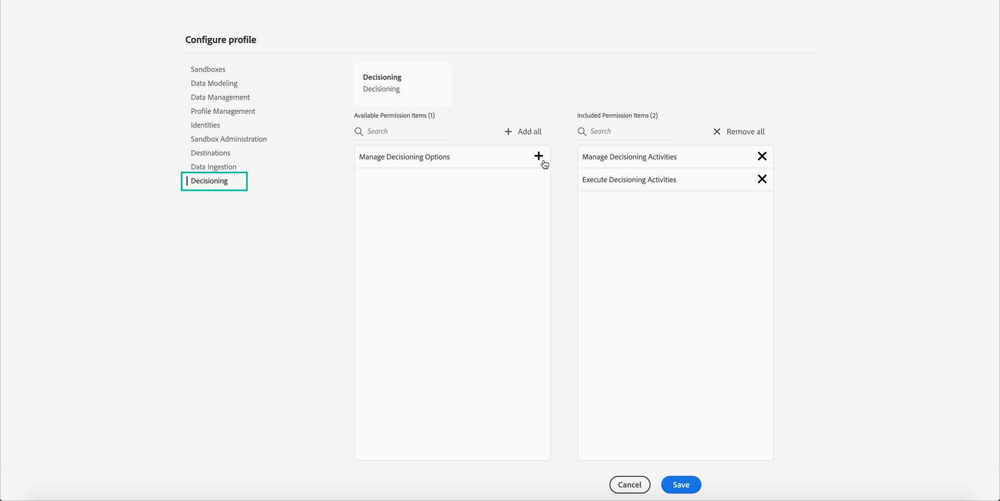

# Bevilja åtkomst till beslutsfattandet {#granting-acess-to-decision-management}

Behörigheter att komma åt och använda offera decisioningen hanteras med [Adobe Admin Console](https://helpx.adobe.com/enterprise/managing/user-guide.html){target=&quot;_blank&quot;}.

Om du vill ge åtkomst till funktionen Beslutshantering måste du skapa en **[!UICONTROL Product profile]** och tilldela användarna motsvarande behörigheter. Läs mer om hantering [!DNL Journey Optimizer] användare och behörigheter i [det här avsnittet](../../administration/permissions.md).

De behörigheter som är specifika för beslutshanteringen finns i [det här avsnittet](../../administration/high-low-permissions.md#manage-decisioning).

<!--If you are a [!DNL Journey Optimizer] user leveraging the **Decision Management** functionality, you need to have the [Decision management permissions](../../administration/high-low-permissions.md#decisions-permissions) enabled to acces all related capabilities. Learn more on managing [!DNL Journey Optimizer] users and permissions in [this section](../../administration/permissions.md).

If you are an [Adobe Experience Platform](https://experienceleague.adobe.com/docs/experience-platform/landing/home.html){target="_blank"} user leveraging the **Offer Decisioning** application service, follow the steps [below](#granting-acess-to-offer-decisioning) to grant access to [!DNL Offer Decisioning].

Grant access to Offer Decisioning

The steps below only apply to **Experience Platform users** leveraging the [!DNL Offer Decisioning] service.-->

1. Öppna [Admin Console](https://helpx.adobe.com/enterprise/managing/user-guide.html)väljer **[!UICONTROL Adobe Experience Platform]**.

   <!---->

1. Produktprofiler för visningen av tjänsten. Om du vill skapa en ny produktprofil klickar du på **[!UICONTROL New Profile]** -knappen.

   

   >[!NOTE]
   >
   >Du kan ha så många produktprofiler du vill, som motsvarar de olika roller du vill konfigurera för din organisation.

1. Ange produktprofilens namn och beskrivning och klicka sedan på **[!UICONTROL Next]**.

   

   <!--To access the product profile’s permissions, select the **[!UICONTROL Permissions]** line.-->

1. Välj de tjänster som ska aktiveras för produktprofilen. Som standard är alla tjänster markerade, vilket rekommenderas för att alla Experience Platform-funktioner ska vara tillgängliga.

   

1. I **[!UICONTROL Decision Management]** klickar du på **+** om du vill tilldela behörigheter till produktprofilen och sedan klicka på **[!UICONTROL Save]**.

   

   Tillgängliga behörigheter är:

   **[!UICONTROL Manage Decisioning Activities]**:

   * Läs, skriv, ta bort erbjudanden
   * Läsa, skriva, radera beslut (kallades tidigare erbjudandeaktiviteter)
   * Läsa, skriva, ta bort placeringar

   **[!UICONTROL Execute Decisioning Activities]**:

   * Läs erbjudanden
   * Läsa beslut
   * Läsplaceringar

   **[!UICONTROL Manage Decisioning Options]**:

   * Läs, skriv, ta bort erbjudanden
   * Läsa beslut
   * Läsa, skriva, ta bort placeringar

1. En sammanfattning av produktprofilens behörigheter visas. Nu kan du tilldela användare till produktprofilen så att de får åtkomst till dessa behörigheter.

   

>[!NOTE]
>
>Mer information om hur du hanterar användarbehörigheter finns i [Admin Console dokumentation](https://helpx.adobe.com/enterprise/managing/user-guide.html){target=&quot;_blank&quot;}.

