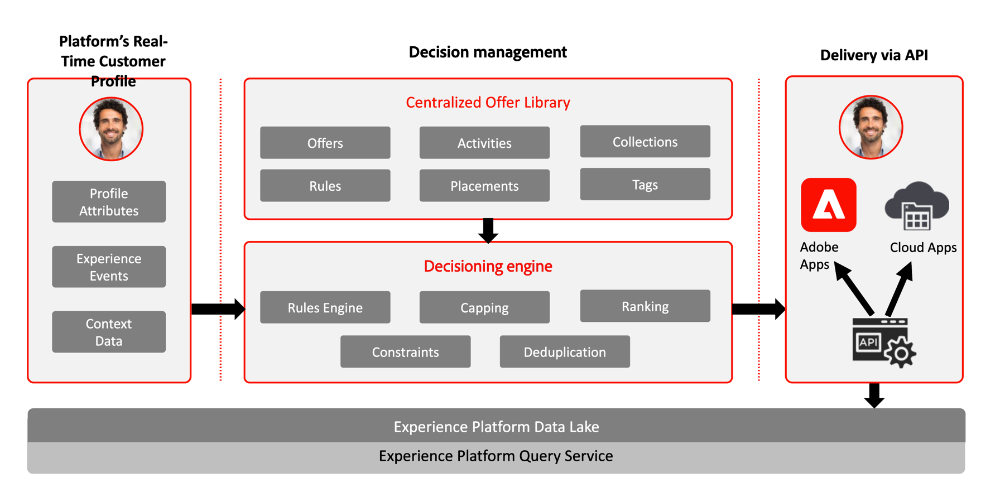
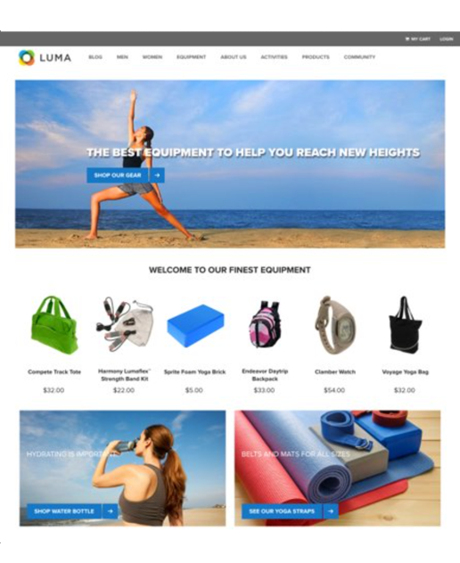

# Kom igång med Beslutshantering {#about-decision-management}

Använd [!DNL Journey Optimizer] för att leverera det bästa erbjudandet och upplevelsen till dina kunder via alla kontaktpunkter vid rätt tidpunkt. När ni väl utformat er målgrupp kan ni inrikta er på personaliserade erbjudanden.

Beslutshantering gör personaliseringen enkel med ett centralt bibliotek med marknadsföringserbjudanden och en beslutsmotor som tillämpar regler och begränsningar på komplexa realtidsprofiler som skapats av Adobe Experience Platform för att hjälpa er att skicka rätt erbjudande till era kunder vid rätt tidpunkt.

Beslutsledningskapaciteten består av två huvudkomponenter:

* **Det centraliserade erbjudandebiblioteket**, som är gränssnittet där du skapar och hanterar de olika elementen som dina erbjudanden består av, och definierar deras regler och begränsningar.
* **beslutsmotorn för erbjudanden** som utnyttjar Adobe Experience Platform-data och kundprofiler i realtid, tillsammans med erbjudandebiblioteket, för att välja rätt tid, kunder och kanaler som erbjudandena ska levereras till.

Några fördelar:

* Förbättrade kampanjresultat genom att leverera personaliserade erbjudanden i flera kanaler,
* Förbättrade arbetsflöden: I stället för att skapa flera leveranser eller kampanjer kan marknadsföringsteamen förbättra arbetsflödena genom att skapa en enda leverans och variera erbjudandena i olika delar av mallen.
* Styr hur många gånger ett erbjudande visas för olika kampanjer och kunder.

➡️ [Läs mer om beslutshantering i dessa videofilmer](#video)

>[!NOTE]
>
>Om du är [Adobe Experience Platform](https://experienceleague.adobe.com/docs/experience-platform/landing/home.html?lang=sv-SE){target="_blank"}-användare och använder **Offer Decisioning**-programmet gäller även alla beslutshanteringsfunktioner som beskrivs i det här avsnittet dig.

## Om erbjudanden och beslut {#about-offers-and-decisions}

Ett **erbjudande** består av innehåll, berättiganderegler och begränsningar som definierar villkoren som gäller när det presenteras för dina kunder.

Det skapas med **Erbjudandebiblioteket** som innehåller en central erbjudandekatalog där du kan koppla berättiganderegler och begränsningar till flera innehållsdelar för att skapa och publicera erbjudanden (se [Användargränssnitt för erbjudandebibliotek](../get-started/user-interface.md)).

När erbjudandebiblioteket har berikats med erbjudanden kan du integrera dina erbjudanden i **beslut**.

Besluten är behållare för dina erbjudanden som utnyttjar beslutsmotorn för erbjudanden för att välja det bästa erbjudandet som ska levereras beroende på leveransmålet.

## Vanliga användningsfall {#common-use-cases}

Beslutshanteringsfunktionerna och integrationen med Adobe Experience Platform gör att ni kan ta upp ett antal olika användningsfall som hjälper er att öka kundernas engagemang och konverteringar.

* Visa erbjudanden på webbplatsens hemsida som matchar besökskundens intressen, baserat på data från Adobe Experience Platform.

  

* Om kunderna går nära en av era butiker skickar du push-meddelanden som påminner dem om tillgängliga erbjudanden enligt deras attribut (lojalitetsnivå, kön, tidigare köp ...).

  

* Beslutshanteringen hjälper er också att förbättra kundernas upplevelse när ni kontaktar supportteamet. Med API:er för beslutshantering kan du i kundtjänstagentportalen visa information om kundens inlösta och nästa bästa erbjudanden.

  

## Bevilja åtkomst till beslutsledning {#granting-acess-to-decision-management}

Behörigheter för åtkomst och användning av beslutsfunktioner hanteras med [Adobe Admin Console](https://helpx.adobe.com/se/enterprise/managing/user-guide.html){target="_blank"}.

Om du vill ge åtkomst till beslutshanteringsfunktionen måste du skapa en **[!UICONTROL Product profile]** och tilldela användarna motsvarande behörigheter. Läs mer om hur du hanterar [!DNL Journey Optimizer] användare och behörigheter i [det här avsnittet](../../administration/permissions.md).

Behörigheterna som är specifika för Beslutshantering visas i [det här avsnittet](../../administration/high-low-permissions.md#decisions-permissions).

## Ordlista {#glossary}

Nedan finns en lista över de viktigaste koncept du kommer att arbeta med när du använder Beslutshantering.

* **Begränsning** eller **antal begränsningar**: en begränsning för att definiera hur många gånger ett erbjudande presenteras. Det finns två typer av begränsningar. Hur många gånger ett erbjudande kan föreslås för den kombinerade målgruppen, även kallat ”Total begränsning” och hur många gånger ett erbjudande kan föreslås för samma slutanvändare, även kallat ”Profilbegränsning”.

* **Samlingar**: samlingar är underuppsättningar av erbjudanden som baseras på fördefinierade villkor som definieras av en marknadsförare såsom erbjudandets kategori.

* **Beslut**: Ett beslut innehåller logiken som informerar valet av ett erbjudande.

* **Beslutsregel**: beslutsregler är begränsningar som läggs till på ett personaliserat erbjudande och tillämpas på en profil för att fastställa berättigande.

* **Berättigat erbjudande**: ett berättigat erbjudande uppfyller de krav som anges ovan och kan konsekvent erbjudas till en profil.

* **Beslutshantering**: Gör att du kan skapa och leverera personaliserade erbjudandeupplevelser för slutanvändare i alla kanaler och i alla program med hjälp av logiska funktioner och beslutsregler.

* **Reserverbjudanden**: ett reserverbjudande är erbjudandet som visas när en slutanvändare inte är berättigad till något av de personaliserade erbjudandena i samlingen.

* **Erbjudande**: ett erbjudande är ett marknadsföringsmeddelande som kan ha kopplade regler som fastställer vem som kan se erbjudandet.

* **Erbjudandebibliotek**: Erbjudandebiblioteket är ett centralt bibliotek som används för att hantera personaliserade erbjudanden och reserverbjudanden, beslutsregler och beslut.

* **Personaliserade erbjudanden**: ett personaliserat erbjudande är ett anpassningsbart marknadsföringsmeddelande som baseras på berättiganderegler och -begränsningar.

* **Placeringar**: en placering är den plats och/eller det sammanhang där ett erbjudande visas för en slutanvändare.

* **Prioritet**: prioritet används för att rangordna erbjudanden som uppfyller alla begränsningar såsom berättigande, kalender och begränsningar.

* **Representationer**: en representation är information som används av en kanal, såsom plats eller språk, för att visa ett erbjudande.

## Instruktionsfilmer{#video}

### Vad är beslutshantering? {#what-is-offer-decisioning}

I videon nedan ges en introduktion till nyckelfunktioner, arkitektur och användningsfall för beslutshantering:

>[!VIDEO](https://video.tv.adobe.com/v/326961?quality=12&learn=on)

### Definiera och hantera erbjudanden {#use-offer-decisioning}

I videon nedan visas hur du använder Beslutshantering för att definiera och hantera dina erbjudanden och utnyttja kunddata i realtid.

>[!VIDEO](https://video.tv.adobe.com/v/326841?quality=12&learn=on)

