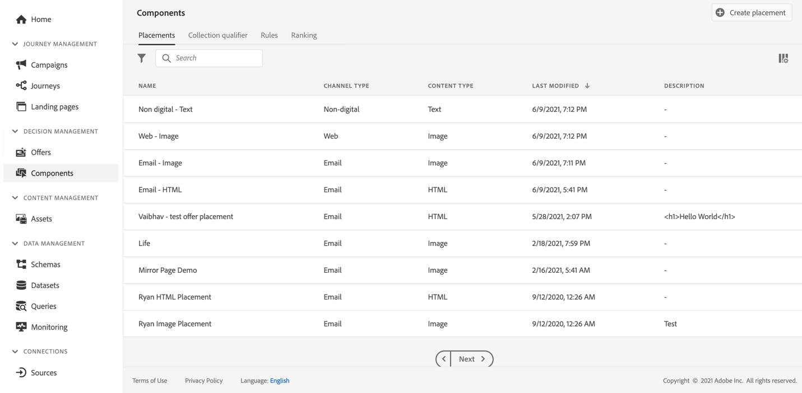

# Erbjud användargränssnitt för bibliotek {#user-interface}

Avsnittet **[!UICONTROL Decision management]** i den vänstra listen innehåller två menyer som ger dig tillgång till funktioner för beslutshantering:

Använd menyn **[!UICONTROL Offers]** för att hantera och leverera dina erbjudanden:

* **[!UICONTROL Overview]**: Ny i [!DNL decision management]? Följ stegen på skärmen för att komma igång med att konfigurera ersättningar, erbjudanden och samlingar. När du redan är bekant med [!DNL decision management] kan du få en översikt över dina senaste erbjudanden, samlingar och beslut. [Läs mer](#overview)
* **[!UICONTROL Offers]**: Skapa och få tillgång till dina personliga erbjudanden och reserverbjudanden. Lär dig hur du skapar [erbjudanden](../offer-library/creating-personalized-offers.md) och [reserverbjudanden](../offer-library/creating-fallback-offers.md)
* **[!UICONTROL Collections]**: Ordna dina erbjudanden i statiska och dynamiska samlingar. [Läs mer](../offer-library/creating-collections.md)
* **[!UICONTROL Decisions]**: Skapa och hantera beslut för att leverera dina erbjudanden. [Läs mer](../offer-activities/create-offer-activities.md)
* **[!UICONTROL Batch decisioning]**: Leverera offertbeslut till alla profiler för en viss Adobe Experience Platform-publik. [Läs mer](../batch-delivery.md)
* **[!UICONTROL Simulation]**: Verifiera din beslutslogik genom att simulera vilka erbjudanden som ska levereras till en testprofil för en viss placering. [Läs mer](../offer-activities/simulation.md)

Använd menyn **[!UICONTROL Components]** för att skapa och hantera komponenter som krävs för att skapa erbjudanden och beslut:

* **[!UICONTROL Placements]**: Skapa och hantera placeringar där dina erbjudanden visas. [Läs mer](../offer-library/creating-placements.md)
* **[!UICONTROL Collection qualifiers]**: Skapa och hantera samlingskvalificerare (kallas tidigare taggar) för att ordna och filtrera dina erbjudanden. [Läs mer](../offer-library/creating-tags.md)
* **[!UICONTROL Rules]**: Hantera villkoren som dina erbjudanden presenteras under. [Läs mer](../offer-library/creating-decision-rules.md)
* **[!UICONTROL Ranking]**: Skapa och hantera rankningsformler för att avgöra vilket erbjudande som ska presenteras först för en viss placering. [Läs mer](../ranking/create-ranking-formulas.md)

>[!NOTE]
>
>Om du har problem med att komma åt beslutshanteringen eller vissa funktioner i den, bör du höra med en Admin-användare att du har fått de behörigheter som krävs. Se [Bevilja åtkomst till beslutshantering](starting-offer-decisioning.md#granting-acess-to-decision-management).

## Översikt {#overview}

När du inte har använt [!DNL decision management] tidigare hjälper fliken **[!UICONTROL Overview]** dig genom de huvudsteg som behövs för att börja skapa ditt första erbjudandebeslut. Följ stegen på skärmen för att börja skapa praktik, erbjudanden och samlingar. När du är klar med de här första stegen uppmanas du att skapa offertbeslut.

>[!NOTE]
>
>De viktigaste stegen för att skapa erbjudanden och använda dem i ett beslut beskrivs i [det här avsnittet](../offer-library/key-steps.md).

När du är mer bekant med [!DNL decision management] och redan har skapat minst ett erbjudandebeslut visas dina senaste erbjudanden, samlingar och beslut på fliken **[!UICONTROL Overview]**.

Klicka på ett erbjudande eller på ett beslut om du vill få direkt tillgång till den valda artikelns information.

Klicka på knappen **[!UICONTROL View all]** för att komma åt erbjudandet, samlingen eller beslutslistorna.

## Söka efter och filtrera information {#search-and-filter-information}

Använd **sökfältet** för att hitta ett specifikt objekt.

**Du kan också komma åt filter** genom att klicka på filterikonen högst upp till vänster i listan. De gör att du kan filtrera de visade elementen enligt olika villkor. Du kan till exempel filtrera de placeringar som har skapats för e-postkommunikationskanalen och bildtypsinnehållet.

## Anpassa visad information {#customize-displayed-information}

Listor från beslutshanteringsmenyer kan anpassas med hjälp av konfigurationsknappen högst upp till höger i listorna.

På så sätt kan du välja vilken information som ska visas efter dina behov.

Observera att kolumnanpassning sparas för varje användare.

## Informationsrutan {#information-pane}

I de olika listorna väljer du ett element för att visa en informationsruta där du kan hämta information och utföra grundläggande åtgärder för elementet.

I erbjudandelistorna och beslutslistorna kan du även utföra massåtgärder för flera element. Välj önskade erbjudanden eller beslut och välj sedan den åtgärd som du vill utföra i informationsrutan.

Observera att du även kan duplicera ett befintligt erbjudande eller befintliga beslut för att skapa en kopia med statusen **[!UICONTROL Draft]**. Detta kan utföras antingen från informationsrutan eller från ett erbjudande eller ett besluts detaljerade vy.

## Ändringsloggar för erbjudanden och beslut {#changes-logs}

Med [!DNL Journey Optimizer] kan du visualisera alla ändringar som har gjorts i ett erbjudande eller ett beslut. Det gör du genom att gå till menyn **[!UICONTROL Audits]** från den vänstra menyn. [Lär dig hur du granskar åtgärder för resurser](../../privacy/audit-logs.md)
