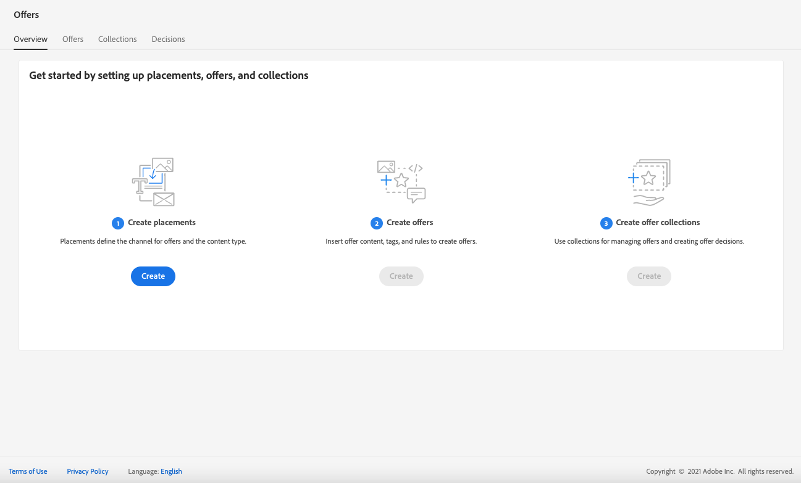
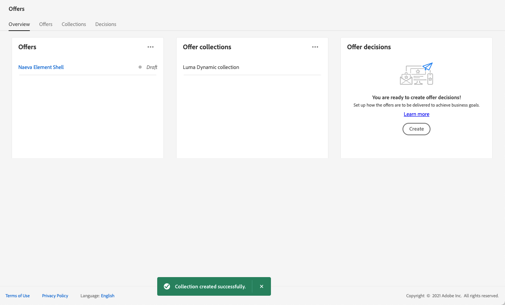
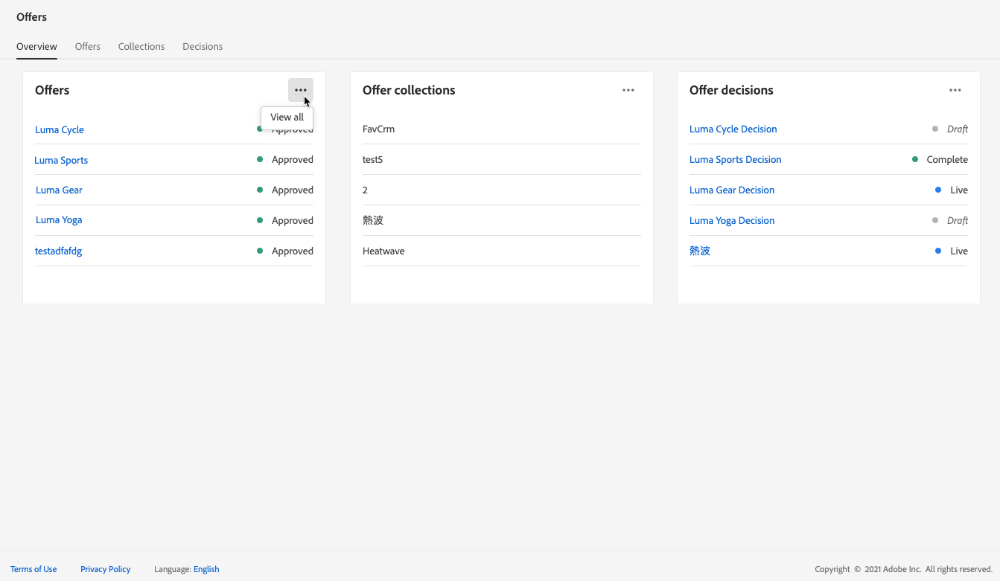
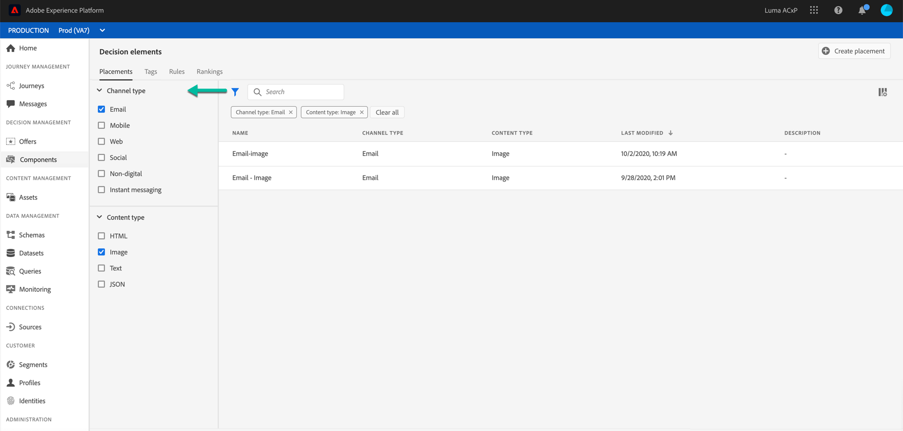

# Användargränssnitt {#user-interface}

Med Erbjudandebiblioteket kan du skapa och hantera dina praktik och erbjudanden på ett och samma ställe, samt få tillgång till alla beslut som skapats (tidigare kallade erbjudandeaktiviteter).

>[!NOTE]
>
>Om du har problem med att få tillgång till erbjudandebiblioteket eller några av dess funktioner, bör du kontrollera med en administratör att du har fått de behörigheter som krävs. Se [Bevilja åtkomst till Beslutshantering](starting-offer-decisioning.md#granting-acess-to-decision-management).

Använd menyn **[!UICONTROL Offers]** för att hantera personaliserade erbjudanden och reserverbjudanden, ordna dem i samlingar och leverera dem genom att fatta beslut:

* **[!UICONTROL Overview]**: Är du nybörjare  [!DNL Offer Decisioning]? Följ stegen på skärmen för att komma igång med att konfigurera ersättningar, erbjudanden och samlingar. När du redan är bekant med [!DNL Offer Decisioning] får du en översikt över dina senaste erbjudanden, samlingar och beslut. Se [Översikt](#overview).

* **[!UICONTROL Offers]**: Få tillgång till dina personliga erbjudanden och reserverbjudanden eller skapa nya. Se [Skapa ett erbjudande](../offer-library/creating-personalized-offers.md) och [Skapa ett reserverbjudande](../offer-library/creating-fallback-offers.md).

* **[!UICONTROL Collections]**: Skapa och hantera statiska och dynamiska erbjudandesamlingar. Se [Om erbjudandesamlingar](../offer-library/creating-collections.md).

* **[!UICONTROL Decisions]**: Skapa och hantera beslut för att leverera era erbjudanden. Se [Skapa beslut](../offer-activities/create-offer-activities.md).

Använd menyn **[!UICONTROL Components]** för att hantera de komponenter som krävs för att skapa erbjudanden:

* **[!UICONTROL Placements]**: Skapa och hantera praktik där era erbjudanden visas. Se [Skapa placeringar](../offer-library/creating-placements.md).

* **[!UICONTROL Tags]**: Skapa och hantera taggar för att ordna och filtrera erbjudandena. Se [Skapa taggar](../offer-library/creating-tags.md).

* **[!UICONTROL Rules]**: Hantera villkoren för hur era erbjudanden presenteras. Se [Skapa en beslutsregel](../offer-library/creating-decision-rules.md).

* **[!UICONTROL Rankings]**: Skapa och hantera rankningsformler för att avgöra vilket erbjudande som ska presenteras först för en viss placering. Se [Skapa rankningsformler](../offer-library/create-ranking-formulas.md).

## Översikt {#overview}

När du inte har använt [!DNL Offer Decisioning] tidigare vägleder fliken **[!UICONTROL Overview]** dig genom de huvudsteg som behövs för att börja bygga ditt första erbjudandebeslut.

Följ stegen på skärmen för att börja skapa praktik, erbjudanden och samlingar.

När du är klar med dessa första steg uppmanas du att skapa erbjudandebeslut (som tidigare kallades erbjudandeaktiviteter).

>[!NOTE]
>
>De viktigaste stegen för att skapa erbjudanden och använda dem i ett beslut finns i [det här avsnittet](../offer-library/key-steps.md).

När du är mer bekant med [!DNL Offer Decisioning] och redan har skapat minst ett erbjudande visar fliken **[!UICONTROL Overview]** dina senaste erbjudanden, samlingar och beslut.

Klicka på ett erbjudande eller på ett beslut om du vill få direkt tillgång till den valda artikelns information.

Klicka på knappen **[!UICONTROL View all]** för att komma åt erbjudandet, samlingen eller beslutslistorna.

## Söka efter och filtrera information

Använd **sökfältet** för att hitta ett specifikt objekt.

**Du kommer även åt** filterskanningen genom att klicka på filterikonen högst upp till vänster i listan. De gör att du kan filtrera de visade elementen enligt olika villkor. Du kan till exempel filtrera de placeringar som har skapats för e-postkommunikationskanalen och bildtypsinnehållet.

## Anpassa visad information

Listor från beslutshanteringsmenyer kan anpassas med konfigurationsknappen högst upp till höger i listorna.

På så sätt kan du välja vilken information som ska visas efter dina behov.

Observera att kolumnanpassning sparas för varje användare.

## Informationsrutan

I de olika listorna väljer du ett element för att visa en informationsruta där du kan hämta information och utföra grundläggande åtgärder för elementet.

I erbjudandelistorna och beslutslistorna kan du även utföra massåtgärder för flera element. Välj önskade erbjudanden eller beslut och välj sedan den åtgärd som du vill utföra i informationsrutan.

Observera att du även kan duplicera ett befintligt erbjudande eller beslut för att skapa en kopia med **[!UICONTROL Draft]**-status. Detta kan utföras antingen från informationsrutan eller från ett erbjudande eller ett besluts detaljerade vy.

## Ändringsloggar för erbjudanden och beslut {#changes-logs}

Med Erbjudandebiblioteket kan du visualisera alla ändringar som har gjorts i ett erbjudande eller ett beslut. Det gör du genom att öppna erbjudandet eller beslutet genom att klicka på dess namn i listan och sedan välja fliken **[!UICONTROL Change log]**.

Alla ändringar som har gjorts visas på den här skärmen, liksom namnet på användaren som utförde ändringarna.

