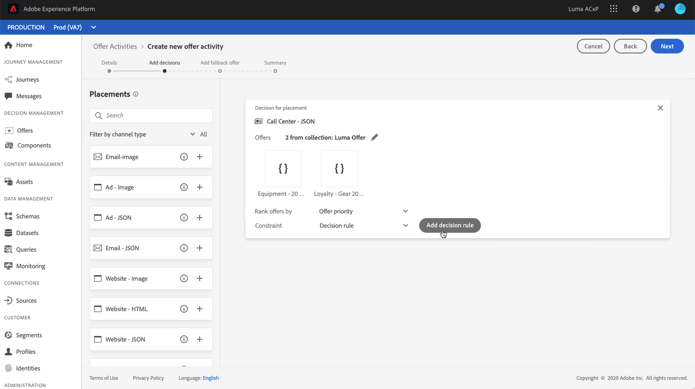
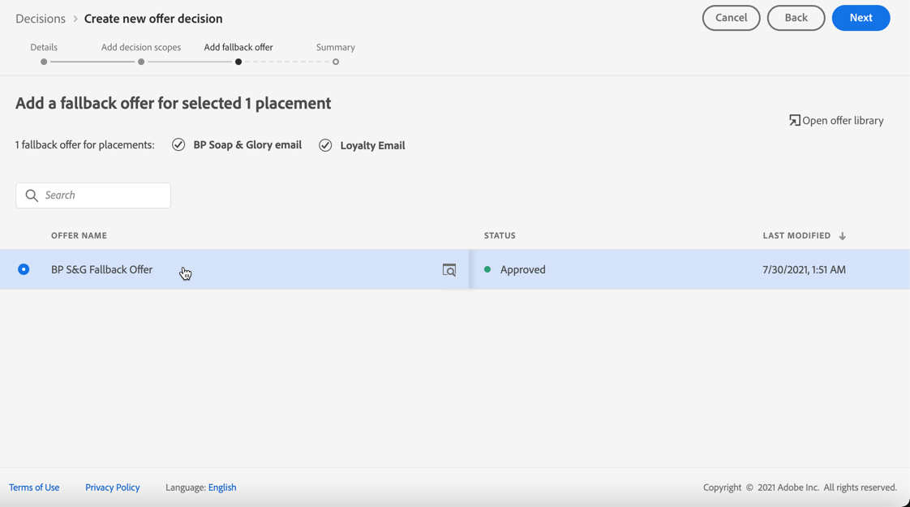

# Skapa beslut {#create-offer-activities}

Besluten (tidigare kallade erbjudandeaktiviteter) är behållare för dina erbjudanden som utnyttjar beslutsmotorn för erbjudanden för att välja det bästa erbjudandet som ska levereras, beroende på leveransmålet.

 [Upptäck den här funktionen i en video](#video)

Listan med beslut finns på fliken **[!UICONTROL Offers]** / **[!UICONTROL Decisions]**. Det finns filter som hjälper dig att hämta beslut utifrån status eller start- och slutdatum.

Innan du bestämmer dig måste du kontrollera att komponenterna nedan har skapats i Erbjudandebiblioteket:

* [Placeringar](../offer-library/creating-placements.md)
* [Samlingar](../offer-library/creating-collections.md)
* [Personaliserade erbjudanden](../offer-library/creating-personalized-offers.md)
* [Reserverbjudanden](../offer-library/creating-fallback-offers.md)

## Skapa beslutet {#create-activity}

1. Gå till beslutslistan och klicka sedan på **[!UICONTROL Create activity]**.

1. Ange beslutets namn samt start- och slutdatum och sluttid och klicka sedan på **[!UICONTROL Next]**.

   

## Lägg till erbjudanden {#add-offers}

1. Dra och släpp en placering från listan för att lägga till den i beslutet och klicka sedan på **[!UICONTROL Add collection]**.

   

1. Välj den samling som innehåller de erbjudanden som ska övervägas och klicka sedan på **[!UICONTROL Add]**.

   

1. De valda erbjudandena läggs till på placeringen. I det här exemplet valde vi två erbjudanden som ska visas i en JSON-typplacering i syfte att presentera erbjudanden i en call center-lösning.

   

1. Om flera erbjudanden kan komma i fråga för den här placeringen kommer erbjudandena med högst prioritet att levereras till kunden.

   Om du vill använda en viss formel för att välja vilket erbjudande som ska levereras väljer du en rankningsformel i listrutan **[!UICONTROL Rank offers by]**. Mer information om detta finns i [det här avsnittet](../offer-activities/configure-offer-selection.md).

1. Fältet **[!UICONTROL Constraint]** begränsar valet av erbjudanden för den här placeringen. Den här begränsningen kan tillämpas med en beslutsregel eller ett eller flera Adobe Experience Platform-segment.

   Om du vill begränsa urvalet av erbjudanden till medlemmarna i ett Adobe Experience Platform-segment väljer du **[!UICONTROL Segments]** och klickar sedan på **[!UICONTROL Add segments]**.

   

   Lägg till ett eller flera segment från den vänstra rutan, kombinera dem med de logiska operatorerna **[!UICONTROL And]** / **[!UICONTROL Or]** och klicka sedan på **[!UICONTROL Select]** för att bekräfta.

   Mer information om hur du arbetar med segment finns i [dokumentationen för segmenteringstjänsten](https://experienceleague.adobe.com/docs/experience-platform/segmentation/home.html).

   

   Om du vill lägga till en markeringsbegränsning för den här placeringen med en beslutsregel, markerar du alternativet **[!UICONTROL Decision rule]** och drar sedan den önskade regeln från den vänstra rutan till **[!UICONTROL Decision rule]**-området. Mer information om hur du skapar en beslutsregel finns i [det här avsnittet](../offer-library/creating-decision-rules.md).

   

## Lägg till ett reserverbjudande {#add-fallback}

Välj det reserverbjudande som ska presenteras som en sista utväg till kunder som inte matchar reglerna och begränsningarna för erbjudanden och klicka sedan på **[!UICONTROL Next]**.

## Granska och spara beslutet {#review}

Om allt är korrekt konfigurerat och ditt beslut är klart att användas för att presentera erbjudanden för kunderna klickar du på **[!UICONTROL Finish]** och väljer sedan **[!UICONTROL Save and activate]**.

Du kan också spara beslutet som utkast för att redigera det och aktivera det senare.

Beslutet visas i listan med statusen **[!UICONTROL Live]** eller **[!UICONTROL Draft]**, beroende på om du aktiverade det eller inte i det föregående steget.

Den är nu klar att användas för att leverera erbjudanden till kunder. Du kan markera den för att visa dess egenskaper och redigera eller inaktivera den.

Mer information om erbjudanden finns i följande avsnitt:

* [Lägg till personaliserade erbjudanden i meddelanden](../../deliver-personalized-offers.md)
* [Leverera erbjudanden med API:er](../api-reference/decisions-api/deliver-offers.md)

>[!NOTE]
>
>När ett beslut har skapats kan du klicka på dess namn i listan för att få tillgång till detaljerad information och visa alla ändringar som har gjorts i den på fliken **[!UICONTROL Change log]** (se [Ändringslogg för erbjudanden och beslut](../get-started/user-interface.md#changes-log)).

## Videokurs {#video}

>[!NOTE]
>
>Den här videon gäller för Offera decisioningens programtjänst som är byggd på Adobe Experience Platform. Det ger dock allmän vägledning om hur man använder Erbjudandet inom ramen för Journey Optimizer.

>[!VIDEO](https://video.tv.adobe.com/v/329606?quality=12)
