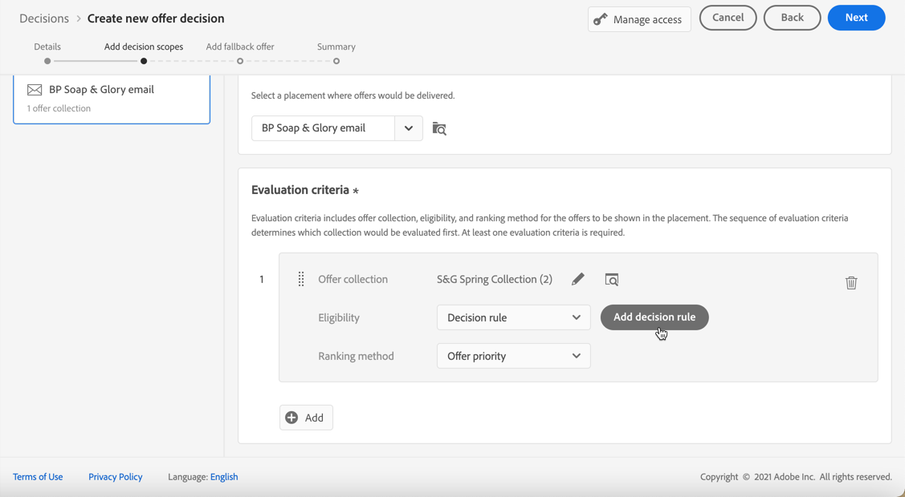
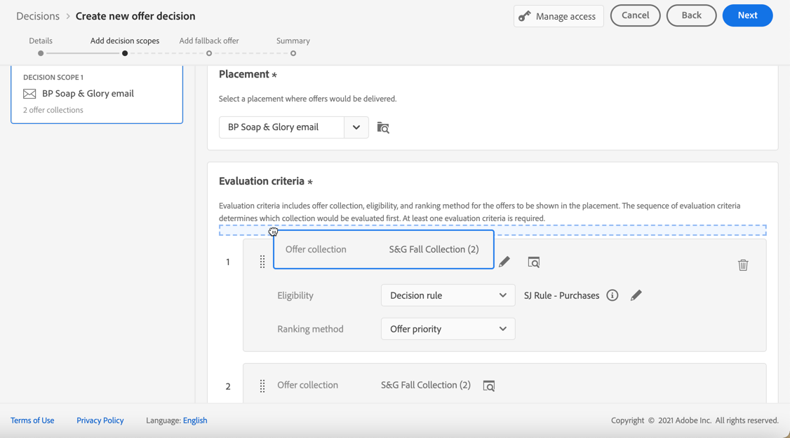
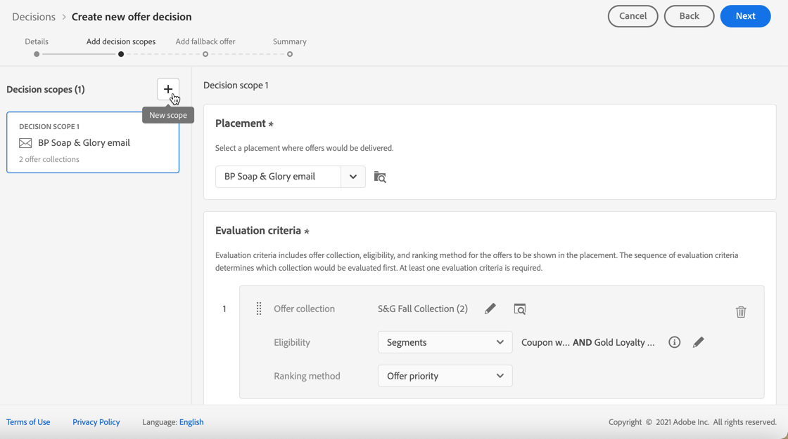

# Skapa beslut {#create-offer-activities}

Besluten är behållare för dina erbjudanden som utnyttjar beslutsmotorn för erbjudanden för att välja det bästa erbjudandet som ska levereras, beroende på leveransmålet.

➡️ [Lär dig skapa erbjudandeaktiviteter i den här videon](#video)

Listan med beslut finns på **[!UICONTROL Offers]**-menyn > fliken **[!UICONTROL Decisions]**. Det finns filter som hjälper dig att hämta beslut utifrån status eller start- och slutdatum.

Innan du bestämmer dig måste du kontrollera att komponenterna nedan har skapats i Erbjudandebiblioteket:

* [Placeringar](../offer-library/creating-placements.md)
* [Samlingar](../offer-library/creating-collections.md)
* [Personaliserade erbjudanden](../offer-library/creating-personalized-offers.md)
* [Reserverbjudanden](../offer-library/creating-fallback-offers.md)

## Skapa beslutet {#create-activity}

>[!CONTEXTUALHELP]
>id="ajo_decisioning_decision_details"
>title="Information om beslut om erbjudande"
>abstract="Ange beslutets namn och definiera ett start- och slutdatum och en sluttid om det behövs. Välj **[!UICONTROL Manage access]** om du vill tilldela etiketter för anpassad eller viktig dataanvändning till beslutet."

1. Gå till beslutslistan och klicka sedan på **[!UICONTROL Create decision]**.

1. Ange beslutets namn.

1. Definiera start- och slutdatum och sluttid om det behövs och klicka sedan på **[!UICONTROL Next]**.

   

1. Välj **[!UICONTROL Manage access]** om du vill tilldela etiketter för anpassad eller viktig dataanvändning till beslutet. [Läs mer om OLAC (Object Level Access Control)](../../administration/object-based-access.md)

## Definiera beslutsomfattningar {#add-decision-scopes}

>[!CONTEXTUALHELP]
>id="ajo_decisioning_decision_scopes"
>title="Beslutsomfattningar"
>abstract="Konfigurera ett eller flera scope för erbjudandebeslutet för att avgöra vilka erbjudanden som ska visas. Detta gör du genom att välja en placering och ett tillhörande utvärderingskriterier för den här placeringen."

>[!CONTEXTUALHELP]
>id="ajo_decisioning_decision_placement"
>title="Placement"
>abstract="Välj en plats där erbjudanden ska levereras."

>[!CONTEXTUALHELP]
>id="ajo_decisioning_decision_evaluation"
>title="Utvärderingskriterier"
>abstract="Utvärderingskriterierna består av en erbjudandesamling som är kopplad till en kvalificeringsbegränsning och en rangordningsmetod för att avgöra vilka erbjudanden som ska visas i placeringen. Sekvensen med utvärderingskriterier avgör vilken samling som ska utvärderas först. Minst ett utvärderingskriterium krävs."

1. Välj en placering i listrutan. Den kommer att läggas till i det första beslutsomfånget i ditt beslut.

   

1. Klicka på **[!UICONTROL Add]** om du vill välja utvärderingskriterier för den här placeringen.

   

   Varje villkor består av en erbjudandesamling som är kopplad till en begränsning för behörighet och en rangordningsmetod för att fastställa vilka erbjudanden som ska visas i placeringen.

   >[!NOTE]
   >
   >Minst ett utvärderingskriterier krävs.

1. Välj den erbjudandesamling som innehåller de erbjudanden som ska övervägas och klicka sedan på **[!UICONTROL Add]**.

   

   >[!NOTE]
   >
   >Du kan klicka på länken **[!UICONTROL Open offer collections]** om du vill visa listan över samlingar på en ny flik, som gör att du kan bläddra bland samlingarna och erbjudandena som de innehåller.

   Den valda samlingen läggs till i villkoren.

   

1. Använd fältet **[!UICONTROL Eligibility]** för att begränsa urvalet av erbjudanden för den här placeringen.

   Den här begränsningen kan tillämpas med en **beslutsregel** eller en eller flera **Adobe Experience Platform-målgrupper**. Båda beskrivs i [det här avsnittet](../offer-library/add-constraints.md#segments-vs-decision-rules).

   * Om du vill begränsa urvalet av erbjudanden till medlemmar i en Experience Platform-publik väljer du **[!UICONTROL Audiences]** och klickar sedan på **[!UICONTROL Add audiences]**.

     

     Lägg till en eller flera målgrupper från den vänstra rutan och kombinera dem med de logiska operatorerna **[!UICONTROL And]** / **[!UICONTROL Or]** .

     

     Lär dig hur du arbetar med målgrupper i [det här avsnittet](../../audience/about-audiences.md).

   * Om du vill lägga till en markeringsbegränsning med en beslutsregel använder du alternativet **[!UICONTROL Decision rule]** och väljer önskad regel.

     

     Lär dig hur du skapar en beslutsregel i [det här avsnittet](../offer-library/creating-decision-rules.md).

1. När du väljer målgrupper eller beslutsregler kan du se information om de uppskattade kvalificerade profilerna. Klicka på **[!UICONTROL Refresh]** för att uppdatera data.

   >[!NOTE]
   >
   >Profiluppskattningar är inte tillgängliga när regelparametrar innehåller data som inte finns i profilen, till exempel kontextdata. Exempel: en regel som kräver att det aktuella vädret är ≥80 grader.

   

1. Definiera den rangordningsmetod som du vill använda för att välja det bästa erbjudandet för varje profil. [Läs mer](../offer-activities/configure-offer-selection.md).

   

   * Om flera erbjudanden är berättigade för den här placeringen använder metoden **[!UICONTROL Offer priority]** det värde som definieras i erbjudandena: erbjudandet med högsta prioritet levereras till användaren.

   * Om du vill använda en viss beräknad poäng för att välja vilket erbjudande som ska levereras väljer du **[!UICONTROL Formula]** eller **[!UICONTROL AI model]**. [Läs mer](../offer-activities/configure-offer-selection.md).

1. Klicka på **[!UICONTROL Add]** om du vill definiera fler villkor för samma placering.

   

1. När du lägger till flera villkor utvärderas de i en viss ordning. Den första samlingen som lades till i sekvensen utvärderas först och så vidare. [Läs mer](#evaluation-criteria-order)

   Om du vill ändra standardsekvensen kan du dra och släppa samlingarna för att ordna om dem som du vill.

   

1. Du kan också utvärdera flera villkor samtidigt. Det gör du genom att dra och släppa samlingen ovanpå en annan.

   

   De har nu samma rankning och kommer därför att utvärderas samtidigt. [Läs mer](#evaluation-criteria-order)

   

   >[!CAUTION]
   >
   >* Om [AI-modellen](../ranking/ai-models.md) används i en utvärderingskriteriegrupp måste alla utvärderingskriterier i den gruppen använda AI-rangordningsmetoden och de måste använda samma specifika AI-modell.
   >
   >* Endast en kriteriegrupp för utvärdering kan använda AI-modellen. Andra grupper inom ett beslutsområde måste använda andra rangordningsmetoder (prioritet eller formel). [Läs mer om rangordningsmetoder](../offer-activities/configure-offer-selection.md)

1. Använd knappen **[!UICONTROL New scope]** om du vill lägga till en ny placering för dina erbjudanden som en del av det här beslutet. Upprepa stegen ovan för varje beslutsomfattning.

   

   >[!NOTE]
   >
   >När flera beslutsomfattningar läggs till påverkas ordningen för utvärderingskriterier. [Läs mer](#multiple-scopes)

### Ordning för utvärderingskriterier {#evaluation-criteria-order}

Som beskrivs ovan består utvärderingskriterierna av en samling, behörighetskrav och en rangordningsmetod. Du kan ange den ordningsföljd i vilken du vill att utvärderingskriterierna ska utvärderas, men du kan också kombinera flera utvärderingskriterier så att de utvärderas tillsammans och inte separat.

#### Med ett omfång {#one-scope}

I ett och samma beslutsomfång avgör flera kriterier och gruppering av dem prioriteringen av kriterierna och rangordningen av godtagbara erbjudanden. De första kriterierna har den högsta prioriteten och de kriterier som kombineras inom samma&quot;grupp&quot; har samma prioritet.

Du har till exempel två samlingar, en i utvärderingskriterier A och en i utvärderingskriterier B. Begäran är att två erbjudanden ska skickas tillbaka. Låt oss säga att det finns två godtagbara erbjudanden från utvärderingskriterier A och tre giltiga erbjudanden från utvärderingskriterier B.

* Om de två utvärderingskriterierna **inte kombineras** och/eller i sekventiell ordning (1 och 2), returneras de två främsta godtagbara erbjudandena från utvärderingskriterierna på första raden. Om det inte finns två godtagbara erbjudanden för de första utvärderingskriterierna kommer beslutsmotorn att gå vidare till nästa utvärderingskriterier i följd för att hitta så många erbjudanden som fortfarande behövs, och kommer vid behov att returnera en reservlösning.

  

* Om de två samlingarna **utvärderas samtidigt**, eftersom det finns två giltiga erbjudanden från utvärderingskriterierna A och tre giltiga erbjudanden från utvärderingskriterier B, kommer alla fem erbjudanden att rangordnas tillsammans baserat på det värde som fastställs av respektive rangordningsmetod. Två erbjudanden begärs, och därför returneras de två främsta erbjudandena från dessa fem.

  

+++ **Exempel med flera villkor**

Låt oss nu titta på ett exempel där du har flera kriterier för ett enskilt omfång indelade i olika grupper.

Du definierade tre kriterier. Kriterierna 1 och 2 sammanslås i grupp 1 och Kriterierna 3 är oberoende (grupp 2).

De berättigade anbuden för varje kriterium och deras prioritet (används vid rankningsfunktionens utvärdering) är följande:

* Grupp 1:
   * Kriterium 1 - (erbjudande 1, erbjudande 2, erbjudande 3) - prioritet 1
   * Kriterium 2 - (erbjudande 3, erbjudande 4, erbjudande 5) - prioritet 1

* Grupp 2:
   * Kriterium 3 - (erbjudande 5, erbjudande 6) - Prioritet 0

De högst prioriterade erbjudandena utvärderas först och läggs till i listan med rankade erbjudanden.

**Iteration 1:**

Kriterium 1 och Villkor 2 utvärderas tillsammans (erbjudande 1, erbjudande 2, erbjudande 3, erbjudande 4, erbjudande 5). Låt oss säga att resultatet är:

Erbjudande 1-10
Erbjudande 2-20
Erbjudande 3-30 från kriterium 1, 45 från kriterium 2. Det högsta av båda kommer att övervägas, så 45 kommer att beaktas.
Erbjudande 4-40
Erbjudande 5-50

Rankat erbjudande: Erbjudande 5, Erbjudande 3, Erbjudande 4, Erbjudande 2, Erbjudande 1.

**Iteration 2:**

Villkor 3 utvärderas (erbjudande 5, erbjudande 6). Låt oss säga att resultatet är:

* Erbjudande 5 - Kommer inte att utvärderas eftersom det redan finns i resultatet ovan.
* Erbjudande 6-60

Rankade erbjudanden: Erbjudande 5, Erbjudande 3, Erbjudande 4, Erbjudande 2, Erbjudande 1, Erbjudande 6.

+++

#### Med flera omfång {#multiple-scopes}

**Om duplicering är inaktiverat**

När du lägger till flera beslutsomfattningar i ett beslut, och om duplicering inte tillåts på flera praktik, väljs de giltiga erbjudandena sekventiellt i den ordning som beslutsomfattningarna i begäran gäller.

>[!NOTE]
>
>Parametern **[!UICONTROL Allow Duplicates across placements]** är inställd på placeringsnivån. Om duplicering är inställt på false för en placering i en beslutsbegäran, ärver alla placeringar i begäran inställningen false. [Läs mer om dupliceringsparametern](../offer-library/creating-placements.md)

Låt oss ta ett exempel där du har lagt till två beslutsomfattningar som:

* Scope 1: Det finns fyra giltiga erbjudanden (Offer 1, Offer 2, Offer 3, Offer 4) och begäran avser två erbjudanden som ska skickas tillbaka.
* Räckvidd 2: Det finns fyra giltiga erbjudanden (erbjudande 1, erbjudande 2, erbjudande 3, erbjudande 4) och begäran avser två erbjudanden som ska skickas tillbaka.

+++ **Exempel 1**

Markeringen ser ut så här:

1. De två bästa erbjudandena från Scope 1 returneras (Erbjudande 1, Erbjudande 2).
1. De två återstående giltiga erbjudandena från Scope 2 returneras (Erbjudande 3, Erbjudande 4).

+++

+++ **Exempel 2**

I det här exemplet har erbjudandet 1 nått sin frekvensgräns. [Läs mer om frekvensbegränsning](../offer-library/add-constraints.md#capping)

Markeringen ser ut så här:

1. De två återstående giltiga erbjudandena från Scope 1 returneras (Erbjudande 2, Erbjudande 3).
1. Det återstående berättigade erbjudandet från Scope 2 kommer att returneras (erbjudande 4).

+++

+++ **Exempel 3**

I det här exemplet nådde Erbjudande 1 och Erbjudande 3 sin frekvensgräns. [Läs mer om frekvensbegränsning](../offer-library/add-constraints.md#capping)

Markeringen ser ut så här:

1. De två återstående giltiga erbjudandena från Scope 1 returneras (Erbjudande 2, Erbjudande 4).
1. Det finns inga andra berättigade erbjudanden för Scope 2, så [reserverbjudandet](#add-fallback) returneras.

+++

**Om duplicering är på**

När duplicering tillåts på alla ersättningar kan samma erbjudande föreslås flera gånger på olika platser. Om det är aktiverat kommer systemet att överväga samma erbjudande för flera praktik. [Läs mer om dupliceringsparametern](../offer-library/creating-placements.md)

Låt oss ta samma exempel som ovan där du lade till två beslutsomfattningar som:

* Scope 1: Det finns fyra giltiga erbjudanden (Offer 1, Offer 2, Offer 3, Offer 4) och begäran avser två erbjudanden som ska skickas tillbaka.
* Räckvidd 2: Det finns fyra giltiga erbjudanden (erbjudande 1, erbjudande 2, erbjudande 3, erbjudande 4) och begäran avser två erbjudanden som ska skickas tillbaka.

+++ **Exempel 1**

Markeringen ser ut så här:

1. De två bästa erbjudandena från Scope 1 returneras (Erbjudande 1, Erbjudande 2).
1. Samma två bästa erbjudanden från Scope 2 returneras (erbjudande 1, erbjudande 2).

+++

+++ **Exempel 2**

I det här exemplet har erbjudandet 1 nått sin frekvensgräns. [Läs mer om frekvensbegränsning](../offer-library/add-constraints.md#capping)

Markeringen ser ut så här:

1. De två återstående giltiga erbjudandena från Scope 1 returneras (Erbjudande 2, Erbjudande 3).

1. Samma återstående två giltiga erbjudanden från Scope 2 returneras (Erbjudande 2, Erbjudande 3).

+++

+++ **Exempel 3**

I det här exemplet nådde Erbjudande 1 och Erbjudande 3 sin frekvensgräns. [Läs mer om frekvensbegränsning](../offer-library/add-constraints.md#capping)

Markeringen ser ut så här:

1. De två återstående giltiga erbjudandena från Scope 1 returneras (Erbjudande 2, Erbjudande 4).

1. Samma återstående två giltiga erbjudanden från Scope 2 returneras (Erbjudande 2, Erbjudande 4).

+++

## Lägg till ett reserverbjudande {#add-fallback}

>[!CONTEXTUALHELP]
>id="ajo_decisioning_decision_fallback"
>title="Lägg till ett reserverbjudande"
>abstract="När du har definierat beslutsomfattningarna definierar du det reserverbjudande som presenteras som en sista utväg till de kunder som inte matchar reglerna och begränsningarna för erbjudanden."

När du har definierat beslutsomfattningarna definierar du det [reserverbjudande](../offer-library/creating-fallback-offers.md) som presenteras som en sista utväg till kunder som inte matchar reglerna och begränsningarna för erbjudanden.

Det gör du genom att välja det i listan över tillgängliga reserverbjudanden för de ersättningar som definierats i beslutet.

>[!NOTE]
>
>Reserverbjudanden ska innehålla alla representationer som används i ett beslut. Om du t.ex. har 5 erbjudanden i ett beslut och var och en av dem har olika representationer, bör 5 representationer ingå i reserverbjudandet.

Klicka på **[!UICONTROL Next]** när du har markerat.

Du kan klicka på länken **[!UICONTROL Open offer library]** för att visa listan med erbjudanden på en ny flik.

## Granska och spara beslutet {#review}

Om allt är korrekt konfigurerat visas en sammanfattning av beslutsegenskaperna.

1. Se till att beslutet är klart att användas för att presentera erbjudanden för kunderna. Alla beslutsomfattningar och det reserverbjudande som det innehåller visas.

   

1. Du kan expandera eller komprimera varje placering. Du kan förhandsgranska tillgängliga erbjudanden, berättigandeinformation och rankningsinformation för varje placering. Du kan även visa information om de uppskattade kvalificerade profilerna. Klicka på **[!UICONTROL Refresh]** för att uppdatera data.

   

1. Klicka på **[!UICONTROL Finish]**.
1. Välj **[!UICONTROL Save and activate]**.

   

   Du kan också spara beslutet som utkast för att redigera det och aktivera det senare.

Beslutet visas i listan med statusen **[!UICONTROL Live]** eller **[!UICONTROL Draft]**, beroende på om du aktiverade det eller inte i det föregående steget.

Den är nu klar att användas för att leverera erbjudanden till kunder.

## Beslutslista {#decision-list}

I beslutslistan kan du välja vilket beslut som ska visas. Därifrån kan du även redigera den, ändra dess status (**Utkast**, **Live**, **Fullständigt**, **Arkiverat**), duplicera beslutet eller ta bort det.

Klicka på knappen **[!UICONTROL Edit]** om du vill gå tillbaka till beslutsversionsläget, där du kan ändra beslutets [information](#create-activity), [beslutsomfattningar](#add-decision-scopes) och [reserverbjudande](#add-fallback).

>[!IMPORTANT]
>
>Om ett beslut om erbjudande som används i ett kundmeddelande ändras måste du avpublicera resan och publicera den på nytt.  På så sätt säkerställs att ändringarna införlivas i kundens budskap och att meddelandet överensstämmer med de senaste uppdateringarna.

Välj ett live-beslut och klicka på **[!UICONTROL Deactivate]** för att återställa beslutsstatusen till **[!UICONTROL Draft]**.

Om du vill ange status till **[!UICONTROL Live]** igen väljer du knappen **[!UICONTROL Activate]** som nu visas.

Knappen **[!UICONTROL More actions]** aktiverar de åtgärder som beskrivs nedan.

* **[!UICONTROL Complete]**: anger beslutets status till **[!UICONTROL Complete]**, vilket innebär att det inte går att anropa beslutet längre. Den här åtgärden är bara tillgänglig för aktiverade beslut. Beslutet är fortfarande tillgängligt från listan, men du kan inte återställa dess status till **[!UICONTROL Draft]** eller **[!UICONTROL Approved]**. Du kan bara duplicera, ta bort eller arkivera den.

* **[!UICONTROL Duplicate]**: skapar ett beslut med samma egenskaper, beslutsomfattningar och reserverbjudande. Som standard har det nya beslutet statusen **[!UICONTROL Draft]**.

* **[!UICONTROL Delete]**: tar bort beslutet från listan.

  >[!CAUTION]
  >
  >Beslutet och dess innehåll kommer inte längre att vara tillgängliga. Det går inte att ångra den här åtgärden.
  >
  >Om beslutet används i ett annat objekt kan det inte tas bort.

* **[!UICONTROL Archive]**: anger beslutsstatus till **[!UICONTROL Archived]**. Beslutet är fortfarande tillgängligt från listan, men du kan inte återställa dess status till **[!UICONTROL Draft]** eller **[!UICONTROL Approved]**. Du kan bara duplicera eller ta bort den.

Du kan också ta bort eller ändra status för flera beslut samtidigt genom att markera motsvarande kryssrutor.

Om du vill ändra status för flera beslut med olika statusvärden, ändras bara statusvärdena.

När ett beslut har skapats kan du klicka på dess namn i listan.

På så sätt kan du få tillgång till detaljerad information för det beslutet. Välj fliken **[!UICONTROL Change log]** om du vill [övervaka alla ändringar &#x200B;](../get-started/user-interface.md#changes-logs) som har gjorts i beslutet.

## Instruktionsvideo{#video}

Lär dig hur du skapar erbjudandeaktiviteter i beslutsprocessen.

>[!VIDEO](https://video.tv.adobe.com/v/329606?quality=12)

