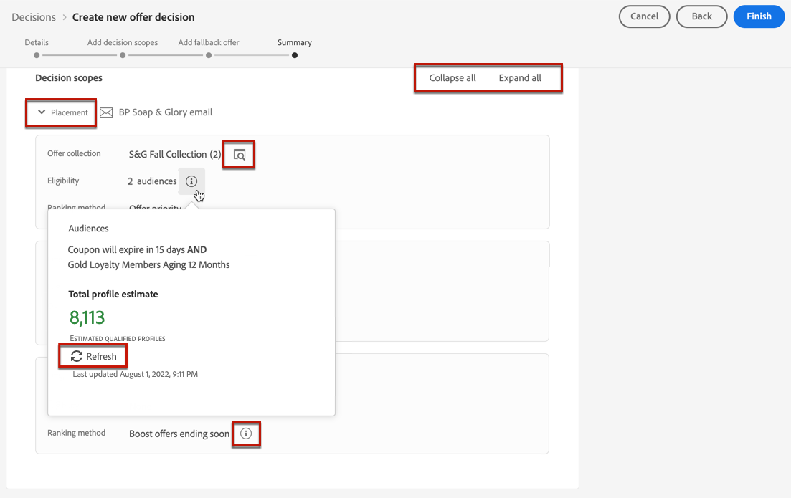

# Skapa beslut {#create-offer-activities}

Besluten är behållare för dina erbjudanden som utnyttjar beslutsmotorn för erbjudanden för att välja det bästa erbjudandet som ska levereras, beroende på leveransmålet.

➡️ [Lär dig hur du skapar erbjudandeaktiviteter i den här videon](#video)

Listan över beslut finns i **[!UICONTROL Offers]** meny > **[!UICONTROL Decisions]** -fliken. Det finns filter som hjälper dig att hämta beslut utifrån status eller start- och slutdatum.

Innan du bestämmer dig måste du kontrollera att komponenterna nedan har skapats i Erbjudandebiblioteket:

* [Placeringar](../offer-library/creating-placements.md)
* [Samlingar](../offer-library/creating-collections.md)
* [Personaliserade erbjudanden](../offer-library/creating-personalized-offers.md)
* [Reserverbjudanden](../offer-library/creating-fallback-offers.md)

## Skapa beslutet {#create-activity}

1. Gå till beslutslistan och klicka sedan på **[!UICONTROL Create decision]**.

1. Ange beslutets namn.

1. Definiera start- och slutdatum och sluttid om det behövs, och klicka sedan på **[!UICONTROL Next]**.

   

1. Om du vill tilldela egna eller centrala dataanvändningsetiketter till ett beslut väljer du **[!UICONTROL Manage access]**. [Läs mer om OLAC (Object Level Access Control)](../../administration/object-based-access.md)

## Definiera beslutsomfattningar {#add-decision-scopes}

1. Välj en placering i listrutan. Den kommer att läggas till i det första beslutsomfånget i ditt beslut.

   

1. Klicka **[!UICONTROL Add]** för att välja utvärderingskriterier för den här placeringen.

   

   Varje villkor består av en erbjudandesamling som är kopplad till en begränsning för behörighet och en rangordningsmetod för att fastställa vilka erbjudanden som ska visas i placeringen.

   >[!NOTE]
   >
   >Minst ett utvärderingskriterier krävs.

1. Välj den erbjudandesamling som innehåller de erbjudanden som ska övervägas och klicka sedan på **[!UICONTROL Add]**.

   

   >[!NOTE]
   >
   >Du kan klicka på **[!UICONTROL Open offer collections]** om du vill visa en lista med samlingar på en ny flik, som gör att du kan bläddra bland samlingarna och erbjudandena som de innehåller.

   Den valda samlingen läggs till i villkoren.

   

1. Använd **[!UICONTROL Eligibility]** om du vill begränsa urvalet av erbjudanden för den här placeringen.

   Den här begränsningen kan tillämpas med en **beslutsregel** eller en eller flera **Adobe Experience Platform segment**. Båda beskrivs i [det här avsnittet](../offer-library/add-constraints.md#segments-vs-decision-rules).

   * Om du vill begränsa urvalet av erbjudanden till medlemmarna i ett Experience Platform-segment väljer du **[!UICONTROL Segments]** och sedan klicka **[!UICONTROL Add segments]**.

      

      Lägg till ett eller flera segment från den vänstra rutan och kombinera dem med **[!UICONTROL And]** / **[!UICONTROL Or]** logiska operatorer.

      

      Lär dig hur du arbetar med segment i [det här avsnittet](../../segment/about-segments.md).

   * Om du vill lägga till en markeringsbegränsning med en beslutsregel använder du kommandot **[!UICONTROL Decision rule]** och välj önskad regel.

      

      Lär dig hur du skapar en beslutsregel i [det här avsnittet](../offer-library/creating-decision-rules.md).

1. När du väljer segment eller beslutsregler kan du se information om de uppskattade kvalificerade profilerna. Klicka **[!UICONTROL Refresh]** för att uppdatera data.

   >[!NOTE]
   >
   >Profiluppskattningar är inte tillgängliga när regelparametrar innehåller data som inte finns i profilen, till exempel kontextdata. Exempel: en regel som kräver att det aktuella vädret är ≥80 grader.

   

1. Definiera den rangordningsmetod som du vill använda för att välja det bästa erbjudandet för varje profil.

   

   * Om flera erbjudanden kan komma i fråga för den här placeringen kommer erbjudandet med högsta prioritet att levereras till kunden som standard.

   * Om du vill använda en viss formel för att välja vilket erbjudande som ska levereras väljer du **[!UICONTROL Ranking formula]**. Lär dig rangordna erbjudanden i [det här avsnittet](../offer-activities/configure-offer-selection.md).

1. Klicka **[!UICONTROL Add]** för att definiera fler villkor för samma placering.

   

1. När du lägger till flera villkor utvärderas de i en viss ordning. Den första samlingen som lades till i sekvensen utvärderas först och så vidare.

   Om du vill ändra standardsekvensen kan du dra och släppa samlingarna för att ordna om dem som du vill.

   

1. Du kan också utvärdera flera villkor samtidigt. Det gör du genom att dra och släppa samlingen ovanpå en annan.

   

   De har nu samma rankning och kommer därför att utvärderas samtidigt.

   

1. Använd **[!UICONTROL New scope]** -knappen. Upprepa stegen ovan för varje beslutsomfattning.

   

## Lägg till ett reserverbjudande {#add-fallback}

När du har definierat beslutsomfattningarna definierar du det reserverbjudande som presenteras som en sista utväg till de kunder som inte matchar reglerna och begränsningarna för erbjudanden.

Det gör du genom att välja det i listan över tillgängliga reserverbjudanden för de ersättningar som definierats i beslutet och sedan klicka på **[!UICONTROL Next]**.

>[!NOTE]
>
>Du kan klicka på **[!UICONTROL Open offer library]** länk för att visa listan med erbjudanden på en ny flik.

## Granska och spara beslutet {#review}

Om allt är korrekt konfigurerat visas en sammanfattning av beslutsegenskaperna.

1. Se till att beslutet är klart att användas för att presentera erbjudanden för kunderna. Alla beslutsomfattningar och det reserverbjudande som det innehåller visas.

   

1. Du kan expandera eller komprimera varje placering. Du kan förhandsgranska tillgängliga erbjudanden, berättigandeinformation och rankningsinformation för varje placering. Du kan även visa information om de uppskattade kvalificerade profilerna. Klicka **[!UICONTROL Refresh]** för att uppdatera data.

   

1. Klicka på **[!UICONTROL Finish]**.
1. Välj **[!UICONTROL Save and activate]**.

   

   Du kan också spara beslutet som utkast för att redigera det och aktivera det senare.

Beslutet visas i listan med **[!UICONTROL Live]** eller **[!UICONTROL Draft]** status, beroende på om du har aktiverat den eller inte i föregående steg.

Den är nu klar att användas för att leverera erbjudanden till kunder.

## Beslutslista {#decision-list}

I beslutslistan kan du välja vilket beslut som ska visas. Därifrån kan du också redigera den och ändra dess status (**Utkast**, **Live**, **Slutförd**, **Arkiverad**), duplicera beslutet eller ta bort det.

Välj **[!UICONTROL Edit]** knapp för att gå tillbaka till beslutsversionsläget, där du kan ändra beslutets [information](#create-activity), [beslutsomfattningar](#add-decision-scopes) och [grunderbjudande](#add-fallback).

Välj ett live-beslut och klicka **[!UICONTROL Deactivate]** för att återställa beslutsstatus till **[!UICONTROL Draft]**.

Om du vill ange status igen till **[!UICONTROL Live]** väljer du **[!UICONTROL Activate]** som nu visas.

The **[!UICONTROL More actions]** aktiverar de åtgärder som beskrivs nedan.

* **[!UICONTROL Complete]**: anger beslutets status till **[!UICONTROL Complete]**, vilket innebär att beslutet inte kan anropas längre. Den här åtgärden är bara tillgänglig för aktiverade beslut. Beslutet är fortfarande tillgängligt i listan, men du kan inte återställa dess status till **[!UICONTROL Draft]** eller **[!UICONTROL Approved]**. Du kan bara duplicera, ta bort eller arkivera den.

* **[!UICONTROL Duplicate]**: skapar ett beslut med samma egenskaper, beslutsomfattningar och reserverbjudande. Som standard har det nya beslutet **[!UICONTROL Draft]** status.

* **[!UICONTROL Delete]**: tar bort beslutet från listan.

   >[!CAUTION]
   >
   >Beslutet och dess innehåll kommer inte längre att vara tillgängliga. Det går inte att ångra den här åtgärden.
   >
   >Om beslutet används i ett annat objekt kan det inte tas bort.

* **[!UICONTROL Archive]**: anger beslutsstatus till **[!UICONTROL Archived]**. Beslutet är fortfarande tillgängligt i listan, men du kan inte återställa dess status till **[!UICONTROL Draft]** eller **[!UICONTROL Approved]**. Du kan bara duplicera eller ta bort den.

Du kan också ta bort eller ändra status för flera beslut samtidigt genom att markera motsvarande kryssrutor.

Om du vill ändra status för flera beslut med olika status, ändras bara statusen.

När ett beslut har skapats kan du klicka på dess namn i listan.

På så sätt kan du få tillgång till detaljerad information för det beslutet. Välj **[!UICONTROL Change log]** tabba till [övervaka alla ändringar](../get-started/user-interface.md#changes-log) som har tagits till beslutet.

## Instruktionsvideo{#video}

Lär dig hur du skapar erbjudandeaktiviteter i beslutsprocessen.

>[!VIDEO](https://video.tv.adobe.com/v/329606?quality=12)

