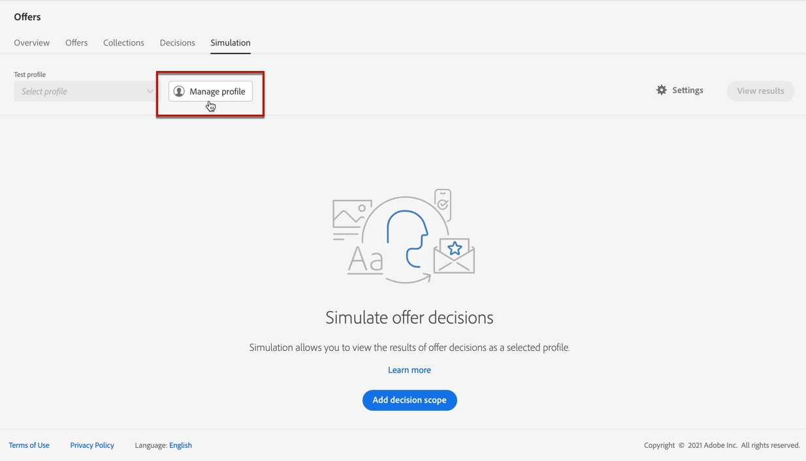
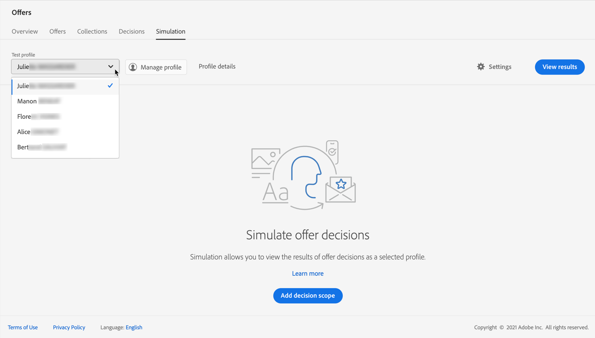

# Skapa simuleringar {#create-simulations}

>[!CONTEXTUALHELP]
>id="ajo_decisioning_simulation"
>title="Simulera beslut om erbjudanden"
>abstract="Simulering gör att du kan simulera vilka erbjudanden som ska levereras till en testprofil för en viss placering. På så sätt kan ni testa och förfina olika versioner av era erbjudanden utan att det påverkar målmottagarna."

## Om simulering {#about-simulation}

Om du vill validera din beslutslogik kan du simulera vilka erbjudanden som ska levereras till en testprofil för en viss placering.

<!--Simulation allows you to view the results of offer decisions as a selected profile.-->

På så sätt kan ni testa och förfina olika versioner av era erbjudanden utan att det påverkar målmottagarna.

>[!NOTE]
>
>Den här funktionen simulerar en enda begäran till [!DNL Decisioning] API. Läs mer på [Leverera erbjudanden med hjälp av besluts-API](../api-reference/offer-delivery-api/decisioning-api.md).

Om du vill komma åt den här funktionen väljer du **[!UICONTROL Simulation]** -fliken från **[!UICONTROL Decision management]** > **[!UICONTROL Offers]** -menyn.

>[!NOTE]
>
>Eftersom simuleringen inte genererar någon beslutshändelse kan [capping](../offer-library/creating-personalized-offers.md#capping) antalet påverkas inte.

<!--
➡️ [Discover this feature in video](#video)
-->

## Välj testprofiler {#select-test-profiles}

>[!CONTEXTUALHELP]
>id="ajo_decisioning_simulation_test_profile"
>title="Lägga till testprofiler"
>abstract="Du kan lägga till en testprofil genom att välja ett identitetsnamnutrymme och ett motsvarande identitetsvärde. Du måste ha testprofiler tillgängliga för att kunna använda dem för simulering."
>additional-url="https://experienceleague.adobe.com/docs/journey-optimizer/using/audiences-profiles-identities/profiles/creating-test-profiles.html" text="Skapa testprofiler"

Först måste du välja de testprofiler som du ska använda för simulering.

>[!CAUTION]
>
>Du måste ha testprofiler tillgängliga för att simulera vilka erbjudanden som ska levereras till dem. Lär dig hur [skapa testprofiler](../../audience/creating-test-profiles.md).

1. Klicka på **[!UICONTROL Manage profile]**.

   

1. Markera det identitetsnamnutrymme som du vill använda för att identifiera testprofiler. I det här exemplet använder vi **E-post** namnutrymme.

   >[!NOTE]
   >
   >Ett identitetsnamnutrymme definierar kontexten för en identifierare, till exempel en e-postadress eller ett CRM-ID. Läs mer om Adobe Experience Platform identitetsnamnutrymmen [i det här avsnittet](../../audience/get-started-identity.md){target="_blank"}.

1. Ange identitetsvärdet och klicka på **[!UICONTROL View]** för att lista tillgängliga profiler.

   

1. Lägg till andra profiler om du vill testa olika profildata och spara urvalet.

   

1. När du har lagt till visas alla profiler i listrutan under **[!UICONTROL Test profile]**. Du kan växla mellan de sparade testprofilerna för att visa resultatet för varje vald profil.

   

   >[!NOTE]
   >
   >De valda profilerna visas som testprofiler i **[!UICONTROL Simulation]** tabba från session till session tills de tas bort med **[!UICONTROL Manage profile]**.

1. Du kan klicka på **[!UICONTROL Profile details]** för att visa valda profildata.

<!--Learn more on [selecting test profiles](messages/preview.md#select-test-profiles)-->

## Lägg till beslutsomfattningar {#add-decision-scopes}

Välj sedan de erbjudandebeslut som du vill simulera i dina testprofiler.

1. Välj **[!UICONTROL Add decision scope]**.

   

1. Välj en placering i listan.

   

1. De tillgängliga besluten visas.

   * Du kan använda sökfältet för att förfina markeringen.
   * Du kan klicka på **[!UICONTROL Open offer decisions]** om du vill öppna en lista med alla beslut som du har skapat. Läs mer på [beslut](create-offer-activities.md).

   Välj önskat beslut och klicka på **[!UICONTROL Add]**.

   

1. Beslutsomfånget du just definierade visas på huvudarbetsytan.

   Du kan justera antalet erbjudanden som du vill begära. Om du till exempel väljer 2 visas de två bästa erbjudandena för detta beslutsområde.

   

   >[!NOTE]
   >
   >Du kan begära upp till 30 erbjudanden.

1. Upprepa stegen ovan om du vill lägga till så många beslut du behöver.

   

   >[!NOTE]
   >
   >Även om du definierar flera beslutsomfattningar simuleras bara en API-begäran.

## Definiera simuleringsinställningar {#define-simulation-settings}

Om du vill redigera standardinställningarna för dina simuleringar följer du stegen nedan.

1. Klicka på **[!UICONTROL Settings]**.

   

1. I **[!UICONTROL Deduplication]** kan du välja att tillåta dubbletter av erbjudanden mellan beslut och/eller placeringar. Det innebär att flera beslut/ersättningar kan tilldelas samma erbjudande.

   

   >[!NOTE]
   >
   >Som standard är alla dedupliceringsflaggor aktiverade för simulering, vilket innebär att beslutsmotorn tillåter dubbletter och därmed kan göra samma förslag för flera beslut/placeringar. Läs mer på [!DNL Decisioning] Egenskaper för API-begäran i [det här avsnittet](../api-reference/offer-delivery-api/decisioning-api.md).

1. I **[!UICONTROL Response format]** kan du välja att ta med metadata i kodvyn. Markera motsvarande alternativ och välj de metadata du vill använda. De visas i begäran- och svarsnyttolasterna när du väljer **[!UICONTROL View code]**. Läs mer i [Visa simuleringsresultat](#simulation-results) -avsnitt.

   

   >[!NOTE]
   >
   >När du aktiverar alternativet markeras alla objekt som standard.

1. Klicka på **[!UICONTROL Save]**.

>[!NOTE]
>
>För närvarande kan du bara använda **[!UICONTROL Hub]** API.

<!--
In the **[!UICONTROL API for simulation]** section, select the API you want to use: **[!UICONTROL Hub]** or **[!UICONTROL Edge]**.
Hub and Edge are two different end points for simulation data.

In the **[!UICONTROL Context data]** section, you can add as many elements as needed.

    >[!NOTE]
    >
    >This section is hidden if you select Edge API in the section above. Hub allows the use of Context data, Edge does not.

Context data allows the user to add contextual data that could affect the simulation score.
For instance, let's say the customer has an offer for a discount on ice cream. In the rules for that offer, it can have logic that would rank it higher when the temperature is above 80 degrees. In simulation, the user could add context data: temperature=65 and that offer would rank lower, of they could add temperature=95 and that would rank higher.
-->

## Visa simuleringsresultat {#simulation-results}

När du har lagt till ett beslutsområde och valt en testprofil kan du visa resultatet.

1. Klicka på **[!UICONTROL View results]**.

   

1. De bästa erbjudandena visas enligt den valda profilen för varje beslut.

   Välj ett erbjudande om du vill visa information om det.

   

1. Klicka **[!UICONTROL View code]** för att visa nyttolasterna för begäran och svar. [Läs mer](#view-code)

1. Välj en annan profil i listan om du vill visa resultatet av erbjudandebesluten för en annan testprofil.

1. Du kan lägga till, ta bort eller uppdatera beslutsomfattningarna så många gånger som behövs.

>[!NOTE]
>
>Varje gång du ändrar profiler eller uppdaterar beslutsomfattningar måste du uppdatera resultaten med **[!UICONTROL View results]** -knappen.

## Visa kod {#view-code}

1. Använd **[!UICONTROL View code]** för att visa begäran- och svarsnyttolaster.

   

   I kodvyn visas utvecklarinformationen för den aktuella användaren. Som standard är **[!UICONTROL Response payload]** visas.

   

1. Klicka **[!UICONTROL Response payload]** eller **[!UICONTROL Request payload]** för att navigera mellan de två flikarna.

   

1. Använda nyttolasten utanför [!DNL Journey Optimizer] - t.ex. för felsökningssyfte kopiera den med **[!UICONTROL Copy to clipboard]** överst i kodvyn.

   

   <!--You cannot copy the response payload. ACTUALLY YES YOU CAN > to confirm with PM/dev? -->

   >[!NOTE]
   >
   >När du kopierar begäran- eller svarsnyttolasterna till din egen kod måste du ersätta {USER_TOKEN} och {API_KEY} med giltiga värden. Lär dig hur du hämtar dessa värden i [Adobe Experience Platform API:er](https://experienceleague.adobe.com/docs/experience-platform/landing/platform-apis/api-authentication.html){target="_blank"} dokumentation.

