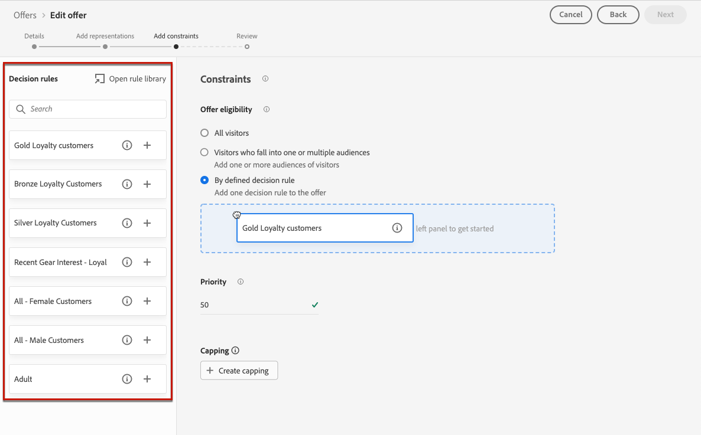
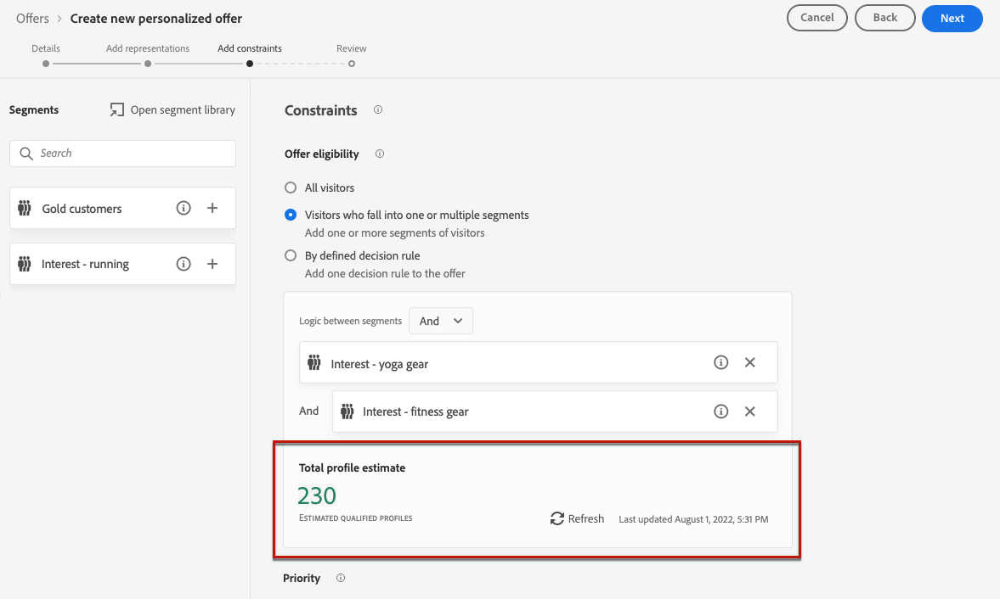

# Lägg till begränsningar i ett erbjudande {#add-constraints}

>[!TIP]
>
>Beslutsfattandet, [!DNL Adobe Journey Optimizer]s nya beslutsfunktion, är nu tillgängligt via den kodbaserade upplevelsen och e-postkanalerna! [Läs mer](../../experience-decisioning/gs-experience-decisioning.md)

>[!CONTEXTUALHELP]
>id="od_offer_constraints"
>title="Om begränsningar för erbjudanden"
>abstract="Med begränsningar kan ni ange hur erbjudandet ska prioriteras och presenteras för användaren jämfört med andra erbjudanden."

>[!CONTEXTUALHELP]
>id="ajo_decisioning_constraints"
>title="Om begränsningar för erbjudanden"
>abstract="Med begränsningar kan ni ange hur erbjudandet ska prioriteras och presenteras för användaren jämfört med andra erbjudanden."

>[!CONTEXTUALHELP]
>id="od_offer_priority"
>title="Prioritet för erbjudande"
>abstract="I det här fältet kan du ange prioritetsinställningar för erbjudandet. Prioritet är ett nummer som används för att rangordna erbjudanden som uppfyller alla krav, som berättigande, datum och appning."

>[!CONTEXTUALHELP]
>id="ajo_decisioning_priority"
>title="Ange prioritet"
>abstract="Prioriteten hjälper till att definiera prioriteten för erbjudandet jämfört med andra om användaren kvalificerar för mer än ett erbjudande. Ju högre prioritet ett erbjudande har, desto högre blir prioriteringen jämfört med andra erbjudanden."

Med begränsningar kan du definiera villkoren för hur ett erbjudande ska visas.

1. Konfigurera **[!UICONTROL Offer eligibility]**. [Läs mer](#eligibility)

   

1. Definiera **[!UICONTROL Priority]** för erbjudandet jämfört med andra om användaren kvalificerar för mer än ett erbjudande. Ju högre prioritet ett erbjudande har, desto högre blir prioriteringen jämfört med andra erbjudanden.

   

   >[!NOTE]
   >
   >Erbjudandeprioriteten måste vara ett heltalsvärde (inga decimaler).

1. Ange erbjudandets **[!UICONTROL Capping]**, vilket innebär det antal gånger som erbjudandet kommer att presenteras. [Läs mer](#capping)

   

1. Klicka på **[!UICONTROL Next]** för att bekräfta alla begränsningar som du har definierat.

Om du till exempel anger följande begränsningar:

* Erbjudandet gäller endast användare som matchar&quot;Gold Loyalty Customers&quot;-beslutsregeln.
* Prioriteten för erbjudandet är 50, vilket innebär att erbjudandet presenteras före erbjudanden med en prioritet mellan 1 och 49, och efter erbjudanden med en prioritet på minst 51.
* Erbjudandet gäller endast en gång i månaden per användare på alla ersättningar.

## Kvalificering {#eligibility}

>[!CONTEXTUALHELP]
>id="ajo_decisioning_eligibility"
>title="Definiera berättigande"
>abstract="Som standard är alla profiler berättigade att presenteras erbjudandet, men du kan använda målgrupper eller beslutsregler för att begränsa erbjudandet till specifika profiler."

>[!CONTEXTUALHELP]
>id="od_offer_eligibility"
>title="Om rätt att köpa"
>abstract="I det här avsnittet kan du använda beslutsregler för att avgöra vilka användare som är berättigade till erbjudandet."

<!--additional-url="https://video.tv.adobe.com/v/329373" text="Watch demo video"-->

>[!CONTEXTUALHELP]
>id="ajo_decisioning_total_profile_estimate"
>title="Total profiluppskattning"
>abstract="När du väljer målgrupper eller beslutsregler kan du se information om de uppskattade kvalificerade profilerna."

I avsnittet **[!UICONTROL Offer eligibility]** kan du begränsa erbjudandet till specifika profiler som du definierar med hjälp av målgrupper eller beslutsregler.

>[!NOTE]
>
>Läs mer om hur du använder **målgrupper** jämfört med **beslutsregler** i [det här avsnittet](#segments-vs-decision-rules).

* Som standard är alternativet **[!UICONTROL All visitors]** valt, vilket innebär att alla profiler är berättigade att presenteras erbjudandet.

  

* Du kan också begränsa hur erbjudandet visas för medlemmar i en eller flera [Adobe Experience Platform-målgrupper](../../audience/about-audiences.md).

  Aktivera alternativet **[!UICONTROL Visitors who fall into one or multiple audiences]** och lägg sedan till en eller flera målgrupper från den vänstra rutan och kombinera dem med de logiska operatorerna **[!UICONTROL And]** / **[!UICONTROL Or]**.

  

* Om du vill koppla en specifik [beslutsregel](../offer-library/creating-decision-rules.md) till erbjudandet väljer du **[!UICONTROL By defined decision rule]** och drar sedan önskad regel från den vänstra rutan till **[!UICONTROL Decision rule]**-området.

  

  >[!CAUTION]
  >
  >Händelsebaserade erbjudanden stöds för närvarande inte i [!DNL Journey Optimizer]. Om du skapar en beslutsregel baserad på en [händelse](https://experienceleague.adobe.com/docs/experience-platform/segmentation/ui/segment-builder.html#events){target="_blank"} kan du inte utnyttja den i ett erbjudande.

När du väljer målgrupper eller beslutsregler kan du se information om de uppskattade kvalificerade profilerna. Klicka på **[!UICONTROL Refresh]** för att uppdatera data.

>[!NOTE]
>
>Profiluppskattningar är inte tillgängliga när regelparametrar innehåller data som inte finns i profilen, till exempel kontextdata. Exempel: en regel som kräver att det aktuella vädret är ≥80 grader.

### Använda målgrupper och beslutsregler {#segments-vs-decision-rules}

Om du vill tillämpa en begränsning kan du begränsa urvalet av erbjudanden till medlemmarna i en eller flera **Adobe Experience Platform-målgrupper**, eller så kan du använda en **beslutsregel** som båda lösningarna motsvarar olika användningar.

En målgrupps utdata är i princip en lista med profiler, medan en beslutsregel är en funktion som körs på begäran mot en enskild profil under beslutsprocessen. Skillnaden mellan dessa två användningar beskrivs nedan.

* **Publiker**

  Å ena sidan är målgrupperna en grupp Adobe Experience Platform-profiler som matchar en viss logik baserat på profilattribut och upplevelsehändelser. Erbjudandehanteringen innebär dock inte att publiken beräknas om, vilket kanske inte är aktuellt när erbjudandet presenteras.

  Läs mer om målgrupper i [det här avsnittet](../../audience/about-audiences.md).

* **Beslutsregler**

  Å andra sidan baseras en beslutsregel på data som är tillgängliga i Adobe Experience Platform och avgör till vem ett erbjudande kan visas. När regeln har valts i ett erbjudande eller i ett beslut för en viss placering verkställs den varje gång ett beslut fattas, vilket säkerställer att varje profil får det senaste och bästa erbjudandet.

  Läs mer om beslutsregler i [det här avsnittet](creating-decision-rules.md).

## Takning {#capping}

>[!CONTEXTUALHELP]
>id="od_offer_globalcap"
>title="Om begränsning av erbjudanden"
>abstract="I det här fältet kan du ange hur många gånger erbjudandet kan presenteras."

>[!CONTEXTUALHELP]
>id="ajo_decisioning_capping"
>title="Använd begränsning"
>abstract="För att undvika att kunderna överbelastas bör du definiera hur många gånger ett erbjudande får presenteras genom att använda capping. Du kan skapa upp till 10 regler för ett visst erbjudande."
>additional-url="https://experienceleague.adobe.com/en/docs/journey-optimizer/using/decisioning/offer-decisioning/managing-offers-in-the-offer-library/configure-offers/add-constraints#capping" text="Ändrade datum kan påverka capping"

Begränsning används som en begränsning för att definiera det maximala antal gånger ett erbjudande kan presenteras. Genom att begränsa antalet gånger som användarna får specifika erbjudanden kan ni undvika att överdriva era kunder och därmed optimera varje kontaktyta med det bästa erbjudandet.

Du kan lägga till upp till 10 regler för ett visst erbjudande. Klicka på knappen **[!UICONTROL Create capping]** och följ sedan stegen nedan för att ange en fästregel.

1. Ange vilken **[!UICONTROL Capping event]** som ska beaktas för att öka räknaren. [Läs mer](#capping-event)

1. Välj om du vill att appningen ska användas för alla användare eller bara för en profil. [Läs mer](#capping-type)

1. Ange hur många gånger erbjudandet kan presenteras. [Läs mer](#capping-count)

1. Ange **[!UICONTROL Frequency]** för att definiera hur ofta antalet fästingar återställs. [Läs mer](#frequency-capping)

1. Om du har definierat flera [representationer](add-representations.md) för ditt erbjudande anger du om du vill tillämpa begränsning **för alla placeringar** eller **för varje placering**. [Läs mer](#placements)

1. När erbjudandet har sparats och godkänts, och om det har angetts det antal gånger som du har angett i det här fältet enligt villkoren och tidsramen som du definierade, upphör leveransen.

Det antal gånger ett erbjudande föreslås beräknas vid e-postförberedelsen. Om du t.ex. förbereder ett e-postmeddelande med ett antal erbjudanden räknas dessa siffror mot det högsta antalet oavsett om e-postmeddelandet skickas eller inte.

<!--If an email delivery is deleted or if the preparation is done again before being sent, the capping value for the offer is automatically updated.-->

>[!NOTE]
>
>Räknarna återställs när erbjudandet upphör eller två år efter startdatumet för erbjudandet, beroende på vilket som inträffar först. Lär dig hur du definierar ett erbjudandes datum i [det här avsnittet](creating-personalized-offers.md#create-offer).

### Takningshändelse {#capping-event}

>[!CONTEXTUALHELP]
>id="ajo_decisioning_frequency_capping_impression"
>title="Impression"
>abstract="Användningen av visningar som capping-händelser är endast tillgänglig för inkommande kanaler."

I fältet **[!UICONTROL Choose capping event]** kan du definiera vilken händelse som ska beaktas för att öka räknaren:

* **[!UICONTROL Decision event]** (standardvärde): Maximalt antal gånger ett erbjudande kan presenteras.
* **[!UICONTROL Clicks]**: Maximalt antal gånger som en användare kan klicka på erbjudandet.
* **[!UICONTROL Impression]**: Maximalt antal gånger som erbjudandet kan visas för en användare.

  >[!NOTE]
  >
  >Användningen av visningar som capping-händelser är endast tillgänglig för **inkommande kanaler**.

* **[!UICONTROL Custom event]**: Du kan definiera en anpassad händelse som ska användas för att begränsa antalet erbjudanden som skickas. Du kan t.ex. sätta ett tak för antalet inlösen tills de blir 10 000 eller tills en viss profil har lösts in 1 gång. Använd [Adobe Experience Platform XDM](https://experienceleague.adobe.com/docs/experience-platform/xdm/home.html?lang=sv){target="_blank"}-scheman för att skapa en anpassad händelseregel.

  <!--For example, you can cap on the number of redemptions so that the offer can be shown until redemptions equal 10,000. You can only select XDM ExperienceEvents. -->

  I exemplet nedan vill du ha en övre gräns för antalet utcheckningar.

   1. Välj **[!UICONTROL Custom event]** i listan och använd knappen **[!UICONTROL Add custom event]**.

   1. Använd **[!UICONTROL Create custom event rules]**-verktyget för att välja den relevanta händelsen. Du kan välja vilken användaråtgärd som helst som du vill sätta på erbjudandet.

      Välj **[!UICONTROL Commerce]** > **[!UICONTROL Checkouts]** > **[!UICONTROL Value]** och välj **[!UICONTROL exists]** i listrutan.

      

   1. När regeln har skapats visas den i fältet **[!UICONTROL Custom event query]**.

      

>[!CAUTION]
>
>För alla takthändelser utom beslutshändelser kanske feedback för beslutshanteringen inte samlas in automatiskt, vilket kan leda till att appningsräknaren inte ökas korrekt. [Läs mer](../data-collection/data-collection.md)
>
>För att vara säker på att varje takthändelse spåras och tas med i appningsräknaren måste du se till att schemat som används för att samla in upplevelsehändelser innehåller rätt fältgrupp för den händelsen. [Läs mer](../data-collection/schema-requirement.md)

### Taktyp {#capping-type}

Du kan ange om du vill att appen ska användas för alla användare eller för en viss profil:

* Välj **[!UICONTROL In total]** om du vill definiera hur många gånger ett erbjudande kan föreslås för den kombinerade målgruppen, vilket innebär för alla användare.

  Om du till exempel är en återförsäljare av elektronikprodukter och har en &quot;TV-affär&quot; vill du att erbjudandet bara ska returneras 200 gånger för alla profiler.

* Välj **[!UICONTROL Per profile]** om du vill definiera hur många gånger ett erbjudande kan föreslås för samma användare.

  Om du till exempel är en bank med ett Platinum-kreditkortserbjudande vill du inte att erbjudandet ska visas mer än fem gånger per profil. Ni tror faktiskt att om användaren har sett erbjudandet fem gånger och inte har följt det, har de större chans att agera på nästa bästa erbjudande.

### Antal tak {#capping-count}

I fältet **[!UICONTROL Capping count limit]** kan du ange hur många gånger erbjudandet kan presenteras.

>[!NOTE]
>
>Talet måste vara ett heltal större än 0.

Du har till exempel definierat en anpassad capping-händelse som antalet utcheckningar som ska beaktas. Om du anger 10 i fältet **[!UICONTROL Capping count limit]** skickas inga fler erbjudanden efter 10 utcheckningar.

### Frekvensbegränsning {#frequency-capping}

>[!CONTEXTUALHELP]
>id="ajo_decisioning_frequency_capping"
>title="Ange takfrekvens"
>abstract="Du kan välja att återställa antalet erbjudanden per dag, vecka eller månad. Observera att när du har publicerat erbjudandet med frekvensbegränsning aktiverat kan du inte ändra den frekvens som har definierats."

I fältet **[!UICONTROL Reset capping frequency]** kan du definiera hur ofta antalet appningar återställs. Om du vill göra det anger du tidsperioden för inventeringen (varje dag, varje vecka eller varje månad) och anger hur många dagar/veckor/månader du vill ha. Om du till exempel vill att antalet capping ska återställas varannan vecka, väljer du **[!UICONTROL Weekly]** i motsvarande listruta och skriver **&#x200B;**&#x200B;i det andra fältet.

* Räknaren för frekvensbegränsning återställs kl. **12 UTC**, den dag du definierade eller den första dagen i veckan/månaden, om tillämpligt. Veckostartdagen är **Söndag**. En varaktighet som du väljer får inte vara längre än **2 år** (d.v.s. motsvarande antal månader, veckor eller dagar).

* När du har publicerat ditt erbjudande kan du inte ändra den tidsperiod (månadsvis, veckovis eller dagligen) som du har valt för frekvensen. Du kan fortfarande redigera frekvensbegränsningen om erbjudandet har statusen **[!UICONTROL Draft]** och aldrig har publicerats tidigare med frekvensbegränsning aktiverad.

* Det kan finnas en bufferttid på upp till 15 minuter innan händelser räknas mot begränsningar för frekvensbegränsning, antingen när erbjudandet godkänns eller när appningen skapas - beroende på vilket som inträffar sist.

+++ **Måste-läsas: API:er för frekvensappning och beslutshantering**

Räknaren för frekvensbegränsning uppdateras och är tillgänglig i ett beslut av typen [Edge Decisioning API](../api-reference/offer-delivery-api/start-offer-delivery-apis.md#edge) på mindre än 3 sekunder.

Varje navområde är associerat med ett eller flera kantområden. Regler för frekvensbegränsning genereras och exporteras från varje navregion till de associerade kantområdena. När ett beslut fattas med hjälp av Edge Decisioning API verkställer systemet de regler som finns i samma kantregion:

* Om det finns en matchande regel ökas profilens räknare för frekvensbegränsning.
* Annars skapas ingen räknare för profilen och regeln för frekvensbegränsning gäller inte. Profilen kommer därför även i fortsättningen att få personaliserade erbjudanden, även om tröskelvärdet överskrids.

Låt oss till exempel se din organisations navregion som *NLD2* och du skickar en beslutsbegäran från Europa (*IRL1* edge region). I det här scenariot ökar beslutsbegäran profilens räknare eftersom reglerna är tillgängliga i regionen *IRL1* (Irland). Om beslutsbegäran däremot kommer från en region som Japan (*JPN3*), som inte är ett kantområde som är knutet till (Nederländerna) *NLD2* -navet, skapas ingen räknare och reglerna för frekvensbegränsning tillämpas inte.

>[!NOTE]
>
>När räknare sprids från kant till nav eller från nav till kant kan en fördröjning på upp till 30 minuter användas.

Om du vill ha mer information om vilka nav- och kantområden som är kopplade till din organisation kontaktar du Adobe.

Med de andra API:erna uppdateras räknaren för frekvensbegränsning enligt följande:

* I ett [Decisioning API](../api-reference/offer-delivery-api/start-offer-delivery-apis.md#decisioning) -beslut kan räknaren för frekvensbegränsning uppdateras med några minuters fördröjning, beroende på trafik.

* I ett [API för gruppbeslut](../api-reference/offer-delivery-api/batch-decisioning-api.md) används ögonblicksbilder där frekvensbegränsningsräknaren förblir fast. Räknaren ändras inte så länge som samma ögonblicksbild används.

+++

### Takning och placeringar {#placements}

Om du har definierat flera [representationer](add-representations.md) för ditt erbjudande anger du om du vill tillämpa begränsning på alla placeringar eller på varje placering.

* **[!UICONTROL Apply capping across all placements]**: Antalet takappar kommer att summera alla beslut för alla placeringar som är associerade med erbjudandet.

  Om ett erbjudande t.ex. har en **e-postplacering** och en **webb**-placering och du anger en begränsning på **2 per profil för alla ersättningar**, kan varje profil få erbjudandet upp till två gånger totalt, oavsett placeringsblandning.

* **[!UICONTROL Apply capping to each placement]**: Antalet takappar avgör antalet beslut separat för varje placering.

  Om ett erbjudande till exempel har en **e-postplacering** och en **webb**-placering, och du anger en begränsning på **2 per profil för varje placering**, kan varje profil få erbjudandet upp till två gånger för e-postplaceringen och ytterligare två gånger för webblplaceringen.

### Påverkan av ändrade datum vid fästning {#capping-change-date}

>[!CONTEXTUALHELP]
>id="ajo_decisioning_offer_change_date"
>title="Ändrade datum kan påverka capping"
>abstract="Om begränsning tillämpas på erbjudandet kan det påverkas när du ändrar start- och slutdatumet."

Du måste vara försiktig när du ändrar datumet för ett erbjudande, eftersom detta kan påverka antalet capping om följande villkor uppfylls:

* Erbjudandet är [godkänt](#review).
* [Paket](#capping) har redan tillämpats på erbjudandet.
* Taket definieras per profil.

>[!NOTE]
>
>Lär dig hur du definierar ett erbjudandes datum i [det här avsnittet](creating-personalized-offers.md#create-offer).

Vid kap per profil sparas antalet på varje profil. När du ändrar start- och slutdatumet för ett godkänt erbjudande kan antalet appar för vissa profiler påverkas enligt de olika scenarier som beskrivs nedan.

Här följer möjliga scenarier när **ett startdatum för erbjudandet ändras**:

| Scenario: Om... | Vad händer: sedan... | Möjlig effekt på antalet decimaler |
|--- |--- |--- |
| ... startdatumet för erbjudandet uppdateras innan startdatumet för det ursprungliga erbjudandet har börjat, | ... antalet får börja på det nya startdatumet. | Nej |
| ... det nya startdatumet infaller före det aktuella slutdatumet, | ... takvärdet fortsätter med ett nytt startdatum och det föregående antalet appningar för varje profil fortsätter. | Nej |
| ... det nya startdatumet infaller efter det aktuella slutdatumet, | ... den aktuella begränsningen upphör att gälla och det nya antalet fästingar börjar om från 0 för alla profiler på det nya startdatumet. | Ja |

Här följer möjliga scenarier när **förlänger ett erbjudandeslutdatum**:

| Scenario: Om... | Vad händer: sedan... | Möjlig effekt på antalet decimaler |
|--- |--- |--- |
| ... en beslutsbegäran infaller före det ursprungliga erbjudandets slutdatum, | ... antalet capping uppdateras och det föregående antalet capping för varje profil fortsätter. | Nej |
| ... ingen beslutsbegäran infaller före det ursprungliga slutdatumet, | ... antalet fästingar återställs på det ursprungliga slutdatumet för varje profil. Det nya antalet capping börjar sedan igen från 0 för alla nya beslutsbegäranden som kommer att inträffa efter det ursprungliga slutdatumet. | Ja |

**Exempel**

Anta att du har ett erbjudande med ett ursprungligt startdatum som är inställt på **Januari, 1**, som upphör **Januari, 31**.

1. Profilerna X, Y och Z presenteras.
1. Den **januari, 10**, ändras erbjudandets slutdatum till **februari, 15**.
1. **Från 11 januari till 31 januari** visas endast profilen Z.

   * Eftersom en beslutsbegäran gjordes före det ursprungliga slutdatumet **för profilen Z**, kan erbjudandets slutdatum förlängas till **februari, 15**.
   * Eftersom ingen aktivitet utfördes före det ursprungliga slutdatumet för **profilerna X och Y** kommer deras räknare att förfalla och deras antal att fästas kommer att återställas till 0 **januari, 31**.

