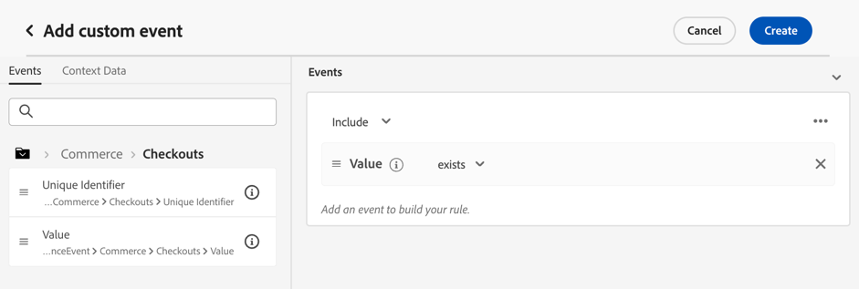

# Lägg till begränsningar i ett erbjudande {#add-constraints}

>[!CONTEXTUALHELP]
>id="od_offer_constraints"
>title="Om begränsningar för erbjudanden"
>abstract="Med begränsningar kan ni ange hur erbjudandet ska prioriteras och presenteras för användaren jämfört med andra erbjudanden."

>[!CONTEXTUALHELP]
>id="ajo_decisioning_constraints"
>title="Om begränsningar för erbjudanden"
>abstract="Med begränsningar kan ni ange hur erbjudandet ska prioriteras och presenteras för användaren jämfört med andra erbjudanden."

>[!CONTEXTUALHELP]
>id="od_offer_priority"
>title="Prioritet för erbjudande"
>abstract="I det här fältet kan du ange prioritetsinställningar för erbjudandet. Prioritet är ett nummer som används för att rangordna erbjudanden som uppfyller alla krav, som berättigande, datum och appning."

>[!CONTEXTUALHELP]
>id="ajo_decisioning_priority"
>title="Ange prioritet"
>abstract="Prioriteten hjälper till att definiera prioriteten för erbjudandet jämfört med andra om användaren kvalificerar för mer än ett erbjudande. Ju högre prioritet ett erbjudande har, desto högre blir prioriteringen jämfört med andra erbjudanden."

Med begränsningar kan du definiera villkoren för hur ett erbjudande ska visas.

1. Konfigurera **[!UICONTROL Offer eligibility]**. [Läs mer](#eligibility)

   

1. Definiera **[!UICONTROL Priority]** av erbjudandet jämfört med andra, om användaren kvalificerar sig för mer än ett erbjudande. Ju högre prioritet ett erbjudande har, desto högre blir prioriteringen jämfört med andra erbjudanden.

   

1. Ange erbjudandets **[!UICONTROL Capping]**, vilket innebär hur många gånger erbjudandet kommer att presenteras. [Läs mer](#capping)

   

1. Klicka **[!UICONTROL Next]** för att bekräfta alla begränsningar som du har definierat.

Om du till exempel anger följande begränsningar:

* Erbjudandet gäller endast användare som matchar&quot;Gold Loyalty Customers&quot;-beslutsregeln.
* Prioriteten för erbjudandet är 50, vilket innebär att erbjudandet presenteras före erbjudanden med en prioritet mellan 1 och 49, och efter erbjudanden med en prioritet på minst 51.
* Erbjudandet gäller endast en gång i månaden per användare och gäller alla ersättningar.

## Kvalificering {#eligibility}

>[!CONTEXTUALHELP]
>id="ajo_decisioning_eligibility"
>title="Definiera berättigande"
>abstract="Som standard är alla profiler berättigade att presenteras för erbjudandet, men du kan använda segment eller beslutsregler för att begränsa erbjudandet till specifika profiler."

>[!CONTEXTUALHELP]
>id="od_offer_eligibility"
>title="Om rätt att köpa"
>abstract="I det här avsnittet kan du använda beslutsregler för att avgöra vilka användare som är berättigade till erbjudandet."
>additional-url="https://video.tv.adobe.com/v/329373" text="Se demovideon"

>[!CONTEXTUALHELP]
>id="ajo_decisioning_total_profile_estimate"
>title="Total profiluppskattning"
>abstract="När du väljer segment eller beslutsregler kan du se information om de uppskattade kvalificerade profilerna."

The **[!UICONTROL Offer eligibility]** kan du begränsa erbjudandet till specifika profiler som du definierar med hjälp av segment eller beslutsregler.

>[!NOTE]
>
>Läs mer om hur du använder **segment** kontra **beslutsregler** in [det här avsnittet](#segments-vs-decision-rules).

* Som standard är **[!UICONTROL All visitors]** är valt, vilket innebär att alla profiler är berättigade att presenteras erbjudandet.

   

* Du kan även begränsa presentationen av erbjudandet till medlemmarna i en eller flera [Adobe Experience Platform segment](../../segment/about-segments.md).

   Aktivera **[!UICONTROL Visitors who fall into one or multiple segments]** lägg sedan till ett eller flera segment från den vänstra rutan och kombinera dem med **[!UICONTROL And]** / **[!UICONTROL Or]** logiska operatorer.

   

* Om du vill associera en viss [beslutsregel](../offer-library/creating-decision-rules.md) till erbjudandet väljer du **[!UICONTROL By defined decision rule]** och sedan dra den önskade regeln från den vänstra rutan till **[!UICONTROL Decision rule]** område.

   

   >[!CAUTION]
   >
   >Händelsebaserade erbjudanden stöds för närvarande inte i [!DNL Journey Optimizer]. Om du skapar en beslutsregel baserad på en [event](https://experienceleague.adobe.com/docs/experience-platform/segmentation/ui/segment-builder.html?lang=en#events){target="_blank"}, kommer du inte att kunna utnyttja erbjudandet.

När du väljer segment eller beslutsregler kan du se information om de uppskattade kvalificerade profilerna. Klicka **[!UICONTROL Refresh]** för att uppdatera data.

>[!NOTE]
>
>Profiluppskattningar är inte tillgängliga när regelparametrar innehåller data som inte finns i profilen, till exempel kontextdata. Exempel: en regel som kräver att det aktuella vädret är ≥80 grader.

### Använda segment och beslutsregler {#segments-vs-decision-rules}

Om du vill tillämpa en begränsning kan du begränsa urvalet av erbjudanden till medlemmarna i en eller flera **Adobe Experience Platform segment** eller så kan du använda en **beslutsregel**, båda lösningarna motsvarar olika användningsområden.

I princip är utdata för ett segment en lista med profiler, medan en beslutsregel är en funktion som körs på begäran mot en enskild profil under beslutsprocessen. Skillnaden mellan dessa två användningar beskrivs nedan.

* **Segment**

   Å ena sidan är segment en grupp Adobe Experience Platform-profiler som matchar en viss logik baserat på profilattribut och upplevelsehändelser. Erbjudandehanteringen beräknar dock inte om segmentet, som kanske inte är aktuellt när erbjudandet presenteras.

   Läs mer om segment i [det här avsnittet](../../segment/about-segments.md).

* **Beslutsregler**

   Å andra sidan baseras en beslutsregel på data som är tillgängliga i Adobe Experience Platform och avgör till vem ett erbjudande kan visas. När regeln har valts i ett erbjudande eller i ett beslut för en viss placering verkställs den varje gång ett beslut fattas, vilket säkerställer att varje profil får det senaste och bästa erbjudandet.

   Läs mer om beslutsregler i [det här avsnittet](creating-decision-rules.md).

## Takning {#capping}

>[!CONTEXTUALHELP]
>id="od_offer_globalcap"
>title="Om begränsning av erbjudanden"
>abstract="I det här fältet kan du ange hur många gånger erbjudandet kan presenteras."

>[!CONTEXTUALHELP]
>id="ajo_decisioning_capping"
>title="Använd begränsning"
>abstract="För att undvika att kunderna blir överdrivna bör du definiera hur många gånger ett erbjudande får presenteras med capping."
>additional-url="https://experienceleague.adobe.com/docs/journey-optimizer/using/offer-decisioning/managing-offers-in-the-offer-library/configure-offers/add-constraints.html#capping-change-date" text="Ändrade datum kan påverka capping"

>[!CONTEXTUALHELP]
>id="ajo_decisioning_frequency_capping"
>title="Ange takfrekvens"
>abstract="Du kan välja att återställa antalet erbjudanden per dag, vecka eller månad. Observera att när du har sparat ditt erbjudande kan du inte ändra den valda frekvensen."

>[!CONTEXTUALHELP]
>id="ajo_decisioning_frequency_capping_impression"
>title="Impression"
>abstract="Användningen av visningar som capping-händelser är endast tillgänglig för inkommande kanaler."

Begränsning används som en begränsning för att definiera det maximala antal gånger ett erbjudande kan presenteras.

Genom att begränsa antalet gånger användarna får specifika erbjudanden kan ni undvika att överdriva era kunder och därmed optimera varje kontaktyta med det bästa erbjudandet.

Följ huvudstegen nedan när du vill ställa in capping.

1. Se till att **[!UICONTROL Include capping]** växlingsknappen är markerad. Takning ingår som standard.

   >[!CAUTION]
   >
   >Det går inte att aktivera eller inaktivera frekvensbegränsning för tidigare skapade erbjudanden. För att göra det måste du duplicera erbjudandet eller skapa ett nytt.

1. Definiera vilken **[!UICONTROL Capping event]** beaktas för att öka räknaren. [Läs mer](#capping-event)

1. Ange hur många gånger erbjudandet kan presenteras. [Läs mer](#capping-count)

1. Välj om du vill att appningen ska användas för alla användare eller bara för en profil. [Läs mer](#capping-type)

1. Ange **[!UICONTROL Frequency]** för att definiera hur ofta antalet capping återställs. [Läs mer](#frequency-capping)

1. Om du har definierat flera [representationer](add-representations.md) för ditt erbjudande, ange om du vill tillämpa begränsning **[!UICONTROL Across all placements]** eller **[!UICONTROL For each placement]**. [Läs mer](#placements)

1. När erbjudandet har sparats och godkänts, och om det har angetts det antal gånger som du har angett i det här fältet enligt villkoren och tidsramen som du definierade, upphör leveransen.

Det antal gånger ett erbjudande föreslås beräknas vid e-postförberedelsen. Om du t.ex. förbereder ett e-postmeddelande med ett antal erbjudanden räknas dessa siffror mot det högsta antalet oavsett om e-postmeddelandet skickas eller inte.

<!--If an email delivery is deleted or if the preparation is done again before being sent, the capping value for the offer is automatically updated.-->

>[!NOTE]
>
>Räknarna återställs när erbjudandet upphör eller två år efter startdatumet för erbjudandet, beroende på vilket som inträffar först. Lär dig hur du definierar ett erbjudandes datum i [det här avsnittet](creating-personalized-offers.md#create-offer).

### Takningshändelse {#capping-event}

The **[!UICONTROL Capping event]** kan du definiera vilket **[!UICONTROL Capping event]** kommer att beaktas för att öka räknaren:

* **[!UICONTROL Decision event]** (standardvärde): Maximalt antal gånger ett erbjudande kan presenteras.
* **[!UICONTROL Impression]**: Maximalt antal gånger som erbjudandet kan visas för en användare.

   >[!NOTE]
   >
   >Användning av visningar när capping-händelser är tillgängliga för **inkommande kanaler** endast.

* **[!UICONTROL Clicks]**: Maximalt antal gånger som en användare kan klicka på erbjudandet.
* **[!UICONTROL Custom event]**: Du kan definiera en anpassad händelse som ska användas för att begränsa antalet erbjudanden som skickas. Du kan t.ex. sätta ett tak för antalet inlösen tills de är lika med 10000 eller tills en viss profil har lösts in 1 gång. Om du vill göra det använder du [Adobe Experience Platform XDM](https://experienceleague.adobe.com/docs/experience-platform/xdm/home.html?lang=sv){target="_blank"} scheman för att skapa en anpassad händelseregel.

   <!--For example, you can cap on the number of redemptions so that the offer can be shown until redemptions equal 10000. You can only select XDM ExperienceEvents. -->

   I exemplet nedan vill du ha en övre gräns för antalet utcheckningar.

   1. Välj **[!UICONTROL Custom event]** i listan och använd **[!UICONTROL Add custom event]** -knappen.

      

   1. Använd **[!UICONTROL Create custom event rules]** builder för att välja den relevanta händelsen. Du kan välja vilken användaråtgärd som helst som du vill sätta på erbjudandet.

      Här väljer du **[!UICONTROL Commerce]** > **[!UICONTROL Checkouts]** > **[!UICONTROL Value]** och markera **[!UICONTROL exists]** i listrutan.

      

   1. När regeln har skapats visas den i **[!UICONTROL Custom event query]** fält.

      
   >[!CAUTION]
   >
   >För alla klickningshändelser utom beslutshändelser kanske feedback för beslutshanteringen inte samlas in automatiskt, så se till att data kommer in. [Läs mer om datainsamling](../data-collection/data-collection.md)

### Antal tak {#capping-count}

The **[!UICONTROL Capping count]** kan du ange hur många gånger erbjudandet kan presenteras.

>[!NOTE]
>
>Talet måste vara ett heltal som är större än 0.

Du har till exempel definierat en anpassad capping-händelse som antalet utcheckningar som ska beaktas. Om du anger 10 i dialogrutan **[!UICONTROL Capping count]** inga fler erbjudanden skickas efter 10 utcheckningar.

### Taktyp {#capping-type}

Du kan också ange om du vill att appen ska användas för alla användare eller för en viss profil:

* Välj **[!UICONTROL In total]** för att definiera hur många gånger ett erbjudande kan föreslås för den kombinerade målgruppen, vilket betyder för alla användare.

   Om du till exempel är en återförsäljare av elektronikprodukter och har en &quot;TV-affär&quot; vill du att erbjudandet bara ska returneras 200 gånger för alla profiler.

* Välj **[!UICONTROL Per profile]** för att definiera hur många gånger ett erbjudande kan erbjudas en och samma användare.

   Om du till exempel är en bank med ett Platinum-kreditkortserbjudande vill du inte att det här erbjudandet ska visas mer än fem gånger per profil. Ni tror faktiskt att om användaren har sett erbjudandet fem gånger och inte har följt det, har de större chans att agera på nästa bästa erbjudande.

### Frekvensbegränsning {#frequency-capping}

The **[!UICONTROL Frequency]** kan du definiera hur ofta antalet capping återställs. Om du vill göra det anger du tidsperioden för inventeringen (varje dag, varje vecka eller varje månad) och anger hur många dagar/veckor/månader du vill ha.

>[!NOTE]
>
>Återställningen sker kl. 12.00 UTC, den dag du har definierat eller den första dagen i veckan/månaden när det är tillämpligt. Veckostartdagen är söndag. En varaktighet som du väljer får inte överstiga 2 år (dvs. motsvarande antal månader, veckor eller dagar).

Om du till exempel vill att antalet fästingar ska återställas varannan vecka väljer du **[!UICONTROL Weekly]** från **[!UICONTROL Repeat]** nedrullningsbar lista och typ **2** i det andra fältet. Återställningen sker varannan söndag kl. 12.00 UTC.

>[!CAUTION]
>
>När du har sparat ditt erbjudande kan du inte ändra den tidsperiod (månatlig, veckovis eller daglig) som du har valt för frekvensen.

### Takning och placeringar {#placements}

Om du har definierat flera [representationer](add-representations.md) för ditt erbjudande, ange om du vill tillämpa begränsning **[!UICONTROL Across all placements]** eller **[!UICONTROL For each placement]**.

* **[!UICONTROL Across all placements]**: antalet licenser kommer att summera alla beslut för alla ersättningar som är kopplade till erbjudandet.

   Om ett erbjudande till exempel har **E-post** placering och en **Webb** placeringen och du ställer in cappen på **2 per profil för alla placeringar** kan varje profil få upp till två gånger i rabatt, oberoende av placeringsmix.

* **[!UICONTROL For each placement]**: antalet licenser tillämpas separat på antalet beslut för varje placering.

   Om ett erbjudande till exempel har **E-post** placering och en **Webb** placeringen och du ställer in cappen på **2 per profil för varje placering** kan varje profil få upp till två gånger för e-postplaceringen och ytterligare två gånger för webblatsplaceringen.

### Påverkan av ändrade datum vid fästning {#capping-change-date}

>[!CONTEXTUALHELP]
>id="ajo_decisioning_offer_change_date"
>title="Ändrade datum kan påverka capping"
>abstract="Om begränsning tillämpas på erbjudandet kan det påverkas när du ändrar start- och slutdatumet."

Du måste vara försiktig när du ändrar datumet för ett erbjudande, eftersom detta kan påverka antalet capping om följande villkor uppfylls:

* Erbjudandet är [godkänd](#review).
* [Takning](#capping) används redan för erbjudandet.
* Taket definieras per profil.

>[!NOTE]
>
>Lär dig hur du definierar ett erbjudandes datum i [det här avsnittet](creating-personalized-offers.md#create-offer).

Vid kap per profil sparas antalet på varje profil. När du ändrar start- och slutdatumet för ett godkänt erbjudande kan antalet appar för vissa profiler påverkas enligt de olika scenarier som beskrivs nedan.

Här är möjliga scenarier när **ändra startdatum för erbjudande**:

| Scenario: Om.. | Vad händer: sedan... | Möjlig effekt på antalet decimaler |
|--- |--- |--- |
| ... erbjudandets startdatum uppdateras innan det ursprungliga startdatumet för erbjudandet har börjat, | ... antalet licenser börjar på det nya startdatumet. | Nej |
| ... det nya startdatumet infaller före det aktuella slutdatumet, | ... Fästningen fortsätter med ett nytt startdatum och det föregående antalet fästingar för varje profil kommer att fortsätta. | Nej |
| ... det nya startdatumet infaller efter det aktuella slutdatumet, | ... det aktuella begränsningsvärdet kommer att upphöra och det nya antalet fästingar kommer att börja om från 0 för alla profiler på det nya startdatumet. | Ja |

Här är möjliga scenarier när **förlänga erbjudandets slutdatum**:

| Scenario: Om.. | Vad händer: sedan... | Möjlig effekt på antalet decimaler |
|--- |--- |--- |
| ... en beslutsbegäran infaller före det ursprungliga erbjudandets slutdatum, | ... antalet capping uppdateras och det föregående antalet capping för varje profil fortsätter. | Nej |
| ... ingen beslutsbegäran infaller före det ursprungliga slutdatumet, | ... antalet licenser återställs på det ursprungliga slutdatumet för varje profil. Det nya antalet capping börjar sedan igen från 0 för alla nya beslutsbegäranden som kommer att inträffa efter det ursprungliga slutdatumet. | Ja |

**Exempel**

Säg att du har ett erbjudande med ett ursprungligt startdatum som är inställt på **1 januari**, förfaller den **31 januari**.

1. Profilerna X, Y och Z presenteras som erbjudandet.
1. På **Januari, 10**, erbjudandets slutdatum ändras till **15 februari**.
1. **11 januari-31 januari**, visas endast profilen Z.

   * På grund av att en beslutsbegäran inträffade före det ursprungliga slutdatumet **för profil Z** kan erbjudandets slutdatum förlängas till **15 februari**.
   * Eftersom ingen aktivitet utfördes före det ursprungliga slutdatumet för **profilerna X och Y** kommer deras räknare att förfalla och deras antal att räknas om till 0 på **31 januari**.

