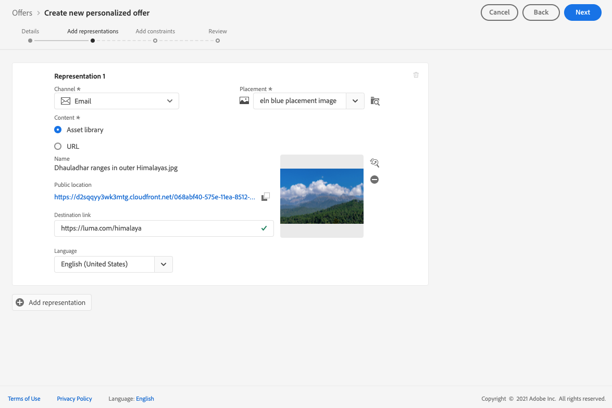
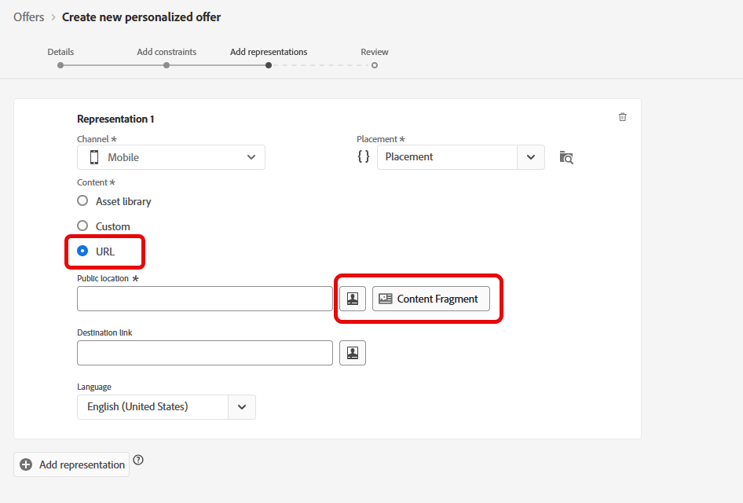

# Lägg till representationer i ett erbjudande {#add-representations}

>[!CONTEXTUALHELP]
>id="ajo_decisioning_representation"
>title="Representationer"
>abstract="Lägg till representationer för att definiera var ditt erbjudande ska visas i meddelandet. Ju fler representationer ett erbjudande har, desto fler möjligheter finns det att använda erbjudandet i olika placeringssammanhang."

Ett erbjudande kan visas på olika platser i ett meddelande: i en översta banderoll med en bild, som text i ett stycke, som ett HTML-block osv. Ju fler representationer ett erbjudande har, desto fler möjligheter finns det att använda erbjudandet i olika placeringssammanhang.

## Konfigurera offertens representationer {#representations}

Följ stegen nedan om du vill lägga till en eller flera representationer i ditt erbjudande och konfigurera dem.

1. För den första representationen börjar du med att välja **[!UICONTROL Channel]** som kommer att användas.

   

   >[!NOTE]
   >
   >Endast de tillgängliga placeringarna för den valda kanalen visas i **[!UICONTROL Placement]** listruta.

1. Välj en placering i listan.

   Du kan också använda knappen bredvid knappen **[!UICONTROL Placement]** om du vill bläddra bland alla placeringar.

   

   Där kan du fortfarande filtrera placeringarna efter kanal- och/eller innehållstyp. Välj en placering och klicka på **[!UICONTROL Select]**.

   

1. Lägg till innehåll i din representation. Läs mer i [det här avsnittet](#content).

1. När du lägger till innehåll som en bild eller URL kan du ange en **[!UICONTROL Destination link]**: de användare som klickar på erbjudandet dirigeras till motsvarande sida.

   

1. Välj slutligen det språk du vill använda för att identifiera och hantera vad som ska visas för användarna.

1. Använd knappen **[!UICONTROL Add representation]** och lägg till så många representationer som behövs.

   

1. När du har lagt till alla representationer väljer du **[!UICONTROL Next]**.

## Definiera innehåll för dina representationer {#content}

Du kan lägga till olika typer av innehåll i en representation.

>[!NOTE]
>
>Endast innehåll som motsvarar placeringens innehållstyp är tillgängligt för användning.

### Lägg till bilder {#images}

Om den valda placeringen är av bildtyp kan du lägga till innehåll från **Adobe Experience Cloud Asset** bibliotek, ett centraliserat arkiv med resurser från [!DNL Adobe Experience Manager Assets Essentials].

>[!NOTE]
>
> Arbeta med [Adobe Experience Manager Assets Essentials](https://experienceleague.adobe.com/docs/experience-manager-assets-essentials/help/introduction.html){target="_blank"}, you need to deploy [!DNL Assets Essentials] for your organization and make sure that users are a part of the **Assets Essentials Consumer Users** or/and **Assets Essentials Users** Product profiles. Learn more on [this page](https://experienceleague.adobe.com/docs/experience-manager-assets-essentials/help/get-started-admins/deploy-administer.html){target="_blank"}.

1. Välj alternativet **[!UICONTROL Asset library]**.

1. Välj **[!UICONTROL Browse]**.

   

1. Bläddra bland resurserna och välj den bild du vill använda

1. Klicka på **[!UICONTROL Select]**.

   

### Lägg till HTML eller JSON-filer {#html-json}

Om den markerade placeringen är HTML kan du även lägga till HTML eller JSON-innehåll från [Adobe Experience Cloud Asset Library](https://experienceleague.adobe.com/docs/experience-manager-assets-essentials/help/introduction.html){target="_blank"}).

Du har t.ex. skapat en e-postmall för HTML i [Adobe Experience Manager](https://experienceleague.adobe.com/docs/experience-manager.html){target="_blank"} och du vill använda den filen för ert erbjudandeinnehåll. I stället för att skapa en ny fil kan du överföra mallen till **Resursbibliotek** för att kunna återanvända det i ert erbjudande.

Om du vill återanvända innehållet i en representation bläddrar du till **Resursbibliotek** enligt beskrivning i [det här avsnittet](#images) och markera den HTML- eller JSON-fil du vill använda.

### Lägg till URL:er {#urls}

Om du vill lägga till innehåll från en extern offentlig plats väljer du **[!UICONTROL URL]** anger du sedan URL-adressen till det innehåll som ska läggas till.

Du kan anpassa URL-adresser med uttrycksredigeraren. Läs mer på [personalisering](../../personalization/personalize.md#use-expression-editor).

Du vill till exempel anpassa bilden som visas som ett erbjudande. Man vill att användare som föredrar semestrar ska se NYC-skylten och användare som föredrar strandsemestrar ska se Hawaii i i nordkusten.

Använd uttrycksredigeraren för att hämta profilattribut som lagras i Adobe Experience Platform med hjälp av fackscheman. [Läs mer](https://experienceleague.adobe.com/docs/experience-platform/profile/union-schemas/union-schemas-overview.html){target="_blank"}

Om du anger en **[!UICONTROL Destination link]** kan du också anpassa den URL som användarna som klickar på erbjudandet ska dirigeras till.

### Lägga till egen text {#custom-text}

Du kan också infoga text när du väljer en kompatibel placering.

1. Välj **[!UICONTROL Custom]** och klicka **[!UICONTROL Add content]**.

   

   >[!NOTE]
   >
   >Det här alternativet är inte tillgängligt för bildtypsplaceringar.

1. Skriv den text som ska visas i erbjudandet.

   

   Du kan anpassa ditt innehåll med uttrycksredigeraren. Läs mer på [personalisering](../../personalization/personalize.md#use-expression-editor).

   

   >[!NOTE]
   >
   >Endast **[!UICONTROL Profile attributes]**, **[!UICONTROL Audiences]** och **[!UICONTROL Helper functions]** Det finns källor för beslutsförvaltning.

