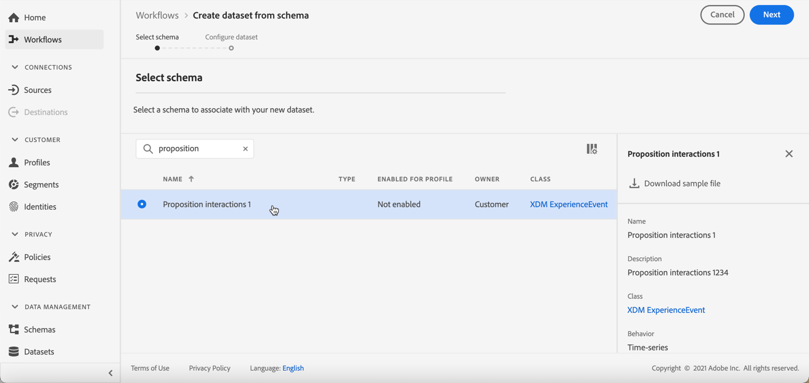

# AI-rankningar {#ai-rankings}

## Kom igång med AI-rankningar {#get-started-with-ai-rankings}

<!--If you are an [Adobe Experience Platform](https://experienceleague.adobe.com/docs/experience-platform/landing/home.html){target="_blank"} user leveraging the **Offer Decisioning** application service,-->You can use a trained model system that ranks offers to display for a given profile.

>[!CAUTION]
>
>AI-rankningen är för närvarande tillgänglig i förtid och endast för vissa användare.

Med den här funktionen kan du skapa olika **rankningsstrategier** baserat på era affärsmål. Genom att använda dessa olika målbaserade strategier i ett beslut (tidigare kallat erbjudandeaktivitet) kommer det tränade modellsystemet att hjälpa dig förstå hur de olika rangordningsstrategierna påverkar era mål.

Du kan till exempel välja en rangordningsstrategi för e-postkanalen och en annan för push-kanalen. För varje kanal utnyttjar det tränade modellsystemet flera datapunkter för att avgöra vilket erbjudande som ska presenteras först för en viss placering, i stället för att beakta offertens prioritetspoäng eller en [rankningsformel](create-ranking-formulas.md).

<!--This feature is not enabled by default. To be able to use it, reach out to your Adobe contact.-->

När en rankningsstrategi har skapats kan du tilldela den till en placering i ett beslut. Läs mer i [Konfigurera urval av erbjudanden i beslut](../offer-activities/configure-offer-selection.md).

### Automatisk optimeringsmodell {#auto-optimization}

Ingår [!DNL Journey Optimizer] den enda modelltypen som stöds för AI-rankning är **automatisk optimering**.

En automatisk optimeringsmodell syftar till att leverera erbjudanden som maximerar avkastningen, baserat på de nyckeltal (KPI) som du anger. <!--These KPIs could be in the form of conversion rates, revenue, etc.-->I nuläget fokuserar automatisk optimering på att optimera antalet erbjudanden med konvertering som mål.

>[!NOTE]
>
>Den automatiska optimeringsmodellen använder inga kontextdata eller användarprofildata. Det optimerar resultaten baserat på erbjudandenas globala prestanda.

Med automatisk optimering är utmaningen att balansera experimentellt lärande och utnyttjande av det inlärningen. Denna princip kallas **&quot;multiväpnad bandit&quot;-metod**.

Den automatiska optimeringsmodellen använder **Thompson Sampling** som gör det möjligt att identifiera vilket alternativ som ska användas för att maximera de förväntade belöningarna. Thompson Sampling är med andra ord en typ av förstärkningsteknik för att lösa problemet med prospektering och exploatering i en flerarmad bandit.

Thompson Sampling-metoden gör det även möjligt att hantera problem som &quot;kallstart&quot;, dvs. när ett nytt erbjudande introduceras i kampanjen har den ingen historik som den kan träna från.

## Skapa en rankningsstrategi {#create-ranking-strategy}

Så här skapar du en rankningsstrategi:

1. Öppna **[!UICONTROL Components]** väljer du **[!UICONTROL AI rankings]** -fliken.

   

   Alla rankningsstrategier som har skapats hittills listas.

1. Klicka på knappen **[!UICONTROL Create strategy]**.

1. Fyll i följande fält:

   

   * **[!UICONTROL Name]**: Unikt namn som du måste ange.

   * **[!UICONTROL Model type]**: Den enda modelltypen som stöds är **[!UICONTROL Auto-optimization]**.<!--More will be supported in the future so the drop-down list will be enabled.-->

   * **[!UICONTROL Optimization metric]**:

      Med det här alternativet kan marknadsförarna välja hur maskininlärningsmodellen ska byggas och tränas: baserat på de erbjudanden som visas, erbjudanden som klickats i e-post och/eller erbjudanden som klickats på webben.

      >[!NOTE]
      >
      >Du kan välja alla måtttyper om det behövs.

      Det finns två typer av optimeringsmått:
      * **[!UICONTROL Impression]**: Inställningshändelser motsvarar alla erbjudanden som visas.
      * **[!UICONTROL Conversion]**: Konverteringshändelser motsvarar alla erbjudanden som resulterar i klick via e-post eller webben.

      Alla valda intryckshändelser och/eller konverteringshändelser hämtas automatiskt med Web SDK eller Mobile SDK som har angetts. Läs mer om detta i [Adobe Experience Platform Web SDK - översikt](https://experienceleague.adobe.com/docs/experience-platform/edge/home.html?lang=en).

   * **[!UICONTROL Dataset ID]**: För konvertering måste du ange en datauppsättning där händelser samlas in genom att välja den i listrutan. Lär dig hur du skapar en sådan datauppsättning i [det här avsnittet](#create-dataset). <!--This dataset needs to be associated with a schema that must have the **[!UICONTROL Proposition Interactions]** field group (previously known as mixin) associated with it.-->

   

   >[!CAUTION]
   >
   >Endast datauppsättningar som skapats från scheman som är kopplade till **[!UICONTROL Experience Event - Proposition Interactions]** fältgruppen (som tidigare kallades mixin) visas i listrutan.

1. Spara och aktivera rankningsstrategin.

   

Det är nu klart att användas i ett beslut om att rangordna kvalificerade erbjudanden för en placering. Läs mer i [det här avsnittet](../offer-activities/configure-offer-selection.md#use-ranking-strategy).<!--TBC?-->

## Skapa en datauppsättning för att samla in händelser {#create-dataset}

Du måste skapa en datauppsättning där konverteringshändelser samlas in. Börja med att skapa schemat som ska användas i din datauppsättning:

1. Från **[!UICONTROL Data Management]** meny, välja **[!UICONTROL Schema]**, går till **[!UICONTROL Browse]** och klicka **[!UICONTROL Create schema]**.

   

1. Välj **[!UICONTROL XDM ExperienceEvent]**.

   

   >[!NOTE]
   >
   >    Läs mer om XDM-scheman och fältgrupper i [Översikt över XDM-systemet - dokumentation](https://experienceleague.adobe.com/docs/experience-platform/xdm/home.html?lang=en).


1. I **[!UICONTROL Search]** -fält, skriv&quot;interaktion för förslag&quot; och välj **[!UICONTROL Experience Event - Proposition Interactions]** fältgrupp.

   

   >[!CAUTION]
   >
   >    Schemat som ska användas i datauppsättningen måste ha **[!UICONTROL Experience Event - Proposition Interactions]** fältgrupp som är associerad med den. Annars kan du inte använda den i din rankningsstrategi.

1. Klicka på **[!UICONTROL Add field groups]**.

   

   >[!NOTE]
   >Fältgruppen kallades tidigare för mixin.

1. Skriv ett namn och spara schemat.<!--How do you edit the fields in this new schema? Examples?-->

>[!NOTE]
>
>    Läs mer om scheman i [Grunderna för schemakomposition](https://experienceleague.adobe.com/docs/experience-platform/xdm/schema/composition.html?lang=en#understanding-schemas).

Du är nu redo att skapa en datauppsättning med det här schemat. Följ stegen nedan för att göra detta:

1. Från **[!UICONTROL Data Management]** meny, välja **[!UICONTROL Datasets]**, går till **[!UICONTROL Browse]** och klicka **[!UICONTROL Create dataset]**.

   

1. Välj **[!UICONTROL Create dataset from schema]**.

   

1. Välj det schema du just skapade från listan.

   

1. Klicka på **[!UICONTROL Next]**.

1. Ange ett unikt namn för datauppsättningen i **[!UICONTROL Name]** fält och klicka **[!UICONTROL Finish]**.

   

Datamängden är nu klar att väljas för att samla in händelsedata när [skapa en rankningsstrategi](#create-ranking-strategy).

## Schemakrav {#schema-requirements}

Nu måste du ha:

* skapade rankningsstrategin,
* definierade vilken typ av händelse du vill fånga - erbjudandet visas (intryck) och/eller erbjudandet klickas (konvertering),
* och i vilken datauppsättning du vill samla in händelsedata.

Varje gång ett erbjudande visas och/eller klickas vill du att motsvarande händelse ska spelas in automatiskt av **[!UICONTROL Experience Event - Proposition Interactions]** fältgrupp med [Adobe Experience Platform Web SDK](https://experienceleague.adobe.com/docs/experience-platform/edge/web-sdk-faq.html#what-is-adobe-experience-platform-web-sdk%3F){target=&quot;_blank&quot;} eller Mobile SDK.

För att kunna skicka i händelsetyper (erbjudandet visas eller erbjudandet klickas) måste du ange rätt värde för varje händelsetyp i en upplevelsehändelse som skickas till Adobe Experience Platform. Nedan följer schemakraven som du måste implementera i din JavaScript-kod:

### Visa scenario

**Händelsetyp:** `decisioning.propositionDisplay`
**Källa:** Web.sdk/Alloy.js (`sendEvent command -> xdm : {eventType, interactionMixin}`) eller batchförtäring
+++**Exempel på nyttolast:**

```
{
    "@id": "a7864a96-1eac-4934-ab44-54ad037b4f2b",
    "xdm:timestamp": "2020-09-26T15:52:25+00:00",
    "xdm:eventType": "decisioning.propositionDisplay",
    "https://ns.adobe.com/experience/decisioning/propositions":
    [
        {
            "xdm:items":
            [
                {
                    "xdm:id": "personalized-offer:f67bab756ed6ee4",
                },
                {
                    "xdm:id": "personalized-offer:f67bab756ed6ee5",
                }
            ],
            "xdm:id": "3cc33a7e-13ca-4b19-b25d-c816eff9a70a", //decision event id - taken from experience event for “nextBestOffer”
            "xdm:scope": "scope:12cfc3fa94281acb", //decision scope id - taken from experience event for “nextBestOffer”
        }
    ]
}
```

+++

### Erbjud klickat scenario

**Händelsetyp:** `decisioning.propositionInteract`
**Källa:** Web.sdk/Alloy.js (`sendEvent command -> xdm : {eventType, interactionMixin}`) eller batchförtäring
+++**Exempel på nyttolast:**

```
{
    "@id": "a7864a96-1eac-4934-ab44-54ad037b4f2b",
    "xdm:timestamp": "2020-09-26T15:52:25+00:00",
    "xdm:eventType": "decisioning.propositionInteract",
    "https://ns.adobe.com/experience/decisioning/propositions":
    [
        {
            "xdm:items":
            [
                {
                    "xdm:id": "personalized-offer:f67bab756ed6ee4"
                },
                {
                    "xdm:id": "personalized-offer:f67bab756ed6ee5"
                },
            ],
            "xdm:id": "3cc33a7e-13ca-4b19-b25d-c816eff9a70a", //decision event id
            "xdm:scope": "scope:12cfc3fa94281acb", //decision scope id
        }
    ]
}
```

+++

<!--
## Using a ranking strategy {#using-ranking}

To use the ranking strategy you created above, follow the steps below:

Once a ranking strategy has been created, you can assign it to a placement in a decision. For more on this, see [Configure offers selection in decisions](../offer-activities/configure-offer-selection.md).

1. Create a decision.
1. Add a placement.
1. Add a collection.
1. Choose to rank offers by AI ranking (select it from the drop-down list).
1. Click Add ranking.
1. Select the ranking strategy that you created. All the details of the ranking strategy are displayed.
1. Click Next to confirm.
1. Save your decision.

It is now ready to be used in a decision to rank eligible offers for a placement (see [Configure offers selection in decisions](../offer-activities/configure-offer-selection.md)).
-->

