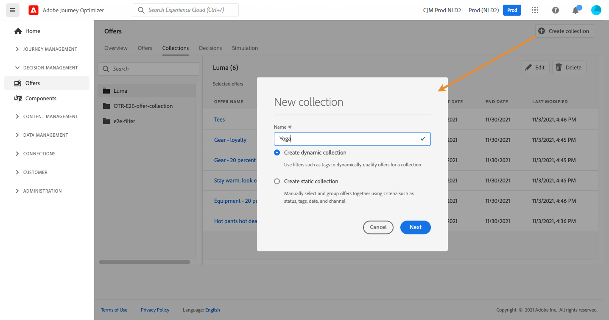

# Skapa samlingar {#create-collections}

>[!CONTEXTUALHELP]
>id="ajo_decisioning_decision_collection"
>title="Om erbjudandesamlingar"
>abstract="Med erbjudandesamlingar kan ni ordna era erbjudanden genom att gruppera om dem i olika kategorier."

>[!CONTEXTUALHELP]
>id="ajo_decisioning_collection_dynamic"
>title="Dynamisk samling"
>abstract="Använd samlingskvalificerare för att dynamiskt kvalificera erbjudanden för en samling."

>[!CONTEXTUALHELP]
>id="ajo_decisioning_collection_static"
>title="Statisk samling"
>abstract="Välj och gruppera erbjudanden manuellt med hjälp av villkor som status, samlingskvalificerare, datum och kanal."

>[!CONTEXTUALHELP]
>id="ajo_decisioning_collection_static_select"
>title="Förhandsgranskning av statisk samling"
>abstract="Statiska samlingar byggs genom att du manuellt väljer enskilda erbjudanden som ska ingå i samlingen. Samlingen kan bara uppdateras genom att fler erbjudanden läggs till manuellt."

>[!CONTEXTUALHELP]
>id="ajo_decisioning_collection_dynamic_select"
>title="Dynamisk förhandsgranskning av samling"
>abstract="Dynamiska samlingar samlar in erbjudanden baserat på samlingskvalificerare. Dessa samlingar uppdateras automatiskt. Om ett nytt erbjudande till exempel skapas med en kvalificerare för &quot;sport&quot;-samlingen läggs det automatiskt till i motsvarande samling."

Med samlingar kan du ordna dina erbjudanden genom att gruppera om dem i olika kategorier. Du kan till exempel skapa en&quot;sport&quot;-samling som bara innehåller sportrelaterade erbjudanden.

➡️ [Upptäck den här funktionen i en video](#video)

Listan med erbjudandesamlingar finns på menyn **[!UICONTROL Offers]**.

Du kan skapa två typer av samlingar:

* **Dynamiska samlingar** är samlingar med erbjudanden som baseras på samlingskvalificerare (som tidigare kallas taggar). Dessa samlingar uppdateras automatiskt. Om till exempel ett nytt erbjudande skapas med den valda samlingskvalificeraren läggs det automatiskt till i samlingen.

* **Statiska samlingar** är samlingar som har skapats genom att du manuellt väljer enskilda erbjudanden som ska ingå i samlingen. Samlingen kan bara uppdateras genom att fler erbjudanden läggs till manuellt.

Så här skapar du en samling:

1. Gå till fliken **[!UICONTROL Collections]** och klicka sedan på **[!UICONTROL Create collection]**.

1. Ange namn och typ av samling som ska skapas.

   

1. Om du vill skapa en dynamisk samling använder du den vänstra rutan för att välja den samlingskvalificerare som erbjudandena ska lägga till i samlingen. Klicka sedan på **[!UICONTROL Save]**. Alla erbjudanden med den valda samlingskvalificeraren sparas i samlingen.

   Mer information om att skapa samlingskvalificerare finns i [Skapa samlingskvalificerare](../offer-library/creating-tags.md).

   

1. Om du vill skapa en statisk samling använder du den vänstra rutan för att filtrera listan med erbjudanden (status, samlingskvalificerare, datum, kanal, innehållstyp) och väljer sedan de erbjudanden som ska läggas till i samlingen.

   

   >[!NOTE]
   >
   >Statiska samlingar uppdateras inte automatiskt. Om du vill lägga till erbjudanden i en statisk samling måste du redigera den och lägga till dem manuellt.

1. Välj **[!UICONTROL Manage access]** om du vill tilldela etiketter för anpassad eller viktig dataanvändning till en statisk samling. [Läs mer om OLAC (Object Level Access Control)](../../administration/object-based-access.md)

   >[!NOTE]
   >
   >Det går inte att använda OLAC för dynamiska samlingar. Den måste hanteras på erbjudandenivå. Därför är det möjligt att du inte ser några erbjudanden i en dynamisk samling om du inte har tillgång till något av dessa erbjudanden.

1. När samlingen har skapats visas den i listan. Du kan markera den om du vill redigera eller ta bort den.

   

## Instruktionsvideo {#video}

>[!VIDEO](https://video.tv.adobe.com/v/329376?quality=12)

