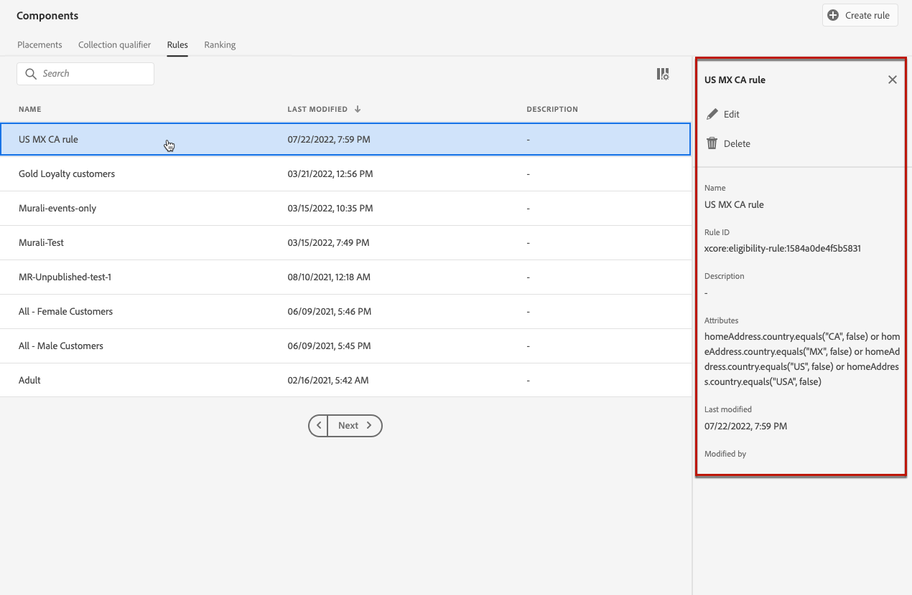

# Skapa beslutsregler {#create-decision-rules}

>[!TIP]
>
>Beslutsfattandet, [!DNL Adobe Journey Optimizer]s nya beslutsfunktion, är nu tillgängligt via den kodbaserade upplevelsen och e-postkanalerna! [Läs mer](../../experience-decisioning/gs-experience-decisioning.md)

## Om beslutsregler {#about}

Du kan skapa beslutsregler för erbjudanden baserat på data som är tillgängliga i Adobe Experience Platform. Beslutsregler avgör vem som kan visa ett erbjudande.

Du kan t.ex. ange att du bara vill att ett &quot;Kläddererbjudande för kvinnor&quot; ska visas när (Kön = &quot;Kvinna&quot;) och (Region = &#39;Nordost&#39;).

➡️ [Upptäck den här funktionen i en video](#video)

Här följer en lista över begränsningar som ska vara kända när man arbetar med beslutsregler:

* Edge-beslut använder kantprofilen som inte lagrar händelser, så alla regler som används i ett edge-beslut blir ogiltiga.
* När du skapar en beslutsregel stöds inte möjligheten att gå tillbaka till en tidigare tidsperiod. Om du till exempel anger en upplevelsehändelse som inträffade under den sista månaden som en komponent i regeln. Alla försök att inkludera en uppslagsperiod när regler skapas kommer att utlösa ett fel när den sparas.
  <!--* Decision requests that use the hub profile will look at the last 100 experience events on the profile to evaluate rules that reference historical experience events.-->

## Skapa en beslutsregel {#create}

Listan med skapade beslutsregler finns på menyn **[!UICONTROL Components]**.

Så här skapar du en beslutsregel:

1. Gå till fliken **[!UICONTROL Rules]** och klicka sedan på **[!UICONTROL Create rule]**.

   

1. Ge regeln ett namn och ange en beskrivning och konfigurera sedan regeln efter behov.

   För att göra detta finns Adobe Experience Platform **Segment Builder** tillgänglig som hjälp att skapa regelns villkor. [Lär dig hur du skapar segmentdefinitioner](../../audience/creating-a-segment-definition.md)

   <!--In this example, the rule will target customers that have the "Gold" loyalty level.-->

   

   >[!NOTE]
   >
   >Segment Builder som har tillhandahållits för att skapa beslutsregler har vissa egenskaper jämfört med den som används med tjänsten **[!UICONTROL Segmentation]**. Den globala processen som beskrivs i [Segment Builder](../../audience/creating-a-segment-definition.md) -dokumentationen är dock fortfarande giltig för att skapa beslutsregler för erbjudanden. Läs mer i [dokumentationen för Adobe Experience Platform segmenteringstjänst](https://experienceleague.adobe.com/docs/experience-platform/segmentation/ui/segment-builder.html).

1. När du lägger till och konfigurerar nya fält på arbetsytan visas information om de beräknade profilerna som tillhör målgruppen i rutan **[!UICONTROL Audience properties]**. Klicka på **[!UICONTROL Refresh estimate]** för att uppdatera data.

   

   >[!NOTE]
   >
   >Profiluppskattningar är inte tillgängliga när regelparametrar innehåller data som inte finns i profilen, till exempel kontextdata. Exempel: en regel som kräver att det aktuella vädret är ≥80 grader.

1. Klicka på **[!UICONTROL Save]** för att bekräfta.

1. När regeln har skapats visas den i listan **[!UICONTROL Rules]**. Du kan markera den för att visa dess egenskaper och redigera eller ta bort den.

   

>[!CAUTION]
>
>Händelsebaserade erbjudanden stöds för närvarande inte i [!DNL Journey Optimizer]. Om du skapar en beslutsregel baserad på en [händelse](https://experienceleague.adobe.com/docs/experience-platform/segmentation/ui/segment-builder.html#events){target="_blank"} kan du inte utnyttja den i ett erbjudande.

## Självstudievideo {#video}

>[!VIDEO](https://video.tv.adobe.com/v/329373?quality=12)
