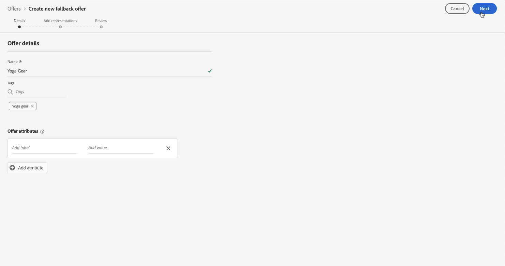

# Skapa reserverbjudanden {#creating-fallback-offers}

Reserverbjudandet skickas till kunderna om de inte är berättigade till andra erbjudanden. Stegen för att skapa ett reserverbjudande består av att skapa en eller flera representationer, som när du skapar ett erbjudande.

 [Upptäck den här funktionen i en video](#video)

Listan med reserverbjudanden finns på **[!UICONTROL Offers]**-menyn.

Så här skapar du ett reserverbjudande:

>[!NOTE]
>
>Observera, att till skillnad från personaliserade erbjudanden saknar reserverbjudanden regler och villkorsparametrar eftersom de presenteras för kunderna som sista utväg utan villkor.

1. Klicka på **[!UICONTROL Create offer]** och välj sedan **[!UICONTROL Fallback offer]**.

   

1. Ange namnet på reserverbjudandet. Du kan också koppla en eller flera befintliga taggar till den, så att du enklare kan söka efter och ordna erbjudandebiblioteket.

   

1. Skapa en eller flera representationer för reserverbjudandet. Det gör du genom att dra och släppa praktik från den vänstra rutan, som när du skapar ett personaliserat erbjudande. Se [Skapa personaliserade erbjudanden](../offer-library/creating-personalized-offers.md).

   

1. När reserverbjudandets representationer har lagts till visas en sammanfattning. Om allt är korrekt konfigurerat och ditt reserverbjudande är klart att presenteras för kunderna klickar du på **[!UICONTROL Finish]** och väljer sedan **[!UICONTROL Save and approve]**.

   Du kan också spara reserverbjudandet som ett utkast för att redigera och godkänna det senare.

   

1. Reserverbjudandet visas i listan med statusen **[!UICONTROL Live]** eller **[!UICONTROL Draft]**, beroende på om du godkände det eller inte i det föregående steget.

   Den är nu klar att levereras till kunderna. Du kan markera den för att visa dess egenskaper och redigera den. <!-- no suppression? -->

   

## Videokurs {#video}

>[!NOTE]
>
>Den här videon gäller för Offera decisioningens programtjänst som är byggd på Adobe Experience Platform. Det ger dock allmän vägledning om hur man använder Erbjudandet inom ramen för Journey Optimizer.

>[!VIDEO](https://video.tv.adobe.com/v/329383?quality=12)
