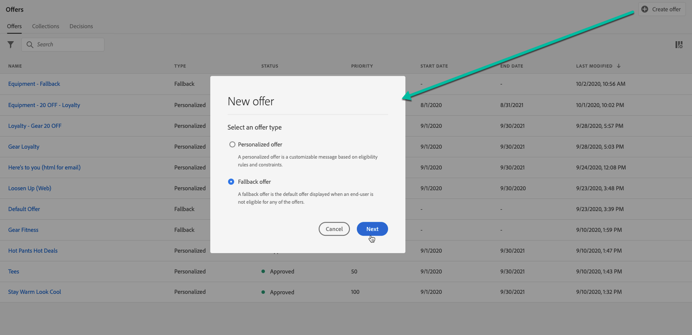
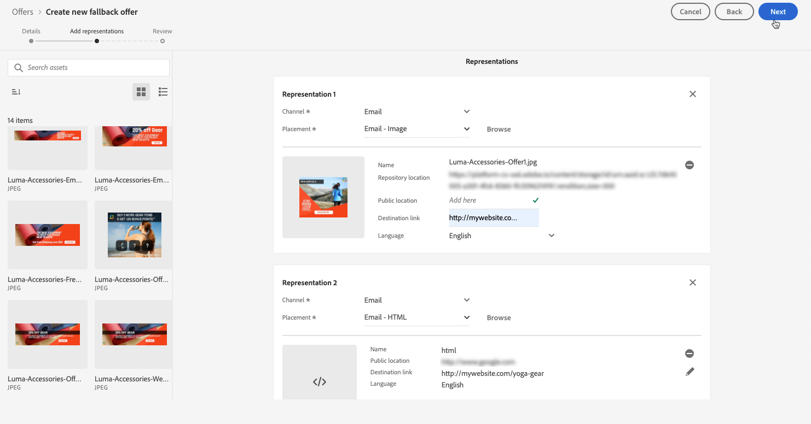
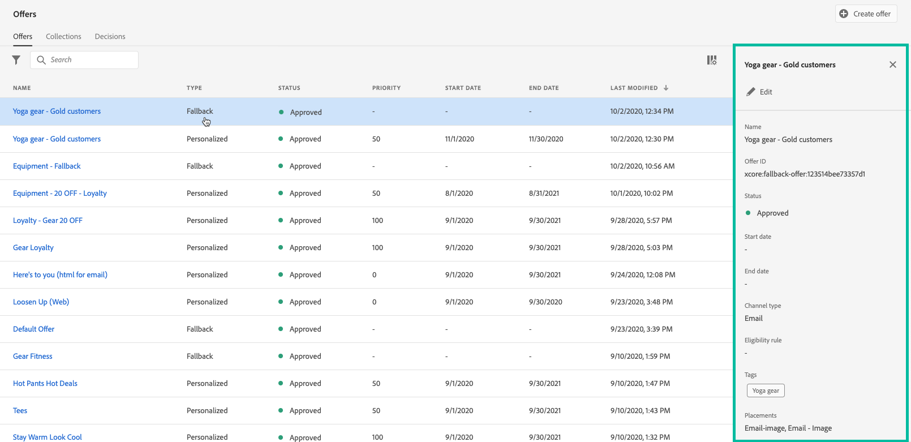

# Skapa reserverbjudanden {#create-fallback-offers}

>[!CONTEXTUALHELP]
>id="ajo_decisioning_new_fallback"
>title="Reserverbjudande"
>abstract="Ett reserverbjudande är standarderbjudande som visas när en slutanvändare inte är berättigad till något av de anpassade erbjudandena."

>[!CONTEXTUALHELP]
>id="ajo_decisioning_fallback_offer_details "
>title="Information om reserverbjudanden"
>abstract="Ange erbjudandets namn. Du kan också koppla en eller flera befintliga samlingskvalificerare till den, så att du enklare kan söka efter och ordna erbjudandebiblioteket."

Reserverbjudandet skickas till kunderna om de inte är berättigade till andra erbjudanden. Stegen för att skapa ett reserverbjudande består av att skapa en eller flera representationer, som när du skapar ett erbjudande.

➡️ [Upptäck den här funktionen i en video](#video)

Listan över reserverbjudanden finns på menyn **[!UICONTROL Offers]**.

Så här skapar du ett reserverbjudande:

>[!NOTE]
>
>Observera, att till skillnad från personaliserade erbjudanden saknar reserverbjudanden regler och begränsningsparametrar eftersom de presenteras för kunderna som sista utväg utan villkor.

1. Klicka på **[!UICONTROL Create offer]** och välj sedan **[!UICONTROL Fallback offer]**.

   

1. Ange erbjudandets namn. Du kan också koppla en eller flera befintliga samlingskvalificerare (som tidigare kallats taggar) till den, så att du enklare kan söka efter och ordna erbjudandebiblioteket.

   

1. Välj **[!UICONTROL Manage access]** om du vill tilldela etiketter för anpassad eller viktig dataanvändning till erbjudandet. [Läs mer om OLAC (Object Level Access Control)](../../administration/object-based-access.md)

1. Skapa en eller flera representationer för reserverbjudandet. Det gör du genom att dra och släppa praktik från den vänstra rutan, som när du skapar ett personaliserat erbjudande. Se [Skapa anpassade erbjudanden](../offer-library/creating-personalized-offers.md).

   

   >[!CAUTION]
   >
   >Reserverbjudanden ska innehålla alla representationer som används inom ett [beslut](../offer-activities/create-offer-activities.md). Om du t.ex. har 5 erbjudanden i ett beslut och var och en av dem har olika representationer, bör 5 representationer ingå i reserverbjudandet.

1. När reserverbjudandets representationer har lagts till visas en sammanfattning. Om allt är korrekt konfigurerat och ditt reserverbjudande är klart att presenteras för kunderna klickar du på **[!UICONTROL Finish]** och väljer sedan **[!UICONTROL Save and approve]**.

   Du kan också spara reserverbjudandet som ett utkast för att redigera och godkänna det senare.

   

1. Reserverbjudandet visas i listan med statusen **[!UICONTROL Live]** eller **[!UICONTROL Draft]**, beroende på om du godkände det eller inte i föregående steg.

   Den är nu klar att levereras till kunderna. Du kan markera den för att visa dess egenskaper och redigera den. <!-- no suppression? -->

   

## Instruktionsvideo {#video}

>[!VIDEO](https://video.tv.adobe.com/v/329383?quality=12)

