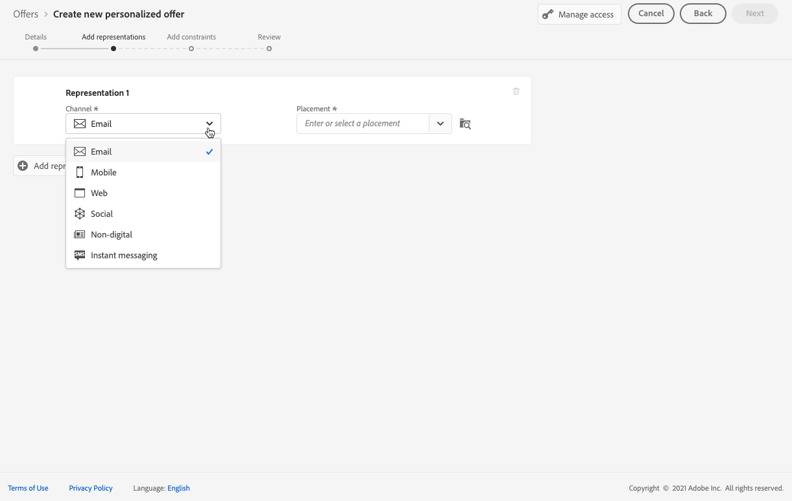
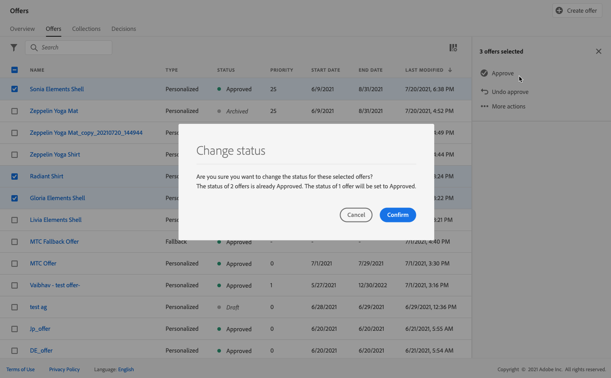
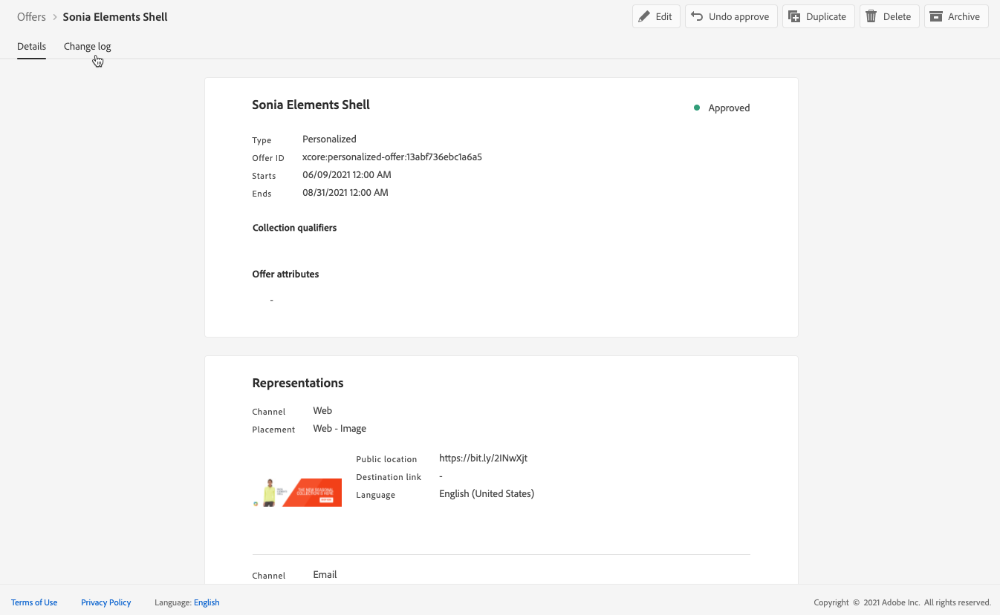

# Skapa personaliserade erbjudanden {#create-personalized-offers}

Innan du skapar ett erbjudande måste du kontrollera att du har skapat:

* A **placering** i vilket erbjudandet kommer att visas. Se [Skapa placeringar](../offer-library/creating-placements.md)
* Om du vill lägga till ett villkor för behörighet: **beslutsregel** som kommer att definiera villkoren för hur erbjudandet ska presenteras. Se [Skapa beslutsregler](../offer-library/creating-decision-rules.md).
* En eller flera **samlingskvalificerare** (tidigare kallat &quot;taggar&quot;) som du kanske vill koppla till erbjudandet. Se [Skapa samlingskvalificerare](../offer-library/creating-tags.md).

➡️ [Upptäck den här funktionen i video](#video)

Listan över personaliserade erbjudanden finns på **[!UICONTROL Offers]** -menyn.

## Skapa ett erbjudande {#create-offer}

>[!CONTEXTUALHELP]
>id="od_offer_attributes"
>title="Om attribut för erbjudande"
>abstract="Med attribut för erbjudanden kan du koppla nyckelvärdepar till erbjudandet i rapporterings- och analyssyfte."

>[!CONTEXTUALHELP]
>id="ajo_decisioning_offer_attributes"
>title="Erbjudandeattribut"
>abstract="Med attribut för erbjudanden kan du koppla nyckelvärdepar till erbjudandet i rapporterings- och analyssyfte."

Skapa en **erbjudande** gör du så här:

1. Klicka **[!UICONTROL Create offer]** väljer **[!UICONTROL Personalized offer]**.

   

1. Ange erbjudandets namn samt start- och slutdatum och sluttid. Utanför dessa datum väljs inte erbjudandet av beslutsmotorn.

   >[!NOTE]
   >
   >När du väljer tider tas den aktuella tidszonen med i beräkningen.

   

   >[!CAUTION]
   >
   >Uppdatering av start- och slutdatum kan påverka capping. [Läs mer](add-constraints.md#capping-change-date)

1. Du kan också koppla en eller flera befintliga **[!UICONTROL collection qualifiers]** så att du enklare kan söka efter och ordna erbjudandebiblioteket. [Läs mer](creating-tags.md).

1. The **[!UICONTROL Offer attributes]** kan du koppla nyckelvärdepar till erbjudandet för rapportering och analys.

1. Om du vill tilldela etiketter för anpassad eller viktig dataanvändning till erbjudandet väljer du **[!UICONTROL Manage access]**. [Läs mer om OLAC (Object Level Access Control)](../../administration/object-based-access.md)

   

1. Lägg till representationer för att definiera var ditt erbjudande ska visas i meddelandet. [Läs mer](add-representations.md)

   

   >[!CAUTION]
   >
   >Ett erbjudande som innehåller alla dess representationer får inte överskrida 300 kB.

1. Lägg till begränsningar för att ange villkoren för erbjudandet som ska visas. [Läs mer](add-constraints.md)

   >[!NOTE]
   >
   >När du väljer målgrupper eller beslutsregler kan du se information om de uppskattade kvalificerade profilerna. Klicka **[!UICONTROL Refresh]** för att uppdatera data.
   >
   >Observera att profiluppskattningar inte är tillgängliga när regelparametrar innehåller data som inte finns i profilen, t.ex. kontextdata. Exempel: en regel som kräver att det aktuella vädret är ≥80 grader.

   

1. Granska och spara erbjudandet. [Läs mer](#review)

## Se erbjudandet {#review}

När regler och begränsningar för behörighet har definierats visas en sammanfattning av egenskaperna för erbjudandet.

1. Kontrollera att allt är rätt konfigurerat.

1. Du kan visa information om de uppskattade kvalificerade profilerna. Klicka **[!UICONTROL Refresh]** för att uppdatera data.

   

1. När erbjudandet är klart för användarna klickar du på **[!UICONTROL Finish]**.

1. Välj **[!UICONTROL Save and approve]**.

   

   Du kan också spara erbjudandet som ett utkast för att redigera det och godkänna det senare.

Erbjudandet visas i listan med **[!UICONTROL Approved]** eller **[!UICONTROL Draft]** status, beroende på om du har godkänt den eller inte i föregående steg.

Den är nu klar att levereras till användarna.

## Hantera erbjudanden {#offer-list}

I erbjudandelistan kan du välja erbjudandet för att visa dess egenskaper. Du kan också redigera det och ändra dess status (**Utkast**, **Godkänd**, **Arkiverad**), duplicera erbjudandet eller ta bort det.

Välj **[!UICONTROL Edit]** för att gå tillbaka till erbjudandeversionen där du kan ändra erbjudandets [information](#create-offer), [representationer](#representations)och du kan redigera [regler och begränsningar för behörighet](#eligibility).

Välj ett godkänt erbjudande och klicka på **[!UICONTROL Undo approve]** för att återställa erbjudandestatusen till **[!UICONTROL Draft]**.

Om du vill ange status igen till **[!UICONTROL Approved]** markerar du motsvarande knapp som nu visas.

The **[!UICONTROL More actions]** aktiverar de åtgärder som beskrivs nedan.

* **[!UICONTROL Duplicate]**: skapar ett erbjudande med samma egenskaper, representationer, regler och begränsningar för behörighet. Som standard har det nya erbjudandet **[!UICONTROL Draft]** status.
* **[!UICONTROL Delete]**: tar bort erbjudandet från listan.

  >[!CAUTION]
  >
  >Erbjudandet och dess innehåll kommer inte längre att vara tillgängliga. Det går inte att ångra den här åtgärden.
  >
  >Om erbjudandet används i en samling eller ett beslut kan det inte tas bort. Du måste ta bort erbjudandet från alla objekt först.

* **[!UICONTROL Archive]**: anger erbjudandestatusen till **[!UICONTROL Archived]**. Erbjudandet är fortfarande tillgängligt från listan, men du kan inte återställa dess status till **[!UICONTROL Draft]** eller **[!UICONTROL Approved]**. Du kan bara duplicera eller ta bort den.

Du kan också ta bort eller ändra status för flera erbjudanden samtidigt genom att markera motsvarande kryssrutor.

Om du vill ändra status för flera erbjudanden med olika status, ändras bara statusen.

När ett erbjudande har skapats kan du klicka på dess namn i listan.

På så sätt kan du få tillgång till detaljerad information om erbjudandet. Välj **[!UICONTROL Change log]** tabba till [övervaka alla ändringar](../get-started/user-interface.md#monitoring-changes) som har erbjudandet.

## Självstudievideo {#video}

>[!VIDEO](https://video.tv.adobe.com/v/329375?quality=12)
