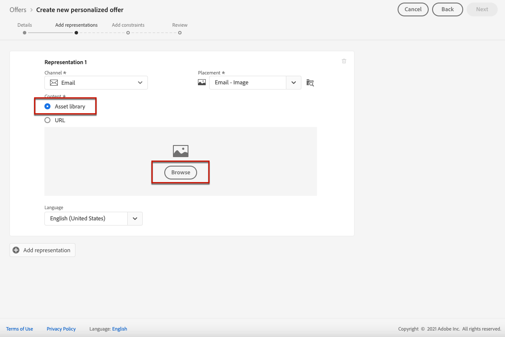

# Skapa personaliserade erbjudanden {#creating-personalized-offers}

Innan du skapar ett erbjudande måste du kontrollera att du har skapat:

* En **placering** där erbjudandet ska visas. Se [Skapa placeringar](../offer-library/creating-placements.md)
* En **beslutsregel** som definierar det villkor som erbjudandet ska presenteras under. Se [Skapa beslutsregler](../offer-library/creating-decision-rules.md).
* En eller flera **taggar** som du vill associera med erbjudandet. Se [Skapa taggar](../offer-library/creating-tags.md).

➡️ [Upptäck den här funktionen i en video](#video)

Listan med personaliserade erbjudanden finns på **[!UICONTROL Offers]**-menyn.

## Skapa erbjudandet {#create-offer}

Så här skapar du ett **erbjudande**:

1. Klicka på **[!UICONTROL Create offer]** och välj sedan **[!UICONTROL Personalized offer]**.

   

1. Ange erbjudandets namn samt start- och slutdatum och sluttid. Du kan också koppla en eller flera befintliga taggar till erbjudandet, så att du enklare kan söka efter och ordna erbjudandebiblioteket.

   

   >[!NOTE]
   >
   >I **[!UICONTROL Offer attributes]**-avsnittet kan du koppla nyckelvärdepar till erbjudandet för rapportering och analys.

## Konfigurera offertens representationer {#representations}

Ett erbjudande kan visas på olika platser i ett meddelande: i en övre banderoll med en bild, som text i ett stycke, som ett HTML-block osv. Ju fler representationer ett erbjudande har, desto fler möjligheter finns det att använda erbjudandet i olika placeringssammanhang.

Följ stegen nedan om du vill lägga till en eller flera representationer i ditt erbjudande och konfigurera dem.

1. För den första representationen börjar du med att välja **[!UICONTROL Channel]** som ska användas.

   

   >[!NOTE]
   >
   >Endast de tillgängliga placeringarna för den valda kanalen visas i listrutan **[!UICONTROL Placement]**.

1. Välj en placering i listan.

   Du kan också använda knappen bredvid listrutan **[!UICONTROL Placement]** för att bläddra bland alla placeringar.

   

   Där kan du fortfarande filtrera placeringarna efter kanal- och/eller innehållstyp. Välj en placering och klicka på **[!UICONTROL Select]**.

   

1. Lägg till innehåll i din representation. Läs mer i [det här avsnittet](#content).

1. När du lägger till innehåll som en bild eller URL kan du ange en **[!UICONTROL Destination link]**: de användare som klickar på erbjudandet dirigeras till motsvarande sida.

   

1. Välj slutligen det språk du vill använda för att identifiera och hantera vad som ska visas för användarna.

1. Om du vill lägga till ytterligare en representation använder du knappen **[!UICONTROL Add representation]** och lägger till så många representationer som behövs.

   

1. När du har lagt till alla representationer väljer du **[!UICONTROL Next]**.

## Definiera innehåll för dina representationer {#content}

Du kan lägga till olika typer av innehåll i en representation.

>[!NOTE]
>
>Endast innehåll som motsvarar placeringens innehållstyp är tillgängligt för användning.

### Lägg till bilder

Om den valda placeringen är av bildtyp kan du lägga till innehåll från **Adobe Experience Cloud Asset**-biblioteket, en centraliserad databas med resurser från [!DNL Adobe Experience Manager Assets Essentials].

>[!NOTE]
>
> Om du vill arbeta med [Adobe Experience Manager Assets Essentials](https://experienceleague.adobe.com/docs/experience-manager-assets-essentials/help/introduction.html?lang=en){target=&quot;_blank&quot;} måste du distribuera [!DNL Assets Essentials] för din organisation och se till att användare är en del av **Assets Essentials konsumentanvändare** eller/och **Assets Essentials-användare** produktprofiler. Läs mer på [den här sidan](https://experienceleague.adobe.com/docs/experience-manager-assets-essentials/help/deploy-administer.html){target=&quot;_blank&quot;}.

1. Välj alternativet **[!UICONTROL Asset library]**.

1. Välj **[!UICONTROL Browse]**.

   

1. Bläddra bland resurserna och välj den bild du vill använda

1. Klicka på **[!UICONTROL Select]**.

   

### Lägg till URL:er

Om du vill lägga till innehåll från en extern offentlig plats väljer du **[!UICONTROL URL]** och anger sedan URL-adressen för innehållet som ska läggas till.

### Lägg till egen text {#custom-text}

Du kan också infoga text när du väljer en kompatibel placering.

1. Välj alternativet **[!UICONTROL Custom]**.

   >[!NOTE]
   >
   >Det här alternativet är inte tillgängligt för bildtypsplaceringar.

1. Skriv den text som ska visas i erbjudandet i det dedikerade området.

   

## Lägg till regler och begränsningar för berättigande {#eligibility}

Behörighetsregler och -begränsningar gör att du kan definiera villkoren för hur ett erbjudande ska visas.

1. Konfigurera **[!UICONTROL Offer eligibility]**.

   * Som standard är alternativet **[!UICONTROL All visitors]** för beslutsregel valt, vilket innebär att alla profiler kan presenteras erbjudandet.

   * Du kan begränsa erbjudandets presentation till medlemmarna i ett eller flera Adobe Experience Platform-segment. Aktivera alternativet **[!UICONTROL Visitors who fall into one or multiple segments]** och lägg sedan till ett eller flera segment från den vänstra rutan och kombinera dem med de logiska operatorerna **[!UICONTROL And]** / **[!UICONTROL Or]**.

      Mer information om hur du arbetar med segment finns på [den här sidan](../../segment/about-segments.md).

      

   * Om du vill koppla en viss beslutsregel till erbjudandet väljer du **[!UICONTROL By defined decision rule]** och drar sedan den önskade regeln från den vänstra rutan till **[!UICONTROL Decision rule]**-området. Mer information om hur du skapar en beslutsregel finns i [det här avsnittet](../offer-library/creating-decision-rules.md).

      

      >[!CAUTION]
      >
      >Händelsebaserade erbjudanden stöds för närvarande inte i [!DNL Journey Optimizer]. Om du skapar en beslutsregel baserad på en [händelse](https://experienceleague.adobe.com/docs/experience-platform/segmentation/ui/segment-builder.html?lang=en#events){target=&quot;_blank&quot;} kan du inte utnyttja den i ett erbjudande.
   Läs mer om hur du använder segment kontra beslutsregler i [det här avsnittet](../offer-activities/create-offer-activities.md#segments-vs-decision-rules).

1. Definiera **[!UICONTROL Priority]** för erbjudandet jämfört med andra om användaren kvalificerar för mer än ett erbjudande. Ju högre prioritet ett erbjudande har, desto högre blir prioriteringen jämfört med andra erbjudanden.

1. Ange erbjudandets **[!UICONTROL Capping]**, vilket innebär hur många gånger erbjudandet kommer att visas totalt för alla användare. Om erbjudandet har levererats till alla användare det antal gånger som du har angett i det här fältet, upphör leveransen.

   >[!NOTE]
   >
   >Det antal gånger ett erbjudande föreslås beräknas vid e-postförberedelsen. Om du t.ex. förbereder ett e-postmeddelande med ett antal erbjudanden räknas dessa siffror mot det högsta antalet oavsett om e-postmeddelandet skickas eller inte.
   >
   >Om en e-postleverans tas bort eller om förberedelserna görs på nytt innan den skickas, uppdateras erbjudandets begränsningsvärde automatiskt.

   

   I exemplet ovan:

   * Prioriteten för erbjudandet är 50, vilket innebär att erbjudandet presenteras före erbjudanden med en prioritet mellan 1 och 49, och efter erbjudanden med en prioritet på minst 51.
   * Erbjudandet gäller endast användare som matchar&quot;Gold Loyalty Customers&quot;-beslutsregeln.
   * Erbjudandet gäller endast en gång per användare.

## Se erbjudandet {#review}

När regler och begränsningar för behörighet har definierats visas en sammanfattning av egenskaperna för erbjudandet.

1. Kontrollera att allt är rätt konfigurerat.

1. När erbjudandet är klart att visas för användarna klickar du på **[!UICONTROL Finish]**.

1. Välj **[!UICONTROL Save and approve]**.

   

   Du kan också spara erbjudandet som ett utkast för att redigera det och godkänna det senare.

Erbjudandet visas i listan med statusen **[!UICONTROL Approved]** eller **[!UICONTROL Draft]**, beroende på om du godkände det eller inte i det föregående steget.

Den är nu klar att levereras till användarna.

## Erbjudandelista {#offer-list}

I erbjudandelistan kan du välja erbjudandet för att visa dess egenskaper. Du kan också redigera det, ändra dess status (**Utkast**, **Godkänd**, **Arkiverat**), duplicera erbjudandet eller ta bort det.

Välj knappen **[!UICONTROL Edit]** om du vill gå tillbaka till erbjudandeversionsläget, där du kan ändra erbjudandets [information](#create-offer), [representationer](#representations), samt redigera [berättiganderegler och begränsningar](#eligibility).

Välj ett godkänt erbjudande och klicka på **[!UICONTROL Undo approve]** för att ange erbjudandestatusen till **[!UICONTROL Draft]**.

Om du vill ange status till **[!UICONTROL Approved]** igen väljer du motsvarande knapp som nu visas.

Knappen **[!UICONTROL More actions]** aktiverar de åtgärder som beskrivs nedan.

* **[!UICONTROL Duplicate]**: skapar ett erbjudande med samma egenskaper, representationer, regler och begränsningar för behörighet. Som standard har det nya erbjudandet statusen **[!UICONTROL Draft]**.
* **[!UICONTROL Delete]**: tar bort erbjudandet från listan.

   >[!CAUTION]
   >
   >Erbjudandet och dess innehåll kommer inte längre att vara tillgängliga. Det går inte att ångra den här åtgärden.
   >
   >Om erbjudandet används i en samling eller ett beslut kan det inte tas bort. Du måste ta bort erbjudandet från alla objekt först.

* **[!UICONTROL Archive]**: anger erbjudandestatusen till  **[!UICONTROL Archived]**. Erbjudandet är fortfarande tillgängligt från listan, men du kan inte ange tillbaka status till **[!UICONTROL Draft]** eller **[!UICONTROL Approved]**. Du kan bara duplicera eller ta bort den.

Du kan också ta bort eller ändra status för flera erbjudanden samtidigt genom att markera motsvarande kryssrutor.

Om du vill ändra status för flera erbjudanden med olika status, ändras bara statusen.

När ett erbjudande har skapats kan du klicka på dess namn i listan.

På så sätt kan du få tillgång till detaljerad information om erbjudandet. Välj fliken **[!UICONTROL Change log]** för att [övervaka alla ändringar](../get-started/user-interface.md#monitoring-changes) som har gjorts i erbjudandet.

## Videokurs {#video}

>[!NOTE]
>
>Den här videon gäller för Offera decisioningens programtjänst som är byggd på Adobe Experience Platform. Det ger dock allmän vägledning om hur man använder Erbjudandet inom ramen för Journey Optimizer.

>[!VIDEO](https://video.tv.adobe.com/v/329375?quality=12)
