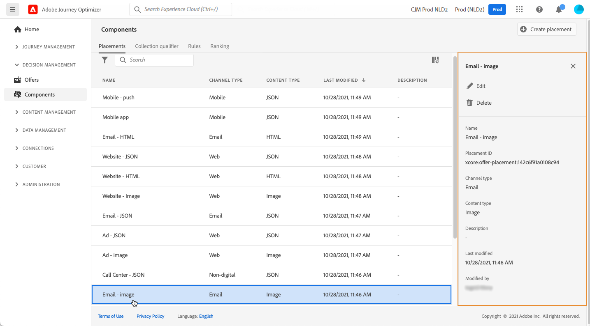

# Skapa placeringar {#create-placements}

>[!TIP]
>
>Beslutsfattandet, [!DNL Adobe Journey Optimizer]s nya beslutsfunktion, är nu tillgängligt via den kodbaserade upplevelsen och e-postkanalerna! [Läs mer](../../experience-decisioning/gs-experience-decisioning.md)

>[!CONTEXTUALHELP]
>id="ajo_decisioning_placement"
>title="Placement"
>abstract="En placering är en behållare som används för att visa erbjudanden. Det hjälper er att se till att rätt erbjudandeinnehåll visas på rätt plats i ert budskap. Placeringar skapas från menyn Komponenter."

>[!CONTEXTUALHELP]
>id="ajo_decisioning_placement_request"
>title="Inställningar för begäran"
>abstract="Aktivera alternativet **[!UICONTROL Allow Duplicates across placements]** om du vill att systemet ska ta hänsyn till samma erbjudande för flera placeringar. Använd fältet **[!UICONTROL Request offer]** för att justera antalet returnerade erbjudanden. Om du till exempel väljer 2 visas de två bästa erbjudandena för det valda beslutsområdet."

>[!CONTEXTUALHELP]
>id="ajo_decisioning_placement_response"
>title="Svarsformat"
>abstract="Med alternativen **[!UICONTROL Include content]** och **[!UICONTROL Include metadata]** kan du ange om erbjudandets innehåll och metadata ska returneras i API-svaret. Du kan endast inkludera alla metadata eller specifika fält. Som standard är Inkludera metadata inställt på true."

En placering säkerställer att rätt erbjudandeinnehåll visas på rätt plats i ert meddelande. När du lägger till innehåll i ett erbjudande blir du ombedd att välja en placering där innehållet kan visas.

➡️ [Lär dig skapa placeringar i den här videon](#video)

I exemplet nedan finns det tre placeringar som motsvarar olika typer av innehåll (bild, text, HTML).

Listan med placeringar finns på menyn **[!UICONTROL Components]**. Det finns filter som hjälper dig att hämta placeringar utifrån en viss kanal eller ett visst innehåll.

Så här skapar du en placering:

1. Klicka på **[!UICONTROL Create placement]**.

   

1. Definiera placeringens egenskaper:

   * **[!UICONTROL Name]**: Placeringens namn. Se till att definiera ett beskrivande namn så att det blir enklare att hämta det.
   * **[!UICONTROL Channel type]**: Den kanal som placeringen ska användas för.
   * **[!UICONTROL Content type]**: Den typ av innehåll som placeringen kan visa: Text, HTML, Image Link eller JSON.
   * **[!UICONTROL Description]**: En beskrivning av placeringen (valfritt).

   

1. Avsnitten **[!UICONTROL Request settings]** och **[!UICONTROL Response format]** innehåller ytterligare parametrar:

   * **[!UICONTROL Allow Duplicates across placements]**: Kontrollera om samma erbjudande kan föreslås flera gånger på olika platser. Om det är aktiverat kommer systemet att överväga samma erbjudande för flera praktik. Som standard är parametern inställd på false.

     Om det här alternativet är inställt på false för alla placeringar i en beslutsbegäran, ärver alla placeringar i begäran inställningen &quot;false&quot;.

   * **[!UICONTROL Request offer]**: Som standard returneras ett erbjudande om beslutsomfånget för varje profil. Du kan justera antalet returnerade erbjudanden med det här alternativet. Om du till exempel väljer 2 visas de två bästa erbjudandena för det valda beslutsområdet.

   * **[!UICONTROL Include content]** / **[!UICONTROL Include metadata]**: Ange om erbjudandets innehåll och metadata ska returneras i API-svaret. Du kan endast inkludera alla metadata eller specifika fält. Som standard är Inkludera metadata inställt på true.

   Dessa parametrar kan också anges direkt i din API-begäran om du arbetar med [besluts-API](https://experienceleague.adobe.com/docs/journey-optimizer/using/offer-decisioning/api-reference/offer-delivery-api/decisioning-api.html?lang=sv-SE). Om du konfigurerar dem i användargränssnittet kan du spara tid eftersom du inte behöver skicka dem i varje API-begäran. Observera, att om du konfigurerar parametrarna både i användargränssnittet och i API-begäran, gäller värdena från API-begäran framför dem i gränssnittet.

   >[!NOTE]
   >
   >Om du arbetar med [Edge Decisioning API](https://experienceleague.adobe.com/docs/journey-optimizer/using/offer-decisioning/api-reference/offer-delivery-api/edge-decisioning-api.html?lang=sv-SE&) kan du inte ange de här parametrarna i din begäran. Du måste definiera dem på den här skärmen.
   >
   >Om du arbetar med [API:t för gruppbeslut](../api-reference/offer-delivery-api/batch-decisioning-api.md) kan du ange de här parametrarna antingen på den här skärmen eller i din API-begäran. Om parametervärdena inte överensstämmer mellan skärmen och APi-begäran används värdena för begäran.

1. Klicka på **[!UICONTROL Save]** för att bekräfta.

1. När placeringen har skapats visas den i placeringslistan. Du kan markera den för att visa dess egenskaper och redigera den.

   

## Instruktionsvideo{#video}

Lär dig hur du skapar praktik i beslutshantering.

>[!VIDEO](https://video.tv.adobe.com/v/329372?quality=12)

