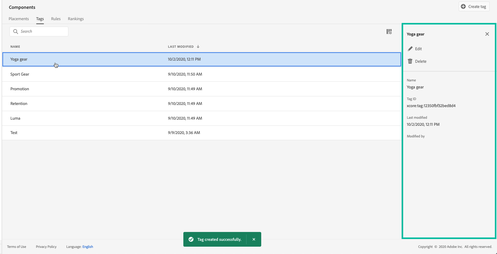

# Skapa samlingskvalificerare {#create-tags}

>[!CONTEXTUALHELP]
>id="ajo_decisioning_offer_tags"
>title="Samlingskvalificerare"
>abstract="Koppla en eller flera av samlingskvalificerarna till erbjudandet för att ordna ditt offertbibliotek och enklare hitta erbjudanden. Samlingskvalificerare skapas från menyn Komponent."

Genom att associera samlingskvalificerare (som tidigare kallats&quot;taggar&quot;) med dina erbjudanden blir det enklare att hålla ordning på dem. Du kan till exempel märka dina erbjudanden på Black Friday med&quot;Black Friday&quot;-samlingskvalificeraren. Du kan sedan använda sökfunktionen i erbjudandebiblioteket för att enkelt hitta alla erbjudanden med den samlingskvalificeraren.

Samlingskvalificerare kan också användas för att gruppera erbjudanden i olika mängder. Se [Skapa samlingar](../offer-library/creating-collections.md).

➡️ [Upptäck den här funktionen i en video](#video)

Listan med skapade samlingskvalificerare är tillgänglig på menyn **[!UICONTROL Components]**.

Så här skapar du en samlingskvalificerare:

1. Gå till fliken **[!UICONTROL Collection qualifiers]** och klicka sedan på **[!UICONTROL Create collection qualifier]**.

1. Ange samlingskvalificerarens namn och klicka sedan på **[!UICONTROL Save]**.

   

1. När samlingskvalificeraren har skapats visas den i listan. Du kan markera den för att visa dess egenskaper och redigera eller inaktivera den.

   

## Instruktionsvideo {#video}

>[!VIDEO](https://video.tv.adobe.com/v/329374?quality=12)
