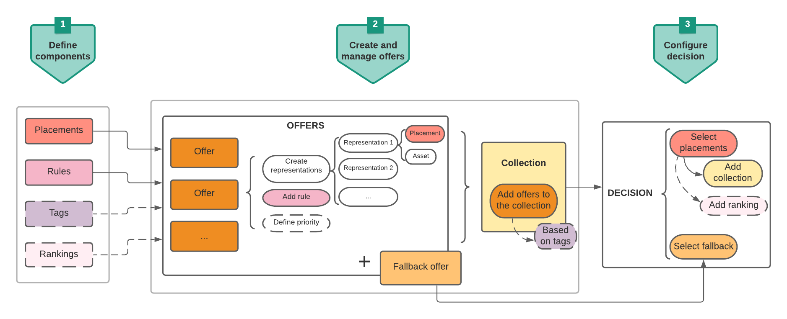

# Viktiga steg för att skapa och hantera erbjudanden {#key-steps}

Nedan beskrivs de viktigaste stegen för att skapa, konfigurera och hantera erbjudanden samt för att använda dem i ett beslut.

Ett fullständigt exempel från början till slut som visar hur du konfigurerar erbjudanden får du om du använder dem i ett beslut och använder det här beslutet i ett e-postmeddelande. Läs [den här sidan](../offers-e2e.md).

## Skapa komponenter

Innan du börjar skapa erbjudanden måste du definiera flera komponenter som du ska använda i dina erbjudanden.

1. **Skapa placeringar**, som är behållare som ska användas för att visa upp dina erbjudanden. Du kan till exempel skapa en placering som är dedikerad till erbjudanden i endast bildformatet och som ligger högst upp i dina meddelanden.

1. **Skapa** beslutsregler som anger villkoren för hur erbjudandena ska presenteras.

1. **Skapa** taggar som du kopplar till erbjudandena, så att du enkelt kan ordna och söka efter dem i biblioteket.

1. Om du vill definiera regler som avgör vilket erbjudande som ska presenteras först för en viss placering (i stället för att ta hänsyn till offertens prioritetspoäng), kan du **skapa en rankningsformel**.

<table>
<tr>
<td>
<a href="../offer-library/creating-placements.md">Skapa placeringar</a>
</td>
<td>
<a href="../offer-library/creating-decision-rules.md">Skapa beslutsregler</a>
</td>
<td>
<a href="../offer-library/creating-tags.md">Skapa taggar</a>
</td>
<td>
<a href="../offer-library/create-ranking-formulas.md">Skapa rankningsformler</a>
</td>
</table>

## Skapa och hantera erbjudanden

1. **Skapa erbjudanden** och konfigurera deras innehåll och egenskaper.

1. **Skapa reserverbjudanden**, som är det sista erbjudandet som visas om kunderna inte är berättigade till något av de valda erbjudandena.

1. **Skapa en** samling för att inkludera de personaliserade erbjudanden du har skapat och använda dem i ett beslut.

<table>
<tr>
<td>
<a href="../offer-library/creating-personalized-offers.md">Skapa erbjudanden</a>
</td>
<td>
<a href="../offer-library/creating-fallback-offers.md">Skapa reserverbjudanden</a>
</td>
<td>
<a href="../offer-library/creating-collections.md">Skapa samlingar</a>
</td></tr>
</table>

## Skapa och konfigurera beslut

1. **Skapa ett** beslut som kombinerar ersättningar med personaliserade erbjudanden och reserverbjudanden. Den här kombinationen kommer att användas av Offera decisioningen för att hitta det bästa erbjudandet för en viss profil.

1. **Konfigurera beslutet**. Om du vill göra det markerar du placeringarna och för varje placering väljer du en samling och en reserv.

1. Vid behov kan du **tilldela en rankningsformel** till en placering när du konfigurerar beslutet.

<table>
<tr>
<td>
<a href="../offer-activities/create-offer-activities.md">Skapa beslut</a>
</td>
<td>
<a href="../offer-activities/create-offer-activities.md#add-offers">Konfigurera beslut</a>
</td>
<td>
<a href="../offer-activities/configure-offer-selection.md#assign-ranking-formula">Tilldela rankning</a>
</td>
</tr>
</table>
