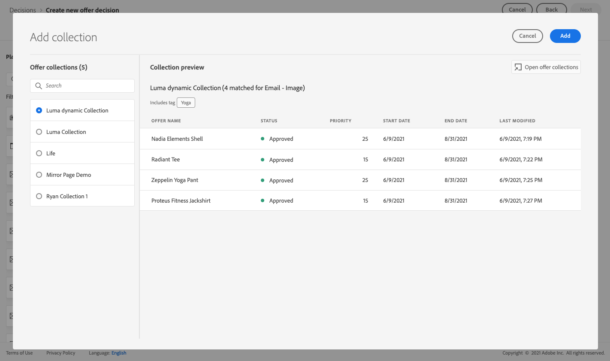

# Användningsfall: Konfigurera personaliserade erbjudanden så att de kan användas i ett e-postmeddelande {#configure-add-personalized-offers-email}

I det här avsnittet presenteras ett exempel från början till slut som visar hur du konfigurerar erbjudanden och använder dem i ett e-postmeddelande baserat på ett beslut som du tidigare har skapat.

## Huvudsteg

De viktigaste stegen för att konfigurera erbjudanden, inkludera dem i ett beslut och utnyttja detta beslut i ett e-postmeddelande är följande:

1. Innan du skapar erbjudanden [definiera dina komponenter](#define-components)

   * Skapa placeringar
   * Skapa beslutsregler
   * Skapa taggar
   * Skapa rankningar (valfritt)

1. [Konfigurera erbjudandena](#configure-offers)

   * Skapa erbjudanden
   * För varje erbjudande:

      * Skapa representationer och välj en placering och en resurs för varje representation
      * Lägg till en regel för varje erbjudande
      * Definiera en prioritet för varje erbjudande

1. [Skapa ett reserverbjudande](#create-fallback)

1. [Skapa en samling](#create-collection) för att inkludera de personaliserade erbjudanden du har skapat

1. [Konfigurera beslutet](#configure-decision)

   * Skapa ett beslut
   * Markera de placeringar du har skapat
   * För varje placering väljer du samlingen
   * Välj en rankning för varje placering (valfritt)
   * Markera reservdelen

1. [Infoga beslutet i ett e-postmeddelande](#insert-decision-in-email)

   * Välj en placering som matchar erbjudandena som du vill visa
   * Välj ett beslut bland de objekt som är kompatibla med den valda placeringen
   * Förgranska erbjudandena

Den övergripande beslutsprocess som ska användas för erbjudanden i ett e-postmeddelande beskrivs på följande sätt:

## Definiera komponenterna {#define-components}

Innan du börjar skapa erbjudanden måste du definiera flera komponenter som du ska använda i dina erbjudanden.

Du hittar dem under **[!UICONTROL Decision Management]** > **[!UICONTROL Components menu]**.

1. Börja med att skapa **placeringar** för era erbjudanden.

   Du använder dessa ersättningar för att definiera var erbjudandet ska visas när du definierar ditt beslut om erbjudande.

   I det här exemplet skapar du tre placeringar med följande kanal- och innehållstyper:

   * *Webb - bild*
   * *E-post - bild*
   * *Icke-digital - text*

   

   De detaljerade stegen för att skapa placeringar beskrivs i [det här avsnittet](../../using/offers/offer-library/creating-placements.md).

1. Skapa **beslutsregler**.

   Beslutsreglerna ger det bästa erbjudandet till en profil i Adobe Experience Platform.

   Konfigurera två enkla regler med **[!UICONTROL XDM Individual Profile > Person > Gender]** attribute:

   * *Kunder som är kvinnor*
   * *Manliga kunder*

   

   De detaljerade stegen för att skapa regler beskrivs i [det här avsnittet](../../using/offers/offer-library/creating-decision-rules.md).

1. Du kan också skapa en **tag**.

   Du kan sedan koppla erbjudandet till dina erbjudanden och använda den här taggen för att gruppera dina erbjudanden i en samling.

   I det här exemplet skapar du *Yoga* -tagg.

   

   De detaljerade stegen för att skapa taggar beskrivs i [det här avsnittet](../../using/offers/offer-library/creating-tags.md).

1. Om du vill definiera regler som avgör vilket erbjudande som ska presenteras först för en viss placering (i stället för att ta hänsyn till offertens prioritetspoäng), kan du skapa en **rankningsformel**.

   De detaljerade stegen för att skapa rankningsformler beskrivs i [det här avsnittet](../../using/offers/offer-library/create-ranking-formulas.md#create-ranking-formula).

   >[!NOTE]
   >
   >I det här exemplet använder vi bara prioritetspoängen. Läs mer på [regler och begränsningar för behörighet](../../using/offers/offer-library/creating-personalized-offers.md#eligibility).

## Konfigurera erbjudanden {#configure-offers}

Nu kan du skapa och konfigurera dina erbjudanden. I det här exemplet skapar du fyra erbjudanden som du vill visa enligt varje specifik profil.

1. Skapa ett erbjudande. Läs mer i [det här avsnittet](../../using/offers/offer-library/creating-personalized-offers.md#create-offer).

1. Skapa tre representationer i det här erbjudandet. Varje representation måste vara en kombination av en placering som du skapade tidigare och en resurs:

   * En som motsvarar *Webb - bild* placering
   * En som motsvarar *E-post - bild* placering
   * En som motsvarar *Icke-digital - text* placering

   >[!NOTE]
   >
   >Ett erbjudande kan visas på olika platser i ett meddelande för att skapa fler möjligheter att använda erbjudandet i olika placeringssammanhang.

   Läs mer om representationer i [det här avsnittet](../../using/offers/offer-library/creating-personalized-offers.md#representations).

1. Välj en lämplig bild för de två första placeringarna. Ange egen text för *Icke-digital - text* placering.

   

1. I **[!UICONTROL Offer eligibility]** avsnitt, markera **[!UICONTROL By defined decision rule]** och dra och släpp valfri regel.

   

1. Fyll i **[!UICONTROL Priority]**. I det här exemplet lägger du till *25*.

1. Granska ditt erbjudande och klicka sedan på **[!UICONTROL Save and approve]**.

   

1. I det här exemplet skapar du ytterligare tre erbjudanden med samma representationer, men med olika resurser. Tilldela dem olika regler och prioriteringar, till exempel:

   * Första erbjudandet - Beslutsregel: *Kunder som är kvinnor*, Prioritet: *25*
   * Andra erbjudandet - Beslutsregel: *Kunder som är kvinnor*, Prioritet: *15*
   * Tredje erbjudandet - beslutsregel: *Manliga kunder*, Prioritet: *25*
   * Fjärde erbjudandet - beslutsregel: *Manliga kunder*, Prioritet: *15*

   

De detaljerade stegen för att skapa och konfigurera erbjudanden beskrivs i [det här avsnittet](../../using/offers/offer-library/creating-personalized-offers.md).

## Skapa ett reserverbjudande {#create-fallback}

1. Skapa ett reserverbjudande.

1. Definiera samma representationer som för erbjudandena, med lämpliga resurser (de bör skilja sig från de som används i dina erbjudanden).

   Varje representation måste vara en kombination av en placering som du skapade tidigare och en resurs:

   * En som motsvarar *Webb - bild* placering
   * En som motsvarar *E-post - bild* placering
   * En som motsvarar *Icke-digital - text* placering

   

1. Granska ditt reserverbjudande och klicka sedan på **[!UICONTROL Save and approve]**.

Ditt reserverbjudande är nu klart att användas i ett beslut.

De detaljerade stegen för att skapa och konfigurera ett reserverbjudande beskrivs i [det här avsnittet](../../using/offers/offer-library/creating-fallback-offers.md).

## Skapa en samling {#create-collection}

När du konfigurerar beslutet måste du lägga till dina personliga erbjudanden som en del av en samling.

1. Om du vill snabba upp beslutsprocessen skapar du en dynamisk samling.

1. Använd *Yoga* för att välja de fyra personliga erbjudanden du skapade tidigare.

   

De detaljerade stegen för att skapa en samling beskrivs i [det här avsnittet](../../using/offers/offer-library/creating-collections.md).

## Konfigurera beslutet {#configure-decision}

Nu måste ni ta ett beslut som kombinerar praktik med personaliserade erbjudanden och det reserverbjudande ni just skapade.

Den här kombinationen kommer att användas av Offera decisioningen för att hitta det bästa erbjudandet för en viss profil: i det här exemplet baseras på den prioritet och beslutsregel som du tilldelade varje erbjudande.

Följ stegen nedan för att skapa och konfigurera ett erbjudande:

1. Skapa ett beslut. Läs mer i [det här avsnittet](../../using/offers/offer-activities/create-offer-activities.md#create-activity).

1. Välj *Webb - bild*, *E-post - bild* och *Icke-digital - text* placeringar.

   

1. Lägg till den samling du skapade för varje placering.

   

1. Om du definierade en rankning när [bygga komponenter](#define-components)kan du tilldela den till en placering i beslutet. Om flera erbjudanden kan presenteras på den här platsen, kommer beslutet att använda den här formeln för att beräkna vilket erbjudande som ska levereras först.

   De detaljerade stegen för att tilldela en rankningsformel till en placering beskrivs i [det här avsnittet](../../using/offers/offer-activities/configure-offer-selection.md#assign-ranking-formula).

1. Välj det reserverbjudande som du skapade. Det visas som ett tillgängligt reserverbjudande för de tre valda placeringarna.

   

1. Granska ditt beslut och klicka sedan på **[!UICONTROL Save and approve]**.

   

Ditt beslut är nu klart att användas för att leverera optimerade och personaliserade erbjudanden.

De detaljerade stegen för att skapa och konfigurera ett beslut beskrivs i [det här avsnittet](../../using/offers/offer-activities/create-offer-activities.md).

## Infoga beslutet i ett e-postmeddelande {#insert-decision-in-email}

Nu när ditt beslut är klart kan du infoga det i ett e-postmeddelande. För att göra detta, följ nedanstående steg:

1. Skapa din e-post och öppna sedan [E-postdesigner](../../using/design-emails.md) för att konfigurera innehållet.

1. Lägg till en strukturkomponent från den vänstra paletten.

1. Lägg till en **[!UICONTROL Offer decision]** innehållskomponent. Lär dig hur du använder innehållskomponenter i [det här avsnittet](../../using/content-components.md).

   

1. Markera den. Klicka på **[!UICONTROL Select offer decision]** för att lägga till ett beslut.

   

1. Välj den placering som motsvarar de erbjudanden som du vill visa på panelen **[!UICONTROL Placements]** listruta.

   I det här fallet är det bara den **E-post - bild** är tillgängligt så som du vill använda beslutet i ett e-postmeddelande. Läs mer på [skapa placeringar](../../using/offers/offer-library/creating-placements.md).

   

1. Beslut som matchar **E-post - bild** placeringen visas. Välj vilket beslut som ska användas i innehållskomponenten och klicka sedan på **[!UICONTROL Add]**.

   

   >[!NOTE]
   >
   >Endast beslut som är kompatibla med den valda placeringen visas i listan.

Nu kan du se alla personaliserade erbjudanden och reserverbjudandet visualiseras i e-postdesignern.

Använd **[!UICONTROL Offers]** -avsnittet eller innehållskomponentpilarna (höger- och vänsterpilar) för att bläddra bland data. Du kan även visa olika erbjudanden som ingår i beslutet med en kundprofil. Läs mer i [det här avsnittet](../../using/deliver-personalized-offers.md#preview-offers-in-email).

När du har sparat dina ändringar och när meddelandet har publicerats är dina erbjudanden klara att visas för de relevanta profilerna när du skickar meddelandet som en del av en resa.

**Relaterade ämnen:**

* Lär dig hur du kontrollerar förhandsgranskningen av meddelandet i [det här avsnittet](../../using/preview.md#preview-your-messages).

* Lär dig hur du publicerar meddelanden i [det här avsnittet](../../using/publish-manage-message.md).

* Lär dig hur meddelanden utlöses av en eller flera resor i [det här avsnittet](../building-journeys/journey.md).

<!--
* Learn how to measure your offer's success and impact on your targeted audience with reports in [this section](../reports/journey-global-report.md).
-->

