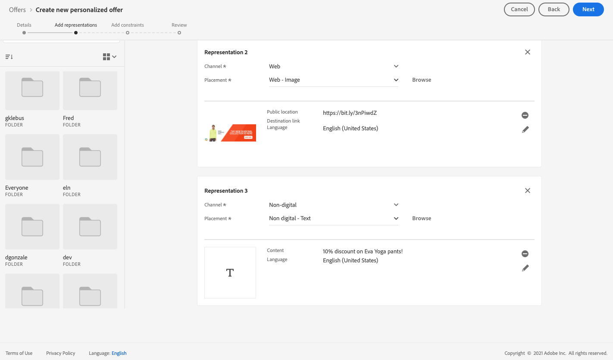

# Användningsexempel: Konfigurera personaliserade erbjudanden så att de kan användas i ett e-postmeddelande {#configure-add-personalized-offers-email}

I det här avsnittet presenteras ett exempel från början till slut som visar hur du konfigurerar erbjudanden och använder dem i ett e-postmeddelande baserat på ett beslut som du tidigare har skapat.

## Huvudsteg {#main-steps}

De viktigaste stegen för att konfigurera erbjudanden, inkludera dem i ett beslut och utnyttja detta beslut i ett e-postmeddelande är följande:

1. [Definiera dina komponenter](#define-components) innan du skapar erbjudanden

   * Skapa placeringar
   * Skapa beslutsregler
   * Skapa samlingskvalificerare (kallas tidigare taggar)
   * Skapa rankningar (valfritt)

1. [Konfigurera erbjudandena](#configure-offers)

   * Skapa erbjudanden
   * För varje erbjudande:

      * Skapa representationer och välj en placering och en resurs för varje representation
      * Lägg till en regel för varje erbjudande
      * Definiera en prioritet för varje erbjudande

1. [Skapa ett reserverbjudande](#create-fallback)

1. [Skapa en samling](#create-collection) som innehåller de anpassade erbjudanden du har skapat

1. [Konfigurera beslutet](#configure-decision)

   * Skapa ett beslut
   * Markera de placeringar du har skapat
   * För varje placering väljer du samlingen
   * Välj en rankning för varje placering (valfritt)
   * Markera reservdelen

1. [Infoga beslutet i ett e-postmeddelande](#insert-decision-in-email)

   * Välj en placering som matchar erbjudandena som du vill visa
   * Välj ett beslut bland de objekt som är kompatibla med den valda placeringen
   * Förgranska erbjudandena

Den övergripande beslutsprocess som ska användas för erbjudanden i ett e-postmeddelande beskrivs på följande sätt:

## Definiera komponenterna {#define-components}

Innan du börjar skapa erbjudanden måste du definiera flera komponenter som du ska använda i dina erbjudanden.

Du hittar dem under **[!UICONTROL Decision Management]** > **[!UICONTROL Components menu]**.

1. Börja med att skapa **placeringar** för dina erbjudanden.

   Du använder dessa ersättningar för att definiera var erbjudandet ska visas när du definierar ditt beslut om erbjudande.

   I det här exemplet skapar du tre placeringar med följande kanal- och innehållstyper:

   * *Webb - bild*
   * *E-post - bild*
   * *Icke-digital - text*

   

   De detaljerade stegen för att skapa placeringar beskrivs i [det här avsnittet](../../using/offers/offer-library/creating-placements.md).

1. Skapa **beslutsregler**.

   Beslutsreglerna ger det bästa erbjudandet till en profil i Adobe Experience Platform.

   Konfigurera två enkla regler med attributet **[!UICONTROL XDM Individual Profile > Person > Gender]**:

   * *Kunder som är kvinnor*
   * *Manliga kunder*

   

   De detaljerade stegen för att skapa regler beskrivs i [det här avsnittet](../../using/offers/offer-library/creating-decision-rules.md).

1. Du kan också skapa en **mängdkvalificerare**.

   Du kan sedan koppla erbjudandet till dina erbjudanden och använda den här samlingskvalificeraren för att gruppera dina erbjudanden i en samling.

   I det här exemplet skapar du samlingskvalificeraren *Yoga*.

   

   De detaljerade stegen för att skapa samlingskvalificerare beskrivs i [det här avsnittet](../../using/offers/offer-library/creating-tags.md).

1. Om du vill definiera regler som avgör vilket erbjudande som ska presenteras först för en viss placering (i stället för att ta hänsyn till offertens prioritetspoäng), kan du skapa en **rankningsformel**.

   De detaljerade stegen för att skapa rankningsformler beskrivs i [det här avsnittet](../../using/offers/ranking/create-ranking-formulas.md#create-ranking-formula).

   >[!NOTE]
   >
   >I det här exemplet använder vi bara prioritetspoängen. Läs mer om [regler och begränsningar för behörighet](../../using/offers/offer-library/add-constraints.md#eligibility).

## Konfigurera erbjudanden {#configure-offers}

Nu kan du skapa och konfigurera dina erbjudanden. I det här exemplet skapar du fyra erbjudanden som du vill visa enligt varje specifik profil.

1. Skapa ett erbjudande. Läs mer i [det här avsnittet](../../using/offers/offer-library/creating-personalized-offers.md#create-offer).

1. Skapa tre representationer i det här erbjudandet. Varje representation måste vara en kombination av en placering som du skapade tidigare och en resurs:

   * En som motsvarar placeringen *Webb - bild*
   * En som motsvarar placeringen *Email - Image*
   * En som motsvarar placeringen *Icke-digital - text*

   >[!NOTE]
   >
   >Ett erbjudande kan visas på olika platser i ett meddelande för att skapa fler möjligheter att använda erbjudandet i olika placeringssammanhang.

   Läs mer om representationer i [det här avsnittet](../../using/offers/offer-library/add-representations.md#representations).

1. Välj en lämplig bild för de två första placeringarna. Ange anpassad text för placeringen *Icke-digital - Text*.

   

1. I avsnittet **[!UICONTROL Offer eligibility]** markerar du **[!UICONTROL By defined decision rule]** och drar och släpper önskad regel.

   

1. Fyll i **[!UICONTROL Priority]**. Lägg till *25* i det här exemplet.

1. Granska ditt erbjudande och klicka sedan på **[!UICONTROL Save and approve]**.

   

1. I det här exemplet skapar du ytterligare tre erbjudanden med samma representationer, men med olika resurser. Tilldela dem olika regler och prioriteringar, till exempel:

   * Första erbjudandet - Beslutsregel: *Kunder som är kvinnor*, prioritet: *25*
   * Andra erbjudandet - Beslutsregel: *Kunder som är kvinnor*, prioritet: *15*
   * Tredje erbjudandet - Beslutsregel: *Handkunder*, prioritet: *25*
   * Fjärde erbjudandet - beslutsregel: *Handkunder*, prioritet: *15*

   

De detaljerade stegen för att skapa och konfigurera erbjudanden beskrivs i [det här avsnittet](../../using/offers/offer-library/creating-personalized-offers.md).

## Skapa ett reserverbjudande {#create-fallback}

1. Skapa ett reserverbjudande.

1. Definiera samma representationer som för erbjudandena, med lämpliga resurser (de bör skilja sig från de som används i dina erbjudanden).

   Varje representation måste vara en kombination av en placering som du skapade tidigare och en resurs:

   * En som motsvarar placeringen *Webb - bild*
   * En som motsvarar placeringen *Email - Image*
   * En som motsvarar placeringen *Icke-digital - text*

   

1. Granska ditt reserverbjudande och klicka sedan på **[!UICONTROL Save and approve]**.

Ditt reserverbjudande är nu klart att användas i ett beslut.

De detaljerade stegen för att skapa och konfigurera ett reserverbjudande beskrivs i [det här avsnittet](../../using/offers/offer-library/creating-fallback-offers.md).

## Skapa en samling {#create-collection}

När du konfigurerar beslutet måste du lägga till dina personliga erbjudanden som en del av en samling.

1. Om du vill snabba upp beslutsprocessen skapar du en dynamisk samling.

1. Använd samlingskvalificeraren *Yoga* för att välja de fyra personliga erbjudanden du skapade tidigare.

   

De detaljerade stegen för att skapa en samling beskrivs i [det här avsnittet](../../using/offers/offer-library/creating-collections.md).

## Konfigurera beslutet {#configure-decision}

Nu måste ni ta ett beslut som kombinerar praktik med personaliserade erbjudanden och det reserverbjudande ni just skapade.

Den här kombinationen används av beslutsmotorn för att hitta det bästa erbjudandet för en viss profil: i det här exemplet baseras det på den prioritet och beslutsregel som du tilldelade varje erbjudande.

Följ stegen nedan för att skapa och konfigurera ett erbjudande:

1. Ta ett beslut. Läs mer i [det här avsnittet](../../using/offers/offer-activities/create-offer-activities.md#create-activity).

1. Välj placeringen *Webb - bild*, *E-post - bild* och *Ej digital - text*.

   

1. Lägg till den samling du skapade för varje placering.

   

1. Om du definierade en rankning när du [byggde dina komponenter](#define-components) kan du tilldela den till en placering i beslutet. Om flera erbjudanden kan presenteras på den här platsen, kommer beslutet att använda den här formeln för att beräkna vilket erbjudande som ska levereras först.

   De detaljerade stegen för att tilldela en rankningsformel till en placering beskrivs i [det här avsnittet](../../using/offers/offer-activities/configure-offer-selection.md#assign-ranking-formula).

1. Välj det reserverbjudande som du skapade. Det visas som ett tillgängligt reserverbjudande för de tre valda placeringarna.

   

1. Granska ditt beslut och klicka sedan på **[!UICONTROL Save and approve]**.

   

Ditt beslut är nu klart att användas för att leverera optimerade och personaliserade erbjudanden.

De detaljerade stegen för att skapa och konfigurera ett beslut beskrivs i [det här avsnittet](../../using/offers/offer-activities/create-offer-activities.md).

## Infoga beslutet i ett e-postmeddelande {#insert-decision-in-email}

Nu när ditt beslut är klart kan du infoga det i ett e-postmeddelande. Om du vill göra det följer du de steg som beskrivs på [den här sidan](../../using/email/add-offers-email.md).

