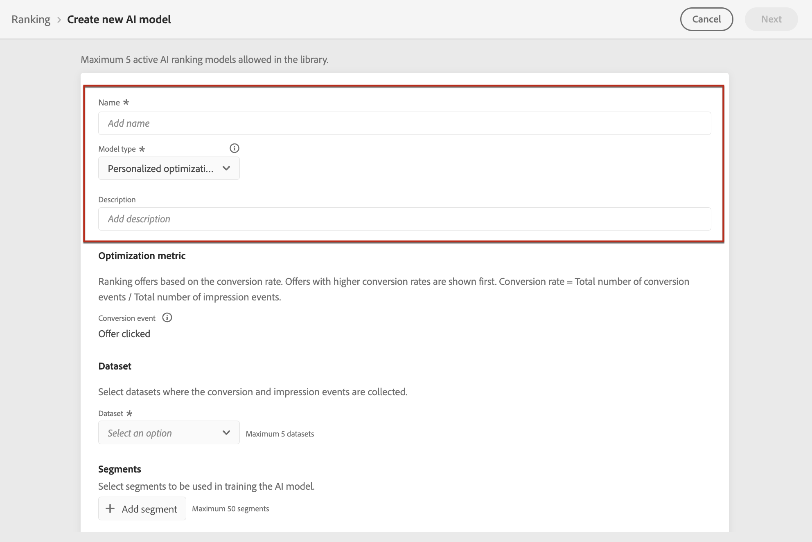

# Skapa AI-modeller {#ai-rankings}

Med [!DNL Journey Optimizer] kan du skapa **AI-modeller** för att rangordna erbjudanden baserat på dina affärsmål.

>[!CAUTION]
>
>Om du vill skapa, redigera eller ta bort AI-modeller måste du ha behörigheten **Hantera rankningsstrategier**. [Läs mer](../../administration/high-low-permissions.md#manage-ranking-strategies)

## Skapa en AI-modell {#create-ranking-strategy}

>[!CONTEXTUALHELP]
>id="ajo_decisioning_ai_model_metric"
>title="Optimeringsmått"
>abstract="[!DNL Journey Optimizer] rangordnade erbjudanden baserat på **konverteringsgrad** (konverteringsgrad = totalt antal konverteringshändelser/totalt antal inställningshändelser). Konverteringsgraden beräknas med två typer av mätvärden: **Impression-händelser** (erbjudanden som visas) och **Conversion-händelser** (erbjudanden som resulterar i klick via e-post eller webben). Dessa händelser spelas in automatiskt med Web SDK eller Mobile SDK som medföljer."

Så här skapar du en AI-modell:

1. Skapa en datauppsättning där konverteringshändelser samlas in. [Lär dig hur](../data-collection/create-dataset.md)

1. Gå till fliken **[!UICONTROL Components]** på menyn **[!UICONTROL Ranking]** och välj sedan **[!UICONTROL AI models]**.

   

   Alla AI-modeller som har skapats hittills visas.

1. Klicka på knappen **[!UICONTROL Create AI model]**.

1. Ange ett unikt namn och en beskrivning för AI-modellen och välj sedan den typ av AI-modell som du vill skapa:

   * **[!UICONTROL Auto-optimization]** optimerar erbjudanden baserat på tidigare erbjudanden. [Läs mer](auto-optimization-model.md)
   * **[!UICONTROL Personalized optimization]** optimerar och personaliserar erbjudanden baserat på målgrupper och erbjuder prestanda. [Läs mer](personalized-optimization-model.md)

   

   >[!NOTE]
   >
   >Avsnittet **[!UICONTROL Optimization metric]** innehåller information om konverteringshändelsen som används av AI-modellen för att beräkna offerternas rankning.
   >
   >[!DNL Journey Optimizer] rangordnade erbjudanden baserat på **konverteringsgrad** (konverteringsgrad = totalt antal konverteringshändelser/totalt antal inställningshändelser). Konverteringsgraden beräknas med hjälp av två typer av mätvärden:
   >* **Impression-händelser** (erbjudanden som visas)
   >* **Konverteringshändelser** (erbjudanden som resulterar i klickningar via e-post eller webben).
   >
   >Dessa händelser spelas in automatiskt med Web SDK eller Mobile SDK som medföljer. Läs mer om detta i [Adobe Experience Platform Web SDK - översikt](https://experienceleague.adobe.com/docs/experience-platform/edge/home.html?lang=sv-SE).

1. Välj den eller de datauppsättningar där konverterings- och inställningshändelser samlas in. Lär dig hur du skapar en sådan datauppsättning i [det här avsnittet](../data-collection/create-dataset.md). <!--This dataset needs to be associated with a schema that must have the **[!UICONTROL Proposition Interactions]** field group (previously known as mixin) associated with it.-->

   

   >[!CAUTION]
   >
   >Endast datauppsättningar som skapats från scheman som är kopplade till fältgruppen **[!UICONTROL Experience Event - Proposition Interactions]** (som tidigare kallades mixin) visas i listrutan.

1. Om du skapar en **[!UICONTROL Personalized optimization]** AI-modell väljer du de segment som ska användas för att utbilda AI-modellen.

   ➡️ [Upptäck den här funktionen i en video](#video)

   

   >[!NOTE]
   >
   >Du kan välja upp till fem målgrupper.

1. Spara och aktivera AI-modellen.

   

<!--At this point, you must have:

* created the AI model,
* defined which type of event you want to capture - offer displayed (impression) and/or offer clicked (conversion),
* and in which dataset you want to collect the event data.-->

Varje gång ett erbjudande visas och/eller klickas vill du att motsvarande händelse ska hämtas automatiskt av fältgruppen **[!UICONTROL Experience Event - Proposition Interactions]** med [Adobe Experience Platform Web SDK](https://experienceleague.adobe.com/docs/experience-platform/edge/web-sdk-faq.html?lang=sv-SE#what-is-adobe-experience-platform-web-sdk%3F){target="_blank"} eller Mobile SDK.

För att kunna skicka i händelsetyper (erbjudandet visas eller erbjudandet klickas) måste du ange rätt värde för varje händelsetyp i en upplevelsehändelse som skickas till Adobe Experience Platform. [Lär dig hur](../data-collection/schema-requirement.md)

## Instruktionsvideo {#video}

Lär dig hur du skapar en personaliserad optimeringsmodell och hur du tillämpar den på ett beslut.

>[!VIDEO](https://video.tv.adobe.com/v/3445955?captions=swe&quality=12)
