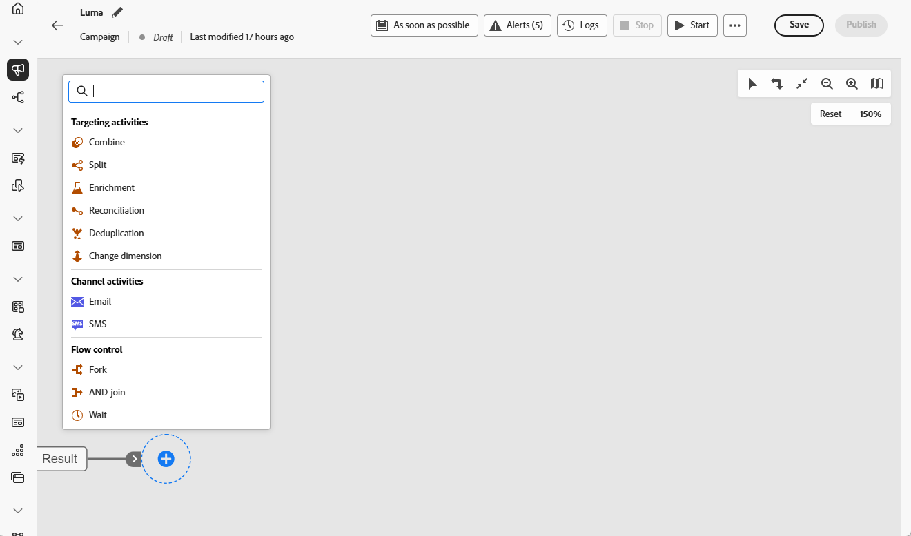

# Om samordnade kampanjaktiviteter {#orchestrated-campaign-activities}

Samordnade kampanjaktiviteter grupperas i tre kategorier. Beroende på sammanhanget kan tillgängliga aktiviteter variera.

Alla aktiviteter beskrivs i avsnitten nedan:

* [Aktiviteter för målgruppsanpassning](#targeting)
* [Kanalaktiviteter](#channel)
* [Flödeskontrollaktiviteter](#flow-control)

{width="80%" align="left"}

>[!NOTE]
>
>* Beroende på licensmodell, behörighet och implementering kan olika aktiviteter förekomma.
>
>* Antalet aktiviteter i en orkestrerad kampanj är begränsat till 500.

## Aktiviteter för målgruppsanpassning {#targeting}

Dessa aktiviteter är specifika för målgruppsanpassning. Med dem kan du skapa ett eller flera mål genom att definiera en målgrupp och dela eller kombinera dessa målgrupper med hjälp av skärnings-, union- eller uteslutningsåtgärder.

{width="40%" align="left"}

Tillgängliga målinriktningsaktiviteter är:

* [Skapa målgrupp](build-audience.md): Definiera målpopulationen. Du kan antingen välja en befintlig målgrupp eller använda regelbyggaren för att definiera en egen fråga.
* [Ändra dimension](change-dimension.md): Ändra måldimensionen när du skapar din orkestrerade kampanj.
* [Kombinera](combine.md): Utför segmentering på den inkommande populationen. Du kan använda en union, en skärning eller ett undantag.
* [Deduplicering](deduplication.md): Ta bort dubbletter i resultatet/resultaten av inkommande aktiviteter.
* [Berikning](enrichment.md): Definiera ytterligare data som ska bearbetas i din Orchestrated-kampanj. Med den här aktiviteten kan du utnyttja den inkommande övergången och konfigurera aktiviteten för att slutföra utdataövergången med ytterligare data.
* [Avstämning](reconciliation.md): Definiera länken mellan data i Journey Optimizer-data och data i en arbetstabell, till exempel data som lästs in från en extern fil.
* [Dela](split.md): Segmentera inkommande population i flera deluppsättningar.

## Kanalaktiviteter {#channel}

Med Adobe Journey Optimizer kan ni automatisera och genomföra marknadsföringskampanjer i flera kanaler. Du kan kombinera [kanalaktiviteter](channels.md) på arbetsytan för att skapa en flerkanalig orkestrerad kampanj som kan utlösa åtgärder baserat på kundbeteende.

Lär dig hur du [skapar en kanalåtgärd i en orkestrerad kampanj](channels.md).

## Flödeskontrollaktiviteter {#flow-control}

>[!CONTEXTUALHELP]
>id="ajo_orchestration_end"
>title="Avsluta aktivitet"
>abstract="Med aktiviteten **End** kan du grafiskt markera slutet på en orkestrerad kampanj. Denna aktivitet har ingen funktionell inverkan och är därför frivillig."

Följande aktiviteter är specifika för att organisera och köra Orchestrated-kampanjer. Deras huvuduppgift är att samordna de andra aktiviteterna.

{width="20%" align="left"}

Tillgängliga flödeskontrollaktiviteter är:

* [And-join](and-join.md): Synkronisera flera körningsgrenar för en orchestrerad-kampanj.
* [Förgrening](fork.md): Skapa utgående övergångar om du vill starta flera aktiviteter samtidigt.
* [Vänta](wait.md): Pausa körningen av en del av en Orchestrated-kampanj tillfälligt.
  <!--* [Test](test.md): Enable transitions based on specified conditions.-->

>[!NOTE]
>Aktiviteten **End** markerar slutet på en orchestrerad kampanj grafiskt. Denna aktivitet har ingen funktionell inverkan och är därför valfri
