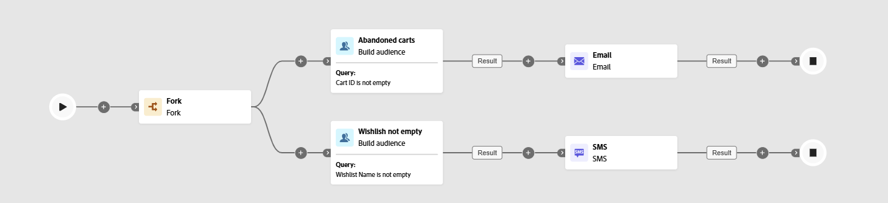

# Bygg målgrupper {#build-audience}

>[!CONTEXTUALHELP]
>id="ajo_orchestration_build_audience"
>title="Bygg målgruppsaktivitet"
>abstract="Med aktiviteten **Skapa målgrupp** kan du definiera målgruppen som ska gå in i den orkestrerade kampanjen. När du skickar meddelanden i samband med en orkestrerad kampanj definieras inte meddelandemålgruppen i kanalaktiviteten, utan i en **Build-målgruppsaktivitet**."

+++ Innehållsförteckning

| Välkommen till samordnade kampanjer | Starta din första samordnade kampanj | Fråga databasen | Ochestrerade kampanjaktiviteter |
|---|---|---|---|
| [Kom igång med samordnade kampanjer](../gs-orchestrated-campaigns.md)  [Konfigurationssteg](../configuration-steps.md)  [Få åtkomst till och hantera samordnade kampanjer](../access-manage-orchestrated-campaigns.md) | [Viktiga steg för att skapa samordnade kampanjer](../gs-campaign-creation.md)  [Skapa och schemalägg kampanjen](../create-orchestrated-campaign.md)  [Organisera aktiviteter](../orchestrate-activities.md)  [Starta och övervaka kampanjen](../start-monitor-campaigns.md)  [Rapportera](../reporting-campaigns.md) | [Arbeta med regelbyggaren](../orchestrated-rule-builder.md)  [Bygg din första fråga](../build-query.md)  [Redigera uttryck](../edit-expressions.md)  [Återmarknadsföring](../retarget.md) | [Kom igång med aktiviteter](about-activities.md)  Aktiviteter: [And-join](and-join.md) - <b>[Bygg målgrupp](build-audience.md)</b> - [Ändra dimension](change-dimension.md) - [Kanalaktiviteter](channels.md) - [Kombinera](combine.md) - [Deduplicering](deduplication.md) - [Enrichment](enrichment.md) - [Fork](fork.md)  - [Avstämning](reconciliation.md) - [Spara målgrupp](save-audience.md) - [Dela](split.md) - [Vänta](wait.md) |

{style="table-layout:fixed"}

+++

 

Som marknadsförare kan ni skapa komplexa målgruppssegment via ett intuitivt gränssnitt, som gör att ni kan inrikta er på användare baserat på en mängd olika kriterier och beteenden för att skräddarsy era kampanjer mer effektivt.

Använd målinriktningsaktiviteten **[!UICONTROL Build audience]** om du vill göra det. Den här aktiviteten definierar målgruppen som går in i den orkestrerade kampanjen. När du skickar meddelanden som en del av en orkestrerad kampanj definieras målgruppen i aktiviteten **[!UICONTROL Build audience]**, inte i den orkestrerade kampanjen.

## Konfigurera aktiviteten Skapa målgrupp {#build-audience-configuration}

>[!CONTEXTUALHELP]
>id="ajo_orchestration_build_audience_audienceselector"
>title="Målgrupp"
>abstract="Välj målgrupp på samma sätt som du använder en målgrupp när du designar en ny leverans."

Så här konfigurerar du aktiviteten **[!UICONTROL Build audience]**:

1. Lägg till en **[!UICONTROL Build audience]**-aktivitet.

   

1. Definiera en **[!UICONTROL Label]**.

1. Konfigurera målgruppen genom att följa stegen som beskrivs på flikarna nedan.

1. Välj **[!UICONTROL Targeting dimension]**. Med målinriktningsdimensionen kan du definiera målgruppen för operationen: mottagare, mottagare, operatör, prenumeranter osv. Som standard är målet markerat bland mottagarna.

1. Klicka på **[!UICONTROL Continue]**.

1. Använd frågemodelleraren för att definiera frågan. [Läs mer om frågemodelleraren i det här avsnittet](../orchestrated-rule-builder.md)

1. Ange om en utgående övergång ska genereras när målgruppen är tom.

## Exempel{#build-audience-examples}

Här är ett exempel på en orkestrerad kampanj med två **[!UICONTROL Build audience]**-aktiviteter. Den första målprofilen som innehåller artiklar i kundvagnen, följt av en e-postleverans. Den andra inriktar sig på profiler med en önskelista, följt av en SMS-leverans.

