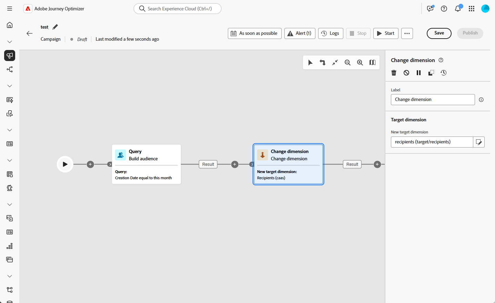

# Ändra dimension {#change-dimension}

>[!CONTEXTUALHELP]
>id="ajo_orchestration_dimension_complement"
>title="Generera ett komplement"
>abstract="Du kan generera ytterligare en utgående övergång med den återstående populationen, som har uteslutits som en dubblett. Aktivera alternativet **Generera komplement** om du vill göra det."

>[!CONTEXTUALHELP]
>id="ajo_orchestration_change_dimension"
>title="Ändra dimensionsaktivitet"
>abstract="Med den här aktiviteten kan ni ändra målgruppsdimensionen när ni skapar en målgrupp. Axeln flyttas beroende på datamallen och indatamängden. Du kan till exempel växla från dimensionen &quot;kontrakt&quot; till dimensionen &quot;kunder&quot;."

+++ Innehållsförteckning

| Välkommen till samordnade kampanjer | Starta din första samordnade kampanj | Fråga databasen | Ochestrerade kampanjaktiviteter |
|---|---|---|---|
| [Kom igång med samordnade kampanjer](../gs-orchestrated-campaigns.md)  Skapa och hantera relationsscheman och datauppsättningar:  <ul><li>[Manuellt schema](../manual-schema.md)</li><li>[Filöverföringsschema](../file-upload-schema.md)</li><li>[Ingest data](../ingest-data.md)</li></ul>[Få åtkomst till och hantera samordnade kampanjer](../access-manage-orchestrated-campaigns.md) | [Viktiga steg för att skapa en orkestrerad kampanj](../gs-campaign-creation.md)  [Skapa och schemalägg kampanjen](../create-orchestrated-campaign.md)  [Orchestrate-aktiviteter](../orchestrate-activities.md)  [Starta och övervaka kampanjen](../start-monitor-campaigns.md)  [Rapportera](../reporting-campaigns.md) | [Arbeta med regelbyggaren](../orchestrated-rule-builder.md)  [Bygg din första fråga](../build-query.md)  [Redigera uttryck](../edit-expressions.md)  [Återmarknadsföring](../retarget.md) | [Kom igång med aktiviteter](about-activities.md)  Aktiviteter: [And-join](and-join.md) - [Bygg målgrupp](build-audience.md) - <b>[Ändra dimension](change-dimension.md)</b> - [Kanalaktiviteter](channels.md) - [Kombinera](combine.md) - [Deduplicering](deduplication.md) - [Enrichment](enrichment.md) - [Fork](fork.md)  - [Avstämning](reconciliation.md) - [Spara målgrupp](save-audience.md) - [Dela](split.md) - [Vänta](wait.md) |

{style="table-layout:fixed"}

+++

 

>[!BEGINSHADEBOX]

Innehållet på den här sidan är inte slutgiltigt och kan komma att ändras.

>[!ENDSHADEBOX]

Som marknadsförare kan ni förbättra målgruppsanpassningen genom att gå över från en datatabell till en relaterad enhet i en strukturerad kampanj. På så sätt kan du gå steget längre än användarprofiler och fokusera på specifika beteenden som inköp, bokningar eller andra interaktioner.

Använd aktiviteten **[!UICONTROL Change dimension]** för att uppnå detta. Ni kan anpassa målinriktningsdimensionen under den samordnade kampanjen.

<!--
>[!IMPORTANT]
>
>Please note that the **[!UICONTROL Change Dimension]** and **[!UICONTROL Change Data source]** activities should not be added in one row. If you need to use both activities consecutively, make sure you include an **[!UICONTROL Enrichement]** activity in between them. This ensures proper execution and prevents potential conflicts or errors.-->

## Konfigurera aktiviteten Ändra dimension {#configure}

Så här konfigurerar du aktiviteten **[!UICONTROL Change dimension]**:

1. Lägg till en **[!UICONTROL Change dimension]**-aktivitet i din samordnade kampanj.

   

1. Definiera **[!UICONTROL New target dimension]**. Vid dimensionsändring sparas alla poster.

## Exempel {#example}

Det här användningsexemplet fokuserar på att skicka ett SMS till profiler som har skapat en önskelista under den senaste månaden.

Börja med en **[!UICONTROL Build audience]**-aktivitet och använd målinriktningsdimensionen **[!UICONTROL Wishlist]** för att identifiera alla relevanta önskelistor.

Lägg sedan till en **[!UICONTROL Change dimension]**-aktivitet för att växla måldimensionen från **[!UICONTROL Wishlist]** till **[!UICONTROL Recipient].** Det här steget ser till att den orkestrerade kampanjen har rätt profiler länkade till dessa önskelistor, vilket gör att SMS:et kan skickas till de avsedda profilerna.

