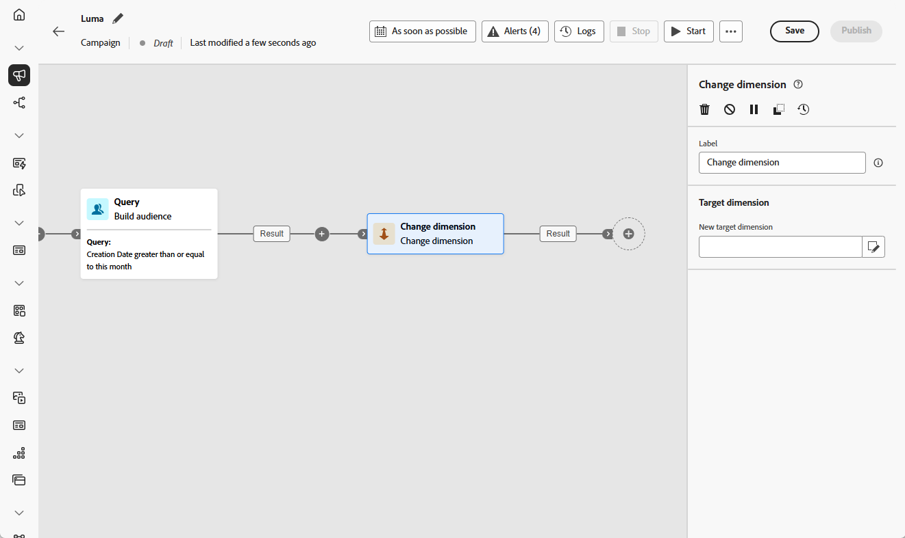

# Ändra dimension {#change-dimension}

>[!CONTEXTUALHELP]
>id="ajo_orchestration_dimension_complement"
>title="Generera ett komplement"
>abstract="Du kan generera ytterligare en utgående övergång med den återstående populationen, som har uteslutits som en dubblett. Aktivera alternativet **Generera komplement** om du vill göra det."

>[!CONTEXTUALHELP]
>id="ajo_orchestration_change_dimension"
>title="Ändra dimensionsaktivitet"
>abstract="Med den här aktiviteten kan ni ändra målgruppsdimensionen när ni skapar en målgrupp. Axeln flyttas beroende på datamallen och indatamängden. Du kan till exempel växla från dimensionen &quot;kontrakt&quot; till dimensionen &quot;kunder&quot;."

+++ Innehållsförteckning

| Välkommen till samordnade kampanjer | Starta din första samordnade kampanj | Fråga databasen | Ochestrerade kampanjaktiviteter |
|---|---|---|---|
| [Kom igång med samordnade kampanjer](../gs-orchestrated-campaigns.md)  [Konfigurationssteg](../configuration-steps.md)  [Viktiga steg för att skapa samordnade kampanjer](../gs-campaign-creation.md) | [Skapa en orkestrerad kampanj](../create-orchestrated-campaign.md)  [Organisera aktiviteter](../orchestrate-activities.md)   [Starta och övervaka kampanjen](../start-monitor-campaigns.md)  [Rapportera](../reporting-campaigns.md) | [Arbeta med Query Modeler](../orchestrated-rule-builder.md)  [Skapa din första fråga](../build-query.md)  [Redigera uttryck](../edit-expressions.md) | [Kom igång med aktiviteter](about-activities.md)  Aktiviteter: [And-join](and-join.md) - [Bygg målgrupp](build-audience.md) - **[Ändra dimension](change-dimension.md)** - [Kanalaktiviteter](channels.md) - [Kombinera](combine.md) - [Deduplicering](deduplication.md) - [Enrichment](enrichment.md) - [Fork](fork.md)  - [Avstämning](reconciliation.md) - [Dela](split.md) - [Vänta](wait.md) |

{style="table-layout:fixed"}

+++

 

Som marknadsförare kan ni förfina målgruppsanpassningen genom att byta från en datatabell till en annan länkad enhet inom en orkestrerad kampanj. På så sätt kan ni gå över från målgruppsprofiler till fokusering på specifika åtgärder, som inköp, bokningar eller andra interaktioner.

Använd aktiviteten **[!UICONTROL Change dimension]** om du vill göra det. Det gör att ni kan ändra målinriktningsdimensionen under den samordnade kampanjen, baserat på datamodellens struktur och indatadimensionen.

<!--
>[!IMPORTANT]
>
>Please note that the **[!UICONTROL Change Dimension]** and **[!UICONTROL Change Data source]** activities should not be added in one row. If you need to use both activities consecutively, make sure you include an **[!UICONTROL Enrichement]** activity in between them. This ensures proper execution and prevents potential conflicts or errors.-->

## Konfigurera aktiviteten Ändra dimension {#configure}

Så här konfigurerar du aktiviteten **[!UICONTROL Change dimension]**:

1. Lägg till en **[!UICONTROL Change dimension]**-aktivitet i din samordnade kampanj.

   

1. Definiera **[!UICONTROL New target dimension]**. Vid dimensionsändring sparas alla poster.

1. Kör den orkestrerade kampanjen för att visa resultatet. Jämför data i tabellerna före och efter ändringsdimensionsaktiviteten och jämför strukturen i de samordnade kampanjtabellerna.

## Exempel {#example}

Det här användningsexemplet innebär att ett SMS skickas till profiler som har skapat en önskelista den senaste månaden.

Börja med en **[!UICONTROL Build audience]**-aktivitet som använder målinriktningsdimensionen **[!UICONTROL Wishlist]** för att välja alla relevanta önskelistor.

Infoga sedan en **[!UICONTROL Change dimension]**-aktivitet för att växla måldimensionen från **[!UICONTROL Wishlist]** till **[!UICONTROL Recipient]**. Detta gör att den samordnade kampanjen kan skicka SMS:et till de profiler som är associerade med dessa önskelistor.

