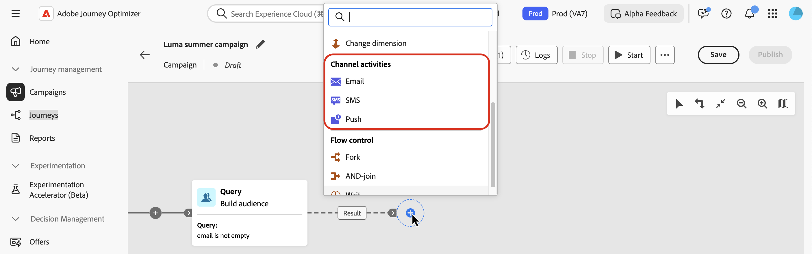
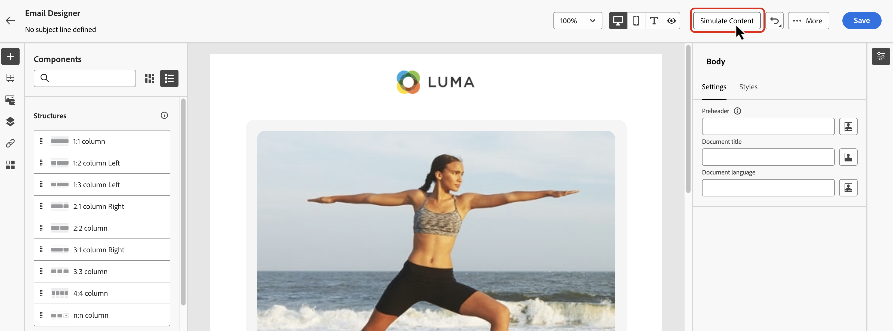

# Kanalaktiviteter {#channel}

>[!CONTEXTUALHELP]
>id="ajo_orchestration_email"
>title="E-postaktivitet"
>abstract="Med e-postaktiviteten kan du skicka e-postmeddelanden i din samordnade kampanj, både för enstaka och återkommande meddelanden. Den automatiserar processen för att skicka e-post till ett mål som beräknas inom samma samordnade kampanj. Ni kan kombinera kanalaktiviteter till en kampanjarbetsyta i flera steg för att skapa flerkanalskampanjer som kan utlösa åtgärder baserat på kundbeteende och data."

>[!CONTEXTUALHELP]
>id="ajo_orchestration_sms"
>title="SMS-aktivitet"
>abstract="Med SMS-aktiviteten kan du skicka SMS i din samordnade kampanj för både engångs- och återkommande meddelanden. Den automatiserar processen för att skicka SMS till ett mål som beräknas inom samma samordnade kampanj. Ni kan kombinera kanalaktiviteter i en flerstegskampanj för att skapa flerkanalskampanjer som kan utlösa åtgärder baserat på kundbeteende och data."

>[!CONTEXTUALHELP]
>id="ajo_orchestration_push"
>title="Push-aktivitet"
>abstract="Med aktiviteten Push kan du skicka push-meddelanden som en del av din orkestrerade kampanj. Det gör det möjligt att leverera både engångskampanjer och återkommande samordnade kampanjer, vilket automatiserar sändningen av push-meddelanden till ett fördefinierat mål inom samma samordnade kampanj. Ni kan kombinera kanalaktiviteter i kampanjarbetsytan för att skapa flerkanalskampanjer som kan utlösa åtgärder baserat på kundbeteende och data."

<!--
UNUSED IDs in BJ

>[!CONTEXTUALHELP]
>id="ajo_orchestration_push_ios"
>title="Push iOS activity"
>abstract="The Push iOS activity lets you send iOS Push notifications as part of your Orchestrated campaign. It enables the delivery of both one-time and recurring Orchestrated campaigns, automating the sending of iOS Push notifications to a predefined target within the same workflow. You can combine channel activities into the campaign canvas to create cross-channel campaigns that can trigger actions based on customer behavior and data."

>[!CONTEXTUALHELP]
>id="ajo_orchestration_push_android"
>title="Push Android activity"
>abstract="The Push Android activity lets you send Android Push notifications as part of your Orchestrated campaign. It enables the delivery of both one-time and recurring messages, automating the sending of Android Push notifications to a predefined target within the same Orchestrated campaign. You can combine channel activities into the Orchestrated campaign canvas to create cross-channel campaigns that can trigger actions based on customer behavior and data."

-->

>[!CONTEXTUALHELP]
>id="ajo_orchestration_directmail"
>title="Aktivitet för direktreklam"
>abstract="Aktiviteten Direktutskick underlättar direktutskick inom din samordnade kampanj, både för enstaka och återkommande meddelanden. Den automatiserar processen för att generera extraheringsfilen som krävs av direktreklamleverantörer. Ni kan kombinera kanalaktiviteter i den orkestrerade kampanjarbetsytan för att skapa flerkanalskampanjer som kan utlösa åtgärder baserat på kundbeteende och data."

Med [!DNL Adobe Journey Optimizer] kan du automatisera och köra marknadsföringskampanjer över flera kanaler - e-post, SMS och push-meddelanden. Ni kan kombinera de här kanalaktiviteterna i kampanjarbetsytan för att skapa flerkanaliga samordnade kampanjer. Dessa kampanjer kan utlösa åtgärder baserat på kundbeteende och data.

Exempel:

* Skicka en välkomstserie via e-post, SMS och push.
* Skicka ett uppföljningsmejl efter köpet.
* Skicka personliga födelsedagshälsningar via SMS.

Genom att använda kanalaktiviteter kan ni skapa omfattande och personaliserade kampanjer som engagerar kunder över flera kontaktytor och driver konverteringar.

>[!CAUTION]
>
>Endast SMS-, push- och e-postkanaler stöds i samordnade kampanjer.

## Lägga till en kanalaktivitet och definiera dess egenskaper {#add}

>[!PREREQUISITES]
>
>Innan du lägger till en kanalaktivitet definierar du målgruppen med en [Skapa målgrupp](build-audience.md) eller en [Läs målgrupp](read-audience.md) -aktivitet.

1. Lägg till en kanalaktivitet på arbetsytan. De tillgängliga kanalaktiviteterna är **[!UICONTROL Email]**, **[!UICONTROL SMS]** och **[!UICONTROL Push]**.

   

1. Markera aktiviteten och klicka på **[!UICONTROL Edit email]**, **[!UICONTROL Edit SMS]** eller **[!UICONTROL Edit Push]** beroende på vald kanal.

   

1. På fliken **[!UICONTROL Properties]** anger du en beskrivning och växlar sedan till fliken **[!UICONTROL Actions]** för att konfigurera aktiviteten.

## Ställ in kanalkonfiguration och inställningar {#configuration}

Använd fliken **[!UICONTROL Actions]** för att välja en kanalkonfiguration för meddelandet och konfigurera ytterligare inställningar som spårning, innehållsexperiment eller flerspråkigt innehåll.

1. **Välj en kanalkonfiguration**

   En konfiguration definieras av en [systemadministratör](../../start/path/administrator.md). Den innehåller alla tekniska parametrar för att skicka meddelandet, som rubrikparametrar, underdomän, mobilappar osv. [Lär dig hur du konfigurerar kanalkonfigurationer](../../configuration/channel-surfaces.md)

   

1. **Använd regler för begränsning**

   I listrutan **[!UICONTROL Rule set]** väljer du en kanalregeluppsättning för att tillämpa appningsregler på kampanjen. Genom att utnyttja kanalregeluppsättningar kan ni ange frekvensbegränsning efter kommunikationstyp för att förhindra att kunder med liknande meddelanden överbelastas. [Lär dig arbeta med regeluppsättningar](../../conflict-prioritization/rule-sets.md)

1. **Spåra engagemang** (e-post och SMS)

   Använd avsnittet **[!UICONTROL Action tracking]** för att spåra hur dina mottagare svarar på dina e-post- eller SMS-leveranser. Spåra resultat kan nås från kampanjrapporten när kampanjen har genomförts. [Läs mer om kampanjrapporter](../../reports/campaign-global-report-cja.md)

1. **Aktivera läget Snabb leverans** (push)

   Snabb leverans är ett [!DNL Journey Optimizer]-tillägg som tillåter mycket snabba push-meddelanden som skickas i stora volymer via kampanjer. Snabb leverans används när fördröjd leverans av meddelanden är affärskritisk. Du vill till exempel skicka en snabb push-varning för mobiltelefoner, som att få nyheter till användare som har installerat din nyhetskanalapp. Lär dig hur du aktiverar läget Snabb leverans för push-meddelanden [på den här sidan](../../push/create-push.md#rapid-delivery).

   Mer information om prestanda när du använder läget Snabb leverans finns i [Adobe Journey Optimizer produktbeskrivning](https://helpx.adobe.com/se/legal/product-descriptions/adobe-journey-optimizer.html){target="_blank"}.

1. **Skapa ett innehållsexperiment**

   Använd avsnittet **[!UICONTROL Content experiment]** för att definiera flera leveransbehandlingar för att mäta vilken som fungerar bäst för målgruppen. Klicka på knappen **[!UICONTROL Create experiment]** och följ sedan stegen som beskrivs i det här avsnittet: [Skapa ett innehållsexperiment](../../content-management/content-experiment.md).

1. **Lägg till flerspråkigt innehåll**

   Använd avsnittet **[!UICONTROL Languages]** för att skapa innehåll på flera språk i kampanjen. Om du vill göra det klickar du på knappen **[!UICONTROL Add languages]** och väljer önskad **[!UICONTROL Language settings]**. Detaljerad information om hur du konfigurerar och använder flerspråkiga funktioner finns i det här avsnittet: [Kom igång med flerspråkigt innehåll](../../content-management/multilingual-gs.md).

   

När kanalaktiviteten har konfigurerats väljer du fliken **[!UICONTROL Content]** för att definiera dess innehåll.

## Definiera innehållet {#content}

Växla till fliken **[!UICONTROL Content]** för att skapa meddelandet. Processstegen varierar beroende på den valda kanalen. Lär dig detaljerade steg för att skapa meddelandeinnehåll på följande sidor.

<table style="table-layout:fixed"><tr style="border: 0; text-align: center;" >
<td> <a href="../../email/create-email.md"><strong>Skapa ett e-postmeddelande</strong></a></td>
<td> <a href="../../sms/create-sms.md"><strong>Skapa ett SMS</strong></a></td>
<td><a href="../../push/create-push.md"><strong>Skapa ett push-meddelande</strong></a></td>
</tr></table>

## Lägg till personalisering

Personalization i samordnade kampanjer fungerar på liknande sätt som andra **[!UICONTROL Journey Optimizer]**-kampanjer eller resor. Det finns emellertid några viktiga skillnader som är specifika för den orkestrerade arbetsytan.

När du öppnar personaliseringsredigeraren från en Orchestrated-kampanj innehåller två huvudmappar tillgängliga attribut för personalisering som anges nedan.

* **[!UICONTROL Profile attributes]**

  Den här mappen innehåller alla profilrelaterade data från [!DNL Adobe Experience Platform]. Det här är standardattribut som namn, e-postadress, plats eller andra egenskaper som har hämtats i användarprofilen.

* **[!UICONTROL Target attributes]** (specifikt för Orchestrated-kampanjer)

  Den här mappen är unik för Orchestrated-kampanjer. Den innehåller attribut som beräknas direkt i kampanjarbetsytan. Den innehåller två undermappar:

   * **`<Targeting dimension>`** (t.ex. &quot;Mottagare&quot;, &quot;Inköp&quot;): Innehåller alla attribut som är relaterade till den dimension som kampanjen riktar sig till.

   * **`Enrichment`**: Inkluderar data som lagts till via **[!UICONTROL Enrichment]** aktiviteter på arbetsytan. På så sätt kan ni personalisera meddelanden baserat på externa datauppsättningar eller ytterligare logik som integrerats under orkestreringen. [Lär dig använda en anrikningsaktivitet](../activities/enrichment.md)

En detaljerad översikt över hur du använder personaliseringsredigeraren finns i [Kom igång med personalisering](../../personalization/personalize.md).

## Kontrollera och testa innehållet

När innehållet har skapats kan du använda knappen **[!UICONTROL Simulate Content]** för att förhandsgranska och testa innehållet med testprofiler eller exempelindata som har överförts från en CSV-/JSON-fil, eller lägga till manuellt. [Läs mer](../../content-management/preview-test.md)

## Nästa steg {#next}

När meddelandeinnehållet är klart går du tillbaka till din Orchestrated-kampanj med pilen **[!UICONTROL Back]**. Du kan sedan slutföra aktivitetssamordningen på arbetsytan och publicera kampanjen för att börja skicka meddelanden. [Lär dig hur du startar och övervakar orkestrerade kampanjer](../start-monitor-campaigns.md)

<!--
## Examples {#cross-channel-workflow-sample}

Here is a cross-channel Orchestrated campaign example with a segmentation and two deliveries. The Orchestrated campaign targets all customers who live in Paris and who are interested in coffee machines. Among this population, an email is sent to the regular customers and an SMS is sent to the VIP clients.

<!--
description, which use case you can perform (common other activities that you can link before of after the activity)

how to add and configure the activity

example of a configured activity within a workflow
The Email delivery activity allows you to configure the sending an email in a workflow. 

-->

<!--You can also create a recurring Orchestrated campaign to send a personalized SMS every first day of the month at 8 PM to all customers living in Paris.

-->

<!-- Scheduled emails available?

This can be a single send email and sent just once, or it can be a recurring email.
* Single send emails are standard emails, sent once.
* Recurring emails allow you to send the same email multiple times to different targets over a defined period. You can aggregate the deliveries per period in order to get reports that correspond to your needs.

When linked to a scheduler, you can define recurring emails.
Email recipients are defined upstream of the activity in the same workflow, via an Audience targeting activity.

-->

<!--The message preparation is triggered according to the workflow execution parameters. From the message dashboard, you can select whether to request or not a manual confirmation to send the message (required by default). You can start the workflow manually or place a scheduler activity in the workflow to automate execution.-->

