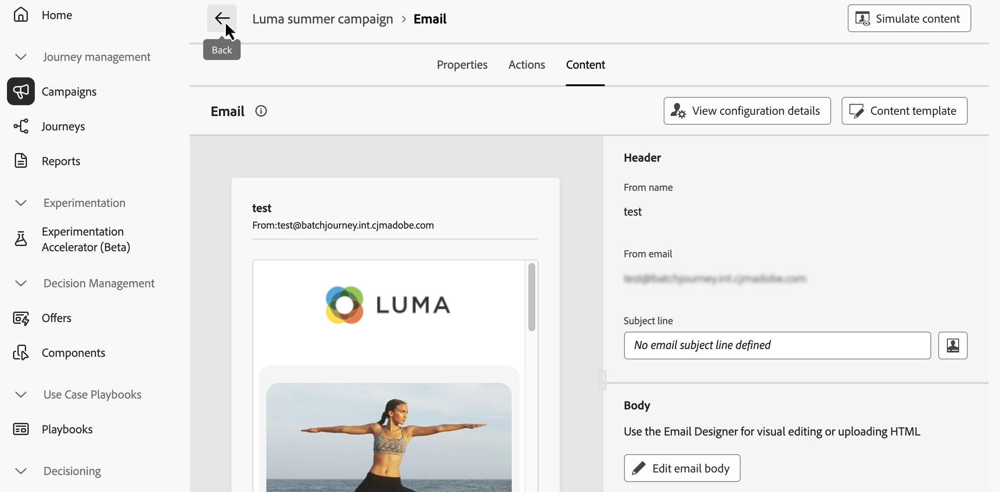

# Kanalaktiviteter {#channel}

+++ Innehållsförteckning

| Välkommen till samordnade kampanjer | Starta din första samordnade kampanj | Fråga databasen | Ochestrerade kampanjaktiviteter |
|---|---|---|---|
| [Kom igång med samordnade kampanjer](../gs-orchestrated-campaigns.md)  [Konfigurationssteg](../configuration-steps.md)  [Viktiga steg för att skapa samordnade kampanjer](../gs-campaign-creation.md) | [Skapa en orkestrerad kampanj](../create-orchestrated-campaign.md)  [Organisera aktiviteter](../orchestrate-activities.md)   [Starta och övervaka kampanjen](../start-monitor-campaigns.md)  [Rapportera](../reporting-campaigns.md) | [Arbeta med Query Modeler](../orchestrated-rule-builder.md)  [Skapa din första fråga](../build-query.md)  [Redigera uttryck](../edit-expressions.md) | [Kom igång med aktiviteter](about-activities.md)  Aktiviteter: [And-join](and-join.md) - [Bygg målgrupp](build-audience.md) - [Ändra dimension](change-dimension.md) - **[Kanalaktiviteter](channels.md)** - [Kombinera](combine.md) - [Deduplicering](deduplication.md) - [Enrichment](enrichment.md) - [Fork](fork.md)  - [Avstämning](reconciliation.md) - [Dela](split.md) - [Vänta](wait.md) |

{style="table-layout:fixed"}

+++

 

Med [!DNL Adobe Journey Optimizer] kan ni automatisera och köra marknadsföringskampanjer i alla kanaler. Ni kan kombinera kanalaktiviteter i den orkestrerade kampanjarbetsytan för att skapa flerkanaliga samordnade kampanjer som kan utlösa åtgärder baserat på kundbeteende och data.

Du kan till exempel skapa en välkomstkampanj för e-post som innehåller en serie meddelanden i olika kanaler, som e-post, SMS och push. Du kan också skicka ett uppföljningsmeddelande via e-post när en kund har slutfört ett köp eller skicka ett personligt födelsedagmeddelande till en kund via SMS.

Genom att använda kanalaktiviteter kan ni skapa omfattande och personaliserade kampanjer som engagerar kunder över flera kontaktytor och driver konverteringar. Kanaler som stöds är e-post, SMS och push.

## Förhandskrav {#channel-activity-prereq}

Börja bygga upp er samordnade kampanj med relevanta aktiviteter:

* Innan du infogar en kanalaktivitet måste du definiera målgruppen. Målgruppen är huvudmålet för leveransen: de profiler som tar emot meddelandena. [Lär dig använda aktiviteten Skapa målgrupp](build-audience.md)

* Om du vill skicka en återkommande leverans startar du din samordnade kampanj med en **[!UICONTROL Scheduler]**-aktivitet. Du kan också använda en **[!UICONTROL Scheduler]**-aktivitet för engångsleveranser för att ange kontaktdatum för den leveransen. Kontaktdatumet kan även anges i leveransinställningarna. [Lär dig schemalägga en orkestrerad videokamera](../create-orchestrated-campaign.md#schedule)

## Konfigurera en kanalaktivitet {#create-a-delivery-in-a-workflow}

>[!CONTEXTUALHELP]
>id="ajo_orchestration_email"
>title="E-postaktivitet"
>abstract="Med e-postaktiviteten kan du skicka e-postmeddelanden inom din samordnade kampanj, både för engångs- och återkommande meddelanden. Den automatiserar processen för att skicka e-post till ett mål som beräknas inom samma samordnade kampanj. Ni kan kombinera kanalaktiviteter till en kampanjarbetsyta i flera steg för att skapa flerkanalskampanjer som kan utlösa åtgärder baserat på kundbeteende och data."

>[!CONTEXTUALHELP]
>id="ajo_orchestration_sms"
>title="SMS-aktivitet"
>abstract="Med SMS-aktiviteten kan du skicka SMS i din samordnade kampanj, både för enstaka och återkommande meddelanden. Den automatiserar processen för att skicka SMS till ett mål som beräknas inom samma samordnade kampanj. Ni kan kombinera kanalaktiviteter i en flerstegskampanj för att skapa flerkanalskampanjer som kan utlösa åtgärder baserat på kundbeteende och data."

>[!CONTEXTUALHELP]
>id="ajo_orchestration_push"
>title="Push-aktivitet"
>abstract="Med aktiviteten Push kan du skicka push-meddelanden som en del av din samordnade kampanj. Det gör det möjligt att leverera både engångskampanjer och återkommande samordnade kampanjer, och automatisera sändning av push-meddelanden till ett fördefinierat mål inom samma samordnade kampanj. Ni kan kombinera kanalaktiviteter i kampanjarbetsytan för att skapa flerkanalskampanjer som kan utlösa åtgärder baserat på kundbeteende och data."

<!--
UNUSED IDs in BJ

>[!CONTEXTUALHELP]
>id="ajo_orchestration_push_ios"
>title="Push iOS activity"
>abstract="The Push iOS activity let you send iOS Push notifications as part of your orchestrated campaign. It enables the delivery of both one-time and recurring orchestrated campaigns, automating the sending iOS Push notifications to a predefined target within the same workflow. You can combine channel activities into the campaign canvas to create cross-channel campaigns that can trigger actions based on customer behavior and data."

>[!CONTEXTUALHELP]
>id="ajo_orchestration_push_android"
>title="Push Android activity"
>abstract="The Push Android activity ket you send Android Push notifications as part of your orchestrated campaign. It enables the delivery of both one-time and recurring messages, automating the sending Android Push notifications to a predefined target within the same orchestrated campaign. You can combine channel activities into the orchestrated campaign canvas to create cross-channel campaigns that can trigger actions based on customer behavior and data."

-->

>[!CONTEXTUALHELP]
>id="ajo_orchestration_directmail"
>title="Aktivitet för direktreklam"
>abstract="Med aktiviteten Direktutskick blir det lättare att skicka direktreklam inom ramen för den orkestrerade kampanjen, både för enstaka och återkommande meddelanden. Den automatiserar processen för att generera extraheringsfilen som krävs av direktreklamleverantörer. Ni kan kombinera kanalaktiviteter i den samordnade kampanjarbetsytan för att skapa flerkanalskampanjer som kan utlösa åtgärder baserat på kundbeteende och data."

Följ stegen nedan för att konfigurera en leverans i samband med en orkestrerad kampanj.

### Lägga till en kanalaktivitet och definiera dess egenskaper {#add}

1. Lägg till en kanalaktivitet på arbetsytan. De tillgängliga kanalaktiviteterna är **[!UICONTROL Email]**, **[!UICONTROL SMS]** och **[!UICONTROL Push]**.

   

1. Markera den tillagda aktiviteten och klicka på knappen **[!UICONTROL Edit Email]**, **[!UICONTROL Edit SMS]** eller **[!UICONTROL Edit Push]** beroende på den valda kanalen.

   

1. Ange en beskrivning för kampanjen på fliken **[!UICONTROL Properties]**.

### Ställ in kanalkonfiguration och inställningar {#configuration}

1. Välj fliken **[!UICONTROL Actions]** och välj den kanalkonfiguration som ska användas för meddelandet.

   En konfiguration definieras av en [systemadministratör](../../start/path/administrator.md). Den innehåller alla tekniska parametrar för att skicka meddelandet, som rubrikparametrar, underdomän, mobilappar osv. [Lär dig hur du konfigurerar kanalkonfigurationer](../../configuration/channel-surfaces.md).

1. För e-post och SMS använder du spårningsalternativen för att övervaka hur mottagarna reagerar på e-post eller SMS-leveranser.

   Spåra resultat kan nås från kampanjrapporten när kampanjen har genomförts. [Läs mer om kampanjrapporter](../reports/campaign-global-report-cja.md)

1. För push-meddelanden använder du alternativet **[!UICONTROL Rapid delivery mode]** för att utföra snabbmeddelanden som skickas på Push-kanalen till en målgrupp som är mindre än 30 MB.

   Snabb leverans är ett **[!DNL Journey Optimizer]**-tillägg som tillåter mycket snabba push-meddelanden som skickas i stora volymer. [Läs mer](../push/create-push.md#rapid-delivery)

1. I avsnittet **[!UICONTROL Content experiment]** kan du definiera flera leveransbehandlingar för att mäta vilken som fungerar bäst för målgruppen.

   Om du vill göra det klickar du på knappen **[!UICONTROL Create experiment]** och följer sedan de steg som beskrivs i det här avsnittet: [Skapa en funktion för innehållsexperimenterande](../../content-management/content-experiment.md).

1. I avsnittet **[!UICONTROL Languages]** kan du skapa innehåll på flera språk i kampanjen.

   Om du vill göra det klickar du på knappen **[!UICONTROL Add languages]** och väljer önskad **[!UICONTROL Language settings]**. Detaljerad information om hur du konfigurerar och använder flerspråkiga funktioner finns i det här avsnittet: [Kom igång med flerspråkigt innehåll](../../content-management/multilingual-gs.md)

### Definiera innehållet {#content}

Välj fliken **[!UICONTROL Content]** för att definiera innehållet i meddelandet. Hur innehållet skapas beror på den valda kanalen.

Lär dig detaljerade steg för att skapa meddelandeinnehåll på följande sidor:

<table style="table-layout:fixed"><tr style="border: 0;">
<td>

<a href="../../email/create-email.md"><strong>E-post</strong></a>
</td>
<td>

<a href="../../sms/create-sms.md"><strong>SMS</strong></a>
</td>
<td>

<a href="../../push/create-push.md"><strong>Push-meddelande</strong></a>
</td>
</tr></table>

När innehållet har definierats kan du använda knappen **[!UICONTROL Simulate content]** för att förhandsgranska och testa innehållet med testprofiler eller exempelindata som har överförts från en CSV-/JSON-fil, eller lägga till manuellt. [Läs mer](../content-management/preview-test.md).

## Nästa steg {#next}

Gå tillbaka till din samordnade kampanj med pilen **[!UICONTROL Back]**.

Nu kan du slutföra aktivitetssamordningen på arbetsytan och publicera kampanjen för att börja skicka meddelanden. [Lär dig hur du startar och övervakar samordnade kampanjer](../start-monitor-campaigns.md)

<!--
## Examples {#cross-channel-workflow-sample}

Here is a cross-channel orchestrated campaign example with a segmentation and two deliveries. The orchestrated campaign targets all customers who live in Paris and who are interested in coffee machines. Among this population, an email is sent to the regular customers and an SMS is sent to the VIP clients.

<!--
description, which use case you can perform (common other activities that you can link before of after the activity)

how to add and configure the activity

example of a configured activity within a workflow
The Email delivery activity allows you to configure the sending an email in a workflow. 

-->

<!--You can also create a recurring orchestrated campaign to send a personalized SMS every first day of the month at 8 PM to all customers living in Paris.

-->

<!-- Scheduled emails available?

This can be a single send email and sent just once, or it can be a recurring email.
* Single send emails are standard emails, sent once.
* Recurring emails allow you to send the same email multiple times to different targets over a defined period. You can aggregate the deliveries per period in order to get reports that correspond to your needs.

When linked to a scheduler, you can define recurring emails.
Email recipients are defined upstream of the activity in the same workflow, via an Audience targeting activity.

-->

<!--The message preparation is triggered according to the workflow execution parameters. From the message dashboard, you can select whether to request or not a manual confirmation to send the message (required by default). You can start the workflow manually or place a scheduler activity in the workflow to automate execution.-->
