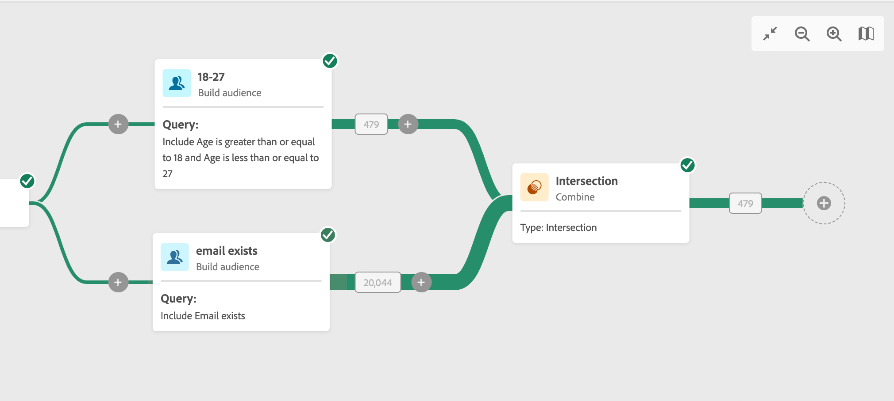

# Kombinera {#combine}

>[!CONTEXTUALHELP]
>id="ajo_orchestration_combine"
>title="Kombinera aktivitet"
>abstract="Med aktiviteten **Kombinera** kan du utföra segmentering på den inkommande populationen. Du kan alltså kombinera flera populationer, exkludera delar av dem eller bara behålla data som är gemensamma för flera mål."

Aktiviteten **Kombinera** är en **målaktivitet**. Med den här aktiviteten kan du segmentera den inkommande populationen. Du kan alltså kombinera flera populationer, utesluta en del av dem eller bara behålla data som är gemensamma för flera mål. Här är de tillgängliga segmenteringstyperna:

<!--
The **Combine** activity can be placed after any other activity, but not at the beginning of the workflow. Any activity can be placed after the **Combine**.
-->

* Med **Union** kan du gruppera om resultatet av flera aktiviteter till ett enda mål.
* Med **skärningspunkten** kan du bara behålla element som är gemensamma för de olika inkommande populationerna i aktiviteten.
* Med **Uteslutning** kan du utesluta element från en population enligt vissa villkor.

## Konfigurera Kombinera-aktiviteten {#combine-configuration}

>[!CONTEXTUALHELP]
>id="ajo_orchestration_intersection_merging_options"
>title="Sammanfogningsalternativ för skärningar"
>abstract="Med skärningspunkten kan du bara behålla de element som är gemensamma för de olika inkommande populationerna i aktiviteten. Markera alla tidigare aktiviteter som du vill ansluta till i sektionen Uppsättningar att ansluta."

>[!CONTEXTUALHELP]
>id="ajo_orchestration_exclusion_merging_options"
>title="Alternativ för uteslutningssammanslagning"
>abstract="Med det här undantaget kan du utesluta element från en population enligt vissa kriterier. Markera alla tidigare aktiviteter som du vill ansluta till i sektionen Uppsättningar att ansluta."

>[!CONTEXTUALHELP]
>id="ajo_orchestration_combine_options"
>title="Välj segmenteringstyp"
>abstract="Välj hur målgrupper ska kombineras. Med **Union** kan du gruppera om resultatet av flera aktiviteter till ett enda mål. Med **skärningspunkten** kan du bara behålla element som är gemensamma för de olika inkommande populationerna i aktiviteten. Med **Uteslutning** kan du utesluta element från en population enligt vissa villkor. "

Följ de här vanliga stegen för att börja konfigurera aktiviteten **Kombinera**:

1. Lägg till flera aktiviteter, till exempel **Bygg målgruppsaktiviteter**, för att skapa minst två olika körningsgrenar.
1. Lägg till en **Kombinera**-aktivitet i någon av de tidigare grenarna.
1. Välj segmenteringstyp: [union](#union), [skärningspunkt](#intersection) eller [exkludering](#exclusion).
1. Klicka på **Fortsätt**.
1. I avsnittet **Uppsättningar att gå med i** markerar du alla tidigare aktiviteter du vill gå med i.

## Sammanslutning {#combine-union}

>[!CONTEXTUALHELP]
>id="ajo_orchestration_combine_reconciliation"
>title="Avstämningsalternativ"
>abstract="Välj **Avstämningstypen** för att definiera hur dubbletter ska hanteras. Som standard är alternativet **Tangenter** aktiverat, vilket innebär att aktiviteten bara behåller ett element när element från olika inkommande övergångar har samma nyckel. Använd alternativet **Ett urval kolumner** för att definiera listan med kolumner som datavstämningen ska användas på."

I aktiviteten **Kombinera** kan du konfigurera en **union**. För detta måste du välja **avstämningstypen** för att definiera hur dubbletter hanteras:

* **Endast tangenter**: Detta är standardläget. Aktiviteten behåller endast ett element när element från olika inkommande övergångar har samma nyckel.  Detta alternativ kan endast användas om de inkommande populationerna är homogena.
* **Ett urval kolumner**: välj det här alternativet om du vill definiera listan med kolumner som datavstämningen ska användas på. Du måste först markera den primära uppsättningen (som innehåller källdata) och sedan de kolumner som ska användas för kopplingen.

## Skärningspunkt {#combine-intersection}

>[!CONTEXTUALHELP]
>id="ajo_orchestration_intersection_reconciliation_options"
>title="Avstämningsalternativ för skärningar"
>abstract="Välj **Avstämningstypen** för att definiera hur dubbletter ska hanteras. Som standard är alternativet **Tangenter** aktiverat, vilket innebär att aktiviteten bara behåller ett element när element från olika inkommande övergångar har samma nyckel. Använd alternativet **Ett urval kolumner** för att definiera listan med kolumner som datavstämningen ska användas på."

I aktiviteten **Kombinera** kan du konfigurera en **skärning**. För detta behöver du följa de extra stegen nedan:

1. Välj **Avstämningstypen** för att definiera hur dubbletter hanteras. Se avsnittet [Förena](#union).
1. Du kan kontrollera alternativet **Generera slutförande** om du vill bearbeta den återstående fyllningen. Komplementet ska innehålla en kombination av resultaten av alla inkommande aktiviteter minus skärningspunkten. En ytterligare utgående övergång läggs sedan till i aktiviteten.

## Uteslutning {#combine-exclusion}

>[!CONTEXTUALHELP]
>id="ajo_orchestration_exclusion_options"
>title="Uteslutningsregler"
>abstract="Vid behov kan du ändra inkommande tabeller. För att utesluta ett mål från en annan dimension måste detta mål återställas till samma måldimension som huvudmålet. Det gör du genom att klicka på Lägg till en regel i avsnittet Uteslutningsregler och ange villkoren för dimensionsändring. Datavstämning utförs antingen via ett attribut eller en koppling."

>[!CONTEXTUALHELP]
>id="ajo_orchestration_combine_sets"
>title="Markera uppsättningar som ska kombineras"
>abstract="I avsnittet **Uppsättningar att gå med i** väljer du den **primära uppsättningen** bland de inkommande övergångarna. Detta är den uppsättning från vilken element utesluts. De andra uppsättningarna matchar element innan de utesluts från den primära uppsättningen."

>[!CONTEXTUALHELP]
>id="ajo_orchestration_combine_exclusion"
>title="Uteslutningsregler"
>abstract="Vid behov kan du ändra inkommande tabeller. För att utesluta ett mål från en annan dimension måste detta mål återställas till samma måldimension som huvudmålet. Det gör du genom att klicka på Lägg till en regel i avsnittet Uteslutningsregler och ange villkoren för dimensionsändring. Datavstämning utförs antingen via ett attribut eller en koppling."

>[!CONTEXTUALHELP]
>id="ajo_orchestration_combine_complement"
>title="Kombinera skapa komplementfärger"
>abstract="Växla till komplementalternativet Generera om du vill bearbeta den återstående populationen i en ytterligare övergång."

I aktiviteten **Kombinera** kan du konfigurera ett **undantag**. För detta behöver du följa de extra stegen nedan:

1. I avsnittet **Uppsättningar att gå med i** väljer du den **primära uppsättningen** bland de inkommande övergångarna. Detta är den uppsättning från vilken element utesluts. De andra uppsättningarna matchar element innan de utesluts från den primära uppsättningen.
1. Vid behov kan du ändra inkommande tabeller. För att utesluta ett mål från en annan dimension måste detta mål återställas till samma måldimension som huvudmålet. Det gör du genom att klicka på **Lägg till en regel** i avsnittet **Uteslutningsregler** och ange villkoren för dimensionsändring. Datavstämning utförs antingen via ett attribut eller en koppling.
1. Du kan kontrollera alternativet **Generera slutförande** om du vill bearbeta den återstående fyllningen. Se avsnittet [Skärningspunkt](#intersection).

## Exempel{#combine-examples}

I följande exempel använder vi en **Kombinera**-aktivitet och lägger till en **union** för att hämta alla profiler för de två frågorna: personer mellan 18 och 27 år och personer mellan 34 och 40 år.

I följande exempel visas **skärningspunkten** mellan två frågeaktiviteter. Den används här för att hämta profiler som är mellan 18 och 27 år gamla och vars e-postadress har angetts.

I följande **exkluderingsexempel** visas två frågor som har konfigurerats för att filtrera profiler som är mellan 18 och 27 år gamla och som har en e-postdomän från Adobe. Profilerna med en e-postdomän från Adobe exkluderas sedan från den första uppsättningen.

