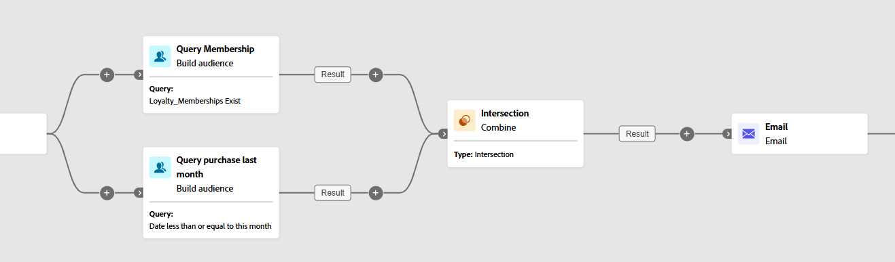

# Kombinera {#combine}

>[!CONTEXTUALHELP]
>id="ajo_orchestration_combine"
>title="Kombinera aktivitet"
>abstract="Med aktiviteten **Kombinera** kan du utföra segmentering på den inkommande populationen. Du kan alltså kombinera flera populationer, exkludera delar av dem eller bara behålla data som är gemensamma för flera mål."

+++ Innehållsförteckning

| Välkommen till samordnade kampanjer | Starta din första samordnade kampanj | Fråga databasen | Ochestrerade kampanjaktiviteter |
|---|---|---|---|
| [Kom igång med samordnade kampanjer](../gs-orchestrated-campaigns.md)  [Konfigurationssteg](../configuration-steps.md)  [Viktiga steg för att skapa samordnade kampanjer](../gs-campaign-creation.md) | [Skapa en orkestrerad kampanj](../create-orchestrated-campaign.md)  [Organisera aktiviteter](../orchestrate-activities.md)  [Skicka meddelanden med orkestrerade kampanjer](../send-messages.md)  [Starta och övervaka kampanjen](../start-monitor-campaigns.md)  [Rapportera](../reporting-campaigns.md) | [Arbeta med Query Modeler](../orchestrated-rule-builder.md)  [Skapa din första fråga](../build-query.md)  [Redigera uttryck](../edit-expressions.md) | [Kom igång med aktiviteter](about-activities.md)  Aktiviteter: [Och-join](and-join.md) - [Skapa målgrupp](build-audience.md) - [Ändra dimension](change-dimension.md) - [Kombinera](combine.md) - [Ta bort dubbletter](deduplication.md) - [Förbättra](enrichment.md) - [Förena](fork.md) - [Förena{1 ](reconciliation.md) - [Dela](split.md) - [Vänta](wait.md) |

{style="table-layout:fixed"}

+++

 

Aktiviteten **[!UICONTROL Combine]** är en typ av **[!UICONTROL Targeting]**-aktivitet som gör att du kan segmentera den inkommande populationen effektivt. Det gör att du kan sammanfoga flera populationer, exkludera specifika segment eller behålla endast data som delas över flera mål.

Följande segmenteringsalternativ är tillgängliga:

* **[!UICONTROL Union]**: sammanfogar resultaten av flera aktiviteter till ett enda enhetligt mål.

* **[!UICONTROL Intersection]**: behåller endast de element som är gemensamma för alla inkommande populationer.

* **[!UICONTROL Exclusion]**: tar bort element från en population baserat på angivna villkor.

## Konfigurera Kombinera-aktiviteten {#combine-configuration}

>[!CONTEXTUALHELP]
>id="ajo_orchestration_intersection_merging_options"
>title="Sammanfogningsalternativ för skärningar"
>abstract="Med skärningspunkten kan du bara behålla de element som är gemensamma för de olika inkommande populationerna i aktiviteten. Markera alla tidigare aktiviteter som du vill ansluta till i sektionen Uppsättningar att ansluta."

>[!CONTEXTUALHELP]
>id="ajo_orchestration_exclusion_merging_options"
>title="Alternativ för uteslutningssammanslagning"
>abstract="Med det här undantaget kan du utesluta element från en population enligt vissa kriterier. Markera alla tidigare aktiviteter som du vill ansluta till i sektionen Uppsättningar att ansluta."

>[!CONTEXTUALHELP]
>id="ajo_orchestration_combine_options"
>title="Välj segmenteringstyp"
>abstract="Välj hur målgrupper ska kombineras. Med **Union** kan du gruppera om resultatet av flera aktiviteter till ett enda mål. Med **skärningspunkten** kan du bara behålla element som är gemensamma för de olika inkommande populationerna i aktiviteten. Med **Uteslutning** kan du utesluta element från en population enligt vissa villkor. "

Följ de här vanliga stegen för att börja konfigurera aktiviteten **[!UICONTROL Combine]**:

1. Lägg till flera aktiviteter, till exempel **[!UICONTROL Build audience]** aktiviteter, för att skapa minst två olika körningsgrenar.
1. Lägg till en **[!UICONTROL Combine]**-aktivitet i någon av de tidigare grenarna.
1. Välj segmenteringstyp: [union](#union), [skärningspunkt](#intersection) eller [exkludering](#exclusion).
1. Klicka på **[!UICONTROL Continue]**.
1. I avsnittet **[!UICONTROL Sets to join]** markerar du alla tidigare aktiviteter du vill gå med i.

## Sammanslutning {#combine-union}

>[!CONTEXTUALHELP]
>id="ajo_orchestration_combine_reconciliation"
>title="Avstämningsalternativ"
>abstract="Välj **Avstämningstypen** för att definiera hur dubbletter ska hanteras. Som standard är alternativet **Tangenter** aktiverat, vilket innebär att aktiviteten bara behåller ett element när element från olika inkommande övergångar har samma nyckel. Använd alternativet **Ett urval kolumner** för att definiera listan med kolumner som datavstämningen ska användas på."

I aktiviteten **[!UICONTROL Combine]** kan du konfigurera en **[!UICONTROL Union]**. För detta måste du välja **[!UICONTROL Reconciliation type]** för att definiera hur dubbletter ska hanteras:

* **[!UICONTROL Keys only]**: detta är standardläget.  Aktiviteten behåller endast ett element när element från olika inkommande övergångar har samma nyckel.  Detta alternativ kan endast användas om de inkommande populationerna är homogena.
* **[!UICONTROL A selection of columns]**: välj det här alternativet om du vill definiera listan med kolumner som datavstämningen ska användas på. Du måste först markera den primära uppsättningen (som innehåller källdata) och sedan de kolumner som ska användas för kopplingen.

I följande exempel använder vi en **[!UICONTROL Combine]**-aktivitet och lägger till en **[!UICONTROL Union]** för att hämta alla profiler för de två frågorna: Förmånsmedlemmar och Inköpare för att bilda en större publik.

## Skärningspunkt {#combine-intersection}

>[!CONTEXTUALHELP]
>id="ajo_orchestration_intersection_reconciliation_options"
>title="Avstämningsalternativ för skärningar"
>abstract="Välj **Avstämningstypen** för att definiera hur dubbletter ska hanteras. Som standard är alternativet **Tangenter** aktiverat, vilket innebär att aktiviteten bara behåller ett element när element från olika inkommande övergångar har samma nyckel. Använd alternativet **Ett urval kolumner** för att definiera listan med kolumner som datavstämningen ska användas på."

I aktiviteten **[!UICONTROL Combine]** kan du konfigurera en **[!UICONTROL Intersection]**. För detta behöver du följa de extra stegen nedan:

1. Välj **[!UICONTROL Reconciliation type]** för att definiera hur dubbletter hanteras. Se avsnittet [Förena](#union).
1. Du kan kontrollera alternativet **[!UICONTROL Generate completement]** om du vill bearbeta den återstående populationen. Komplementet ska innehålla en kombination av resultaten av alla inkommande aktiviteter minus skärningspunkten. En ytterligare utgående övergång läggs sedan till i aktiviteten.

I följande exempel visas **[!UICONTROL Intersection]** mellan två frågeaktiviteter. Den används här för att hämta profiler med ett lojalitetsmedlemskap och vars senaste köp gjordes för mindre än en månad sedan.

## Uteslutning {#combine-exclusion}

>[!CONTEXTUALHELP]
>id="ajo_orchestration_exclusion_options"
>title="Uteslutningsregler"
>abstract="Vid behov kan du ändra inkommande tabeller. För att utesluta ett mål från en annan dimension måste detta mål återställas till samma måldimension som huvudmålet. Det gör du genom att klicka på Lägg till en regel i avsnittet Uteslutningsregler och ange villkoren för dimensionsändring. Datavstämning utförs antingen via ett attribut eller en koppling."

>[!CONTEXTUALHELP]
>id="ajo_orchestration_combine_sets"
>title="Markera uppsättningar som ska kombineras"
>abstract="I avsnittet **Uppsättningar att gå med i** väljer du den **primära uppsättningen** bland de inkommande övergångarna. Detta är den uppsättning från vilken element utesluts. De andra uppsättningarna matchar element innan de utesluts från den primära uppsättningen."

>[!CONTEXTUALHELP]
>id="ajo_orchestration_combine_exclusion"
>title="Uteslutningsregler"
>abstract="Vid behov kan du ändra inkommande tabeller. För att utesluta ett mål från en annan dimension måste detta mål återställas till samma måldimension som huvudmålet. Det gör du genom att klicka på Lägg till en regel i avsnittet Uteslutningsregler och ange villkoren för dimensionsändring. Datavstämning utförs antingen via ett attribut eller en koppling."

>[!CONTEXTUALHELP]
>id="ajo_orchestration_combine_complement"
>title="Kombinera skapa komplementfärger"
>abstract="Växla till komplementalternativet Generera om du vill bearbeta den återstående populationen i en ytterligare övergång."

I aktiviteten **[!UICONTROL Combine]** kan du konfigurera en **[!UICONTROL Exclusion]**. För detta behöver du följa de extra stegen nedan:

1. I avsnittet **[!UICONTROL Sets to join]** väljer du **[!UICONTROL Primary set]** bland de inkommande övergångarna. Detta är den uppsättning från vilken element utesluts. De andra uppsättningarna matchar element innan de utesluts från den primära uppsättningen.
1. Vid behov kan du ändra inkommande tabeller. För att utesluta ett mål från en annan dimension måste detta mål återställas till samma måldimension som huvudmålet. Det gör du genom att klicka på **[!UICONTROL Add a rule]** i avsnittet **[!UICONTROL Exclusion rules]** och ange villkoren för dimensionsändring. Datavstämning utförs antingen via ett attribut eller en koppling.
1. Du kan kontrollera alternativet **[!UICONTROL Generate completement]** om du vill bearbeta den återstående populationen. Se avsnittet [Skärningspunkt](#intersection).

I följande **[!UICONTROL Exclusion]**-exempel visas två frågor som har konfigurerats för att filtrera profiler som köpt en produkt. De profiler som inte har något lojalitetsmedlemskap exkluderas sedan från den första uppsättningen.

Varför: Du driver en lojalitetskampanj, så icke-medlemmar är irrelevanta.

