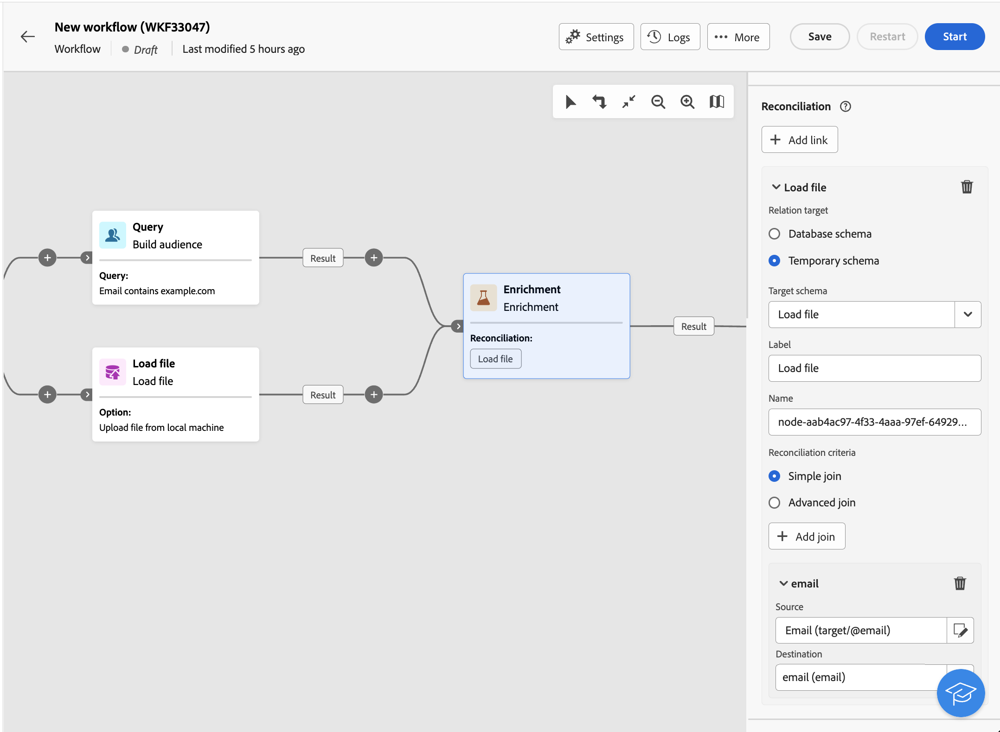
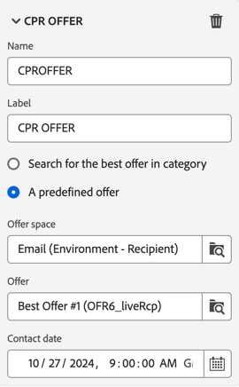

# Berikning {#enrichment}

>[!CONTEXTUALHELP]
>id="ajo_orchestration_enrichment"
>title="Anrikningsaktivitet"
>abstract="Med aktiviteten **Enrichment** kan du förbättra måldata med ytterligare information från databasen. Det används ofta i ett arbetsflöde efter segmenteringsaktiviteter."

+++ Innehållsförteckning

| Välkommen till samordnade kampanjer | Starta din första samordnade kampanj | Fråga databasen | Ochestrerade kampanjaktiviteter |
|---|---|---|---|
| [Kom igång med samordnade kampanjer](../gs-orchestrated-campaigns.md)  [Konfigurationssteg](../configuration-steps.md)  [Viktiga steg för att skapa samordnade kampanjer](../gs-campaign-creation.md) | [Skapa en orkestrerad kampanj](../create-orchestrated-campaign.md)  [Organisera aktiviteter](../orchestrate-activities.md)  [Skicka meddelanden med orkestrerade kampanjer](../send-messages.md)  [Starta och övervaka kampanjen](../start-monitor-campaigns.md)  [Rapportera](../reporting-campaigns.md) | [Arbeta med Query Modeler](../orchestrated-query-modeler.md)  [Skapa din första fråga](../build-query.md)  [Redigera uttryck](../edit-expressions.md) | [Kom igång med aktiviteter](about-activities.md)  Aktiviteter: [Och-join](and-join.md) - [Skapa målgrupp](build-audience.md) - [Ändra dimension](change-dimension.md) - [Kombinera](combine.md) - [Ta bort dubbletter](/deduplication.md) - [Förbättra](enrichment.md) - [Förena](fork.md) - [Förena{1 ](reconciliation.md) - [Dela](split.md) - [Vänta](wait.md) |

{style="table-layout:fixed"}

+++

  

Aktiviteten **Enrichment** är en **Target**-aktivitet. Det gör att du kan förbättra måldata med ytterligare information från databasen. Det används ofta i ett arbetsflöde efter segmenteringsaktiviteter.

Anrikningsdata kan komma antingen:

* **Från samma arbetstabell** som den som är riktad till din samordnade kampanj:

  *Ange en grupp kunder som mål och lägg till fältet &quot;Födelsedatum&quot; i den aktuella arbetstabellen*.

* **Från en annan arbetstabell**:

  *Aktivera en grupp kunder och lägg till fälten Belopp och Produkttyp som kommer från tabellen Inköp*.

När anrikningsdata har lagts till i den orkestrerade kampanjen kan de användas i aktiviteter som lagts till efter **Enrichment** -aktiviteten för att segmentera kunder i distinkta grupper baserat på deras beteenden, önskemål och behov, eller för att skapa personaliserade marknadsföringsmeddelanden och kampanjer som troligtvis får genklang hos målgruppen.

Du kan till exempel lägga till information om kundernas inköp i den samordnade kampanjarbetstabellen och använda dessa data för att anpassa e-postmeddelanden med deras senaste köp eller hur mycket som spenderas på dessa inköp.

## Lägg till en anrikningsaktivitet {#enrichment-configuration}

Så här konfigurerar du aktiviteten **Enrichment**:

1. Lägg till aktiviteter som **Skapa målgrupp** och **Kombinera** aktiviteter.
1. Lägg till en **anrikningsaktivitet**.
1. Om flera övergångar har konfigurerats i din samordnade kampanj kan du använda fältet **[!UICONTROL Primary set]** för att definiera vilken övergång som ska användas som primär uppsättning för att utöka med data.

## Lägg till anrikningsdata {#enrichment-add}

>[!CONTEXTUALHELP]
>id="ajo_targetdata_personalization_enrichmentdata"
>title="Anrikningsdata"
>abstract="Välj de data som ska användas för att berika er samordnade kampanj. Du kan välja två typer av anrikningsdata: ett enskilt anrikningsattribut från måldimensionen, eller en samlingslänk, som är en länk med en 1-N-kardinalitet mellan tabellerna."

>[!CONTEXTUALHELP]
>id="ajo_orchestration_enrichment_data"
>title="Anrikningsaktivitet"
>abstract="När data om berikning har lagts till i den orkestrerade kampanjen kan de användas i aktiviteter som lagts till efter Enrichment-aktiviteten för att segmentera kunder i distinkta grupper baserat på deras beteenden, önskemål och behov, eller för att skapa personaliserade marknadsföringsmeddelanden och kampanjer som troligtvis får genklang hos målgruppen."

1. Klicka på **Lägg till anrikningsdata** och markera attributet som ska användas för att utöka data.

   Du kan välja två typer av anrikningsdata: ett enskilt anrikningsattribut från måldimensionen eller en samlingslänk. Var och en av dessa typer beskrivs i exemplen nedan:
   * [Single enrichment-attribut](#single-attribute)
   * [Samlingslänk](#collection-link)

   >[!NOTE]
   >
   >Med knappen **Redigera uttryck** i attributmarkeringsskärmen kan du skapa avancerade uttryck för att välja attributet.

   

## Skapa länkar mellan tabeller {#create-links}

>[!CONTEXTUALHELP]
>id="ajo_orchestration_enrichment_simplejoin"
>title="Länkdefinition"
>abstract="Skapa en länk mellan arbetstabelldata och Adobe Journey Optimizer. Om du till exempel läser in data från en fil som innehåller mottagarnas kontonummer, land och e-postadress måste du skapa en länk till landstabellen för att kunna uppdatera informationen i deras profiler."

I avsnittet **[!UICONTROL Link definition]** kan du skapa en länk mellan arbetstabelldata och Adobe Journey Optimizer. Om du till exempel läser in data från en fil som innehåller mottagarnas kontonummer, land och e-postadress måste du skapa en länk till landstabellen för att kunna uppdatera informationen i deras profiler.

Det finns flera typer av länkar:

* **[!UICONTROL 1 cardinality simple link]**: Varje post från den primära uppsättningen kan associeras med en och endast en post från de länkade data.
* **[!UICONTROL 0 or 1 cardinality simple link]**: Varje post från den primära uppsättningen kan associeras med 0 eller 1 post från de länkade data, men inte mer än en.
* **[!UICONTROL N cardinality collection link]**: Varje post från den primära uppsättningen kan associeras med 0, 1 eller fler (N) poster från de länkade data.

Så här skapar du en länk:

1. Klicka på knappen **[!UICONTROL Add link]** i avsnittet **[!UICONTROL Link definition]**.

   

1. Välj den typ av länk du vill skapa i listrutan **Relationstyp**.

1. Identifiera det mål som du vill länka den primära uppsättningen till:

   * Om du vill länka en befintlig tabell i databasen väljer du **[!UICONTROL Database schema]** och markerar den önskade tabellen i fältet **[!UICONTROL Target schema]**.
   * Om du vill länka till data från indataövergången väljer du **Tillfälligt schema** och väljer den övergång vars data du vill använda.

1. Definiera avstämningskriterierna för att matcha data från den primära uppsättningen med det länkade schemat. Det finns två typer av kopplingar:

   * **Enkel koppling**: Välj ett specifikt attribut för att matcha data från de två scheman. Klicka på **Lägg till join** och välj de **Source** - och **Destination** -attribut som ska användas som avstämningsvillkor.
   * **Avancerad join**: Skapa en join med avancerade villkor. Klicka på **Lägg till koppling** och klicka på knappen **Skapa villkor** för att öppna frågemodelleraren.

Ett arbetsflödesexempel med länkar finns i avsnittet [Exempel](#link-example).

## Datavstämning {#reconciliation}

>[!CONTEXTUALHELP]
>id="ajo_orchestration_enrichment_reconciliation"
>title="Avstämning"
>abstract="Aktiviteten **Enrichment** kan användas för att stämma av data från Journey Optimizer-schemat med data från ett annat schema, eller med data från ett tillfälligt schema, till exempel data som överförts med en Läs in filaktivitet. Den här typen av länk definierar en avstämning mot en unik post. Journey Optimizer skapar en länk till en måltabell genom att lägga till en sekundärnyckel i den för att lagra en referens till den unika posten."

Aktiviteten **Enrichment** kan användas för att stämma av data från Campaign-databasschemat med data från ett annat schema, eller med data från ett temporärt schema, till exempel data som överförts med en Läs in filaktivitet. Den här typen av länk definierar en avstämning mot en unik post. Journey Optimizer skapar en länk till en måltabell genom att lägga till en sekundärnyckel i den för att lagra en referens till den unika posten.

Du kan till exempel använda det här alternativet för att stämma av en profils land, som anges i en överförd fil, med något av de länder som är tillgängliga i den dedikerade tabellen i Campaign-databasen.

Följ stegen för att konfigurera en **anrikningsaktivitet** med en avstämningslänk:

1. Klicka på knappen **Lägg till länk** i avsnittet **Avstämning**.
1. Identifiera de data som du vill skapa en avstämningslänk med.

   * Om du vill skapa en avstämningslänk med data från Campaign-databasen väljer du **Databasschema** och väljer det schema där målet lagras.
   * Om du vill skapa en avstämningslänk med data från indataövergången väljer du **Tillfälligt schema** och väljer den orkestrerade kampanjövergång där måldata lagras.

1. Fälten **Etikett** och **Namn** fylls i automatiskt baserat på det valda målschemat. Du kan ändra deras värden om det behövs.

1. I avsnittet **Avstämningskriterier** anger du hur du vill stämma av data från käll- och måltabellerna:

   * **Enkel koppling**: Stäm av ett specifikt fält från källtabellen med ett annat fält i måltabellen. Det gör du genom att klicka på knappen **Lägg till koppling** och ange fälten **Source** och **Mål** som ska användas för avstämningen.

     >[!NOTE]
     >
     >Du kan använda ett eller flera **enkla join** -villkor, och då måste alla verifieras så att data kan länkas samman.

   * **Avancerad join**: Använd frågemodelleraren för att konfigurera avstämningsvillkoren. Det gör du genom att klicka på knappen **Skapa villkor** och sedan definiera dina avstämningsvillkor genom att skapa en egen regel med hjälp av AND- och OR-åtgärder.

I exemplet nedan visas en strukturerad kampanj som konfigurerats för att skapa en länk mellan Journey Optimizer-profiltabellen och en tillfällig tabell som genererats en **Läs in fil** -aktivitet. I det här exemplet avstäms båda tabellerna av aktiviteten **Enrichment** med e-postadressen som avstämningskriterier.

## Lägg till erbjudanden {#add-offers}

>[!CONTEXTUALHELP]
>id="ajo_orchestration_enrichment_offer_proposition"
>title="Erbjudandeförslag"
>abstract="Med aktiviteten Anrikning kan du lägga till erbjudanden för varje profil."

Med aktiviteten **[!UICONTROL Enrichment]** kan du lägga till erbjudanden för varje profil.

Så här konfigurerar du en **[!UICONTROL Enrichment]**-aktivitet med ett erbjudande:

1. Klicka på knappen **[!UICONTROL Add offer]** i **[!UICONTROL Enrichment]**-aktiviteten i avsnittet **[!UICONTROL Offer proposition]**

   

1. Du kan välja mellan två alternativ:

   * **[!UICONTROL Search for the best offer in category]** : Markera det här alternativet och ange parametrarna för uppringning av erbjudandemotor (erbjudandeutrymme, kategori eller tema, kontaktdatum, antal erbjudanden som ska behållas). Motorn beräknar det/de bästa erbjudandena som ska läggas till enligt dessa parametrar. Vi rekommenderar att du fyller i antingen kategorin eller temafältet, i stället för båda samtidigt.

     

   * **[!UICONTROL A predefined offer]** : Markera det här alternativet och ange ett erbjudandeutrymme, ett specifikt erbjudande och ett kontaktdatum för att direkt konfigurera det erbjudande du vill lägga till, utan att anropa erbjudandemotorn.

     

1. När du har valt ditt erbjudande klickar du på knappen **[!UICONTROL Confirm]**.

Nu kan du använda erbjudandet i leveransaktiviteten.

### Använda erbjudanden från anrikningsaktiviteten

Om du vill använda erbjudanden från en anrikningsaktivitet i leveransen i en orkestrerad kampanj följer du stegen nedan:

1. Öppna leveransaktiviteten och gå till innehållsutgåvan. Klicka på knappen **[!UICONTROL Offers settings]** och välj den **[!UICONTROL Offers space]** som motsvarar ditt erbjudande i listrutan.
Om du bara vill visa erbjudanden från anrikningsaktiviteten anger du antalet **[!UICONTROL Propositions]** till 0 och sparar ändringarna.

   

1. När du lägger till en anpassning med erbjudanden i e-postdesignern klickar du på ikonen **[!UICONTROL Propositions]**. Då visas de erbjudanden du får från aktiviteten **[!UICONTROL Enrichment]**. Öppna det erbjudande du vill välja genom att klicka på det.

   

   Gå in **[!UICONTROL Rendering functions]** och välj **[!UICONTROL HTML rendering]** eller **[!UICONTROL Text rendering]** efter dina behov.

   

>[!NOTE]
>
>Om du väljer att ha fler än ett erbjudande i aktiviteten **[!UICONTROL Enrichment]** vid alternativet **[!UICONTROL Number of offers to keep]** visas alla erbjudanden när du klickar på ikonen **[!UICONTROL Propositions]** .

## Exempel {#example}

### Single enrichment-attribut {#single-attribute}

Här lägger vi bara till ett enda anrikningsattribut, till exempel födelsedatumet. Följ de här stegen:

1. Klicka i fältet **Attribut**.
1. Välj ett enkelt fält från målgruppsdimensionen, födelsedatumet i vårt exempel.
1. Klicka på **Bekräfta**.

### Samlingslänk {#collection-link}

I det här mer komplicerade fallet väljer vi en samlingslänk som är en länk med en 1-N-kardinalitet mellan tabellerna. Vi hämtar de tre senaste inköpen som är mindre än 100$. Därför måste du definiera:

* ett anrikningsattribut: fältet **Price**
* antalet rader som ska hämtas: 3
* ett filter: filtrera bort objekt som är större än 100$
* en sortering: fallande sortering i fältet **Beställningsdatum**.

#### Lägg till attributet {#add-attribute}

Här väljer du den samlingslänk som ska användas som anrikningsdata.

1. Klicka i fältet **Attribut**.
1. Klicka på **Visa avancerade attribut**.
1. Välj fältet **Pris** i tabellen **Inköp**.

<!--  -->

#### Definiera samlingsinställningarna{#collection-settings}

Definiera sedan hur data samlas in och hur många poster som ska hämtas.

1. Välj **Samla in data** i listrutan **Välj hur data samlas in**.
1. Skriv &quot;3&quot; i fältet **Rader som ska hämtas (kolumner som ska skapas)**.

Om du till exempel vill få fram det genomsnittliga antalet inköp för en kund väljer du **Aggregerade data** i stället och väljer **Jämka** i listrutan **Aggregerade data**.

Använd fälten **Etikett** och **Alias** för attributet för att göra det lättare att förstå, vilket visas nedan.

#### Definiera filtren{#collection-filters}

Här definierar vi det högsta värdet för anrikningsattributet. Vi filtrerar bort objekt som är större än 100$.
1. Klicka på **Skapa filter**.
1. Lägg till följande två filter: **Price** finns OCH **Price** är mindre än 100. Den första filtrerar NULL-värden så som de skulle visas som det största värdet.
1. Klicka på **Bekräfta**.

#### Definiera sorteringen{#collection-sorting}

Vi måste nu använda sortering för att kunna hämta de tre **senaste** inköpen.

1. Aktivera alternativet **Aktivera sortering**.
1. Klicka i fältet **Attribut**.
1. Välj fältet **Beställningsdatum**.
1. Klicka på **Bekräfta**.
1. Välj **Fallande** i listrutan **Sortera**.

### Berika med länkade data {#link-example}

I exemplet nedan visas en orkestrerad kampanj som konfigurerats för att skapa en länk mellan två övergångar. De första övergångarna avser profildata med hjälp av en **Query**-aktivitet, medan den andra övergången innehåller inköpsdata som lagras i en fil som läses in via en Läs in filaktivitet.

* Den första **Enrichment**-aktiviteten länkar den primära uppsättningen (data från **Query** -aktiviteten) med schemat från **Load file** -aktiviteten. På så sätt kan vi matcha varje profil som används av frågan med motsvarande inköpsdata.

  

* En andra **berikning**-aktivitet läggs till för att berika data från den orkestrerade kampanjtabellen med inköpsdata från aktiviteten **Läs in fil**. Detta gör att vi kan använda dessa data i ytterligare aktiviteter, till exempel för att anpassa meddelanden som skickas till kunderna med information om deras köp.

  
