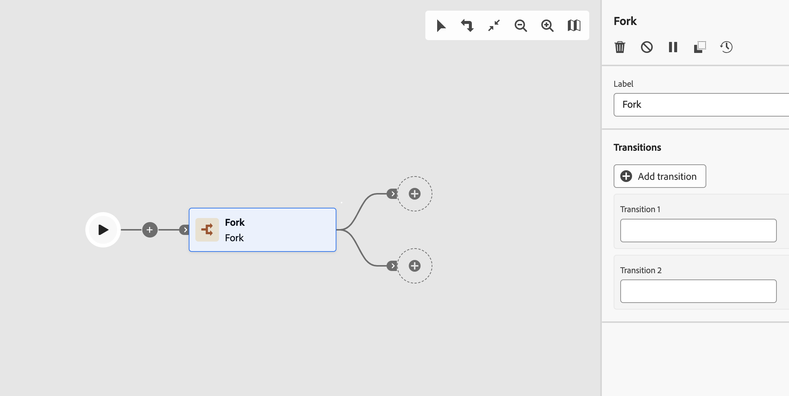

# Förgrening {#fork}

>[!CONTEXTUALHELP]
>id="ajo_orchestration_fork"
>title="Gaffelaktivitet"
>abstract="Med aktiviteten **Förena** kan du skapa utgående övergångar och starta flera aktiviteter samtidigt."

>[!CONTEXTUALHELP]
>id="ajo_orchestration_fork_transitions"
>title="Fork-aktivitetsövergångar"
>abstract="Som standard skapas två övergångar med en **Förgrening**-aktivitet. Klicka på knappen **Lägg till övergång** för att definiera ytterligare en utgående övergång och ange dess etikett."

Aktiviteten **Förena** är en **flödeskontroll**-aktivitet. Det gör att du kan skapa utgående övergångar och starta flera aktiviteter samtidigt.

## Konfigurera gaffelaktiviteten{#fork-configuration}

Följ de här stegen för att konfigurera aktiviteten **Förgrening**:

1. Lägg till en **förgrening**-aktivitet i din samordnade kampanj.
1. Klicka på **Lägg till övergång** för att lägga till en ny utgående övergång. Som standard definieras två övergångar.
1. Lägg till en etikett till varje övergång.

## Exempel{#fork-example}

I följande exempel använder vi två **gaffelaktiviteter**:

* En före de två frågorna om du vill köra dem samtidigt.
* En efter skärningspunkten, för att skicka ett e-postmeddelande och ett SMS samtidigt till målpopulationen.

