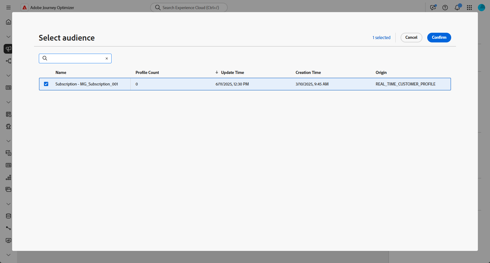

# Läs målgrupp {#read-audience}

>[!CONTEXTUALHELP]
>id="ajo_orchestration_read_audience"
>title="Bygg målgruppsaktivitet"
>abstract="Med aktiviteten **Läsa målgrupp** kan du välja målgrupp som ska ingå i den Orchestrated-kampanjen. Publiken kan vara en befintlig Adobe Experience Platform-publik eller en publik som hämtats från en CSV-fil. När du skickar meddelanden i samband med en orkestrerad kampanj definieras inte meddelandemålgruppen i kanalaktiviteten, utan i en **läsmålgrupp** eller en **bygg målgruppsaktivitet** ."

Med aktiviteten **[!UICONTROL Read audience]** kan du hämta en befintlig publik - som tidigare har sparats eller importerats - och återanvända den i en orchestrerad-kampanj. Den här aktiviteten är särskilt användbar när du vill ha en fördefinierad uppsättning profiler som mål utan att behöva utföra en ny segmenteringsprocess.

När målgruppen har lästs in kan du förfina den genom att välja ett unikt identitetsfält och berika målgruppen med ytterligare profilattribut för målinriktning, personalisering eller rapportering.

## Läs målgruppscache {#cache}

När du testar en Orchestrated-kampanj tar aktiviteten **[!UICONTROL Read Audience]** vanligtvis lite tid att hämta data, vilket kan göra att testet körs längre. Det finns ett **[!UICONTROL Read Audience]**-cacheminne för att öka hastigheten.

I cachen lagras målgruppen tillsammans med de valda attributen för **upp till två timmar**. Under den här tiden kan alla efterföljande testkörningar använda cachelagrade resultat, så att data inte behöver hämtas igen. När **tvåtimmarsperioden** har passerat måste data hämtas på nytt.

Cacheminnet sparas för varje iscensatt kampanj, inte för själva publiken. Om samma målgrupp används i en **[!UICONTROL Read Audience]**-aktivitet i en annan Orchestrated-kampanj måste systemet fortfarande hämta data igen.

Cachen bevaras inte i följande fall:

* När aktiviteten **[!UICONTROL Read Audience]** uppdateras med nya attribut uppdateras cachen med nya attributdata. Det innebär att den första testkörningen efter uppdateringen tar längre tid eftersom data måste hämtas igen.

* När den Orchestrated-kampanjen publiceras, hämtas den senaste informationen när den aktiva orchestrated-kampanjen körs.

## Konfigurera aktiviteten Läsa målgrupp {#read-audience-configuration}

Så här konfigurerar du aktiviteten **[!UICONTROL Read audience]**:

1. Innan du lägger till din **[!UICONTROL Read audience]**-aktivitet måste du välja en **[!UICONTROL Merge policy]** i dina Campaign-inställningar.

   

1. Lägg till en **[!UICONTROL Read audience]**-aktivitet i din Orchestrated-kampanj.

   

1. Ange en **[!UICONTROL Label]** till din aktivitet. Den här etiketten kommer att fungera som målgruppens namn.

1. Klicka på  för att välja den målgrupp du vill ha för din Orchestrated-kampanj. [Läs mer om hur du genererar och målgruppsanpassar i Journey Optimizer](../../audience/about-audiences.md).

   

1. Välj en **[!UICONTROL Entity&#x200B;]** från din Campaign-måldimension. Den här inställningen definierar målentiteten och attributet som används för att matcha målgruppen med måldimensionen.

   ➡️ [Följ stegen som beskrivs på den här sidan för att skapa din Campaign Targeting-dimension](../target-dimension.md)

   

1. Välj **[!UICONTROL Add attribute]** om du vill berika den valda målgruppen med ytterligare data. I det här steget kan du lägga till profilattribut till målgruppen, vilket resulterar i en lista över mottagare som förbättrats med dessa attribut.

1. Välj den **[!UICONTROL Attributes]** som du vill lägga till för din målgrupp. Attributväljaren visar fält från **unionsprofilschemat**:

   * För CSV-baserade målgrupper omfattar detta både **profilattribut** och anpassade målgruppsattribut. Dessa attribut finns under följande schemasökväg:

     `<audienceid> > _ajobatchjourneystage > audienceEnrichment > CustomerAudienceUpload > <audienceid>`

   * För AEP standardmålgrupper är endast **profilattribut** tillgängliga eftersom de inte innehåller inbäddade målgruppsspecifika fält.

   >[!NOTE]
   >
   > Även om vissa attribut kan visas i väljaren beror deras tillgänglighet vid körning på om målgruppsdata har stämts av och sammanfogats med **Adobe Experience Platform-profilen**.

   

När en målgrupp har skapats är den skrivskyddad och kan inte längre redigeras. Den kan bara användas när skapandet är klart.

## Exempel

I exemplet nedan används aktiviteten **[!UICONTROL Read audience]** för att hämta en tidigare skapad och sparad publik med profiler som prenumererade på nyhetsbrevet. Publiken berikas sedan med attributet **Lojalitetsmedlemskap** för att aktivera målgruppsanpassning för användare som är registrerade medlemmar i bonusprogrammet.

